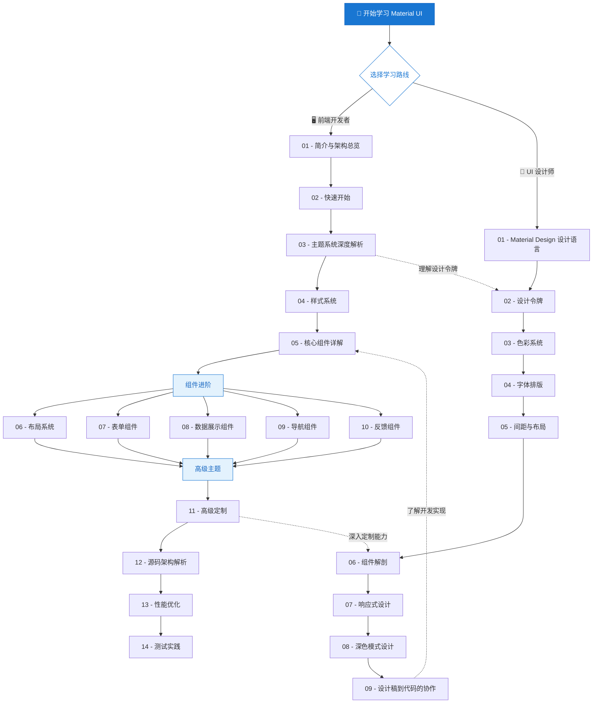

# 📚 Material UI 系统学习教程

> **Material UI** 是基于 Google [Material Design](https://m3.material.io/) 规范实现的 React UI 组件库，提供了丰富的预构建组件、强大的主题定制能力和灵活的样式系统，是目前 React 生态中最受欢迎的 UI 框架之一。

本教程专为希望 **系统性掌握 Material UI** 的学习者设计，涵盖从入门到源码级别的完整知识体系。无论你是前端开发者还是 UI 设计师，都能在这里找到适合自己的学习路径。

---

## 📖 目录

- [学习路线总览](#-学习路线总览)
- [🖥️ 前端开发者路线](#️-前端开发者路线)
- [🎨 UI 设计师路线](#-ui-设计师路线)
- [🚀 如何使用本教程](#-如何使用本教程)
- [📋 前置知识要求](#-前置知识要求)
- [🗺️ 推荐学习顺序](#️-推荐学习顺序)

---

## 🗺️ 学习路线总览

下面的 Mermaid 图展示了两条学习路线及其知识模块之间的关系：



> 💡 **提示**：虚线箭头表示两条路线之间的交叉学习建议——设计师可以了解开发实现细节，开发者也应理解设计令牌等设计概念。

---

## 🖥️ 前端开发者路线

面向具有 React 基础的前端开发者，从框架概览到源码解析，全面掌握 Material UI。

| 序号 | 文件 | 主题 | 概要 |
|:---:|------|------|------|
| 01 | [introduction.md](front-end/01-introduction.md) | Material UI 简介与架构总览 | 了解 Material UI 的核心理念、整体架构和包结构 |
| 02 | [quick-start.md](front-end/02-quick-start.md) | 快速开始 | 安装、配置和第一个 Material UI 应用 |
| 03 | [theming-system.md](front-end/03-theming-system.md) | 主题系统深度解析 | `ThemeProvider`、`createTheme`、Design Token 与全局主题定制 |
| 04 | [styling-system.md](front-end/04-styling-system.md) | 样式系统 | `sx` prop、`styled()` API、Emotion 集成与 CSS-in-JS 方案 |
| 05 | [core-components.md](front-end/05-core-components.md) | 核心组件详解 | `Button`、`TextField`、`Typography` 等基础组件的使用与定制 |
| 06 | [layout-system.md](front-end/06-layout-system.md) | 布局系统 | `Grid`、`Container`、`Box`、`Stack` 与响应式布局 |
| 07 | [form-components.md](front-end/07-form-components.md) | 表单组件 | 输入控件、选择器、表单验证与第三方库集成 |
| 08 | [data-display.md](front-end/08-data-display.md) | 数据展示组件 | `Table`、`List`、`Card`、`Chip` 等数据展示方案 |
| 09 | [navigation-components.md](front-end/09-navigation-components.md) | 导航组件 | `AppBar`、`Drawer`、`Tabs`、`Breadcrumbs` 等导航方案 |
| 10 | [feedback-components.md](front-end/10-feedback-components.md) | 反馈组件 | `Dialog`、`Snackbar`、`Alert`、`Progress` 等用户反馈 |
| 11 | [advanced-customization.md](front-end/11-advanced-customization.md) | 高级定制 | 组件 Slot/Override 机制、全局 CSS 覆盖与自定义变体 |
| 12 | [source-code-architecture.md](front-end/12-source-code-architecture.md) | 源码架构解析 | Material UI 源码组织、构建流程与核心设计模式 |
| 13 | [performance-optimization.md](front-end/13-performance-optimization.md) | 性能优化 | Tree Shaking、按需加载、渲染优化与 Bundle 分析 |
| 14 | [testing.md](front-end/14-testing.md) | 测试实践 | 使用 Vitest / React Testing Library 测试 Material UI 组件 |

---

## 🎨 UI 设计师路线

面向 UI/UX 设计师，深入理解 Material Design 设计体系以及如何高效地与开发团队协作。

| 序号 | 文件 | 主题 | 概要 |
|:---:|------|------|------|
| 01 | [material-design-intro.md](ui-designer/01-material-design-intro.md) | Material Design 设计语言 | Material Design 的核心原则、演进历程与设计哲学 |
| 02 | [design-tokens.md](ui-designer/02-design-tokens.md) | 设计令牌 | Design Token 的概念、分层结构与在 Material UI 中的应用 |
| 03 | [color-system.md](ui-designer/03-color-system.md) | 色彩系统 | 调色板设计、Primary/Secondary 色、语义化颜色与无障碍对比度 |
| 04 | [typography.md](ui-designer/04-typography.md) | 字体排版 | 字体层级、`Typography` 变体、自定义字体与国际化排版 |
| 05 | [spacing-layout.md](ui-designer/05-spacing-layout.md) | 间距与布局 | 8px 网格系统、间距规则、内边距与外边距的设计规范 |
| 06 | [component-anatomy.md](ui-designer/06-component-anatomy.md) | 组件解剖 | 组件结构拆解、状态变化、可交互区域与尺寸规范 |
| 07 | [responsive-design.md](ui-designer/07-responsive-design.md) | 响应式设计 | 断点系统、自适应布局策略与多端设计适配 |
| 08 | [dark-mode.md](ui-designer/08-dark-mode.md) | 深色模式设计 | 深色主题配色原则、表面层级与深色模式下的无障碍设计 |
| 09 | [design-to-code.md](ui-designer/09-design-to-code.md) | 设计稿到代码的协作 | 设计交付规范、Design Token 对接与设计师-开发者协作流程 |

---

## 🚀 如何使用本教程

### 📂 目录结构

```text
learn/
├── README.md                          ← 📍 你当前所在的位置
├── front-end/                         ← 🖥️ 前端开发者路线
│   ├── 01-introduction.md
│   ├── 02-quick-start.md
│   ├── ...
│   └── 14-testing.md
└── ui-designer/                       ← 🎨 UI 设计师路线
    ├── 01-material-design-intro.md
    ├── 02-design-tokens.md
    ├── ...
    └── 09-design-to-code.md
```

### 📝 学习建议

1. **选择路线**：根据你的角色选择对应的学习路线，按照编号顺序逐步学习。
2. **动手实践**：每篇教程都包含代码示例或设计案例，建议边学边动手操作。
3. **交叉学习**：鼓励开发者阅读设计师路线中的 Design Token 和色彩系统部分；设计师也可浏览开发者路线中的组件详解，以更好地理解实现能力与限制。
4. **结合官方文档**：本教程是对 [Material UI 官方文档](https://mui.com/material-ui/getting-started/) 的系统化整理与深度补充，建议配合官方文档一起使用。

---

## 📋 前置知识要求

### 🖥️ 前端开发者

| 类别 | 要求 | 推荐程度 |
|------|------|:--------:|
| HTML / CSS | 掌握基础语义化标签和盒模型 | ⭐⭐⭐ 必须 |
| JavaScript (ES6+) | 熟悉箭头函数、解构、模块化、Promise | ⭐⭐⭐ 必须 |
| React | 理解组件、Props、State、Hooks | ⭐⭐⭐ 必须 |
| TypeScript | 了解基本类型注解和 Interface | ⭐⭐ 推荐 |
| npm / pnpm | 了解包管理器的基本使用 | ⭐⭐ 推荐 |
| CSS-in-JS | 了解 Emotion 或 Styled Components 概念 | ⭐ 加分 |

### 🎨 UI 设计师

| 类别 | 要求 | 推荐程度 |
|------|------|:--------:|
| 设计基础 | 掌握色彩理论、排版和布局基础 | ⭐⭐⭐ 必须 |
| 设计工具 | 熟悉 Figma / Sketch 等设计工具 | ⭐⭐⭐ 必须 |
| Material Design | 了解 Material Design 基本概念 | ⭐⭐ 推荐 |
| 响应式设计 | 了解多端适配的基本思路 | ⭐⭐ 推荐 |
| HTML / CSS | 了解基础的前端概念 | ⭐ 加分 |
| Design Token | 了解设计令牌的概念 | ⭐ 加分 |

---

## 🗺️ 推荐学习顺序

### 🖥️ 前端开发者路线（建议 4～6 周）

```text
第 1 周    ▸ 01 简介与架构总览 → 02 快速开始
第 2 周    ▸ 03 主题系统 → 04 样式系统
第 3 周    ▸ 05 核心组件 → 06 布局系统 → 07 表单组件
第 4 周    ▸ 08 数据展示 → 09 导航组件 → 10 反馈组件
第 5 周    ▸ 11 高级定制 → 12 源码架构解析
第 6 周    ▸ 13 性能优化 → 14 测试实践
```

### 🎨 UI 设计师路线（建议 3～4 周）

```text
第 1 周    ▸ 01 Material Design 设计语言 → 02 设计令牌 → 03 色彩系统
第 2 周    ▸ 04 字体排版 → 05 间距与布局 → 06 组件解剖
第 3 周    ▸ 07 响应式设计 → 08 深色模式设计
第 4 周    ▸ 09 设计稿到代码的协作（含实战练习）
```

---

> 🎯 **目标**：通过系统学习，前端开发者能独立构建高质量的 Material UI 应用；UI 设计师能输出符合 Material Design 规范且可高效落地的设计方案。

祝你学习愉快！🚀
