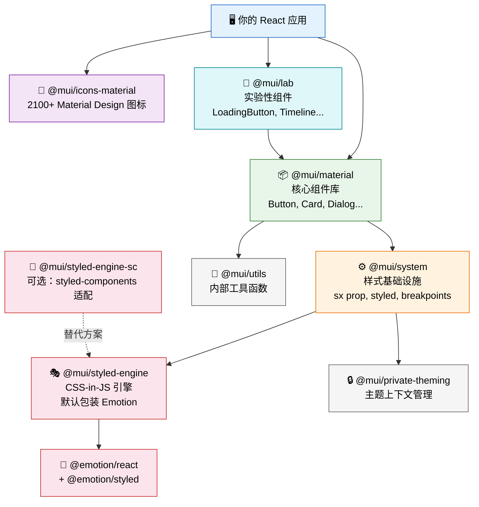
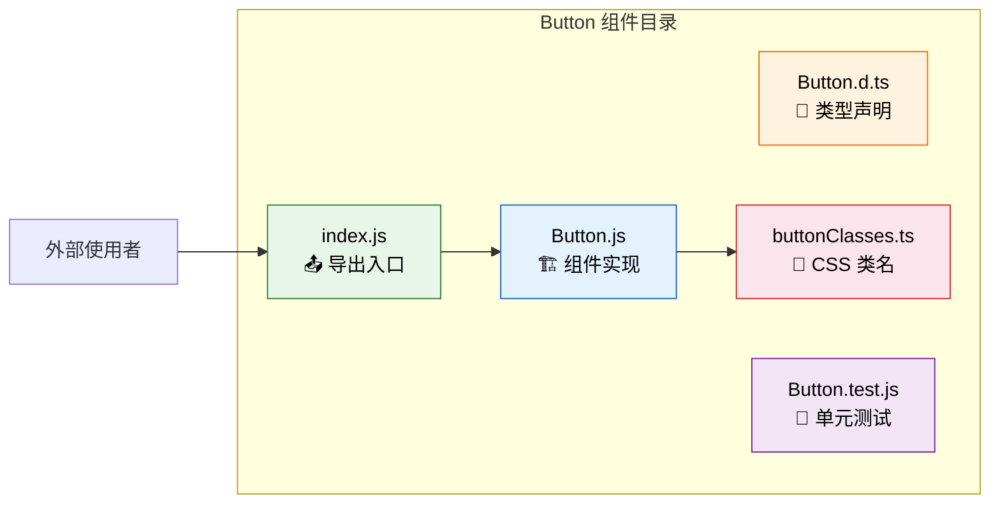
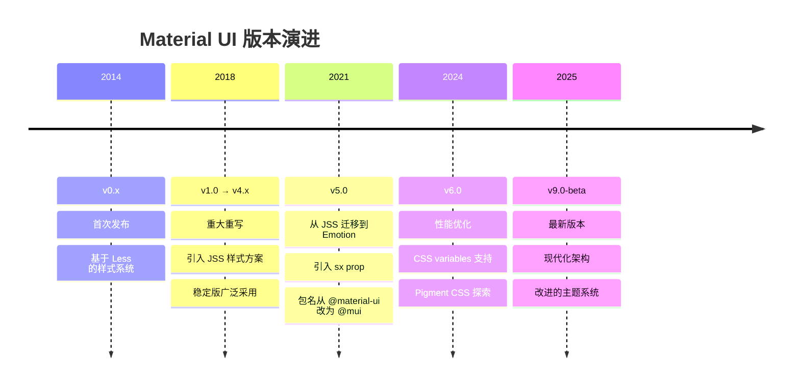
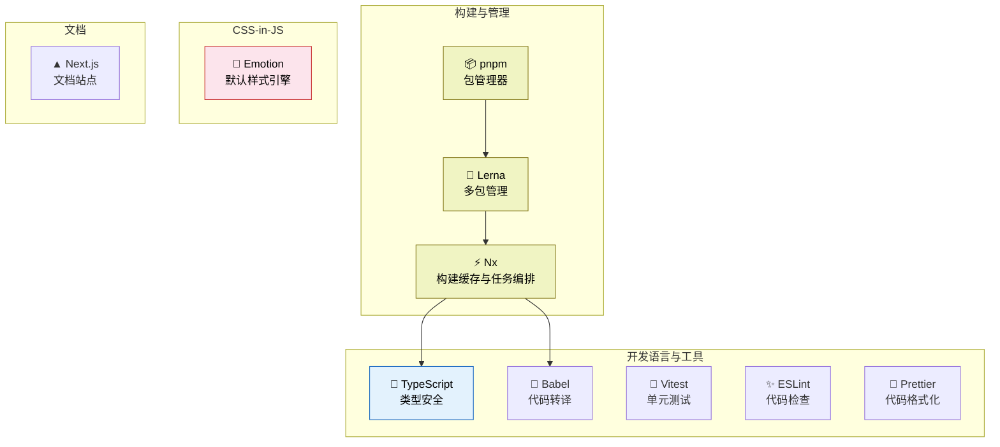

# 📚 Material UI 简介与架构总览

> **学习目标**：了解 Material UI 是什么、为什么选择它、掌握其核心概念与 monorepo 架构全貌。

---

## 🎯 什么是 Material UI？

Material UI 是一个**全面的 React 组件库**，实现了 Google 的 [Material Design](https://material.io/design) 设计规范。它为开发者提供了一套开箱即用、高质量、可定制的 UI 组件，让你能够快速构建美观、一致且可访问的 Web 应用。

> 🧩 **类比时间**：把 Material UI 想象成一套**高级乐高积木**——
> - 每块积木（Button、Card、Dialog 等）都是预先设计好的**组件**
> - 积木的配色方案和尺寸规格是统一的**设计系统**（Material Design）
> - 你有一本自定义手册（**Theming 系统**）来修改颜色、字体、间距
> - 所有积木可以自由组合，构建出任何你想要的界面

### 核心数据一览

| 指标 | 数据 |
|------|------|
| ⭐ GitHub Stars | 95,000+ |
| 📦 npm 周下载量 | 4,000,000+ |
| 🧩 组件数量 | 50+ 核心组件 |
| 🎨 图标数量 | 2,100+ Material Design 图标 |
| 📅 首次发布 | 2014 年 |
| 🏷️ 当前版本 | v9.0.0-beta.0 |

---

## 🤔 为什么选择 Material UI？

### 1. 🏭 生产就绪（Production-Ready）

Material UI 被**数千家企业**在生产环境中使用，包括 NASA、Netflix、Spotify 等。每个组件都经过了严格的测试和优化。

### 2. ♿ 无障碍访问（Accessibility）

所有组件默认遵循 [WAI-ARIA](https://www.w3.org/WAI/ARIA/apg/) 规范，支持键盘导航、屏幕阅读器等辅助技术。你不需要额外处理 `aria-*` 属性——组件已经帮你做好了。

### 3. 🎨 强大的定制能力

从简单的颜色修改到深度的组件样式覆盖，Material UI 提供了多层次的定制方案：

```
简单定制 ◀──────────────────────────────────▶ 深度定制

  props       sx prop      styled()     theme       自定义组件
  覆盖        行内样式      包装组件     全局覆盖     从零构建
```

### 4. 🌐 庞大的生态系统

```
Material UI 生态系统
├── 🧩 @mui/material        核心组件库
├── 🧪 @mui/lab             实验性组件
├── 🎨 @mui/icons-material  2100+ 图标
├── ⚙️  @mui/system          样式系统
├── 📊 MUI X                高级组件（DataGrid、DatePicker 等）
├── 🖌️  MUI Toolpad          低代码内部工具构建器
└── 📝 丰富的文档和社区支持
```

### 5. 📦 TypeScript 优先

完整的 TypeScript 支持，包括组件 props 类型推断、主题类型扩展、IDE 智能提示等。

---

## 🧠 核心概念

### 概念一：基于组件（Component-Based）

Material UI 中的一切都是 React 组件。每个组件都是自包含的，拥有自己的样式、逻辑和 API。

```tsx
import Button from '@mui/material/Button';
import TextField from '@mui/material/TextField';
import Card from '@mui/material/Card';

// 组合使用，构建界面
function LoginForm() {
  return (
    <Card sx={{ p: 3 }}>
      <TextField label="用户名" fullWidth margin="normal" />
      <TextField label="密码" type="password" fullWidth margin="normal" />
      <Button variant="contained" fullWidth>
        登录
      </Button>
    </Card>
  );
}
```

### 概念二：主题驱动（Theming）

一个 **Theme 对象**控制着整个应用的视觉风格——颜色、字体、间距、阴影等等。修改主题，所有组件自动更新。

```tsx
import { createTheme, ThemeProvider } from '@mui/material/styles';

const theme = createTheme({
  palette: {
    primary: { main: '#1976d2' },   // 主色调
    secondary: { main: '#dc004e' }, // 辅助色
  },
  typography: {
    fontFamily: '"Roboto", "Helvetica", "Arial", sans-serif',
  },
});

function App() {
  return (
    <ThemeProvider theme={theme}>
      {/* 所有子组件都能访问主题 */}
      <MyApplication />
    </ThemeProvider>
  );
}
```

### 概念三：样式系统（Styling System）

Material UI 提供了三种主要的样式方案，适用于不同场景：

| 方案 | 适用场景 | 示例 |
|------|----------|------|
| `sx` prop | 快速单次样式调整 | `<Box sx={{ mt: 2, color: 'primary.main' }} />` |
| `styled()` | 创建可复用的样式组件 | `const MyButton = styled(Button)({...})` |
| Theme `styleOverrides` | 全局组件样式覆盖 | `components: { MuiButton: { styleOverrides: {...} } }` |

---

## 🏗️ Monorepo 架构总览

Material UI 采用 **monorepo**（单一代码仓库）架构，使用 **pnpm** 作为包管理器，**Lerna** + **Nx** 进行多包管理和构建缓存。

### 包依赖关系图



### 各包职责详解

#### 📦 `@mui/material` — 核心组件库

这是你最常用的包，包含 50+ 个生产就绪的 React 组件：

- **输入类**：Button, TextField, Checkbox, Radio, Select, Slider, Switch
- **导航类**：AppBar, Drawer, Menu, Tabs, Breadcrumbs, BottomNavigation
- **展示类**：Card, Avatar, Badge, Chip, List, Table, Typography
- **反馈类**：Alert, Dialog, Snackbar, Backdrop, CircularProgress
- **布局类**：Box, Container, Grid, Stack
- **工具类**：Modal, Popover, Popper, Transitions

#### ⚙️ `@mui/system` — 样式基础设施

提供了样式系统的核心功能，是 `@mui/material` 的底层依赖：

- **`sx` prop**：快速编写响应式、主题感知的内联样式
- **`styled()`**：创建样式化组件的工厂函数
- **`createBreakpoints()`**：响应式断点管理
- **`createTheme()`**：主题创建（底层实现）
- **布局组件**：Box, Container, Grid, Stack

#### 🎭 `@mui/styled-engine` — CSS-in-JS 引擎

一个薄薄的抽象层，默认包装了 **Emotion**：

```
你的样式代码
    ↓
@mui/styled-engine（抽象层）
    ↓
@emotion/react + @emotion/styled（实际执行）
    ↓
CSS 注入到 DOM
```

> 💡 **为什么要加这层抽象？** 这样你可以在不修改组件代码的情况下，把底层引擎从 Emotion 换成 styled-components（通过 `@mui/styled-engine-sc`）。

#### 🧪 `@mui/lab` — 实验性组件

包含还在开发中或尚未稳定的组件。当组件足够成熟后，会"毕业"到 `@mui/material` 中：

```
🧪 @mui/lab（实验阶段）
    ↓ 稳定后
📦 @mui/material（正式发布）
```

包含：LoadingButton, Timeline, TreeView, Masonry 等组件。

#### 🎨 `@mui/icons-material` — Material Design 图标

提供 2,100+ 个 Material Design 图标，每个图标都是一个 React 组件：

```tsx
import DeleteIcon from '@mui/icons-material/Delete';
import SearchIcon from '@mui/icons-material/Search';
import HomeIcon from '@mui/icons-material/Home';

// 每个图标支持 5 种风格
import DeleteOutlinedIcon from '@mui/icons-material/DeleteOutlined';
import DeleteRoundedIcon from '@mui/icons-material/DeleteRounded';
import DeleteTwoToneIcon from '@mui/icons-material/DeleteTwoTone';
import DeleteSharpIcon from '@mui/icons-material/DeleteSharp';
```

#### 🔧 `@mui/utils` — 内部工具函数

提供组件开发所需的实用函数，如 `deepmerge`、`ownerDocument`、`useEventCallback` 等。

---

## 📂 组件文件结构

每个 Material UI 组件都遵循统一的目录结构：

```
packages/mui-material/src/Button/
├── Button.js              # 🏗️ 组件主要实现
├── Button.d.ts            # 📝 TypeScript 类型声明
├── Button.test.js         # 🧪 单元测试
├── Button.spec.tsx        # 🧪 TypeScript 类型测试
├── buttonClasses.ts       # 🎨 CSS 类名定义与导出
└── index.js               # 📤 公开导出入口
```



### buttonClasses.ts 示例

```typescript
// 每个组件都有自己的 CSS 类名定义
export interface ButtonClasses {
  root: string;           // 根元素
  text: string;           // variant="text"
  textPrimary: string;    // variant="text" color="primary"
  contained: string;      // variant="contained"
  outlined: string;       // variant="outlined"
  disabled: string;       // 禁用状态
  fullWidth: string;      // fullWidth 属性
  // ...更多
}

// 生成类名：MuiButton-root, MuiButton-contained, ...
const buttonClasses: ButtonClasses = generateUtilityClasses('MuiButton', [
  'root', 'text', 'contained', 'outlined', ...
]);
```

---

## 📜 版本演进历史



### 关键版本变化

| 版本 | 关键变化 |
|------|----------|
| v0 → v1 | 完全重写，引入 JSS |
| v4 → v5 | Emotion 替代 JSS，`sx` prop，包名改为 `@mui/*` |
| v5 → v6 | CSS variables 支持，性能优化 |
| v6 → v9 | 现代化架构，当前最新 beta |

---

## 🔄 与其他组件库对比

| 特性 | Material UI | Ant Design | Chakra UI |
|------|-------------|------------|-----------|
| 🎨 设计规范 | Material Design | Ant Design | 自有设计系统 |
| 📦 组件数量 | 50+ | 60+ | 40+ |
| 🎭 样式方案 | Emotion (CSS-in-JS) | CSS-in-JS + CSS | Emotion (CSS-in-JS) |
| 📝 TypeScript | 完整支持 | 完整支持 | 完整支持 |
| 🌍 国际化 | 社区支持 | 内置 (中文优先) | 社区支持 |
| 📏 包体积 | 中等 (tree-shakable) | 较大 | 较小 |
| 🎯 定制能力 | ⭐⭐⭐⭐⭐ | ⭐⭐⭐⭐ | ⭐⭐⭐⭐ |
| 🏢 适用场景 | 企业级 + 通用 | 企业级后台 | 快速原型 + 小型项目 |

### 选择建议

- **选 Material UI**：需要 Material Design 风格、高度可定制、大型项目
- **选 Ant Design**：面向中国市场、企业后台管理系统、需要内置国际化
- **选 Chakra UI**：追求简洁 API、快速开发、对设计规范要求灵活

---

## 🗺️ Monorepo 技术栈总览



---

## ✅ 本章小结

| 知识点 | 掌握情况 |
|--------|----------|
| Material UI 是什么 | ☐ |
| 为什么选择 Material UI | ☐ |
| 三大核心概念：组件、主题、样式 | ☐ |
| Monorepo 中各包的职责 | ☐ |
| 组件文件结构模式 | ☐ |
| 版本演进历史 | ☐ |

---

## 📖 延伸阅读

- [Material UI 官方文档](https://mui.com/material-ui/)
- [Material Design 设计规范](https://material.io/design)
- [GitHub 仓库](https://github.com/mui/material-ui)

---

> ⏭️ **下一章**：[快速开始](./02-quick-start.md) — 从零开始搭建你的第一个 Material UI 应用！
