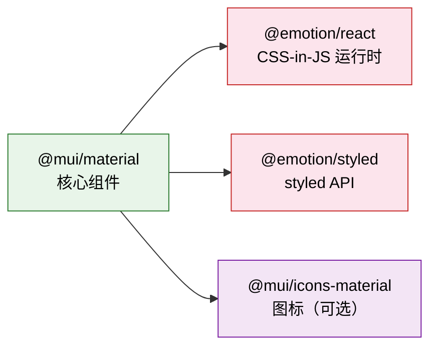
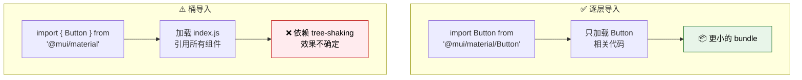
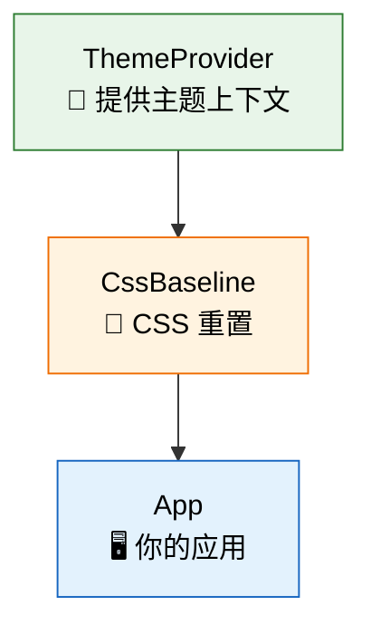
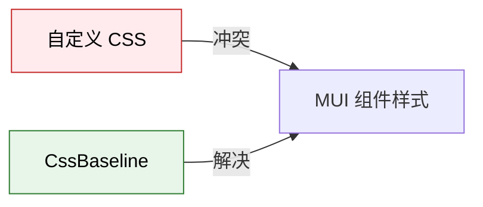
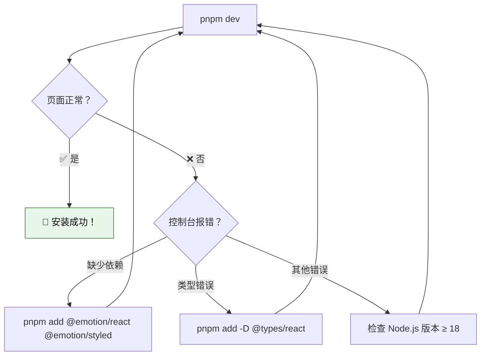

# 🚀 快速开始

> **学习目标**：从零搭建一个 Material UI 项目，编写第一个组件，理解核心导入模式与项目结构。

---

## 📋 前置要求

在开始之前，请确保你已安装以下工具：

| 工具 | 最低版本 | 检查命令 |
|------|----------|----------|
| Node.js | ≥ 18.0 | `node --version` |
| 包管理器 | pnpm / npm / yarn | `pnpm --version` |
| 代码编辑器 | VS Code（推荐） | — |

> 💡 Material UI v9 推荐使用 **Node.js 22+** 以获得最佳体验。

---

## 📦 安装 Material UI

### Step 1：创建 React 项目

```bash
# 使用 Vite 创建（推荐，速度快）
pnpm create vite my-mui-app --template react-ts
cd my-mui-app
```

### Step 2：安装 Material UI 及其依赖

Material UI 需要 **Emotion** 作为默认的 CSS-in-JS 引擎：



选择你的包管理器：

```bash
# pnpm（推荐）
pnpm add @mui/material @emotion/react @emotion/styled
pnpm add @mui/icons-material    # 可选：图标包

# npm
npm install @mui/material @emotion/react @emotion/styled
npm install @mui/icons-material

# yarn
yarn add @mui/material @emotion/react @emotion/styled
yarn add @mui/icons-material
```

### Step 3：添加 Roboto 字体

Material Design 默认使用 **Roboto** 字体。在 `index.html` 的 `<head>` 中添加：

```html
<link rel="preconnect" href="https://fonts.googleapis.com" />
<link rel="preconnect" href="https://fonts.gstatic.com" crossorigin />
<link
  rel="stylesheet"
  href="https://fonts.googleapis.com/css2?family=Roboto:wght@300;400;500;700&display=swap"
/>
```

或者通过 npm 安装：

```bash
pnpm add @fontsource/roboto
```

然后在入口文件中导入：

```tsx
import '@fontsource/roboto/300.css';
import '@fontsource/roboto/400.css';
import '@fontsource/roboto/500.css';
import '@fontsource/roboto/700.css';
```

---

## 🎨 第一个组件：Button

让我们从最简单的组件开始——**Button**：

```tsx
// src/App.tsx
import Button from '@mui/material/Button';

function App() {
  return (
    <div style={{ padding: 24, display: 'flex', gap: 16 }}>
      {/* 三种 variant */}
      <Button variant="text">文本按钮</Button>
      <Button variant="contained">实心按钮</Button>
      <Button variant="outlined">描边按钮</Button>
    </div>
  );
}

export default App;
```

### Button 的三种 variant 对比

```
┌─────────────────────────────────────────────────────────┐
│                                                         │
│   文本按钮        ┌──────────┐    ┌──────────┐          │
│   (text)         │ 实心按钮  │    │ 描边按钮  │          │
│                  │(contained)│    │(outlined) │          │
│   最低强调        └──────────┘    └──────────┘          │
│                   最高强调         中等强调              │
│                                                         │
└─────────────────────────────────────────────────────────┘
```

### 更多 Button 用法

```tsx
import Button from '@mui/material/Button';
import DeleteIcon from '@mui/icons-material/Delete';
import SendIcon from '@mui/icons-material/Send';
import Stack from '@mui/material/Stack';

function ButtonShowcase() {
  return (
    <Stack spacing={2} direction="row">
      {/* 颜色变体 */}
      <Button color="primary">Primary</Button>
      <Button color="secondary">Secondary</Button>
      <Button color="success">Success</Button>
      <Button color="error">Error</Button>

      {/* 大小变体 */}
      <Button size="small">小</Button>
      <Button size="medium">中</Button>
      <Button size="large">大</Button>

      {/* 带图标 */}
      <Button variant="contained" startIcon={<DeleteIcon />}>
        删除
      </Button>
      <Button variant="contained" endIcon={<SendIcon />}>
        发送
      </Button>

      {/* 禁用状态 */}
      <Button disabled>禁用</Button>
    </Stack>
  );
}
```

---

## 📥 理解导入模式

Material UI 支持两种导入方式，但推荐**第一种**：

### ✅ 推荐：逐层导入（One-Level Deep Import）

```tsx
// ✅ 推荐 - 直接从组件路径导入
import Button from '@mui/material/Button';
import TextField from '@mui/material/TextField';
import Card from '@mui/material/Card';
```

### ⚠️ 可用但不推荐：桶导入（Barrel Import）

```tsx
// ⚠️ 可用，但可能影响 bundle size
import { Button, TextField, Card } from '@mui/material';
```

### 为什么推荐逐层导入？



> 🧩 **类比**：逐层导入就像去超市**只拿你需要的商品**，桶导入像是把**整个货架**搬走再挑选——虽然最终你可能只用了几样，但搬运的成本更高。

**关键原因**：

1. **Tree-shaking 可靠性**：逐层导入不依赖打包工具的 tree-shaking 优化
2. **Bundle 体积**：确保只包含用到的组件代码
3. **开发体验**：更快的 HMR（热模块替换）刷新速度
4. **代码分割**：更有利于按需加载

---

## 🎭 设置 ThemeProvider 和 CssBaseline

一个完整的 Material UI 应用需要两个关键包装组件：

### ThemeProvider

提供主题上下文，让所有子组件都能访问主题配置。

### CssBaseline

类似于 CSS Reset / Normalize.css，提供统一的基础样式：

- 移除浏览器默认 margin
- 设置 `box-sizing: border-box`
- 应用 Roboto 字体
- 启用基础的抗锯齿渲染



---

## 📝 完整的最小应用示例

下面是一个结构完整、可以直接运行的 Material UI 应用：

### `src/main.tsx` — 应用入口

```tsx
import React from 'react';
import ReactDOM from 'react-dom/client';
import App from './App';

// 如果使用 @fontsource/roboto
import '@fontsource/roboto/300.css';
import '@fontsource/roboto/400.css';
import '@fontsource/roboto/500.css';
import '@fontsource/roboto/700.css';

ReactDOM.createRoot(document.getElementById('root')!).render(
  <React.StrictMode>
    <App />
  </React.StrictMode>,
);
```

### `src/theme.ts` — 主题配置

```tsx
import { createTheme } from '@mui/material/styles';

const theme = createTheme({
  palette: {
    primary: {
      main: '#1976d2',
    },
    secondary: {
      main: '#9c27b0',
    },
  },
  typography: {
    fontFamily: '"Roboto", "Helvetica", "Arial", sans-serif',
    h4: {
      fontWeight: 600,
    },
  },
});

export default theme;
```

### `src/App.tsx` — 主应用组件

```tsx
import { ThemeProvider } from '@mui/material/styles';
import CssBaseline from '@mui/material/CssBaseline';
import Container from '@mui/material/Container';
import Typography from '@mui/material/Typography';
import Button from '@mui/material/Button';
import TextField from '@mui/material/TextField';
import Box from '@mui/material/Box';
import Card from '@mui/material/Card';
import CardContent from '@mui/material/CardContent';
import Stack from '@mui/material/Stack';
import theme from './theme';

function App() {
  return (
    <ThemeProvider theme={theme}>
      {/* CssBaseline 提供全局 CSS 重置 */}
      <CssBaseline />

      <Container maxWidth="sm" sx={{ mt: 4 }}>
        <Typography variant="h4" component="h1" gutterBottom>
          🎉 我的第一个 Material UI 应用
        </Typography>

        <Card sx={{ mb: 3 }}>
          <CardContent>
            <Typography variant="h6" gutterBottom>
              联系表单
            </Typography>
            <Stack spacing={2}>
              <TextField label="姓名" variant="outlined" fullWidth />
              <TextField label="邮箱" variant="outlined" fullWidth type="email" />
              <TextField
                label="留言"
                variant="outlined"
                fullWidth
                multiline
                rows={4}
              />
              <Box sx={{ display: 'flex', gap: 2 }}>
                <Button variant="contained" color="primary">
                  提交
                </Button>
                <Button variant="outlined" color="secondary">
                  重置
                </Button>
              </Box>
            </Stack>
          </CardContent>
        </Card>
      </Container>
    </ThemeProvider>
  );
}

export default App;
```

---

## ⚠️ 常见错误与解决方案

### 错误 1：缺少 Emotion 依赖

```
Module not found: Can't resolve '@emotion/react'
```

**原因**：安装 `@mui/material` 时忘记安装 Emotion 依赖。

**解决**：

```bash
pnpm add @emotion/react @emotion/styled
```

### 错误 2：缺少 ThemeProvider

```
MUI: `useTheme` requires the theme context to be provided.
```

**原因**：组件没有被 `ThemeProvider` 包裹。

**解决**：确保应用的根组件被 `ThemeProvider` 包裹：

```tsx
// ❌ 错误
function App() {
  return <Button variant="contained">Hello</Button>;
}

// ✅ 正确
function App() {
  return (
    <ThemeProvider theme={theme}>
      <Button variant="contained">Hello</Button>
    </ThemeProvider>
  );
}
```

### 错误 3：TypeScript 类型报错

```
Property 'palette' does not exist on type 'Theme'.
```

**原因**：TypeScript 需要正确的类型支持。

**解决**：确保安装了 `@types/react`：

```bash
pnpm add -D @types/react @types/react-dom
```

### 错误 4：样式冲突 / 样式丢失



**原因**：全局 CSS 与 Material UI 组件样式冲突。

**解决**：
1. 使用 `CssBaseline` 组件统一基础样式
2. 避免使用全局 CSS 选择器覆盖 MUI 组件
3. 优先使用 `sx` prop 或 `styled()` API

### 错误 5：导入了错误的包

```tsx
// ❌ 旧版包名（v4 及更早）
import Button from '@material-ui/core/Button';

// ✅ 新版包名（v5+）
import Button from '@mui/material/Button';
```

---

## 📂 推荐项目结构

对于中大型 Material UI 项目，推荐以下目录结构：

```
my-mui-app/
├── public/
│   └── index.html
├── src/
│   ├── components/              # 🧩 可复用组件
│   │   ├── common/              # 通用组件
│   │   │   ├── LoadingButton.tsx
│   │   │   └── ConfirmDialog.tsx
│   │   ├── layout/              # 布局组件
│   │   │   ├── Header.tsx
│   │   │   ├── Sidebar.tsx
│   │   │   └── Footer.tsx
│   │   └── forms/               # 表单组件
│   │       ├── LoginForm.tsx
│   │       └── SearchBar.tsx
│   │
│   ├── pages/                   # 📄 页面组件
│   │   ├── HomePage.tsx
│   │   ├── DashboardPage.tsx
│   │   └── SettingsPage.tsx
│   │
│   ├── theme/                   # 🎨 主题配置
│   │   ├── index.ts             # 主题入口
│   │   ├── palette.ts           # 调色板配置
│   │   ├── typography.ts        # 排版配置
│   │   └── components.ts        # 组件样式覆盖
│   │
│   ├── hooks/                   # 🪝 自定义 Hooks
│   │   ├── useThemeMode.ts
│   │   └── useResponsive.ts
│   │
│   ├── utils/                   # 🔧 工具函数
│   │
│   ├── App.tsx                  # 应用根组件
│   └── main.tsx                 # 入口文件
│
├── package.json
├── tsconfig.json
└── vite.config.ts
```

### 主题文件拆分示例

当主题配置变得复杂时，推荐将其拆分为多个文件：

```tsx
// src/theme/palette.ts
export const palette = {
  primary: {
    main: '#1976d2',
    light: '#42a5f5',
    dark: '#1565c0',
  },
  secondary: {
    main: '#9c27b0',
    light: '#ba68c8',
    dark: '#7b1fa2',
  },
};

// src/theme/typography.ts
export const typography = {
  fontFamily: '"Roboto", "Helvetica", "Arial", sans-serif',
  h1: { fontSize: '2.5rem', fontWeight: 700 },
  h2: { fontSize: '2rem', fontWeight: 600 },
};

// src/theme/components.ts
import type { Components, Theme } from '@mui/material/styles';

export const components: Components<Theme> = {
  MuiButton: {
    defaultProps: {
      disableElevation: true, // 全局禁用按钮阴影
    },
    styleOverrides: {
      root: {
        textTransform: 'none', // 禁用大写转换
        borderRadius: 8,
      },
    },
  },
  MuiCard: {
    defaultProps: {
      elevation: 0,
    },
    styleOverrides: {
      root: {
        border: '1px solid',
        borderColor: 'divider',
      },
    },
  },
};

// src/theme/index.ts
import { createTheme } from '@mui/material/styles';
import { palette } from './palette';
import { typography } from './typography';
import { components } from './components';

const theme = createTheme({
  palette,
  typography,
  components,
});

export default theme;
```

---

## 🧪 验证安装是否成功

创建完项目后，运行开发服务器：

```bash
pnpm dev
```

你应该能看到：

1. ✅ 页面正常显示，没有控制台报错
2. ✅ Button 组件有 Material Design 风格的涟漪效果（ripple effect）
3. ✅ Typography 使用了 Roboto 字体
4. ✅ 组件有正确的颜色和间距



---

## ✅ 本章小结

| 知识点 | 掌握情况 |
|--------|----------|
| 创建项目并安装 Material UI | ☐ |
| 编写第一个 Button 组件 | ☐ |
| 理解两种导入模式的区别 | ☐ |
| 配置 ThemeProvider 和 CssBaseline | ☐ |
| 了解常见错误及其解决方案 | ☐ |
| 合理组织项目目录结构 | ☐ |

---

## 📖 延伸阅读

- [Material UI 安装指南](https://mui.com/material-ui/getting-started/installation/)
- [Vite + React 创建项目](https://vite.dev/guide/)
- [Emotion 官方文档](https://emotion.sh/docs/introduction)

---

> ⏭️ **下一章**：[主题系统深度解析](./03-theming-system.md) — 掌握 Material UI 最强大的定制能力！
