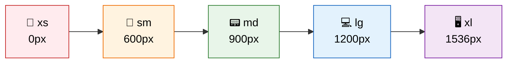
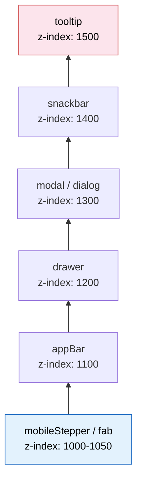
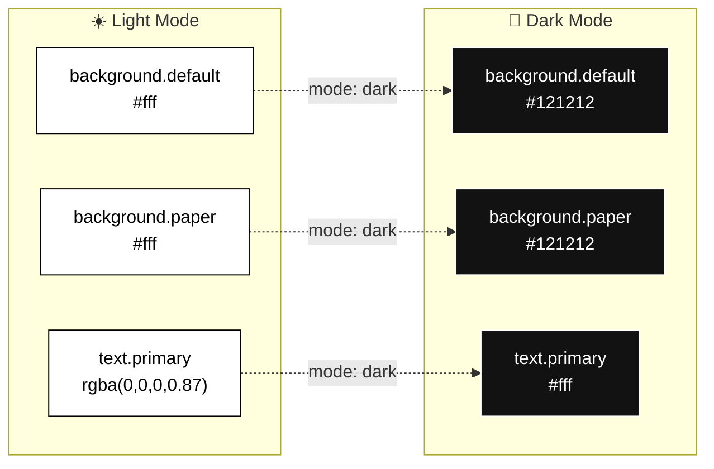
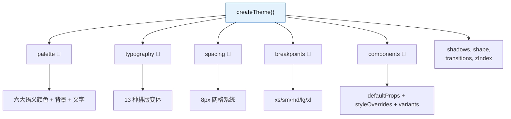

# 🎨 主题系统深度解析

> **学习目标**：深入理解 Material UI 的 Theme 对象结构，掌握 `createTheme()` 的各项配置，实现暗黑模式与品牌定制。

---

## 🧠 什么是 Theme？

> 🏗️ **类比**：Theme 就像一本**品牌视觉规范手册**——
> - 你的品牌色是什么？（palette）
> - 用什么字体、多大字号？（typography）
> - 元素间距统一用多少？（spacing）
> - 圆角多大？（shape）
> - 阴影多深？（shadows）
>
> 有了这本手册，公司里每个设计师（组件）都会按照统一标准工作。

在 Material UI 中，**Theme** 是一个 JavaScript 对象，它集中定义了整个应用的视觉规范。所有组件都会读取这个对象来决定自己的外观。

```tsx
import { createTheme } from '@mui/material/styles';

// createTheme 就是「创建品牌手册」的工具
const theme = createTheme({
  palette: { /* 颜色配置 */ },
  typography: { /* 字体配置 */ },
  spacing: 8, // 间距基数
  shape: { borderRadius: 4 }, // 形状配置
  // ...更多配置
});
```

---

## 🗺️ Theme 对象完整结构

```mermaid
graph TD
    THEME["🎨 Theme 对象"]

    THEME --> PALETTE["🌈 palette<br/>调色板"]
    THEME --> TYPO["📝 typography<br/>排版"]
    THEME --> SPACING["📏 spacing<br/>间距"]
    THEME --> BP["📱 breakpoints<br/>断点"]
    THEME --> SHADOWS["🌑 shadows<br/>阴影"]
    THEME --> SHAPE["⬜ shape<br/>形状"]
    THEME --> TRANS["⏱️ transitions<br/>动画过渡"]
    THEME --> ZINDEX["📐 zIndex<br/>层级"]
    THEME --> COMP["🧩 components<br/>组件覆盖"]

    PALETTE --> P1["primary 主色"]
    PALETTE --> P2["secondary 辅助色"]
    PALETTE --> P3["error 错误色"]
    PALETTE --> P4["warning 警告色"]
    PALETTE --> P5["info 信息色"]
    PALETTE --> P6["success 成功色"]
    PALETTE --> P7["background 背景色"]
    PALETTE --> P8["text 文字色"]
    PALETTE --> P9["divider 分割线色"]
    PALETTE --> P10["mode: light / dark"]

    TYPO --> T1["fontFamily"]
    TYPO --> T2["fontSize"]
    TYPO --> T3["h1 - h6"]
    TYPO --> T4["body1, body2"]
    TYPO --> T5["subtitle1, subtitle2"]
    TYPO --> T6["caption, overline"]
    TYPO --> T7["button"]

    style THEME fill:#e3f2fd,stroke:#1565c0,color:#000
    style PALETTE fill:#fce4ec,stroke:#c62828,color:#000
    style TYPO fill:#e8f5e9,stroke:#2e7d32,color:#000
    style SPACING fill:#fff3e0,stroke:#ef6c00,color:#000
    style BP fill:#f3e5f5,stroke:#7b1fa2,color:#000
    style SHADOWS fill:#e0e0e0,stroke:#616161,color:#000
    style SHAPE fill:#e0f7fa,stroke:#00838f,color:#000
    style TRANS fill:#f0f4c3,stroke:#827717,color:#000
    style ZINDEX fill:#fbe9e7,stroke:#bf360c,color:#000
    style COMP fill:#ede7f6,stroke:#4527a0,color:#000
```



---

## 🌈 palette — 调色板

调色板是主题中最重要的部分，定义了应用的所有颜色。

### 颜色结构

每个语义颜色都包含四个值：

```tsx
const theme = createTheme({
  palette: {
    primary: {
      main: '#1976d2',    // 主色调 — 必填
      light: '#42a5f5',   // 浅色变体 — 可选，自动计算
      dark: '#1565c0',    // 深色变体 — 可选，自动计算
      contrastText: '#fff', // 对比文字色 — 可选，自动计算
    },
  },
});
```

> 💡 只需要提供 `main`，其他三个值会自动根据 `main` 计算生成。

### 完整调色板示例

```tsx
const theme = createTheme({
  palette: {
    mode: 'light', // 'light' | 'dark'

    // 六大语义颜色
    primary: { main: '#1976d2' },     // 品牌主色
    secondary: { main: '#9c27b0' },   // 辅助色
    error: { main: '#d32f2f' },       // 错误/危险
    warning: { main: '#ed6c02' },     // 警告
    info: { main: '#0288d1' },        // 信息
    success: { main: '#2e7d32' },     // 成功

    // 背景色
    background: {
      default: '#fff',   // 页面背景
      paper: '#fff',     // Card、Paper 等组件背景
    },

    // 文字色
    text: {
      primary: 'rgba(0, 0, 0, 0.87)',    // 主要文字
      secondary: 'rgba(0, 0, 0, 0.6)',   // 次要文字
      disabled: 'rgba(0, 0, 0, 0.38)',   // 禁用文字
    },

    // 分割线色
    divider: 'rgba(0, 0, 0, 0.12)',
  },
});
```

### 在组件中使用颜色

```tsx
// 通过 color prop 使用语义颜色
<Button color="primary">主色按钮</Button>
<Button color="secondary">辅助色按钮</Button>
<Alert severity="error">错误提示</Alert>
<Alert severity="success">成功提示</Alert>

// 通过 sx prop 引用主题颜色
<Box sx={{
  color: 'primary.main',           // #1976d2
  bgcolor: 'background.paper',     // #fff
  borderColor: 'divider',          // rgba(0, 0, 0, 0.12)
}} />
```

---

## 📝 typography — 排版

### 预定义的排版变体

Material UI 定义了 13 种排版变体，涵盖了常见的文本场景：

```tsx
const theme = createTheme({
  typography: {
    // 全局字体设置
    fontFamily: '"Roboto", "Helvetica", "Arial", sans-serif',
    fontSize: 14, // 基准字号（px）

    // 各级变体
    h1: { fontSize: '6rem', fontWeight: 300, lineHeight: 1.167 },
    h2: { fontSize: '3.75rem', fontWeight: 300, lineHeight: 1.2 },
    h3: { fontSize: '3rem', fontWeight: 400, lineHeight: 1.167 },
    h4: { fontSize: '2.125rem', fontWeight: 400, lineHeight: 1.235 },
    h5: { fontSize: '1.5rem', fontWeight: 400, lineHeight: 1.334 },
    h6: { fontSize: '1.25rem', fontWeight: 500, lineHeight: 1.6 },

    subtitle1: { fontSize: '1rem', fontWeight: 400, lineHeight: 1.75 },
    subtitle2: { fontSize: '0.875rem', fontWeight: 500, lineHeight: 1.57 },

    body1: { fontSize: '1rem', fontWeight: 400, lineHeight: 1.5 },
    body2: { fontSize: '0.875rem', fontWeight: 400, lineHeight: 1.43 },

    button: { fontSize: '0.875rem', fontWeight: 500, textTransform: 'uppercase' },
    caption: { fontSize: '0.75rem', fontWeight: 400, lineHeight: 1.66 },
    overline: { fontSize: '0.75rem', fontWeight: 400, textTransform: 'uppercase' },
  },
});
```

### 在组件中使用

```tsx
import Typography from '@mui/material/Typography';

function TypographyShowcase() {
  return (
    <>
      <Typography variant="h1">h1 标题</Typography>
      <Typography variant="h4" component="h1">
        {/* variant 控制样式，component 控制渲染的 HTML 标签 */}
        看起来是 h4，实际是 h1 标签
      </Typography>
      <Typography variant="body1">正文内容 body1</Typography>
      <Typography variant="caption" color="text.secondary">
        辅助说明文字
      </Typography>
    </>
  );
}
```

---

## 📏 spacing — 间距

Material UI 使用 **8px 网格系统**，这是 Material Design 的核心布局原则。

### 为什么是 8px？

> 🧩 **类比**：8px 间距就像音乐中的**节拍**——所有元素都按照 8 的倍数对齐，形成视觉上的韵律感和秩序感。

```tsx
const theme = createTheme({
  spacing: 8, // 基数，默认就是 8
});

// 使用方式：theme.spacing(n) = n × 8px
theme.spacing(1);  // '8px'
theme.spacing(2);  // '16px'
theme.spacing(3);  // '24px'
theme.spacing(0.5); // '4px'
```

### 在 sx prop 中使用

```tsx
// spacing 属性会自动乘以主题的 spacing 基数
<Box sx={{
  m: 2,    // margin: 16px (2 × 8px)
  p: 3,    // padding: 24px (3 × 8px)
  mt: 1,   // marginTop: 8px
  px: 4,   // paddingLeft + paddingRight: 32px
  gap: 2,  // gap: 16px
}} />

// 等价于：
<Box sx={{
  margin: 16,
  padding: 24,
  marginTop: 8,
  paddingLeft: 32,
  paddingRight: 32,
  gap: 16,
}} />
```

### spacing 简写速查表

| 简写 | 全称 | 示例 |
|------|------|------|
| `m` | margin | `m: 2` → 所有方向 16px |
| `mt` | marginTop | `mt: 1` → 上方 8px |
| `mb` | marginBottom | `mb: 3` → 下方 24px |
| `ml` | marginLeft | `ml: 2` → 左侧 16px |
| `mr` | marginRight | `mr: 1` → 右侧 8px |
| `mx` | marginLeft + marginRight | `mx: 'auto'` → 水平居中 |
| `my` | marginTop + marginBottom | `my: 4` → 上下 32px |
| `p` | padding | 同上规则 |
| `pt`, `pb`, `pl`, `pr` | padding 各方向 | 同上 |
| `px`, `py` | padding 水平/垂直 | 同上 |

---

## 📱 breakpoints — 响应式断点

```tsx
const theme = createTheme({
  breakpoints: {
    values: {
      xs: 0,      // 手机竖屏
      sm: 600,    // 手机横屏 / 小平板
      md: 900,    // 平板
      lg: 1200,   // 桌面
      xl: 1536,   // 大屏桌面
    },
  },
});
```



### 在 sx prop 中使用响应式值

```tsx
// 方式 1：对象语法
<Box sx={{
  width: {
    xs: '100%',   // 手机：全宽
    sm: '50%',    // 平板：半宽
    md: '33.33%', // 桌面：三分之一
  },
  fontSize: {
    xs: '14px',
    md: '16px',
    lg: '18px',
  },
}} />

// 方式 2：数组语法（按 xs, sm, md, lg, xl 顺序）
<Box sx={{
  width: ['100%', '50%', '33.33%'],
  // xs: 100%, sm: 50%, md: 33.33%
}} />
```

---

## 🌑 shadows — 阴影

Material Design 定义了 **25 级阴影**（0-24），模拟物理世界中纸张的高度层次：

```tsx
// 默认阴影系统
theme.shadows[0];  // 'none' — 无阴影
theme.shadows[1];  // 最浅的阴影 — Card 默认
theme.shadows[4];  // 中等阴影 — AppBar 默认
theme.shadows[8];  // 较深阴影 — Drawer 默认
theme.shadows[16]; // 深阴影 — Dialog 默认
theme.shadows[24]; // 最深阴影

// 自定义
const theme = createTheme({
  shadows: [
    'none',
    '0px 1px 3px rgba(0,0,0,0.12)',
    // ... 提供 25 个值
  ],
});
```

### 在组件中使用

```tsx
<Paper elevation={0}>无阴影</Paper>
<Paper elevation={1}>浅阴影</Paper>
<Paper elevation={4}>中等阴影</Paper>
<Paper elevation={8}>深阴影</Paper>
```

---

## ⬜ shape — 形状

```tsx
const theme = createTheme({
  shape: {
    borderRadius: 4, // 默认圆角，单位 px
  },
});

// 在 sx 中使用
<Card sx={{ borderRadius: 2 }} />
// 实际值 = 2 × theme.shape.borderRadius = 8px
```

---

## ⏱️ transitions — 动画过渡

```tsx
const theme = createTheme({
  transitions: {
    duration: {
      shortest: 150,
      shorter: 200,
      short: 250,
      standard: 300,     // 默认动画时长
      complex: 375,
      enteringScreen: 225,
      leavingScreen: 195,
    },
    easing: {
      easeInOut: 'cubic-bezier(0.4, 0, 0.2, 1)',
      easeOut: 'cubic-bezier(0.0, 0, 0.2, 1)',
      easeIn: 'cubic-bezier(0.4, 0, 1, 1)',
      sharp: 'cubic-bezier(0.4, 0, 0.6, 1)',
    },
  },
});

// 在组件中使用
<Box sx={{
  transition: (theme) =>
    theme.transitions.create(['background-color', 'transform'], {
      duration: theme.transitions.duration.standard,
    }),
  '&:hover': {
    backgroundColor: 'primary.light',
    transform: 'scale(1.05)',
  },
}} />
```

---

## 📐 zIndex — 层级

Material UI 预定义了一套 z-index 层级体系，避免层级冲突：

```tsx
const theme = createTheme({
  zIndex: {
    mobileStepper: 1000,
    fab: 1050,
    speedDial: 1050,
    appBar: 1100,
    drawer: 1200,
    modal: 1300,
    snackbar: 1400,
    tooltip: 1500,
  },
});
```



---

## 🧩 components — 组件全局覆盖

这是主题系统中最强大的部分，允许你全局修改任何组件的默认 props 和样式：

```tsx
const theme = createTheme({
  components: {
    // 组件名格式：Mui + 组件名
    MuiButton: {
      // 修改默认 props
      defaultProps: {
        variant: 'contained',     // 默认使用实心按钮
        disableElevation: true,   // 禁用阴影
        size: 'medium',
      },

      // 覆盖样式
      styleOverrides: {
        root: {
          textTransform: 'none',   // 禁用文字大写
          borderRadius: 8,
          fontWeight: 600,
        },
        containedPrimary: {
          '&:hover': {
            backgroundColor: '#1565c0',
          },
        },
      },

      // 自定义 variants
      variants: [
        {
          props: { variant: 'dashed' },
          style: {
            border: '2px dashed',
            borderColor: 'currentColor',
          },
        },
      ],
    },

    MuiTextField: {
      defaultProps: {
        variant: 'outlined',
        size: 'small',
      },
    },

    MuiCard: {
      styleOverrides: {
        root: {
          borderRadius: 12,
          boxShadow: '0 2px 8px rgba(0,0,0,0.08)',
        },
      },
    },
  },
});
```

### 使用 ownerState 进行条件样式

```tsx
const theme = createTheme({
  components: {
    MuiChip: {
      styleOverrides: {
        root: ({ ownerState }) => ({
          // 根据组件 props 动态调整样式
          ...(ownerState.color === 'primary' && ownerState.variant === 'outlined' && {
            borderWidth: 2,
            fontWeight: 700,
          }),
        }),
      },
    },
  },
});
```

---

## 🔧 createTheme() 深度使用

### 基础用法

```tsx
import { createTheme, ThemeProvider } from '@mui/material/styles';

const theme = createTheme({
  palette: {
    primary: { main: '#6366f1' },
    secondary: { main: '#ec4899' },
  },
});

function App() {
  return (
    <ThemeProvider theme={theme}>
      <MyApp />
    </ThemeProvider>
  );
}
```

### 访问主题中的其他值

`createTheme` 支持两次调用以实现交叉引用：

```tsx
// 第一步：创建基础主题
let theme = createTheme({
  palette: {
    primary: { main: '#6366f1' },
  },
});

// 第二步：基于已有主题扩展（可以引用 palette）
theme = createTheme(theme, {
  components: {
    MuiButton: {
      styleOverrides: {
        root: {
          // 现在可以访问 theme.palette
          backgroundColor: theme.palette.primary.main,
        },
      },
    },
  },
});
```

### 主题嵌套与合并

```tsx
import { createTheme, ThemeProvider } from '@mui/material/styles';

const outerTheme = createTheme({
  palette: { primary: { main: '#1976d2' } },
});

const innerTheme = createTheme({
  palette: { primary: { main: '#e91e63' } },
});

function App() {
  return (
    <ThemeProvider theme={outerTheme}>
      {/* 这里 primary 是蓝色 */}
      <Button color="primary">外层蓝色</Button>

      <ThemeProvider theme={innerTheme}>
        {/* 这里 primary 变成粉色 */}
        <Button color="primary">内层粉色</Button>
      </ThemeProvider>
    </ThemeProvider>
  );
}
```

---

## 🌙 暗黑模式实现

### 方式 1：手动切换 palette.mode

```tsx
import { createTheme, ThemeProvider } from '@mui/material/styles';
import CssBaseline from '@mui/material/CssBaseline';
import { useState, useMemo } from 'react';

function App() {
  const [mode, setMode] = useState<'light' | 'dark'>('light');

  const theme = useMemo(
    () => createTheme({
      palette: {
        mode, // 'light' 或 'dark'
        primary: { main: '#6366f1' },
      },
    }),
    [mode],
  );

  const toggleMode = () => {
    setMode((prev) => (prev === 'light' ? 'dark' : 'light'));
  };

  return (
    <ThemeProvider theme={theme}>
      <CssBaseline /> {/* 自动应用暗色/亮色背景 */}
      <Button onClick={toggleMode}>
        切换到 {mode === 'light' ? '🌙 暗黑' : '☀️ 明亮'} 模式
      </Button>
    </ThemeProvider>
  );
}
```

### 方式 2：跟随系统设置

```tsx
import useMediaQuery from '@mui/material/useMediaQuery';

function App() {
  // 检测系统是否使用暗色模式
  const prefersDarkMode = useMediaQuery('(prefers-color-scheme: dark)');

  const theme = useMemo(
    () => createTheme({
      palette: {
        mode: prefersDarkMode ? 'dark' : 'light',
      },
    }),
    [prefersDarkMode],
  );

  return (
    <ThemeProvider theme={theme}>
      <CssBaseline />
      <MyApp />
    </ThemeProvider>
  );
}
```

### 暗黑模式下的自动颜色变化



---

## 📘 TypeScript 主题扩展

当你需要在主题中添加自定义值时，需要通过 **module augmentation** 扩展 TypeScript 类型：

```tsx
// src/theme/types.ts
import '@mui/material/styles';

declare module '@mui/material/styles' {
  // 扩展 Palette
  interface Palette {
    neutral: Palette['primary'];
    gradient: {
      primary: string;
      secondary: string;
    };
  }
  interface PaletteOptions {
    neutral?: PaletteOptions['primary'];
    gradient?: {
      primary?: string;
      secondary?: string;
    };
  }

  // 扩展 TypographyVariants
  interface TypographyVariants {
    poster: React.CSSProperties;
  }
  interface TypographyVariantsOptions {
    poster?: React.CSSProperties;
  }
}

// 扩展 Typography 组件的 variant prop
declare module '@mui/material/Typography' {
  interface TypographyPropsVariantOverrides {
    poster: true;
  }
}

// 扩展 Button 组件的 color prop
declare module '@mui/material/Button' {
  interface ButtonPropsColorOverrides {
    neutral: true;
  }
}
```

```tsx
// src/theme/index.ts
import { createTheme } from '@mui/material/styles';
import './types'; // 导入类型扩展

const theme = createTheme({
  palette: {
    neutral: {
      main: '#64748B',
      light: '#94a3b8',
      dark: '#475569',
      contrastText: '#fff',
    },
    gradient: {
      primary: 'linear-gradient(135deg, #667eea 0%, #764ba2 100%)',
      secondary: 'linear-gradient(135deg, #f093fb 0%, #f5576c 100%)',
    },
  },
  typography: {
    poster: {
      fontSize: '4rem',
      fontWeight: 800,
      lineHeight: 1.1,
      letterSpacing: '-0.02em',
    },
  },
});

export default theme;
```

使用扩展后的主题：

```tsx
// ✅ TypeScript 不会报错
<Button color="neutral">自定义颜色按钮</Button>
<Typography variant="poster">大标题</Typography>

<Box sx={{
  background: (theme) => theme.palette.gradient.primary,
  color: 'neutral.main',
}} />
```

---

## 📐 responsiveFontSizes() 工具

自动为排版变体添加响应式字体大小：

```tsx
import { createTheme, responsiveFontSizes } from '@mui/material/styles';

let theme = createTheme();
theme = responsiveFontSizes(theme);

// 转换前 h1: fontSize: '6rem'（固定大小）
// 转换后 h1: 在小屏幕上自动缩小到合适大小
```

```
大屏幕 (lg)：  h1 = 6rem     ████████████
中屏幕 (md)：  h1 = 4.7rem   ██████████
小屏幕 (sm)：  h1 = 3.5rem   ████████
手机 (xs)：    h1 = 3rem     ██████
```

---

## 🏢 实战：创建完整品牌主题

下面是一个完整的企业品牌主题示例：

```tsx
import { createTheme, responsiveFontSizes } from '@mui/material/styles';

let theme = createTheme({
  // 🌈 品牌色彩
  palette: {
    primary: {
      main: '#6366f1',    // Indigo
      light: '#818cf8',
      dark: '#4f46e5',
      contrastText: '#ffffff',
    },
    secondary: {
      main: '#ec4899',    // Pink
      light: '#f472b6',
      dark: '#db2777',
    },
    error: { main: '#ef4444' },
    warning: { main: '#f59e0b' },
    info: { main: '#3b82f6' },
    success: { main: '#10b981' },
    background: {
      default: '#f8fafc',
      paper: '#ffffff',
    },
    text: {
      primary: '#1e293b',
      secondary: '#64748b',
    },
  },

  // 📝 排版
  typography: {
    fontFamily: '"Inter", "Roboto", "Helvetica", "Arial", sans-serif',
    h1: { fontWeight: 800, letterSpacing: '-0.025em' },
    h2: { fontWeight: 700, letterSpacing: '-0.025em' },
    h3: { fontWeight: 700 },
    h4: { fontWeight: 600 },
    h5: { fontWeight: 600 },
    h6: { fontWeight: 600 },
    button: { textTransform: 'none', fontWeight: 600 },
  },

  // ⬜ 形状
  shape: {
    borderRadius: 8,
  },

  // 🧩 组件覆盖
  components: {
    MuiButton: {
      defaultProps: {
        disableElevation: true,
      },
      styleOverrides: {
        root: {
          borderRadius: 8,
          padding: '8px 20px',
        },
        sizeLarge: {
          padding: '12px 28px',
          fontSize: '1rem',
        },
      },
    },
    MuiCard: {
      styleOverrides: {
        root: {
          borderRadius: 12,
          border: '1px solid',
          borderColor: 'rgba(0, 0, 0, 0.08)',
          boxShadow: '0 1px 3px rgba(0, 0, 0, 0.04)',
        },
      },
    },
    MuiTextField: {
      defaultProps: {
        variant: 'outlined',
        size: 'small',
      },
    },
    MuiChip: {
      styleOverrides: {
        root: {
          borderRadius: 6,
          fontWeight: 500,
        },
      },
    },
    MuiAppBar: {
      styleOverrides: {
        root: {
          boxShadow: '0 1px 3px rgba(0, 0, 0, 0.05)',
        },
      },
    },
  },
});

// 自动响应式字体
theme = responsiveFontSizes(theme);

export default theme;
```

---

## ✅ 本章小结



| 知识点 | 掌握情况 |
|--------|----------|
| Theme 对象的完整结构 | ☐ |
| palette 调色板配置 | ☐ |
| typography 排版系统 | ☐ |
| spacing 8px 网格 | ☐ |
| breakpoints 响应式断点 | ☐ |
| components 全局覆盖 | ☐ |
| 暗黑模式实现 | ☐ |
| TypeScript 主题扩展 | ☐ |

---

## 📖 延伸阅读

- [Material UI 主题文档](https://mui.com/material-ui/customization/theming/)
- [调色板配置](https://mui.com/material-ui/customization/palette/)
- [暗色模式](https://mui.com/material-ui/customization/dark-mode/)
- [组件样式覆盖](https://mui.com/material-ui/customization/theme-components/)

---

> ⏭️ **下一章**：[样式系统（sx prop, styled, CSS-in-JS）](./04-styling-system.md) — 掌握三种样式方案，写出灵活优雅的组件样式！
