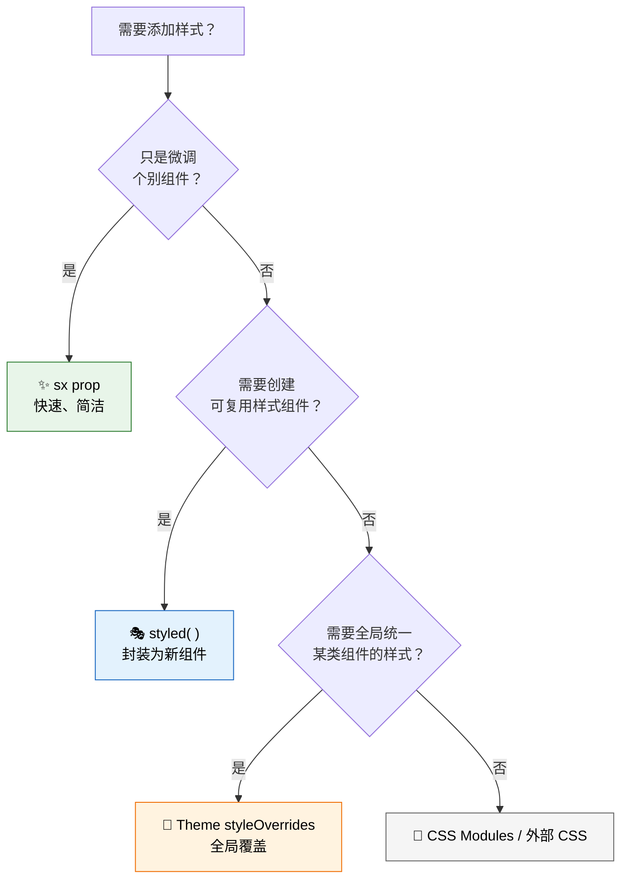
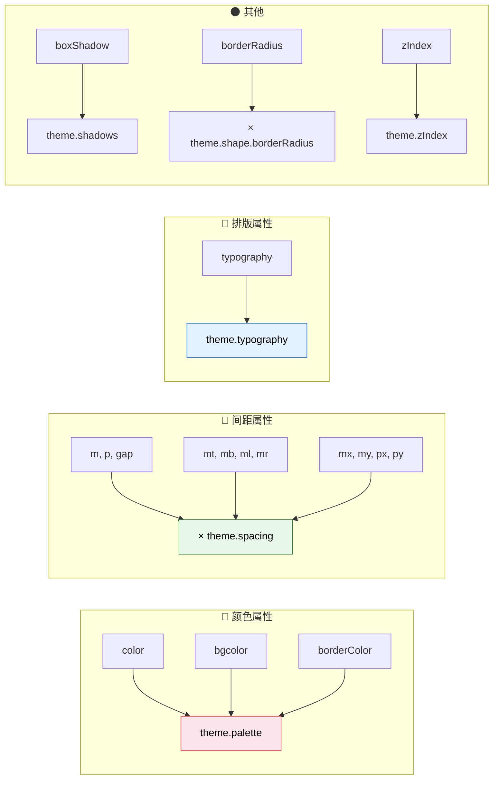
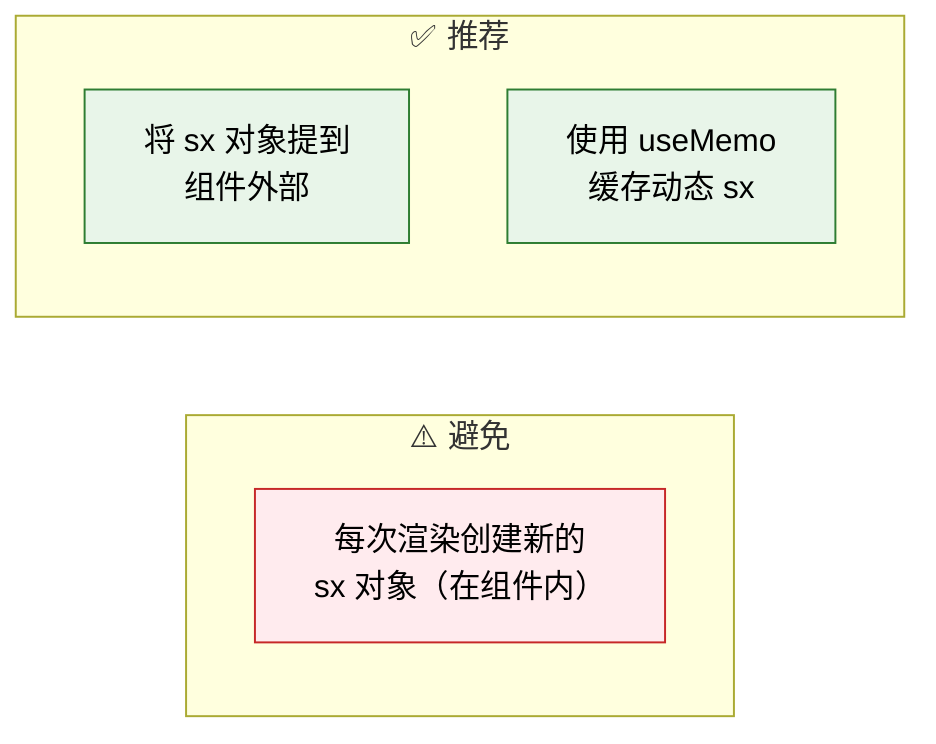
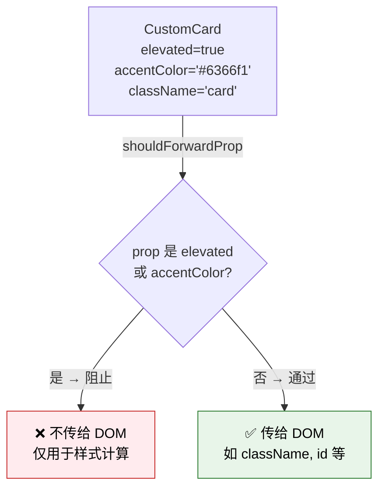
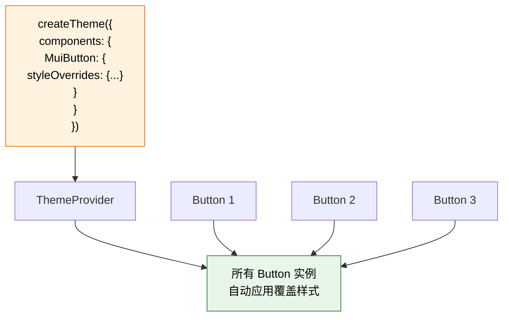
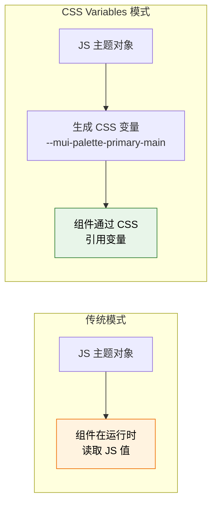
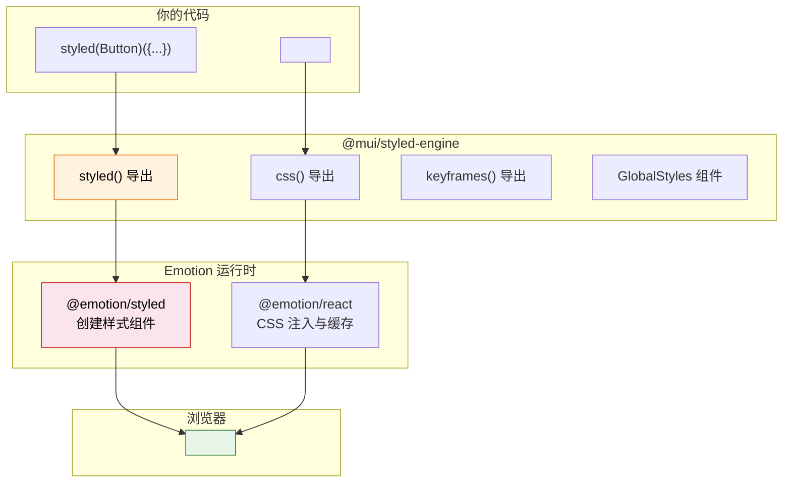
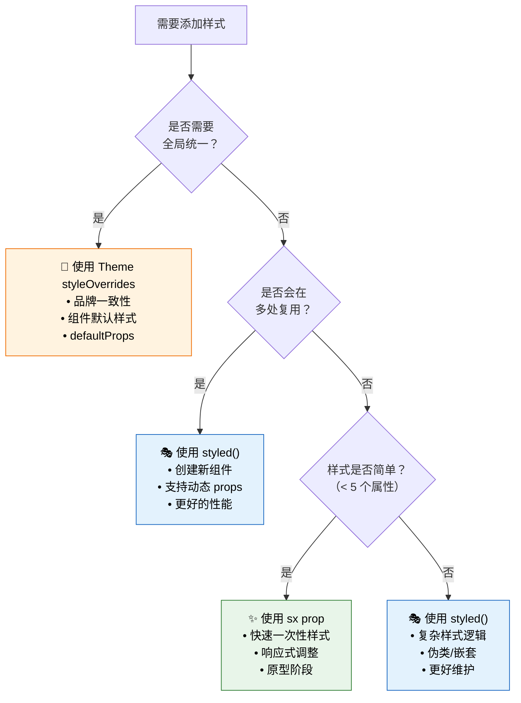
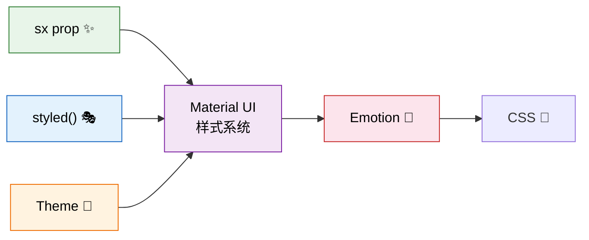

# 💅 样式系统（sx prop, styled, CSS-in-JS）

> **学习目标**：掌握 Material UI 的三种样式方案——`sx` prop、`styled()` API 和 Theme `styleOverrides`，理解何时使用哪种方案。

---

## 🗺️ 样式方案总览

Material UI 提供了三种主要的样式方案，它们各有优势，适用于不同场景：

> 🧩 **类比时间**：
> - **`sx` prop** → 像是「内联样式的超级升级版」——快速、方便、支持主题，适合一次性样式
> - **`styled()`** → 像是「定制裁缝」——为组件量身定做一套样式，可复用
> - **Theme `styleOverrides`** → 像是「公司着装规范」——全局统一所有同类组件的样式

### 三种方案对比

| 特性 | `sx` prop | `styled()` | Theme `styleOverrides` |
|------|-----------|------------|----------------------|
| 📍 作用范围 | 单个实例 | 创建新组件 | 全局所有实例 |
| 🔄 可复用性 | ❌ 不可复用 | ✅ 高度可复用 | ✅ 全局生效 |
| 🎨 主题感知 | ✅ 内置 | ✅ 通过 `theme` 参数 | ✅ 内置 |
| 📱 响应式 | ✅ 内置断点语法 | 需手动编写 media query | 需手动编写 |
| ⚡ 性能 | 适中 | ✅ 最优 | ✅ 最优 |
| 🎯 适用场景 | 快速调整 / 原型 | 自定义组件 | 品牌统一 |



---

## ✨ sx prop — 快速样式利器

### 基础用法

`sx` prop 是 Material UI 最便捷的样式方案，支持所有 CSS 属性，并额外提供主题感知的快捷写法：

```tsx
import Box from '@mui/material/Box';
import Button from '@mui/material/Button';

function Example() {
  return (
    <Box
      sx={{
        // 标准 CSS 属性
        display: 'flex',
        flexDirection: 'column',
        alignItems: 'center',

        // 主题感知的间距（自动 × spacing 基数 8px）
        p: 3,        // padding: 24px
        m: 2,        // margin: 16px
        gap: 2,      // gap: 16px

        // 主题感知的颜色
        color: 'primary.main',           // theme.palette.primary.main
        bgcolor: 'background.paper',     // theme.palette.background.paper
        borderColor: 'divider',          // theme.palette.divider

        // 尺寸快捷写法
        width: 300,  // 数字自动转为 px
        maxWidth: '100%',

        // 圆角（乘以 theme.shape.borderRadius）
        borderRadius: 2, // 2 × 4 = 8px
      }}
    >
      <Button sx={{ textTransform: 'none' }}>
        Hello World
      </Button>
    </Box>
  );
}
```

### 主题感知属性速查



### 颜色引用路径

```tsx
<Box sx={{
  // 通过点号路径引用主题颜色
  color: 'primary.main',           // theme.palette.primary.main
  color: 'secondary.dark',         // theme.palette.secondary.dark
  color: 'text.primary',           // theme.palette.text.primary
  color: 'text.secondary',         // theme.palette.text.secondary
  color: 'error.main',             // theme.palette.error.main
  bgcolor: 'background.default',   // theme.palette.background.default
  bgcolor: 'background.paper',     // theme.palette.background.paper
  bgcolor: 'grey.100',             // theme.palette.grey[100]
  borderColor: 'divider',          // theme.palette.divider
}} />
```

### 响应式语法

```tsx
// 对象语法 — 最常用
<Box sx={{
  // 不同断点使用不同值
  flexDirection: {
    xs: 'column',    // 手机：垂直排列
    sm: 'row',       // 平板：水平排列
  },
  p: {
    xs: 2,           // 手机：16px padding
    sm: 3,           // 平板：24px
    md: 4,           // 桌面：32px
  },
  fontSize: {
    xs: '0.875rem',
    md: '1rem',
    lg: '1.125rem',
  },
  display: {
    xs: 'none',      // 手机上隐藏
    md: 'block',     // 平板及以上显示
  },
}} />

// 数组语法 — 简洁，按 xs, sm, md, lg, xl 顺序
<Box sx={{
  width: ['100%', '100%', '50%', '33.33%'],
  // xs: 100%, sm: 100%, md: 50%, lg: 33.33%
}} />
```

### 伪类和嵌套选择器

```tsx
<Button sx={{
  // 伪类
  '&:hover': {
    backgroundColor: 'primary.dark',
    transform: 'translateY(-2px)',
    boxShadow: 4,
  },
  '&:active': {
    transform: 'translateY(0)',
  },
  '&:disabled': {
    opacity: 0.5,
  },

  // 伪元素
  '&::before': {
    content: '""',
    position: 'absolute',
    top: 0,
    left: 0,
    width: '100%',
    height: '100%',
  },

  // 子元素选择器
  '& .MuiButton-startIcon': {
    marginRight: 1,
  },

  // 相邻兄弟
  '& + &': {
    marginLeft: 2,
  },
}} />
```

### 函数语法 — 访问 theme 对象

```tsx
<Box sx={(theme) => ({
  // 完整访问 theme 对象
  backgroundColor: theme.palette.mode === 'dark'
    ? theme.palette.grey[900]
    : theme.palette.grey[50],

  // 使用主题工具函数
  border: `1px solid ${theme.palette.divider}`,

  // 使用 transition 工具
  transition: theme.transitions.create(['background-color'], {
    duration: theme.transitions.duration.short,
  }),

  // 使用 breakpoint 工具
  [theme.breakpoints.up('md')]: {
    padding: theme.spacing(4),
  },
})} />
```

### 数组语法 — 合并多组样式

```tsx
// 适用于条件样式
<Box sx={[
  // 基础样式
  {
    p: 2,
    borderRadius: 1,
    border: '1px solid',
  },
  // 条件样式
  isActive && {
    borderColor: 'primary.main',
    bgcolor: 'primary.light',
  },
  isError && {
    borderColor: 'error.main',
    bgcolor: 'error.light',
  },
]} />
```

### sx 性能注意事项



```tsx
// ⚠️ 每次渲染都会创建新对象
function Card() {
  return <Box sx={{ p: 2, border: '1px solid grey' }}>...</Box>;
  // 对于简单场景这样写没问题
}

// ✅ 对于复杂样式或列表渲染，提到外部
const cardStyles = { p: 2, border: '1px solid grey' } as const;

function Card() {
  return <Box sx={cardStyles}>...</Box>;
}

// ✅ 动态样式使用 useMemo
function DynamicCard({ color }: { color: string }) {
  const sx = useMemo(() => ({
    p: 2,
    borderColor: color,
  }), [color]);

  return <Box sx={sx}>...</Box>;
}
```

---

## 🎭 styled() API — 创建样式组件

### 基础用法

`styled()` 让你基于已有组件创建一个带有预设样式的新组件：

```tsx
import { styled } from '@mui/material/styles';
import Button from '@mui/material/Button';

// 创建一个自定义样式的 Button
const GradientButton = styled(Button)(({ theme }) => ({
  background: 'linear-gradient(45deg, #FE6B8B 30%, #FF8E53 90%)',
  border: 0,
  borderRadius: 8,
  boxShadow: '0 3px 5px 2px rgba(255, 105, 135, .3)',
  color: 'white',
  height: 48,
  padding: '0 30px',

  '&:hover': {
    background: 'linear-gradient(45deg, #FE6B8B 60%, #FF8E53 90%)',
    boxShadow: '0 6px 10px 4px rgba(255, 105, 135, .3)',
  },
}));

// 使用
function App() {
  return <GradientButton>渐变按钮</GradientButton>;
}
```

### 包装 HTML 元素

```tsx
import { styled } from '@mui/material/styles';

// 包装原生 HTML 元素
const GlassCard = styled('div')(({ theme }) => ({
  padding: theme.spacing(3),
  borderRadius: theme.shape.borderRadius * 2,
  background: 'rgba(255, 255, 255, 0.25)',
  backdropFilter: 'blur(10px)',
  border: '1px solid rgba(255, 255, 255, 0.18)',
  boxShadow: '0 8px 32px rgba(0, 0, 0, 0.1)',
}));

const FlexCenter = styled('div')({
  display: 'flex',
  alignItems: 'center',
  justifyContent: 'center',
});
```

### 访问 theme

```tsx
const ThemedBox = styled('div')(({ theme }) => ({
  // theme 对象完全可用
  backgroundColor: theme.palette.background.paper,
  color: theme.palette.text.primary,
  padding: theme.spacing(2),
  borderRadius: theme.shape.borderRadius,

  // 响应式
  [theme.breakpoints.down('sm')]: {
    padding: theme.spacing(1),
    fontSize: '0.875rem',
  },
  [theme.breakpoints.up('md')]: {
    padding: theme.spacing(3),
    fontSize: '1.125rem',
  },

  // 暗色模式适配
  ...(theme.palette.mode === 'dark' && {
    backgroundColor: theme.palette.grey[900],
    border: `1px solid ${theme.palette.grey[800]}`,
  }),
}));
```

### 动态样式 — 基于 props

```tsx
import { styled } from '@mui/material/styles';

// 定义自定义 props 的类型
interface StatusBadgeProps {
  status: 'online' | 'offline' | 'busy';
  size?: 'small' | 'large';
}

const StatusBadge = styled('span')<StatusBadgeProps>(
  ({ theme, status, size = 'small' }) => ({
    display: 'inline-block',
    borderRadius: '50%',

    // 根据 status prop 动态设置颜色
    backgroundColor: {
      online: theme.palette.success.main,
      offline: theme.palette.grey[400],
      busy: theme.palette.error.main,
    }[status],

    // 根据 size prop 动态设置大小
    width: size === 'small' ? 8 : 14,
    height: size === 'small' ? 8 : 14,
  }),
);

// 使用
<StatusBadge status="online" />
<StatusBadge status="busy" size="large" />
```

### shouldForwardProp — 过滤 props

默认情况下，所有自定义 props 都会传递到底层 DOM 元素，这可能导致 React 警告。使用 `shouldForwardProp` 来过滤：

```tsx
import { styled } from '@mui/material/styles';

interface CustomCardProps {
  elevated?: boolean;
  accentColor?: string;
}

const CustomCard = styled('div', {
  // 告诉 styled 哪些 props 不要传递到 DOM
  shouldForwardProp: (prop) =>
    prop !== 'elevated' && prop !== 'accentColor',
})<CustomCardProps>(({ theme, elevated, accentColor }) => ({
  padding: theme.spacing(2),
  borderRadius: theme.shape.borderRadius,
  backgroundColor: theme.palette.background.paper,

  // 条件样式
  ...(elevated && {
    boxShadow: theme.shadows[8],
    transform: 'translateY(-4px)',
  }),

  ...(accentColor && {
    borderLeft: `4px solid ${accentColor}`,
  }),
}));

// 使用 — elevated 和 accentColor 不会出现在 DOM 中
<CustomCard elevated accentColor="#6366f1">
  这是一个带有提升效果和强调色的卡片
</CustomCard>
```



### 覆盖 MUI 组件样式

```tsx
import { styled } from '@mui/material/styles';
import Chip from '@mui/material/Chip';
import TextField from '@mui/material/TextField';

// 自定义 Chip
const PillChip = styled(Chip)({
  borderRadius: 20,
  fontWeight: 600,
  '& .MuiChip-icon': {
    fontSize: 18,
  },
});

// 自定义 TextField
const RoundedTextField = styled(TextField)(({ theme }) => ({
  '& .MuiOutlinedInput-root': {
    borderRadius: 12,
    '& fieldset': {
      borderColor: theme.palette.grey[300],
    },
    '&:hover fieldset': {
      borderColor: theme.palette.primary.main,
    },
    '&.Mui-focused fieldset': {
      borderWidth: 2,
    },
  },
}));
```

---

## 🏢 Theme styleOverrides — 全局组件覆盖

### 工作原理



### 基础用法

```tsx
import { createTheme } from '@mui/material/styles';

const theme = createTheme({
  components: {
    // 组件名：Mui + 组件名
    MuiButton: {
      // 1️⃣ 修改默认 props
      defaultProps: {
        variant: 'contained',
        disableElevation: true,
      },

      // 2️⃣ 覆盖样式
      styleOverrides: {
        // root 覆盖根元素样式
        root: {
          textTransform: 'none',
          borderRadius: 8,
          fontWeight: 600,
          padding: '8px 20px',
        },
        // 覆盖特定变体
        contained: {
          boxShadow: 'none',
          '&:hover': {
            boxShadow: '0 2px 8px rgba(0,0,0,0.15)',
          },
        },
        outlined: {
          borderWidth: 2,
          '&:hover': {
            borderWidth: 2,
          },
        },
        // 覆盖特定大小
        sizeSmall: {
          padding: '4px 12px',
          fontSize: '0.8125rem',
        },
        sizeLarge: {
          padding: '12px 28px',
          fontSize: '1rem',
        },
      },
    },

    MuiPaper: {
      defaultProps: {
        elevation: 0,
      },
      styleOverrides: {
        root: {
          border: '1px solid',
          borderColor: 'rgba(0, 0, 0, 0.08)',
        },
        rounded: {
          borderRadius: 12,
        },
      },
    },
  },
});
```

### 使用 ownerState 条件样式

`ownerState` 让你根据组件当前的 props 和状态动态设置样式：

```tsx
const theme = createTheme({
  components: {
    MuiAlert: {
      styleOverrides: {
        root: ({ ownerState, theme }) => ({
          borderRadius: 8,
          // 根据 severity 设置左侧边框
          borderLeft: '4px solid',
          borderLeftColor: {
            error: theme.palette.error.main,
            warning: theme.palette.warning.main,
            info: theme.palette.info.main,
            success: theme.palette.success.main,
          }[ownerState.severity || 'info'],

          // 根据 variant 调整背景
          ...(ownerState.variant === 'filled' && {
            fontWeight: 600,
          }),
        }),
      },
    },

    MuiButton: {
      styleOverrides: {
        root: ({ ownerState }) => ({
          // 只有 contained + primary 组合时应用圆角
          ...(ownerState.variant === 'contained' &&
            ownerState.color === 'primary' && {
              borderRadius: 24,
              paddingLeft: 24,
              paddingRight: 24,
            }),
        }),
      },
    },
  },
});
```

### 自定义 variants

```tsx
const theme = createTheme({
  components: {
    MuiButton: {
      variants: [
        // 添加 variant="dashed"
        {
          props: { variant: 'dashed' },
          style: {
            border: '2px dashed',
            borderColor: 'currentColor',
            backgroundColor: 'transparent',
            '&:hover': {
              backgroundColor: 'rgba(0, 0, 0, 0.04)',
            },
          },
        },
        // 添加 variant="dashed" + color="error" 组合
        {
          props: { variant: 'dashed', color: 'error' },
          style: {
            borderColor: '#d32f2f',
            color: '#d32f2f',
          },
        },
      ],
    },
  },
});

// 使用自定义 variant
<Button variant="dashed">虚线按钮</Button>
<Button variant="dashed" color="error">红色虚线按钮</Button>
```

---

## 🔗 CSS Variables（CSS 变量）

Material UI 支持 CSS 变量模式，将主题值自动注入为 CSS 自定义属性：

### 基本概念



### 优势

1. **性能**：减少 JavaScript 运行时计算
2. **暗色模式**：切换时无需重新渲染整个组件树
3. **SSR 友好**：避免水合不匹配
4. **调试**：在浏览器 DevTools 中直接查看和修改

### 使用方法

```tsx
import { extendTheme, CssVarsProvider } from '@mui/material/styles';

// 使用 extendTheme 代替 createTheme
const theme = extendTheme({
  colorSchemes: {
    light: {
      palette: {
        primary: { main: '#1976d2' },
      },
    },
    dark: {
      palette: {
        primary: { main: '#90caf9' },
      },
    },
  },
});

function App() {
  return (
    // 使用 CssVarsProvider 代替 ThemeProvider
    <CssVarsProvider theme={theme}>
      <MyApp />
    </CssVarsProvider>
  );
}
```

### 在样式中引用 CSS 变量

```tsx
<Box sx={{
  // 直接使用 CSS 变量
  color: 'var(--mui-palette-primary-main)',
  bgcolor: 'var(--mui-palette-background-paper)',
  p: 'var(--mui-spacing-2)',
}} />
```

---

## 🎭 Emotion 底层原理

### @mui/styled-engine 架构



### 为什么选择 Emotion？

Material UI v5 从 **JSS** 迁移到 **Emotion**，原因包括：

| 因素 | JSS (v4) | Emotion (v5+) |
|------|----------|---------------|
| 🚀 性能 | 较慢 | 更快 |
| 📦 Bundle 大小 | 较大 | 更小 |
| 🔧 SSR 支持 | 复杂配置 | 开箱即用 |
| 🎯 API 设计 | `makeStyles` / `withStyles` | `styled` / `sx` |
| 🌐 生态系统 | 逐渐衰落 | 活跃维护 |
| ⚛️ React 兼容性 | 限制多 | 全面支持 |

### 替代引擎：styled-components

如果你的项目已经在使用 styled-components，可以替换底层引擎：

```bash
pnpm add @mui/styled-engine-sc styled-components
```

需要在打包工具中配置别名：

```js
// webpack.config.js 或 vite.config.ts
resolve: {
  alias: {
    '@mui/styled-engine': '@mui/styled-engine-sc',
  },
},
```

---

## 📊 性能对比与最佳实践

### 性能排序

```
最快 ◀──────────────────────────────────▶ 最慢

  Theme          styled()       sx prop
  styleOverrides  (编译时)       (运行时)
  (一次注入)                    (每次渲染)
```

### 最佳实践决策树



### 代码示例：同一效果的三种实现

**目标**：创建一个带有主色调渐变背景、圆角、悬浮效果的卡片。

#### 方式 1：sx prop

```tsx
// ✅ 适合一次性使用
<Card sx={{
  background: (theme) =>
    `linear-gradient(135deg, ${theme.palette.primary.light}, ${theme.palette.primary.main})`,
  borderRadius: 3,
  color: '#fff',
  p: 3,
  transition: 'transform 0.2s, box-shadow 0.2s',
  '&:hover': {
    transform: 'translateY(-4px)',
    boxShadow: 8,
  },
}}>
  一次性渐变卡片
</Card>
```

#### 方式 2：styled()

```tsx
// ✅ 适合多处复用
const GradientCard = styled(Card)(({ theme }) => ({
  background: `linear-gradient(135deg, ${theme.palette.primary.light}, ${theme.palette.primary.main})`,
  borderRadius: theme.shape.borderRadius * 3,
  color: '#fff',
  padding: theme.spacing(3),
  transition: theme.transitions.create(['transform', 'box-shadow'], {
    duration: theme.transitions.duration.short,
  }),
  '&:hover': {
    transform: 'translateY(-4px)',
    boxShadow: theme.shadows[8],
  },
}));

// 使用
<GradientCard>可复用渐变卡片</GradientCard>
<GradientCard>另一个渐变卡片</GradientCard>
```

#### 方式 3：Theme styleOverrides

```tsx
// ✅ 适合全局统一
const theme = createTheme({
  components: {
    MuiCard: {
      variants: [
        {
          props: { variant: 'gradient' },
          style: ({ theme }) => ({
            background: `linear-gradient(135deg, ${theme.palette.primary.light}, ${theme.palette.primary.main})`,
            borderRadius: theme.shape.borderRadius * 3,
            color: '#fff',
            transition: 'transform 0.2s, box-shadow 0.2s',
            '&:hover': {
              transform: 'translateY(-4px)',
              boxShadow: theme.shadows[8],
            },
          }),
        },
      ],
    },
  },
});

// 使用 — 所有 variant="gradient" 的 Card 都有这个效果
<Card variant="gradient">全局渐变卡片</Card>
```

---

## 🧪 实战练习：构建一个样式化表单

综合运用三种样式方案：

```tsx
import { createTheme, ThemeProvider, styled } from '@mui/material/styles';
import Box from '@mui/material/Box';
import Button from '@mui/material/Button';
import TextField from '@mui/material/TextField';
import Typography from '@mui/material/Typography';
import Card from '@mui/material/Card';

// 1️⃣ Theme styleOverrides — 全局统一
const theme = createTheme({
  components: {
    MuiTextField: {
      defaultProps: {
        variant: 'outlined',
        size: 'small',
        fullWidth: true,
      },
      styleOverrides: {
        root: {
          '& .MuiOutlinedInput-root': {
            borderRadius: 8,
          },
        },
      },
    },
    MuiButton: {
      defaultProps: {
        disableElevation: true,
      },
      styleOverrides: {
        root: {
          textTransform: 'none',
          borderRadius: 8,
          fontWeight: 600,
        },
      },
    },
  },
});

// 2️⃣ styled() — 可复用组件
const FormCard = styled(Card)(({ theme }) => ({
  maxWidth: 480,
  margin: '0 auto',
  padding: theme.spacing(4),
  borderRadius: 16,
  boxShadow: '0 4px 20px rgba(0, 0, 0, 0.08)',
}));

const FormTitle = styled(Typography)(({ theme }) => ({
  marginBottom: theme.spacing(3),
  fontWeight: 700,
  background: `linear-gradient(135deg, ${theme.palette.primary.main}, ${theme.palette.secondary.main})`,
  WebkitBackgroundClip: 'text',
  WebkitTextFillColor: 'transparent',
}));

// 3️⃣ 组合使用
function ContactForm() {
  return (
    <ThemeProvider theme={theme}>
      <FormCard>
        <FormTitle variant="h5">📬 联系我们</FormTitle>

        {/* sx prop — 快速布局调整 */}
        <Box sx={{ display: 'flex', flexDirection: 'column', gap: 2 }}>
          <Box sx={{ display: 'flex', gap: 2 }}>
            <TextField label="姓" />
            <TextField label="名" />
          </Box>
          <TextField label="邮箱地址" type="email" />
          <TextField label="留言" multiline rows={4} />

          <Box sx={{ display: 'flex', gap: 2, justifyContent: 'flex-end', mt: 1 }}>
            <Button variant="outlined">取消</Button>
            <Button variant="contained">提交</Button>
          </Box>
        </Box>
      </FormCard>
    </ThemeProvider>
  );
}
```

---

## ✅ 本章小结



| 知识点 | 掌握情况 |
|--------|----------|
| sx prop 基础与高级用法 | ☐ |
| sx 响应式语法 | ☐ |
| sx 伪类和嵌套选择器 | ☐ |
| styled() 创建样式组件 | ☐ |
| shouldForwardProp 使用 | ☐ |
| Theme styleOverrides 全局覆盖 | ☐ |
| ownerState 条件样式 | ☐ |
| CSS Variables 模式 | ☐ |
| 三种方案的选择策略 | ☐ |

---

## 📖 延伸阅读

- [sx prop 文档](https://mui.com/system/getting-started/the-sx-prop/)
- [styled() API](https://mui.com/system/styled/)
- [组件样式覆盖](https://mui.com/material-ui/customization/theme-components/)
- [CSS Variables 指南](https://mui.com/material-ui/customization/css-theme-variables/overview/)
- [Emotion 官方文档](https://emotion.sh/docs/styled)

---

> 🎉 **恭喜！** 你已经完成了 Material UI 前端开发学习路径的基础部分。接下来可以深入学习组件 API、高级定制和性能优化！
