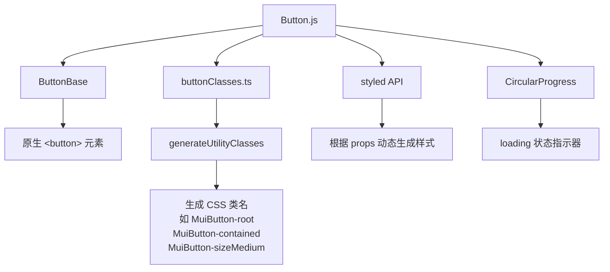
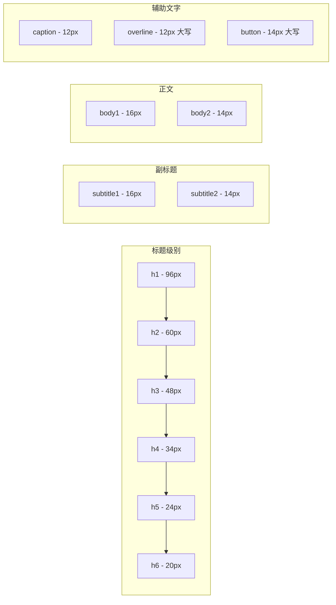
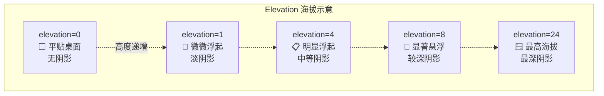
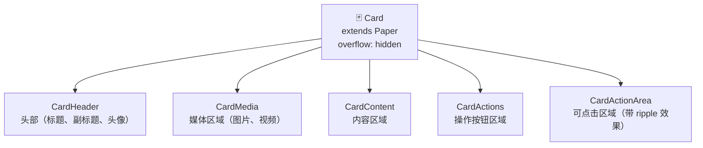
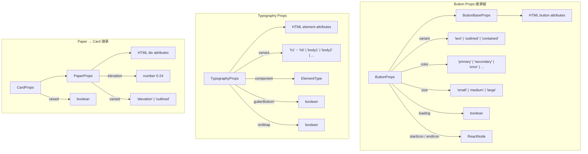

# 🧱 核心组件详解（Button, Typography, Icon, Paper, Card）

> 📚 Material UI v9 前端开发者学习路线 - 第五章
>
> 组件是 UI 的原子——就像乐高积木一样，掌握每一块积木的形状与连接方式，才能搭建出完整的界面。

---

## 📑 本章目录

- [1. Button 按钮组件](#1-button-按钮组件)
- [2. Typography 排版组件](#2-typography-排版组件)
- [3. Icon 图标组件](#3-icon-图标组件)
- [4. Paper 纸张组件](#4-paper-纸张组件)
- [5. Card 卡片组件](#5-card-卡片组件)
- [6. 组件 Props 层级总览](#6-组件-props-层级总览)

---

## 1. Button 按钮组件

> 🎯 **类比**：Button 就像遥控器上的按键——外观不同（实心、描边、文字），但按下去都会触发一个动作。

### 1.1 三种 Variant

Material Design 为按钮定义了三种视觉层级，分别对应不同的"强调程度"：

| Variant | 含义 | 使用场景 |
|---------|------|----------|
| `contained` | 实心填充，最高强调 | 主操作（提交、确认） |
| `outlined` | 描边，中等强调 | 次要操作（取消、返回） |
| `text` | 纯文字，最低强调 | 辅助操作（了解更多） |

```tsx
import Button from '@mui/material/Button';

// ✅ 三种 Variant 示例
<Button variant="contained">提交订单</Button>
<Button variant="outlined">返回修改</Button>
<Button variant="text">了解详情</Button>
```

### 1.2 尺寸（Size）

```tsx
<Button variant="contained" size="small">小按钮</Button>
<Button variant="contained" size="medium">中按钮</Button>  {/* 默认 */}
<Button variant="contained" size="large">大按钮</Button>
```

内部对应不同的 padding 和 font-size：

| Size | Padding | Font Size |
|------|---------|-----------|
| `small` | 4px 10px | 0.8125rem |
| `medium` | 6px 16px | 0.875rem |
| `large` | 8px 22px | 0.9375rem |

### 1.3 颜色（Color）

Material UI v9 支持 7 种内置颜色：

```tsx
<Button variant="contained" color="primary">Primary</Button>
<Button variant="contained" color="secondary">Secondary</Button>
<Button variant="contained" color="success">Success</Button>
<Button variant="contained" color="error">Error</Button>
<Button variant="contained" color="warning">Warning</Button>
<Button variant="contained" color="info">Info</Button>
<Button variant="contained" color="inherit">Inherit</Button>
```

### 1.4 带图标的按钮

```tsx
import DeleteIcon from '@mui/icons-material/Delete';
import SendIcon from '@mui/icons-material/Send';

// startIcon: 图标在文字左侧
<Button variant="contained" startIcon={<SendIcon />}>
  发送消息
</Button>

// endIcon: 图标在文字右侧
<Button variant="outlined" endIcon={<DeleteIcon />}>
  删除文件
</Button>
```

### 1.5 IconButton 图标按钮

当只需要图标、不需要文字时使用：

```tsx
import IconButton from '@mui/material/IconButton';
import FavoriteIcon from '@mui/icons-material/Favorite';

<IconButton aria-label="收藏" color="error">
  <FavoriteIcon />
</IconButton>

// 支持 size 和 color 属性
<IconButton size="small" color="primary">
  <FavoriteIcon fontSize="small" />
</IconButton>
```

> ⚠️ **无障碍提醒**：IconButton 没有可见文字，必须添加 `aria-label` 供屏幕阅读器使用。

### 1.6 ButtonGroup 按钮组

将相关按钮组合在一起，共享 variant 和 size：

```tsx
import ButtonGroup from '@mui/material/ButtonGroup';

<ButtonGroup variant="contained" aria-label="操作按钮组">
  <Button>保存</Button>
  <Button>取消</Button>
  <Button>重置</Button>
</ButtonGroup>

// 垂直按钮组
<ButtonGroup orientation="vertical" variant="outlined">
  <Button>选项一</Button>
  <Button>选项二</Button>
  <Button>选项三</Button>
</ButtonGroup>
```

### 1.7 LoadingButton 加载按钮

v9 中 loading 功能已内置到 Button 组件中：

```tsx
import Button from '@mui/material/Button';
import SaveIcon from '@mui/icons-material/Save';

// 基础 loading 状态
<Button loading variant="contained">
  提交中
</Button>

// 自定义 loading 位置
<Button
  loading
  loadingPosition="start"
  startIcon={<SaveIcon />}
  variant="outlined"
>
  保存中...
</Button>

// loadingPosition 选项: 'start' | 'end' | 'center'（默认）
```

### 1.8 内部结构解析

Button 组件的渲染并非一个简单的 `<button>` 标签，而是有完整的架构体系：



**buttonClasses.ts 如何工作：**

```ts
// 源码简化版
import generateUtilityClasses from '@mui/utils/generateUtilityClasses';

const buttonClasses = generateUtilityClasses('MuiButton', [
  'root',           // → MuiButton-root
  'text',           // → MuiButton-text
  'outlined',       // → MuiButton-outlined
  'contained',      // → MuiButton-contained
  'sizeLarge',      // → MuiButton-sizeLarge
  'colorPrimary',   // → MuiButton-colorPrimary
  'startIcon',      // → MuiButton-startIcon
  'loading',        // → MuiButton-loading
  // ... 更多 class
]);
```

> 🔍 **命名规则**：`Mui{组件名}-{状态/变体}`，这使得外部 CSS 可以精准覆盖任何组件样式。

---

## 2. Typography 排版组件

> 🎯 **类比**：Typography 就像报纸的排版规范——标题用大字、正文用小字、注释更小。它确保整个应用的文字层级一致。

### 2.1 全部 13+1 种 Variant



```tsx
import Typography from '@mui/material/Typography';

// 标题系列
<Typography variant="h1">h1 - 主标题</Typography>
<Typography variant="h2">h2 - 二级标题</Typography>
<Typography variant="h3">h3 - 三级标题</Typography>
<Typography variant="h4">h4 - 四级标题</Typography>
<Typography variant="h5">h5 - 五级标题</Typography>
<Typography variant="h6">h6 - 六级标题</Typography>

// 副标题
<Typography variant="subtitle1">subtitle1 - 副标题</Typography>
<Typography variant="subtitle2">subtitle2 - 小副标题</Typography>

// 正文
<Typography variant="body1">body1 - 主要正文（默认）</Typography>
<Typography variant="body2">body2 - 次要正文</Typography>

// 辅助
<Typography variant="caption">caption - 说明文字</Typography>
<Typography variant="overline">overline - 上划线标签</Typography>
<Typography variant="button">button - 按钮文字样式</Typography>
```

### 2.2 component Prop — 语义 HTML

默认的 variant → HTML 元素映射：

| Variant | 默认 HTML 元素 |
|---------|----------------|
| h1 ~ h6 | `<h1>` ~ `<h6>` |
| subtitle1, subtitle2 | `<h6>` |
| body1, body2 | `<p>` |
| caption, overline | `<span>`（通过 variantMapping） |

有时视觉上是 h1 样式，但语义上应该是 h2：

```tsx
// 视觉上是 h1 的大字，但 DOM 中渲染为 <h2>
<Typography variant="h1" component="h2">
  视觉大标题，语义二级标题
</Typography>

// 渲染为 <div> 而不是 <p>
<Typography variant="body1" component="div">
  一段需要嵌套其他元素的内容
</Typography>
```

### 2.3 gutterBottom 和 noWrap

```tsx
// gutterBottom: 添加底部 margin（0.35em）
<Typography variant="h4" gutterBottom>
  带底部间距的标题
</Typography>

// noWrap: 单行显示 + 溢出省略号
<Typography variant="body1" noWrap>
  这是一段非常非常非常长的文字，当容器宽度不够时会被截断并显示省略号...
</Typography>
```

### 2.4 Typography 与 Theme 的关联

Typography 的样式直接来源于 `theme.typography`：

```tsx
const theme = createTheme({
  typography: {
    h1: {
      fontSize: '3rem',
      fontWeight: 700,
      letterSpacing: '-0.02em',
    },
    body1: {
      fontSize: '1rem',
      lineHeight: 1.6,
    },
    // 还可以自定义 fontFamily
    fontFamily: '"Noto Sans SC", "Roboto", "Helvetica", sans-serif',
  },
});

// 使用后，所有 <Typography variant="h1"> 都会应用上述样式
```

---

## 3. Icon 图标组件

> 🎯 **类比**：图标就像路标上的标志——一个简洁的图形就能传达信息，比文字更直观、更国际化。

### 3.1 @mui/icons-material 概览

Material UI 提供 **2100+ 个** Material Design 图标，全部封装为 React SVG 组件：

```bash
# 安装图标包
pnpm add @mui/icons-material
```

```tsx
// ✅ 推荐：按需导入单个图标（tree-shaking 友好）
import DeleteIcon from '@mui/icons-material/Delete';
import HomeIcon from '@mui/icons-material/Home';
import SettingsIcon from '@mui/icons-material/Settings';

// ❌ 避免：从包根导入（会导致打包体积膨胀）
// import { Delete, Home, Settings } from '@mui/icons-material';
```

每个图标有 5 种风格变体：

| 风格 | 导入后缀 | 示例 |
|------|----------|------|
| Filled（默认） | 无 | `Delete` |
| Outlined | `Outlined` | `DeleteOutlined` |
| Rounded | `Rounded` | `DeleteRounded` |
| Two-tone | `TwoTone` | `DeleteTwoTone` |
| Sharp | `Sharp` | `DeleteSharp` |

### 3.2 SVG 图标的本质

每个图标组件本质上是一个包裹了 SVG path 的 React 组件：

```tsx
// DeleteIcon 的本质（简化）
const DeleteIcon = (props) => (
  <SvgIcon {...props}>
    <path d="M6 19c0 1.1.9 2 2 2h8c1.1 0 2-.9 ..." />
  </SvgIcon>
);
```

### 3.3 SvgIcon 自定义图标

当需要使用自己的 SVG 图标时：

```tsx
import SvgIcon from '@mui/material/SvgIcon';

function CustomIcon(props) {
  return (
    <SvgIcon {...props} viewBox="0 0 24 24">
      <path d="M12 2L1 21h22L12 2zm0 3.5L19.5 19H4.5L12 5.5z" />
    </SvgIcon>
  );
}

// 使用方式和内置图标完全一致
<CustomIcon color="primary" fontSize="large" />
```

### 3.4 图标尺寸与颜色

```tsx
import DeleteIcon from '@mui/icons-material/Delete';

// 尺寸
<DeleteIcon fontSize="small" />    // 20px
<DeleteIcon fontSize="medium" />   // 24px（默认）
<DeleteIcon fontSize="large" />    // 35px
<DeleteIcon sx={{ fontSize: 48 }} /> // 自定义尺寸

// 颜色
<DeleteIcon color="primary" />
<DeleteIcon color="secondary" />
<DeleteIcon color="error" />
<DeleteIcon color="disabled" />
<DeleteIcon color="action" />
<DeleteIcon sx={{ color: '#ff5722' }} /> // 自定义颜色
```

---

## 4. Paper 纸张组件

> 🎯 **类比**：Paper 就像桌面上的一张纸——阴影深度代表纸张浮起的高度。elevation=0 就是平贴桌面，elevation=24 就是浮在空中。

### 4.1 Material Design 的 Elevation 概念

Material Design 用投影（shadow）来表示界面元素的"海拔高度"，模拟物理世界中纸张悬浮的效果：



### 4.2 基本使用

```tsx
import Paper from '@mui/material/Paper';

// 默认 elevation=1
<Paper>
  <Typography sx={{ p: 2 }}>这是一张纸</Typography>
</Paper>

// 不同 elevation（0 ~ 24）
<Paper elevation={0}>无阴影</Paper>
<Paper elevation={3}>轻微阴影</Paper>
<Paper elevation={8}>明显阴影</Paper>
<Paper elevation={16}>深度阴影</Paper>
<Paper elevation={24}>最深阴影</Paper>
```

### 4.3 Variant：Elevation vs Outlined

```tsx
// 默认 variant="elevation"（使用阴影）
<Paper elevation={3}>
  使用阴影表示层级
</Paper>

// variant="outlined"（使用边框，无阴影）
<Paper variant="outlined">
  使用边框表示层级
</Paper>
```

> 💡 **设计提示**：`outlined` 适用于扁平化设计风格；`elevation` 适用于需要深度感的传统 Material Design。

### 4.4 Elevation 与 theme.shadows

Paper 的阴影来源于 `theme.shadows` 数组（共 25 个值，索引 0~24）：

```tsx
const theme = createTheme({
  shadows: [
    'none',                                         // 0
    '0px 2px 1px -1px rgba(0,0,0,0.2), ...',       // 1
    '0px 3px 1px -2px rgba(0,0,0,0.2), ...',       // 2
    // ... 一直到 24
  ],
});

// Paper 使用 CSS 变量 --Paper-shadow
// 该变量的值为 theme.shadows[elevation]
```

### 4.5 其他属性

```tsx
// square: 去掉圆角
<Paper square>方形纸张</Paper>

// 结合 sx 自定义
<Paper
  elevation={3}
  sx={{
    p: 3,
    borderRadius: 2,
    backgroundColor: 'grey.50',
  }}
>
  自定义纸张
</Paper>
```

---

## 5. Card 卡片组件

> 🎯 **类比**：Card 就像一张实体名片——有固定的结构区域（头部、封面图、内容、操作按钮），是承载独立信息的容器。

### 5.1 Card 组件家族

Card 是 Paper 的子组件，提供了丰富的子组件用于构建完整的卡片：



### 5.2 子组件详解

```tsx
import Card from '@mui/material/Card';
import CardHeader from '@mui/material/CardHeader';
import CardMedia from '@mui/material/CardMedia';
import CardContent from '@mui/material/CardContent';
import CardActions from '@mui/material/CardActions';
import CardActionArea from '@mui/material/CardActionArea';
import Avatar from '@mui/material/Avatar';
import IconButton from '@mui/material/IconButton';
import MoreVertIcon from '@mui/icons-material/MoreVert';

// 基础卡片
<Card>
  <CardContent>
    <Typography variant="h5">卡片标题</Typography>
    <Typography variant="body2" color="text.secondary">
      卡片描述内容
    </Typography>
  </CardContent>
  <CardActions>
    <Button size="small">了解更多</Button>
  </CardActions>
</Card>
```

### 5.3 完整卡片示例

```tsx
// 🛒 产品卡片
function ProductCard({ product }) {
  return (
    <Card sx={{ maxWidth: 345 }}>
      <CardActionArea>
        <CardMedia
          component="img"
          height="200"
          image={product.image}
          alt={product.name}
        />
        <CardContent>
          <Typography gutterBottom variant="h5" component="div">
            {product.name}
          </Typography>
          <Typography variant="body2" color="text.secondary">
            {product.description}
          </Typography>
          <Typography variant="h6" color="primary" sx={{ mt: 1 }}>
            ¥{product.price}
          </Typography>
        </CardContent>
      </CardActionArea>
      <CardActions>
        <Button size="small" color="primary">
          加入购物车
        </Button>
        <Button size="small">收藏</Button>
      </CardActions>
    </Card>
  );
}
```

```tsx
// 👤 用户资料卡片
function UserProfileCard({ user }) {
  return (
    <Card sx={{ maxWidth: 400 }}>
      <CardHeader
        avatar={
          <Avatar sx={{ bgcolor: 'primary.main' }}>
            {user.name[0]}
          </Avatar>
        }
        action={
          <IconButton aria-label="设置">
            <MoreVertIcon />
          </IconButton>
        }
        title={user.name}
        subheader={`加入于 ${user.joinDate}`}
      />
      <CardMedia
        component="img"
        height="194"
        image={user.coverImage}
        alt="用户封面"
      />
      <CardContent>
        <Typography variant="body2" color="text.secondary">
          {user.bio}
        </Typography>
      </CardContent>
      <CardActions disableSpacing>
        <IconButton aria-label="点赞">
          <FavoriteIcon />
        </IconButton>
        <IconButton aria-label="分享">
          <ShareIcon />
        </IconButton>
      </CardActions>
    </Card>
  );
}
```

### 5.4 Card 的内部结构

```tsx
// Card 本质上就是一个设置了 overflow: hidden 的 Paper
// 源码简化版：
const CardRoot = styled(Paper, {
  name: 'MuiCard',
  slot: 'Root',
})({
  overflow: 'hidden',
});

// Card 接受 raised prop
// raised=true 时 elevation 自动设为 8
<Card raised>高阴影卡片</Card>
```

---

## 6. 组件 Props 层级总览



---

## 📝 本章小结

| 组件 | 核心用途 | 关键 Props |
|------|----------|------------|
| **Button** | 触发操作 | `variant`, `color`, `size`, `loading`, `startIcon` |
| **Typography** | 文字排版 | `variant`, `component`, `gutterBottom`, `noWrap` |
| **Icon** | 图形信息 | `fontSize`, `color` |
| **Paper** | 表面容器 | `elevation`, `variant`, `square` |
| **Card** | 信息卡片 | `raised` + 子组件（Header/Media/Content/Actions） |

> ✅ **下一章预告**：[第六章 - 布局系统](./06-layout-system.md) 将学习 Grid、Stack、Box、Container 等布局组件，学会用积木搭建完整的页面框架！

---

## 🔗 参考资源

- [Button API 文档](https://mui.com/material-ui/api/button/)
- [Typography API 文档](https://mui.com/material-ui/api/typography/)
- [Icons 使用指南](https://mui.com/material-ui/icons/)
- [Paper API 文档](https://mui.com/material-ui/api/paper/)
- [Card API 文档](https://mui.com/material-ui/api/card/)
- 📁 源码路径：`packages/mui-material/src/Button/`、`Typography/`、`Paper/`、`Card/`
