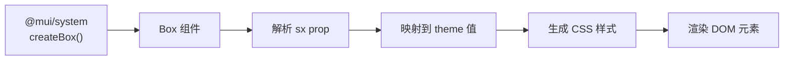
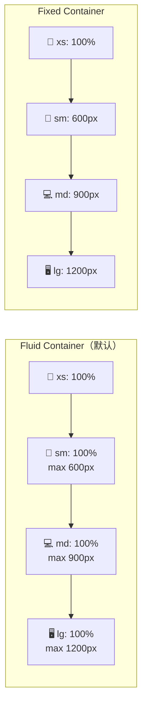
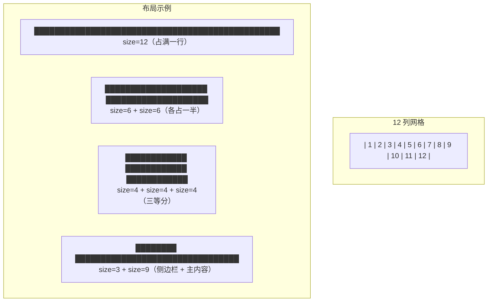
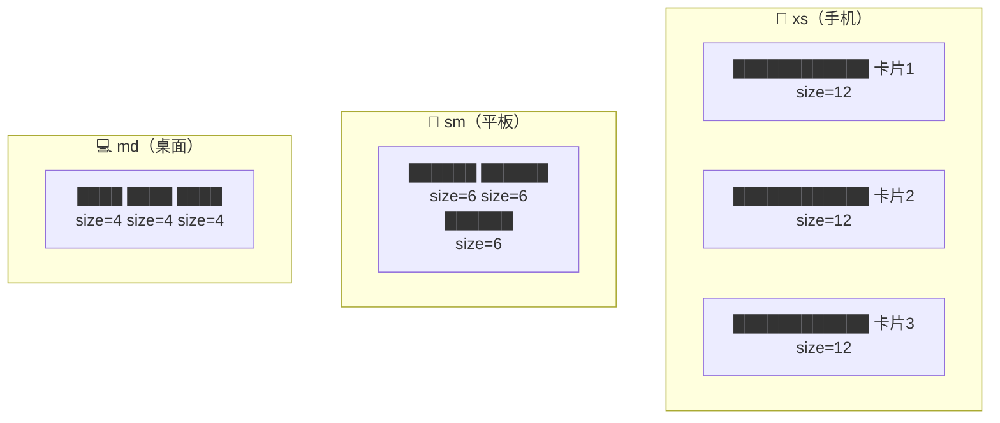
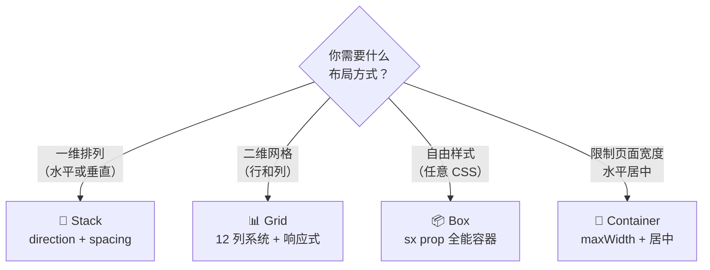
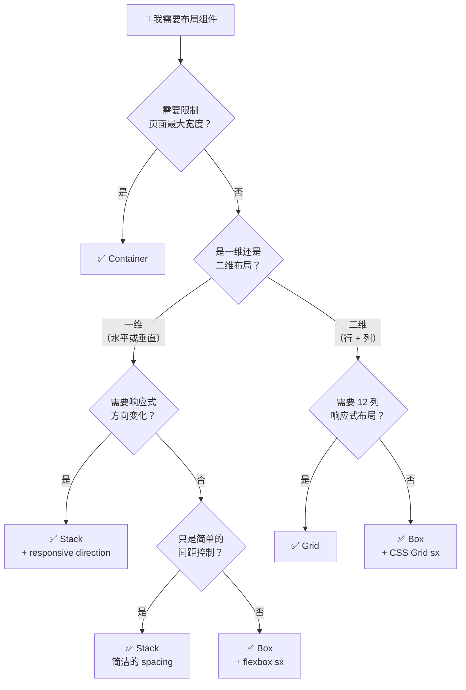
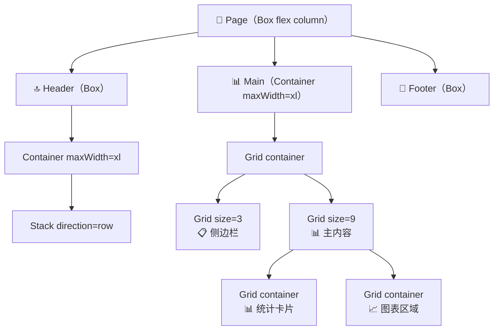

# 📐 布局系统（Grid, Stack, Box, Container）

> 📚 Material UI v9 前端开发者学习路线 - 第六章
>
> 如果组件是乐高积木，那么布局系统就是底板和框架——决定了积木们如何排列、对齐和响应屏幕变化。

---

## 📑 本章目录

- [1. Box 基础容器](#1-box-基础容器)
- [2. Container 页面容器](#2-container-页面容器)
- [3. Grid 网格布局](#3-grid-网格布局)
- [4. Stack 堆叠布局](#4-stack-堆叠布局)
- [5. 布局组件选择指南](#5-布局组件选择指南)
- [6. 布局组合实战](#6-布局组合实战)

---

## 1. Box 基础容器

> 🎯 **类比**：Box 就像一个空的收纳盒——它本身没有特殊外观，但你可以任意设置它的大小、颜色、边距，把任何东西放进去。

### 1.1 Box 是什么？

**Box = `<div>` + `sx` prop + `component` prop**

Box 是 Material UI 中最基础的布局组件。它本身不带任何视觉样式，但提供了强大的 `sx` 属性，让你可以用主题感知的方式编写内联样式。

```tsx
import Box from '@mui/material/Box';

// 最基本的用法：一个带样式的 div
<Box sx={{ p: 2, bgcolor: 'background.paper', borderRadius: 1 }}>
  我是一个有内边距、背景色和圆角的 Box
</Box>
```

### 1.2 内部原理

Box 组件由 `@mui/system` 的 `createBox` 工厂函数创建：



### 1.3 component Prop

Box 默认渲染为 `<div>`，但可以通过 `component` 改变：

```tsx
// 渲染为 <section>
<Box component="section" sx={{ p: 2 }}>
  语义化的 section 元素
</Box>

// 渲染为 <main>
<Box component="main" sx={{ flexGrow: 1 }}>
  主内容区域
</Box>

// 甚至可以渲染为其他组件
<Box component="span" sx={{ color: 'primary.main' }}>
  内联文字
</Box>
```

### 1.4 常用模式

```tsx
// 🔹 Flexbox 居中
<Box
  sx={{
    display: 'flex',
    justifyContent: 'center',
    alignItems: 'center',
    minHeight: '100vh',
  }}
>
  <Typography>完美居中</Typography>
</Box>

// 🔹 条件样式
<Box
  sx={{
    bgcolor: 'background.paper',
    p: { xs: 1, sm: 2, md: 3 },           // 响应式 padding
    display: { xs: 'block', md: 'flex' },  // 响应式 display
  }}
>
  响应式样式
</Box>

// 🔹 作为间距容器
<Box sx={{ mt: 2, mb: 4 }}>
  <Button>按钮一</Button>
  <Button sx={{ ml: 2 }}>按钮二</Button>
</Box>
```

---

## 2. Container 页面容器

> 🎯 **类比**：Container 就像一本书的"版心"——书页很大，但文字只在中间固定宽度的区域内排列，两侧留白让阅读更舒适。

### 2.1 基本概念

Container 用于将内容水平居中并限制最大宽度，是页面级布局的基础组件：

```tsx
import Container from '@mui/material/Container';

<Container>
  {/* 内容自动居中，最大宽度默认为 lg (1200px) */}
  <Typography variant="h4">页面内容</Typography>
</Container>
```

### 2.2 maxWidth 断点值

| maxWidth | 最大宽度 | 适用场景 |
|----------|----------|----------|
| `'xs'` | 444px | 极窄内容（登录框） |
| `'sm'` | 600px | 窄内容（文章阅读） |
| `'md'` | 900px | 中等内容 |
| `'lg'` | 1200px | 标准页面（**默认**） |
| `'xl'` | 1536px | 宽屏页面 |
| `false` | 无限制 | 全宽布局 |

```tsx
// 窄容器（适合文章页面）
<Container maxWidth="sm">
  <Typography>窄版内容，适合阅读</Typography>
</Container>

// 宽容器
<Container maxWidth="xl">
  <Typography>宽版内容，适合数据面板</Typography>
</Container>

// 全宽（无最大宽度限制）
<Container maxWidth={false}>
  <Typography>占满整个屏幕宽度</Typography>
</Container>
```

### 2.3 Fixed vs Fluid

```tsx
// Fluid（默认）：宽度随视口变化，直到 maxWidth
<Container maxWidth="md">
  宽度 ≤ 900px，在小屏幕上会更窄
</Container>

// Fixed：宽度跳跃式变化，匹配当前断点的 min-width
<Container fixed>
  在 sm 屏幕下宽度固定为 600px
  在 md 屏幕下宽度固定为 900px
  在 lg 屏幕下宽度固定为 1200px
</Container>
```



### 2.4 Container vs Box

| 对比 | Container | Box |
|------|-----------|-----|
| 目的 | 限制页面宽度、水平居中 | 通用样式容器 |
| 默认行为 | 居中 + maxWidth + padding | 无样式的 div |
| 使用场景 | 页面外层包裹 | 任意布局、间距、样式 |

```tsx
// ✅ 典型组合：Container 包在外层，Box 用在内部
<Container maxWidth="lg">
  <Box sx={{ py: 4 }}>
    <Typography variant="h3">页面标题</Typography>
    <Box sx={{ mt: 3 }}>
      {/* 具体内容 */}
    </Box>
  </Box>
</Container>
```

---

## 3. Grid 网格布局

> 🎯 **类比**：Grid 就像一个书架——每层隔板是一行（row），每层上有固定数量的格子（12 列），书籍（组件）可以占据一个或多个格子的宽度。

### 3.1 12 列系统

Material UI 的 Grid 基于经典的 **12 列系统**：



### 3.2 基本用法

```tsx
import Grid from '@mui/material/Grid';

// Grid 容器 + Grid 项目
<Grid container spacing={2}>
  <Grid size={8}>
    <Paper sx={{ p: 2 }}>占 8 列（主内容）</Paper>
  </Grid>
  <Grid size={4}>
    <Paper sx={{ p: 2 }}>占 4 列（侧边栏）</Paper>
  </Grid>
</Grid>
```

> 📌 **v9 变化**：不再使用 `item` prop 和 `xs`/`md`/`lg` props。改用 `size` prop。

### 3.3 响应式 Grid

通过给 `size` 传入断点对象，实现不同屏幕下的列数变化：

```tsx
<Grid container spacing={2}>
  {/* 手机：12列（独占一行），平板：6列（两列），桌面：4列（三列） */}
  <Grid size={{ xs: 12, sm: 6, md: 4 }}>
    <Paper sx={{ p: 2 }}>卡片 1</Paper>
  </Grid>
  <Grid size={{ xs: 12, sm: 6, md: 4 }}>
    <Paper sx={{ p: 2 }}>卡片 2</Paper>
  </Grid>
  <Grid size={{ xs: 12, sm: 6, md: 4 }}>
    <Paper sx={{ p: 2 }}>卡片 3</Paper>
  </Grid>
</Grid>
```



### 3.4 Spacing 间距控制

```tsx
// 统一间距
<Grid container spacing={3}>
  {/* spacing=3 → 3 * 8px = 24px 间距 */}
</Grid>

// 分别控制行间距和列间距
<Grid container rowSpacing={2} columnSpacing={4}>
  <Grid size={6}>项目 A</Grid>
  <Grid size={6}>项目 B</Grid>
  <Grid size={6}>项目 C</Grid>
  <Grid size={6}>项目 D</Grid>
</Grid>
```

### 3.5 Offset 列偏移

```tsx
<Grid container spacing={2}>
  {/* 偏移 3 列后开始，占 6 列（实现居中效果） */}
  <Grid size={6} offset={3}>
    <Paper sx={{ p: 2, textAlign: 'center' }}>
      居中的内容
    </Paper>
  </Grid>
</Grid>

// 响应式偏移
<Grid size={{ xs: 12, md: 8 }} offset={{ md: 2 }}>
  桌面端居中，移动端全宽
</Grid>
```

### 3.6 Auto-layout 自动布局

```tsx
// size="grow" → 自动填充剩余空间
<Grid container spacing={2}>
  <Grid size={6}>固定 6 列</Grid>
  <Grid size="grow">自动填充剩余空间</Grid>
</Grid>

// size="auto" → 根据内容自适应宽度
<Grid container spacing={2}>
  <Grid size="auto">宽度跟随内容</Grid>
  <Grid size="grow">占满剩余空间</Grid>
</Grid>
```

### 3.7 嵌套 Grid

```tsx
<Grid container spacing={2}>
  <Grid size={8}>
    {/* 嵌套 Grid：内部再次分为 12 列 */}
    <Grid container spacing={1}>
      <Grid size={6}>
        <Paper>嵌套项 A</Paper>
      </Grid>
      <Grid size={6}>
        <Paper>嵌套项 B</Paper>
      </Grid>
    </Grid>
  </Grid>
  <Grid size={4}>
    <Paper>侧边栏</Paper>
  </Grid>
</Grid>
```

### 3.8 对齐与排列

Grid 容器支持 flexbox 对齐属性：

```tsx
// 水平居中 + 垂直居中
<Grid
  container
  spacing={2}
  justifyContent="center"
  alignItems="center"
  sx={{ minHeight: '50vh' }}
>
  <Grid size="auto">
    <Paper sx={{ p: 3 }}>居中内容</Paper>
  </Grid>
</Grid>

// 均匀分布
<Grid container justifyContent="space-between">
  <Grid size="auto">左</Grid>
  <Grid size="auto">中</Grid>
  <Grid size="auto">右</Grid>
</Grid>
```

---

## 4. Stack 堆叠布局

> 🎯 **类比**：Stack 就像一摞盘子——默认垂直堆叠（column），也可以水平排列（row），盘子之间有固定间距。

### 4.1 基本用法

Stack 是一维布局组件，基于 CSS Flexbox：

```tsx
import Stack from '@mui/material/Stack';

// 默认垂直堆叠
<Stack spacing={2}>
  <Paper sx={{ p: 2 }}>项目 1</Paper>
  <Paper sx={{ p: 2 }}>项目 2</Paper>
  <Paper sx={{ p: 2 }}>项目 3</Paper>
</Stack>

// 水平排列
<Stack direction="row" spacing={2}>
  <Button variant="contained">按钮 1</Button>
  <Button variant="outlined">按钮 2</Button>
  <Button variant="text">按钮 3</Button>
</Stack>
```

### 4.2 Direction 方向

```tsx
<Stack direction="column">垂直（默认）⬇️</Stack>
<Stack direction="row">水平 ➡️</Stack>
<Stack direction="column-reverse">垂直反转 ⬆️</Stack>
<Stack direction="row-reverse">水平反转 ⬅️</Stack>

// 响应式方向
<Stack
  direction={{ xs: 'column', sm: 'row' }}
  spacing={2}
>
  <Button>手机上垂直排列</Button>
  <Button>平板上水平排列</Button>
</Stack>
```

### 4.3 Divider 分隔线

```tsx
import Divider from '@mui/material/Divider';

<Stack
  direction="row"
  divider={<Divider orientation="vertical" flexItem />}
  spacing={2}
>
  <Typography>第一段</Typography>
  <Typography>第二段</Typography>
  <Typography>第三段</Typography>
</Stack>
```

### 4.4 useFlexGap

默认情况下 Stack 使用 CSS margin 实现间距。启用 `useFlexGap` 后改用 CSS `gap`，解决了换行时多余 margin 的问题：

```tsx
// 推荐：使用 CSS gap
<Stack
  direction="row"
  spacing={2}
  useFlexGap
  sx={{ flexWrap: 'wrap' }}
>
  {tags.map((tag) => (
    <Chip key={tag} label={tag} />
  ))}
</Stack>
```

### 4.5 Stack vs Grid vs Box



| 场景 | 推荐组件 | 原因 |
|------|----------|------|
| 按钮一行排列 | Stack | 一维水平布局，spacing 简洁 |
| 表单字段垂直排列 | Stack | 一维垂直布局 |
| 卡片网格展示 | Grid | 需要多列响应式布局 |
| 侧边栏 + 主内容 | Grid | 经典两栏布局 |
| 精细样式控制 | Box | 需要任意 CSS 属性 |
| 页面外层包裹 | Container | 限制宽度、居中 |

---

## 5. 布局组件选择指南

当你面对一个页面布局需求时，按照这个决策流程选择合适的组件：



---

## 6. 布局组合实战

### 6.1 完整页面布局

```tsx
import Container from '@mui/material/Container';
import Grid from '@mui/material/Grid';
import Stack from '@mui/material/Stack';
import Box from '@mui/material/Box';
import Paper from '@mui/material/Paper';
import Typography from '@mui/material/Typography';
import Button from '@mui/material/Button';

function DashboardPage() {
  return (
    <Box sx={{ display: 'flex', flexDirection: 'column', minHeight: '100vh' }}>
      {/* 🔝 头部导航 */}
      <Box
        component="header"
        sx={{
          bgcolor: 'primary.main',
          color: 'white',
          py: 2,
          px: 3,
        }}
      >
        <Container maxWidth="xl">
          <Stack direction="row" justifyContent="space-between" alignItems="center">
            <Typography variant="h6">我的仪表板</Typography>
            <Stack direction="row" spacing={1}>
              <Button color="inherit">帮助</Button>
              <Button color="inherit">设置</Button>
            </Stack>
          </Stack>
        </Container>
      </Box>

      {/* 📊 主内容区域 */}
      <Container maxWidth="xl" sx={{ flex: 1, py: 4 }}>
        <Grid container spacing={3}>
          {/* 侧边栏 */}
          <Grid size={{ xs: 12, md: 3 }}>
            <Paper sx={{ p: 2 }}>
              <Typography variant="h6" gutterBottom>
                导航菜单
              </Typography>
              <Stack spacing={1}>
                <Button fullWidth variant="text">概览</Button>
                <Button fullWidth variant="text">数据分析</Button>
                <Button fullWidth variant="text">用户管理</Button>
                <Button fullWidth variant="text">系统设置</Button>
              </Stack>
            </Paper>
          </Grid>

          {/* 主内容 */}
          <Grid size={{ xs: 12, md: 9 }}>
            {/* 统计卡片行 */}
            <Grid container spacing={2}>
              {['总用户', '今日活跃', '收入', '订单量'].map((title) => (
                <Grid key={title} size={{ xs: 6, lg: 3 }}>
                  <Paper sx={{ p: 2, textAlign: 'center' }}>
                    <Typography variant="h4">1,234</Typography>
                    <Typography color="text.secondary">{title}</Typography>
                  </Paper>
                </Grid>
              ))}
            </Grid>

            {/* 图表区域 */}
            <Box sx={{ mt: 3 }}>
              <Grid container spacing={2}>
                <Grid size={{ xs: 12, lg: 8 }}>
                  <Paper sx={{ p: 2, height: 300 }}>
                    <Typography variant="h6">趋势图</Typography>
                  </Paper>
                </Grid>
                <Grid size={{ xs: 12, lg: 4 }}>
                  <Paper sx={{ p: 2, height: 300 }}>
                    <Typography variant="h6">分布图</Typography>
                  </Paper>
                </Grid>
              </Grid>
            </Box>
          </Grid>
        </Grid>
      </Container>

      {/* 🔻 底部 */}
      <Box
        component="footer"
        sx={{ bgcolor: 'grey.100', py: 2, textAlign: 'center' }}
      >
        <Typography variant="body2" color="text.secondary">
          © 2025 我的应用 · 使用 Material UI 构建
        </Typography>
      </Box>
    </Box>
  );
}
```

页面结构解析：



### 6.2 响应式产品列表

```tsx
function ProductList({ products }) {
  return (
    <Container maxWidth="lg">
      <Typography variant="h4" gutterBottom>
        热门商品
      </Typography>
      <Grid container spacing={3}>
        {products.map((product) => (
          <Grid key={product.id} size={{ xs: 12, sm: 6, md: 4, lg: 3 }}>
            <Card>
              <CardMedia
                component="img"
                height="200"
                image={product.image}
                alt={product.name}
              />
              <CardContent>
                <Typography variant="h6">{product.name}</Typography>
                <Typography variant="h5" color="primary">
                  ¥{product.price}
                </Typography>
              </CardContent>
              <CardActions>
                <Button size="small" variant="contained" fullWidth>
                  加入购物车
                </Button>
              </CardActions>
            </Card>
          </Grid>
        ))}
      </Grid>
    </Container>
  );
}
```

### 6.3 Header + Sidebar + Main 经典三栏布局

```tsx
function AppLayout({ children }) {
  const sidebarWidth = 240;

  return (
    <Box sx={{ display: 'flex', minHeight: '100vh' }}>
      {/* 固定侧边栏 */}
      <Box
        component="nav"
        sx={{
          width: { xs: 0, md: sidebarWidth },
          flexShrink: 0,
          display: { xs: 'none', md: 'block' },
        }}
      >
        <Paper
          square
          sx={{
            width: sidebarWidth,
            height: '100vh',
            position: 'fixed',
            overflow: 'auto',
            p: 2,
          }}
        >
          <Typography variant="h6" sx={{ mb: 2 }}>菜单</Typography>
          <Stack spacing={1}>
            <Button fullWidth>首页</Button>
            <Button fullWidth>产品</Button>
            <Button fullWidth>关于</Button>
          </Stack>
        </Paper>
      </Box>

      {/* 主内容区域 */}
      <Box
        component="main"
        sx={{
          flexGrow: 1,
          display: 'flex',
          flexDirection: 'column',
        }}
      >
        {/* 顶部导航栏 */}
        <Paper
          square
          elevation={1}
          sx={{ p: 2, position: 'sticky', top: 0, zIndex: 1100 }}
        >
          <Stack direction="row" justifyContent="space-between" alignItems="center">
            <Typography variant="h6">应用名称</Typography>
            <Stack direction="row" spacing={1}>
              <Button>登录</Button>
              <Button variant="contained">注册</Button>
            </Stack>
          </Stack>
        </Paper>

        {/* 页面内容 */}
        <Container maxWidth="lg" sx={{ py: 3, flex: 1 }}>
          {children}
        </Container>
      </Box>
    </Box>
  );
}
```

---

## 📝 本章小结

| 组件 | 核心用途 | 关键 Props | 类比 |
|------|----------|------------|------|
| **Box** | 通用样式容器 | `sx`, `component` | 空收纳盒 |
| **Container** | 限宽 + 居中 | `maxWidth`, `fixed` | 书页版心 |
| **Grid** | 12 列响应式网格 | `size`, `offset`, `spacing` | 书架格子 |
| **Stack** | 一维堆叠 | `direction`, `spacing`, `divider` | 一摞盘子 |

> 💡 **黄金法则**：Container 包页面 → Grid 分区域 → Stack 排元素 → Box 做微调。

> ✅ **下一章预告**：[第七章 - 表单组件](./07-form-components.md) 将深入 TextField、Select、Checkbox、Autocomplete 等表单组件，学会构建完整的用户输入界面！

---

## 🔗 参考资源

- [Box API 文档](https://mui.com/material-ui/api/box/)
- [Container API 文档](https://mui.com/material-ui/api/container/)
- [Grid API 文档](https://mui.com/material-ui/api/grid/)
- [Stack API 文档](https://mui.com/material-ui/api/stack/)
- [响应式 UI 指南](https://mui.com/material-ui/guides/responsive-ui/)
- 📁 源码路径：`packages/mui-material/src/Box/`、`Container/`、`Grid/`、`Stack/`
