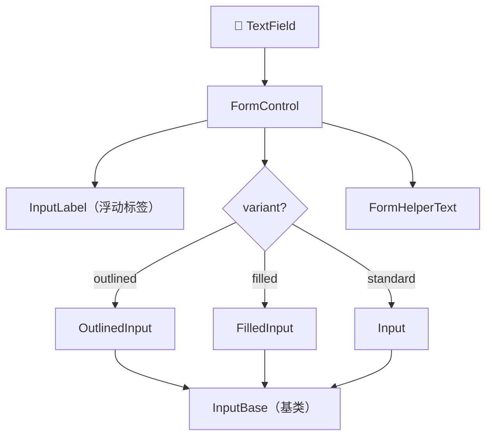
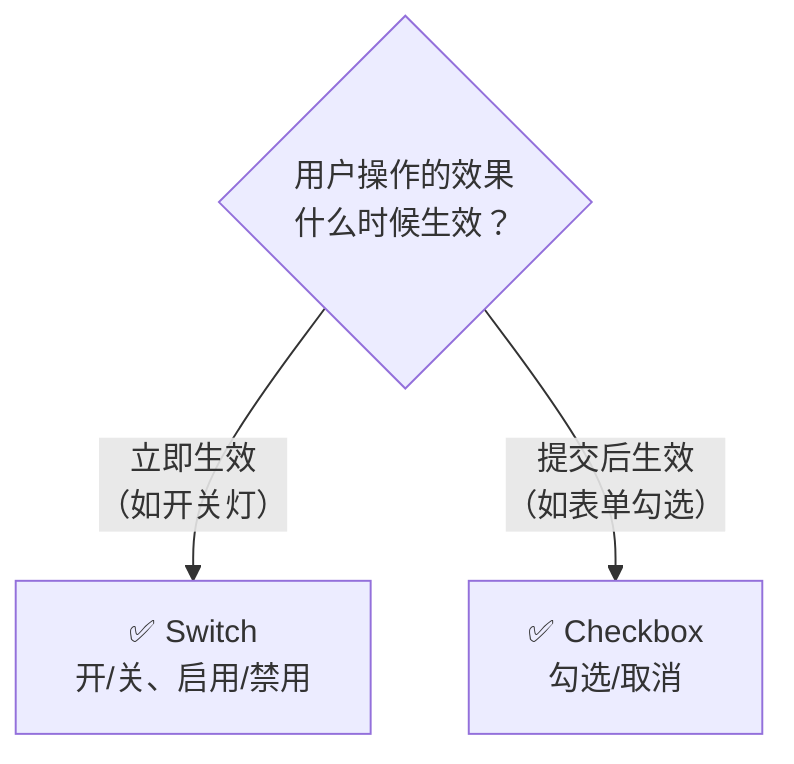
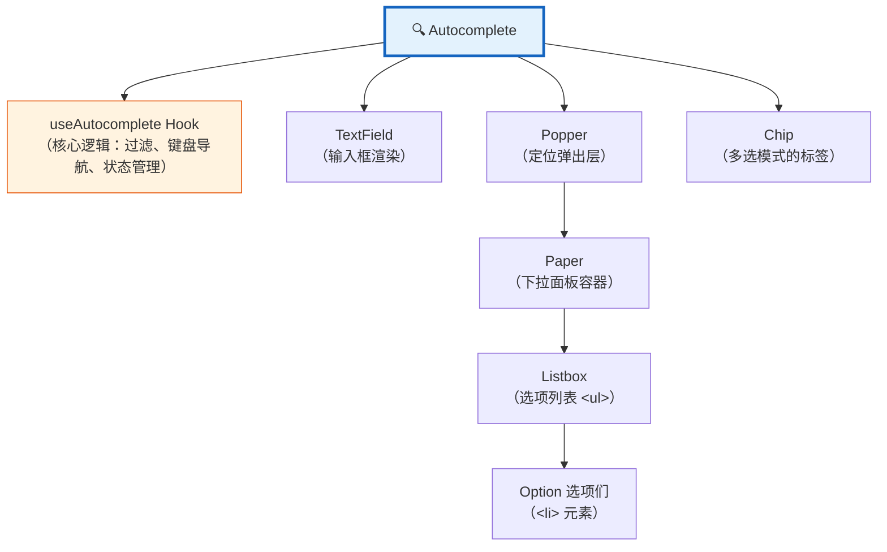

# 📝 表单组件（TextField, Select, Checkbox, Radio, Switch, Autocomplete）

> 📚 Material UI v9 前端开发者学习路线 - 第七章
>
> 表单是用户与应用的对话窗口——每个输入框都是一个提问，而用户的每次输入都是一次回答。好的表单设计让这场对话自然流畅。

---

## 📑 本章目录

- [1. TextField 文本输入](#1-textfield-文本输入)
- [2. Select 下拉选择](#2-select-下拉选择)
- [3. Checkbox 复选框](#3-checkbox-复选框)
- [4. Radio 单选按钮](#4-radio-单选按钮)
- [5. Switch 开关](#5-switch-开关)
- [6. Autocomplete 自动补全](#6-autocomplete-自动补全)
- [7. 表单实战模式](#7-表单实战模式)

---

## 1. TextField 文本输入

> 🎯 **类比**：TextField 就像一张精心设计的表格纸——有标签告诉你填什么，有边框指示输入区域，还有底部提示帮你纠错。

### 1.1 三种 Variant

Material Design 提供三种输入框风格，适用于不同的视觉上下文：

| Variant | 外观 | 使用场景 |
|---------|------|----------|
| `outlined` | 四周边框（**默认**） | 最通用，视觉最清晰 |
| `filled` | 底部填充背景 | 与深色背景搭配 |
| `standard` | 仅底部边线 | 极简风格、表格内 |

```tsx
import TextField from '@mui/material/TextField';

<TextField variant="outlined" label="用户名" />
<TextField variant="filled" label="邮箱地址" />
<TextField variant="standard" label="手机号码" />
```

### 1.2 Controlled vs Uncontrolled

```tsx
// ✅ Controlled：由 React state 控制值
function ControlledInput() {
  const [name, setName] = React.useState('');

  return (
    <TextField
      label="姓名"
      value={name}
      onChange={(e) => setName(e.target.value)}
    />
  );
}

// ✅ Uncontrolled：由 DOM 自身管理值
function UncontrolledInput() {
  const inputRef = React.useRef(null);

  return (
    <TextField
      label="姓名"
      defaultValue="默认值"
      inputRef={inputRef}
    />
  );
}
```

> 💡 **什么时候用哪个？** 需要实时响应（搜索框、校验）→ Controlled；只在提交时读值 → Uncontrolled。

### 1.3 验证状态

```tsx
// error + helperText 组合
<TextField
  label="邮箱"
  error
  helperText="请输入有效的邮箱地址"
/>

// 动态验证
function EmailInput() {
  const [email, setEmail] = React.useState('');
  const [error, setError] = React.useState(false);

  const handleChange = (e) => {
    const value = e.target.value;
    setEmail(value);
    setError(value !== '' && !value.includes('@'));
  };

  return (
    <TextField
      label="邮箱"
      value={email}
      onChange={handleChange}
      error={error}
      helperText={error ? '邮箱格式不正确' : '我们绝不会泄露您的邮箱'}
    />
  );
}
```

### 1.4 InputAdornment 装饰器

给输入框添加前缀或后缀图标 / 文字：

```tsx
import InputAdornment from '@mui/material/InputAdornment';
import AccountCircle from '@mui/icons-material/AccountCircle';

// 前缀图标
<TextField label="用户名"
  slotProps={{ input: { startAdornment: (
    <InputAdornment position="start"><AccountCircle /></InputAdornment>
  )}}} />

// 后缀文字
<TextField label="金额"
  slotProps={{ input: { endAdornment: (
    <InputAdornment position="end">元</InputAdornment>
  )}}} />

// 密码输入框（带显示/隐藏切换）
function PasswordField() {
  const [show, setShow] = React.useState(false);
  return (
    <TextField label="密码" type={show ? 'text' : 'password'}
      slotProps={{ input: { endAdornment: (
        <InputAdornment position="end">
          <IconButton onClick={() => setShow(!show)}>
            {show ? <VisibilityOff /> : <Visibility />}
          </IconButton>
        </InputAdornment>
      )}}} />
  );
}
```

### 1.5 Multiline 多行输入

```tsx
// 固定行数
<TextField
  label="个人简介"
  multiline
  rows={4}
/>

// 自适应行数（自动扩展）
<TextField
  label="留言"
  multiline
  minRows={2}
  maxRows={6}
/>
```

### 1.6 内部结构解析

TextField 不是一个单一组件，而是多个组件的**便捷封装**：



> 📖 源码注释："TextField 是最常见场景（80%）的便捷包装。" —— 需要更灵活的控制时，直接使用底层组件：

```tsx
import FormControl from '@mui/material/FormControl';
import InputLabel from '@mui/material/InputLabel';
import OutlinedInput from '@mui/material/OutlinedInput';
import FormHelperText from '@mui/material/FormHelperText';

<FormControl error>
  <InputLabel htmlFor="email">邮箱</InputLabel>
  <OutlinedInput id="email" label="邮箱" />
  <FormHelperText>请输入有效的邮箱地址</FormHelperText>
</FormControl>
```

---

## 2. Select 下拉选择

> 🎯 **类比**：Select 就像餐厅菜单——展开后看到所有选项，选好后菜单收起只显示你的选择。

### 2.1 基本用法

```tsx
import TextField from '@mui/material/TextField';
import MenuItem from '@mui/material/MenuItem';

const cities = ['北京', '上海', '广州', '深圳', '杭州'];

function CitySelect() {
  const [city, setCity] = React.useState('');

  return (
    <TextField
      select
      label="选择城市"
      value={city}
      onChange={(e) => setCity(e.target.value)}
      sx={{ minWidth: 200 }}
    >
      {cities.map((c) => (
        <MenuItem key={c} value={c}>
          {c}
        </MenuItem>
      ))}
    </TextField>
  );
}
```

### 2.2 独立 Select 组件

```tsx
import Select from '@mui/material/Select';
import InputLabel from '@mui/material/InputLabel';
import FormControl from '@mui/material/FormControl';

<FormControl sx={{ minWidth: 200 }}>
  <InputLabel>角色</InputLabel>
  <Select label="角色" value={role} onChange={(e) => setRole(e.target.value)}>
    <MenuItem value="admin">管理员</MenuItem>
    <MenuItem value="editor">编辑者</MenuItem>
    <MenuItem value="viewer">查看者</MenuItem>
  </Select>
</FormControl>
```

### 2.3 多选 Select

```tsx
import Chip from '@mui/material/Chip';

function MultiSelect() {
  const [skills, setSkills] = React.useState([]);
  return (
    <FormControl sx={{ minWidth: 300 }}>
      <InputLabel>技能</InputLabel>
      <Select multiple value={skills} label="技能"
        onChange={(e) => setSkills(e.target.value)}
        renderValue={(selected) => (
          <Box sx={{ display: 'flex', flexWrap: 'wrap', gap: 0.5 }}>
            {selected.map((v) => <Chip key={v} label={v} size="small" />)}
          </Box>
        )}>
        {['React', 'TypeScript', 'Node.js', 'Python', 'Go'].map((s) => (
          <MenuItem key={s} value={s}>{s}</MenuItem>
        ))}
      </Select>
    </FormControl>
  );
}
```

### 2.4 分组 Select

```tsx
import ListSubheader from '@mui/material/ListSubheader';

<Select label="选择框架">
  <ListSubheader>前端框架</ListSubheader>
  <MenuItem value="react">React</MenuItem>
  <MenuItem value="vue">Vue</MenuItem>
  <MenuItem value="angular">Angular</MenuItem>

  <ListSubheader>后端框架</ListSubheader>
  <MenuItem value="express">Express</MenuItem>
  <MenuItem value="django">Django</MenuItem>
  <MenuItem value="spring">Spring</MenuItem>
</Select>
```

---

## 3. Checkbox 复选框

> 🎯 **类比**：Checkbox 就像购物清单上的勾选框——可以独立勾选多个，也可以全部勾掉。

### 3.1 基本用法

```tsx
import Checkbox from '@mui/material/Checkbox';
import FormControlLabel from '@mui/material/FormControlLabel';

// 单独使用
<Checkbox defaultChecked />

// 带标签（推荐方式）
<FormControlLabel
  control={<Checkbox />}
  label="我同意服务条款"
/>

// Controlled
function AgreementCheckbox() {
  const [agreed, setAgreed] = React.useState(false);

  return (
    <FormControlLabel
      control={
        <Checkbox
          checked={agreed}
          onChange={(e) => setAgreed(e.target.checked)}
        />
      }
      label="我已阅读并同意用户协议"
    />
  );
}
```

### 3.2 Indeterminate 不确定状态

"全选"功能中，部分子项选中时父项显示 indeterminate 状态：

```tsx
function IndeterminateCheckbox() {
  const [checked, setChecked] = React.useState([true, false, false]);
  const allChecked = checked.every(Boolean);
  const someChecked = checked.some(Boolean) && !allChecked;

  return (
    <>
      <FormControlLabel
        control={<Checkbox checked={allChecked} indeterminate={someChecked}
          onChange={(e) => setChecked([e.target.checked, e.target.checked, e.target.checked])} />}
        label="全选"
      />
      <Box sx={{ ml: 3, display: 'flex', flexDirection: 'column' }}>
        {['选项 A', '选项 B', '选项 C'].map((label, i) => (
          <FormControlLabel key={label}
            control={<Checkbox checked={checked[i]}
              onChange={(e) => { const next = [...checked]; next[i] = e.target.checked; setChecked(next); }} />}
            label={label} />
        ))}
      </Box>
    </>
  );
}
```

### 3.3 自定义图标

```tsx
import BookmarkBorderIcon from '@mui/icons-material/BookmarkBorder';
import BookmarkIcon from '@mui/icons-material/Bookmark';

<Checkbox
  icon={<BookmarkBorderIcon />}
  checkedIcon={<BookmarkIcon />}
/>
```

---

## 4. Radio 单选按钮

> 🎯 **类比**：Radio 就像考试的单选题——同一题只能选一个答案，选了新的自动取消旧的。

### 4.1 RadioGroup 用法

```tsx
import Radio from '@mui/material/Radio';
import RadioGroup from '@mui/material/RadioGroup';
import FormControl from '@mui/material/FormControl';
import FormLabel from '@mui/material/FormLabel';

function GenderSelect() {
  const [gender, setGender] = React.useState('');
  return (
    <FormControl>
      <FormLabel>性别</FormLabel>
      <RadioGroup value={gender} onChange={(e) => setGender(e.target.value)}>
        <FormControlLabel value="male" control={<Radio />} label="男" />
        <FormControlLabel value="female" control={<Radio />} label="女" />
        <FormControlLabel value="other" control={<Radio />} label="其他" />
      </RadioGroup>
    </FormControl>
  );
}
```

### 4.2 水平排列 & 完整模式

```tsx
// 水平排列
<RadioGroup row>
  <FormControlLabel value="a" control={<Radio />} label="A" />
  <FormControlLabel value="b" control={<Radio />} label="B" />
</RadioGroup>

// 完整模式: FormControl + FormLabel + RadioGroup + FormHelperText
<FormControl component="fieldset" error={!selectedPlan}>
  <FormLabel component="legend">选择套餐</FormLabel>
  <RadioGroup value={selectedPlan} onChange={handleChange}>
    <FormControlLabel value="free" control={<Radio />} label="免费版" />
    <FormControlLabel value="pro" control={<Radio />} label="专业版 - ¥99/月" />
  </RadioGroup>
  {!selectedPlan && <FormHelperText>请选择一个套餐</FormHelperText>}
</FormControl>
```

---

## 5. Switch 开关

> 🎯 **类比**：Switch 就像墙上的电灯开关——按下打开，再按关闭，效果立即生效。

### 5.1 基本用法

```tsx
import Switch from '@mui/material/Switch';

// 带标签
<FormControlLabel
  control={<Switch defaultChecked />}
  label="启用通知"
/>

// Controlled
function DarkModeSwitch() {
  const [darkMode, setDarkMode] = React.useState(false);

  return (
    <FormControlLabel
      control={
        <Switch
          checked={darkMode}
          onChange={(e) => setDarkMode(e.target.checked)}
        />
      }
      label={darkMode ? '深色模式' : '浅色模式'}
    />
  );
}
```

### 5.2 Switch vs Checkbox：何时用哪个？



| 特征 | Switch | Checkbox |
|------|--------|----------|
| 效果时机 | 立即生效 | 表单提交后生效 |
| 典型场景 | 系统设置、开关功能 | 表单同意条款、多选 |
| 视觉语义 | "启用/禁用" | "是/否"、"选中/未选中" |

### 5.3 尺寸与颜色

```tsx
<Switch size="small" />
<Switch size="medium" />  {/* 默认 */}

<Switch color="primary" defaultChecked />
<Switch color="secondary" defaultChecked />
<Switch color="warning" defaultChecked />
<Switch color="error" defaultChecked />
```

---

## 6. Autocomplete 自动补全

> 🎯 **类比**：Autocomplete 就像搜索引擎的搜索框——你输入几个字母，它立刻弹出匹配的建议列表，你可以直接点选。

### 6.1 基本用法

```tsx
import Autocomplete from '@mui/material/Autocomplete';
import TextField from '@mui/material/TextField';

const languages = ['JavaScript', 'TypeScript', 'Python', 'Java', 'Go', 'Rust', 'C++'];

<Autocomplete
  options={languages}
  renderInput={(params) => <TextField {...params} label="编程语言" />}
/>
```

### 6.2 Free Solo 模式

允许用户输入选项列表之外的值：

```tsx
<Autocomplete
  freeSolo
  options={languages}
  renderInput={(params) => (
    <TextField {...params} label="编程语言（可输入自定义值）" />
  )}
/>
```

### 6.3 多选模式

```tsx
<Autocomplete
  multiple
  options={languages}
  defaultValue={['JavaScript']}
  renderInput={(params) => (
    <TextField {...params} label="掌握的技术" placeholder="添加技术..." />
  )}
/>
```

### 6.4 分组选项

```tsx
const techStack = [
  { label: 'React', category: '前端' },
  { label: 'Vue', category: '前端' },
  { label: 'Angular', category: '前端' },
  { label: 'Express', category: '后端' },
  { label: 'Django', category: '后端' },
  { label: 'PostgreSQL', category: '数据库' },
  { label: 'MongoDB', category: '数据库' },
];

<Autocomplete
  options={techStack.sort((a, b) => -b.category.localeCompare(a.category))}
  groupBy={(option) => option.category}
  getOptionLabel={(option) => option.label}
  renderInput={(params) => <TextField {...params} label="技术栈" />}
/>
```

### 6.5 异步加载

```tsx
function AsyncAutocomplete() {
  const [open, setOpen] = React.useState(false);
  const [options, setOptions] = React.useState([]);
  const [loading, setLoading] = React.useState(false);

  React.useEffect(() => {
    if (!open) return;
    setLoading(true);
    fetch('https://api.example.com/users')
      .then((res) => res.json())
      .then((data) => { setOptions(data); setLoading(false); });
  }, [open]);

  return (
    <Autocomplete
      open={open} onOpen={() => setOpen(true)} onClose={() => setOpen(false)}
      options={options} loading={loading}
      getOptionLabel={(option) => option.name}
      renderInput={(params) => <TextField {...params} label="搜索用户" />}
    />
  );
}
```

### 6.6 自定义渲染

通过 `renderOption` 自定义每个选项的 UI：

```tsx
<Autocomplete
  options={users}
  getOptionLabel={(option) => option.name}
  renderOption={(props, option) => (
    <Box component="li" {...props} sx={{ display: 'flex', gap: 1 }}>
      <Avatar src={option.avatar} sx={{ width: 32, height: 32 }} />
      <Box>
        <Typography variant="body1">{option.name}</Typography>
        <Typography variant="caption" color="text.secondary">{option.email}</Typography>
      </Box>
    </Box>
  )}
  renderInput={(params) => <TextField {...params} label="选择用户" />}
/>
```

### 6.7 内部架构



### 6.8 大数据量性能优化

当选项超过数千条时，使用 `react-window` 等虚拟化库自定义 `slots.listbox`，只渲染可视区域内的选项以提升性能。

---

## 7. 表单实战模式

### 7.1 完整注册表单

```tsx
import React from 'react';
import Box from '@mui/material/Box';
import TextField from '@mui/material/TextField';
import Button from '@mui/material/Button';
import Stack from '@mui/material/Stack';
import MenuItem from '@mui/material/MenuItem';
import FormControlLabel from '@mui/material/FormControlLabel';
import Checkbox from '@mui/material/Checkbox';
import Switch from '@mui/material/Switch';
import RadioGroup from '@mui/material/RadioGroup';
import Radio from '@mui/material/Radio';
import FormControl from '@mui/material/FormControl';
import FormLabel from '@mui/material/FormLabel';
import InputAdornment from '@mui/material/InputAdornment';
import IconButton from '@mui/material/IconButton';
import Typography from '@mui/material/Typography';
import Paper from '@mui/material/Paper';
import Container from '@mui/material/Container';
import Autocomplete from '@mui/material/Autocomplete';
import Visibility from '@mui/icons-material/Visibility';
import VisibilityOff from '@mui/icons-material/VisibilityOff';

const cities = ['北京', '上海', '广州', '深圳', '杭州', '成都'];

function RegistrationForm() {
  const [formData, setFormData] = React.useState({
    username: '', email: '', password: '', confirmPassword: '',
    gender: '', city: null, role: 'viewer',
    newsletter: true, agreement: false,
  });
  const [showPassword, setShowPassword] = React.useState(false);
  const [errors, setErrors] = React.useState({});

  const handleChange = (field) => (e) => {
    setFormData({ ...formData, [field]: e.target.value });
    if (errors[field]) setErrors({ ...errors, [field]: '' });
  };

  const validate = () => {
    const newErrors = {};
    if (!formData.username) newErrors.username = '请输入用户名';
    if (!formData.email.includes('@')) newErrors.email = '邮箱格式不正确';
    if (formData.password.length < 8) newErrors.password = '密码至少 8 个字符';
    if (formData.password !== formData.confirmPassword)
      newErrors.confirmPassword = '两次密码不一致';
    if (!formData.agreement) newErrors.agreement = '请同意用户协议';
    setErrors(newErrors);
    return Object.keys(newErrors).length === 0;
  };

  const handleSubmit = (e) => {
    e.preventDefault();
    if (validate()) console.log('提交：', formData);
  };

  return (
    <Container maxWidth="sm">
      <Paper elevation={3} sx={{ p: 4, mt: 4 }}>
        <Typography variant="h4" gutterBottom align="center">📝 用户注册</Typography>
        <Box component="form" onSubmit={handleSubmit} noValidate>
          <Stack spacing={3}>
            <TextField label="用户名" required value={formData.username}
              onChange={handleChange('username')}
              error={!!errors.username} helperText={errors.username} />

            <TextField label="邮箱" type="email" required value={formData.email}
              onChange={handleChange('email')}
              error={!!errors.email} helperText={errors.email} />

            <TextField label="密码" required value={formData.password}
              type={showPassword ? 'text' : 'password'}
              onChange={handleChange('password')}
              error={!!errors.password} helperText={errors.password || '至少 8 个字符'}
              slotProps={{ input: { endAdornment: (
                <InputAdornment position="end">
                  <IconButton onClick={() => setShowPassword(!showPassword)}>
                    {showPassword ? <VisibilityOff /> : <Visibility />}
                  </IconButton>
                </InputAdornment>
              )}}} />

            <TextField label="确认密码" type="password" required
              value={formData.confirmPassword} onChange={handleChange('confirmPassword')}
              error={!!errors.confirmPassword} helperText={errors.confirmPassword} />

            <FormControl>
              <FormLabel>性别</FormLabel>
              <RadioGroup row value={formData.gender} onChange={handleChange('gender')}>
                <FormControlLabel value="male" control={<Radio />} label="男" />
                <FormControlLabel value="female" control={<Radio />} label="女" />
                <FormControlLabel value="other" control={<Radio />} label="其他" />
              </RadioGroup>
            </FormControl>

            <Autocomplete options={cities} value={formData.city}
              onChange={(_, v) => setFormData({ ...formData, city: v })}
              renderInput={(params) => <TextField {...params} label="所在城市" />} />

            <TextField select label="角色" value={formData.role}
              onChange={handleChange('role')}>
              <MenuItem value="viewer">查看者</MenuItem>
              <MenuItem value="editor">编辑者</MenuItem>
              <MenuItem value="admin">管理员</MenuItem>
            </TextField>

            <FormControlLabel label="接收产品更新通知"
              control={<Switch checked={formData.newsletter}
                onChange={(e) => setFormData({ ...formData, newsletter: e.target.checked })} />} />

            <FormControlLabel label="我已阅读并同意《用户服务协议》"
              control={<Checkbox checked={formData.agreement}
                onChange={(e) => setFormData({ ...formData, agreement: e.target.checked })} />} />

            <Button type="submit" variant="contained" size="large" fullWidth>
              立即注册
            </Button>
          </Stack>
        </Box>
      </Paper>
    </Container>
  );
}
```

### 7.2 与 React Hook Form 集成

```tsx
import { useForm, Controller } from 'react-hook-form';

function HookFormExample() {
  const { control, handleSubmit, formState: { errors } } = useForm({
    defaultValues: { email: '', password: '' },
  });

  return (
    <Box component="form" onSubmit={handleSubmit((data) => console.log(data))}>
      <Stack spacing={2}>
        <Controller name="email" control={control}
          rules={{ required: '邮箱必填', pattern: { value: /^[^@]+@[^@]+$/, message: '格式不正确' } }}
          render={({ field }) => (
            <TextField {...field} label="邮箱"
              error={!!errors.email} helperText={errors.email?.message} />
          )} />

        <Controller name="password" control={control}
          rules={{ required: '密码必填', minLength: { value: 8, message: '至少8位' } }}
          render={({ field }) => (
            <TextField {...field} label="密码" type="password"
              error={!!errors.password} helperText={errors.password?.message} />
          )} />

        <Button type="submit" variant="contained">提交</Button>
      </Stack>
    </Box>
  );
}
```

> 💡 Formik 的集成方式类似——用 `<Field>` 或 `useField()` 包裹 Material UI 组件即可。

### 7.3 无障碍最佳实践

| 原则 | 做法 | Material UI 支持 |
|------|------|------------------|
| 所有输入有标签 | TextField 的 `label` prop | 自动创建 `<label>` |
| 错误信息关联 | `error` + `helperText` | 自动 `aria-describedby` |
| 分组有标题 | FormControl + FormLabel | 渲染为 `fieldset` + `legend` |
| 键盘可操作 | Tab / Space / Enter | 默认支持 |
| 必填标注 | `required` prop | 显示 `*` + `aria-required` |

---

## 📝 本章小结

| 组件 | 核心用途 | 关键 Props |
|------|----------|------------|
| **TextField** | 文本输入 | `variant`, `error`, `helperText`, `multiline`, `slotProps` |
| **Select** | 下拉选择 | `multiple`, `renderValue`, `native` |
| **Checkbox** | 多项勾选 | `checked`, `indeterminate`, `icon`, `checkedIcon` |
| **Radio** | 单项选择 | RadioGroup + `value` + `onChange` |
| **Switch** | 即时开关 | `checked`, `onChange`, `size`, `color` |
| **Autocomplete** | 搜索选择 | `options`, `freeSolo`, `multiple`, `groupBy`, `loading` |

> 💡 **核心理念**：TextField 覆盖 80% 的输入需求；需要更精细的控制时，拆解为 FormControl + InputLabel + Input + FormHelperText 底层组件。

> ✅ **下一章预告**：第八章将学习数据展示组件（Table、List、Tooltip、Badge 等），掌握信息呈现的最佳实践！

---

## 🔗 参考资源

- [TextField API 文档](https://mui.com/material-ui/api/text-field/)
- [Select API 文档](https://mui.com/material-ui/api/select/)
- [Autocomplete API 文档](https://mui.com/material-ui/api/autocomplete/)
- [表单最佳实践](https://mui.com/material-ui/react-text-field/)
- 📁 源码路径：`packages/mui-material/src/TextField/`、`Select/`、`Autocomplete/`
