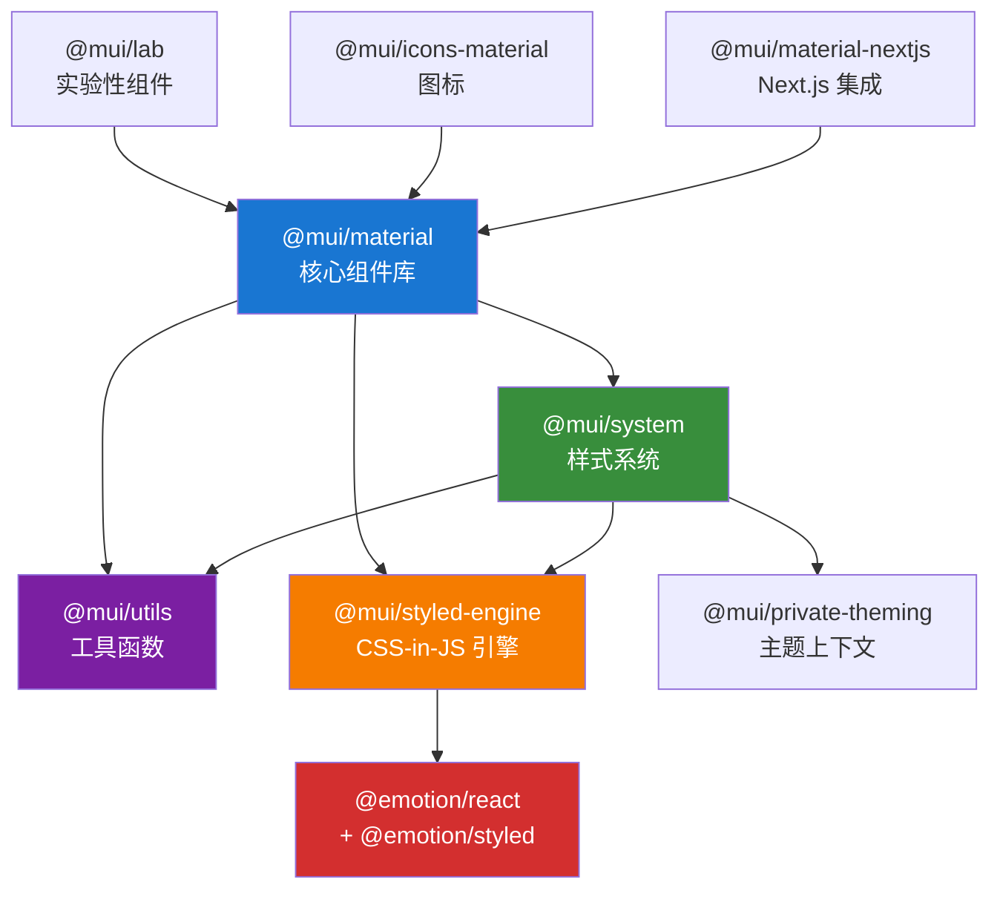
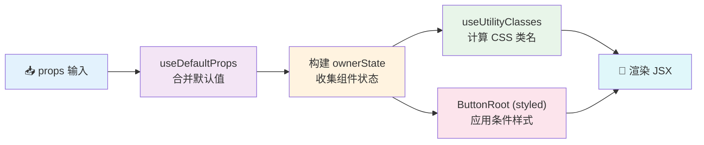
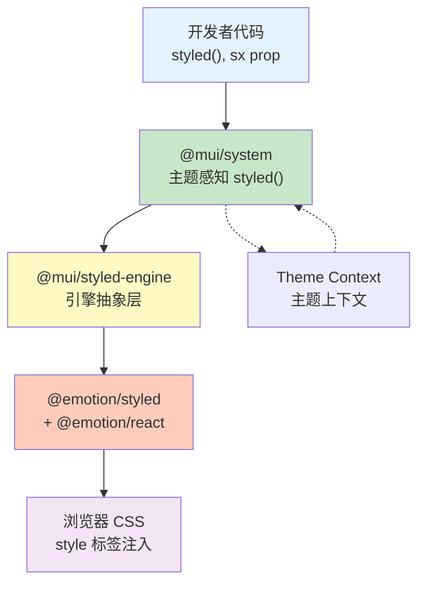
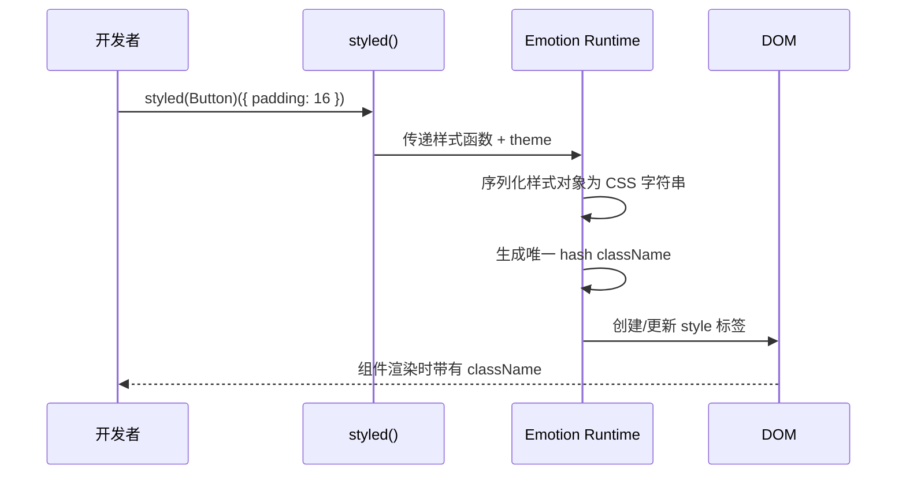
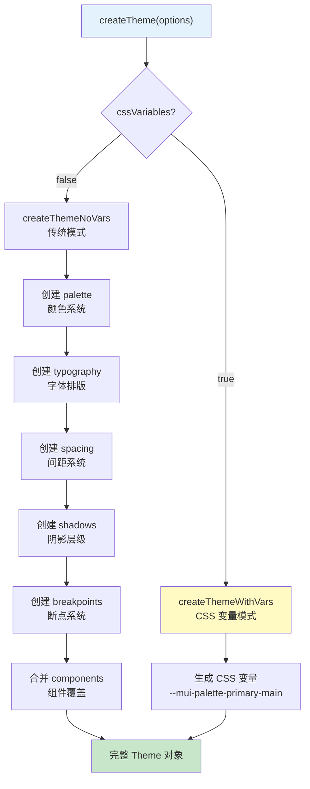
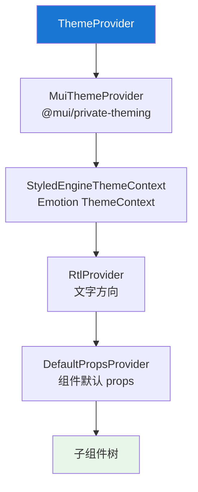
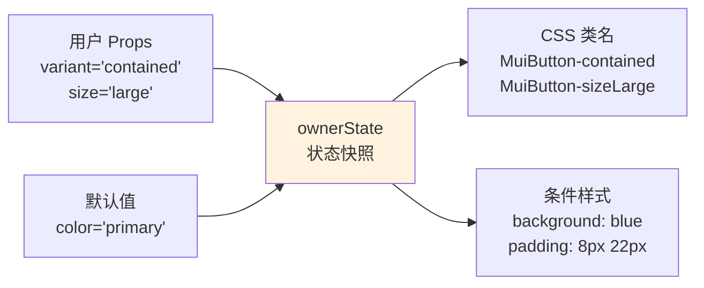
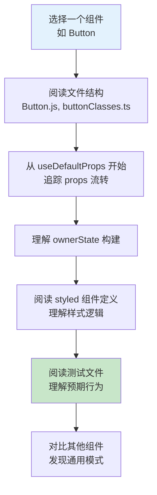
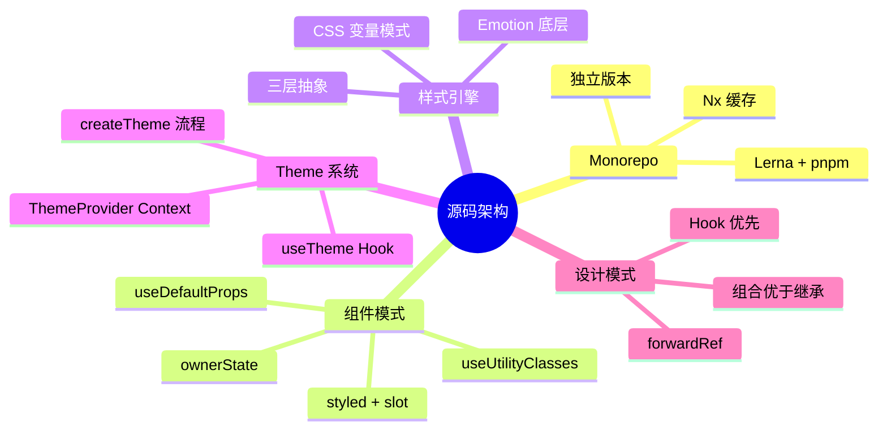

# 🏗️ 源码架构解析

> 📚 Material UI v9 前端开发者学习路线 - 第十二章
>
> 阅读源码就像参观一座精心设计的建筑——你不仅能看到外观（API），还能理解承重结构（架构模式）、管道系统（数据流）和施工工艺（设计决策）。掌握 Material UI 的内部实现，让你从"使用者"进化为"掌控者"。

---

## 📑 本章目录

- [1. Monorepo 架构](#1-monorepo-架构)
- [2. 组件源码模式（以 Button 为例）](#2-组件源码模式以-button-为例)
- [3. 样式引擎架构](#3-样式引擎架构)
- [4. Theme 系统内部实现](#4-theme-系统内部实现)
- [5. 关键设计模式](#5-关键设计模式)
- [6. 如何参与贡献](#6-如何参与贡献)

---

## 1. Monorepo 架构

> 🎯 **类比**：Monorepo 就像一个大型购物中心——所有店铺（packages）共享停车场（构建工具）、安保系统（CI/CD）和物流通道（内部依赖），但每家店铺都有自己的招牌和独立经营。

### 1.1 包组织结构

Material UI 使用 **Lerna + pnpm workspaces** 管理 monorepo，用 **Nx** 进行任务编排和缓存。

```
material-ui/
├── packages/
│   ├── mui-material/          # 📦 @mui/material - 核心组件库
│   ├── mui-system/            # 📦 @mui/system - 样式系统基础
│   ├── mui-lab/               # 📦 @mui/lab - 实验性组件
│   ├── mui-icons-material/    # 📦 @mui/icons-material - Material 图标
│   ├── mui-utils/             # 📦 @mui/utils - 工具函数
│   ├── mui-styled-engine/     # 📦 @mui/styled-engine - Emotion 适配
│   ├── mui-styled-engine-sc/  # 📦 styled-components 适配
│   ├── mui-private-theming/   # 📦 内部主题工具
│   ├── mui-types/             # 📦 TypeScript 类型定义
│   ├── mui-material-nextjs/   # 📦 Next.js 集成
│   ├── mui-codemod/           # 📦 代码迁移工具
│   └── ...
├── packages-internal/         # 内部工具（不发布）
├── docs/                      # 文档站点
├── test/                      # 测试基础设施
├── lerna.json                 # Lerna 配置
├── pnpm-workspace.yaml        # pnpm 工作空间配置
└── nx.json                    # Nx 任务编排配置
```

### 1.2 包依赖关系



### 1.3 构建系统

```bash
# pnpm-workspace.yaml 定义工作空间
packages:
  - packages/*
  - packages-internal/*
  - docs
  - test

# lerna.json 核心配置
{
  "npmClient": "pnpm",
  "version": "independent"    # 每个包独立版本号
}
```

**构建流程**：

| 步骤 | 工具 | 作用 |
|------|------|------|
| 类型编译 | TypeScript (`tsc`) | 生成 `.d.ts` 类型声明 |
| 代码转译 | Babel | 转译 JSX、TypeScript、ESM |
| 任务编排 | Nx | 并行执行、缓存构建结果 |
| 包管理 | pnpm | 高效的依赖安装和链接 |
| 发布 | Lerna | 独立版本发布 |

### 1.4 为什么选择 Monorepo？

| 优势 | 说明 |
|------|------|
| 🔗 代码共享 | `@mui/utils` 可被所有包直接引用，无需发布 |
| 🔄 原子化变更 | 跨包重构可在一个 PR 中完成 |
| 📦 统一版本 | 确保包之间的兼容性 |
| 🧪 统一测试 | 共享测试基础设施和 CI 配置 |
| 📋 统一规范 | ESLint、Prettier、TypeScript 配置共享 |

---

## 2. 组件源码模式（以 Button 为例）

> 🎯 **类比**：每个 MUI 组件就像一台精密的瑞士手表——外表简洁优雅，但内部有多个精密齿轮（hooks、styled 组件、ownerState）协同工作。

### 2.1 文件结构

```
packages/mui-material/src/Button/
├── Button.js              # 🎯 组件主实现（~737 行）
├── Button.d.ts            # 📝 TypeScript 类型声明
├── Button.test.js         # 🧪 单元测试
├── Button.spec.tsx        # 📋 TypeScript 类型测试
├── buttonClasses.ts       # 🏷️ CSS 类名定义
├── index.js               # 📤 导出入口
└── index.d.ts             # 📤 类型导出入口
```

### 2.2 渲染管线



### 2.3 useDefaultProps — 默认值合并

```tsx
// Button.js 中的调用
const props = useDefaultProps({ props: resolvedProps, name: 'MuiButton' });
```

这个 Hook 从 `DefaultPropsProvider` 的 Context 中获取 `theme.components.MuiButton.defaultProps`，与用户传入的 props 合并。**用户传入的 props 总是优先**。

```tsx
// 如果主题中设置了：
createTheme({
  components: {
    MuiButton: {
      defaultProps: {
        variant: 'contained',
        disableElevation: true,
      },
    },
  },
});

// 那么 <Button /> 等效于 <Button variant="contained" disableElevation />
// 但 <Button variant="outlined" /> 中用户传入的 variant 优先
```

### 2.4 ownerState — 组件状态快照

> 🎯 **类比**：ownerState 就像角色扮演游戏中的角色属性面板——记录了角色的所有特征（力量、敏捷、体质），决定了角色的外观和能力。样式引擎根据这些"属性"来决定组件穿什么"装备"。

```tsx
const ownerState = {
  ...props,
  color,         // 'primary' | 'secondary' | 'success' | ...
  disabled,      // boolean
  variant,       // 'text' | 'outlined' | 'contained'
  size,          // 'small' | 'medium' | 'large'
  fullWidth,     // boolean
  loading,       // boolean
  // ... 其他状态
};
```

ownerState 被传递给 styled 组件，用于**条件样式**：

```tsx
const ButtonRoot = styled(ButtonBase, {
  name: 'MuiButton',
  slot: 'Root',
})(({ ownerState, theme }) => ({
  // 根据 ownerState 的值决定样式
  ...(ownerState.variant === 'contained' && {
    backgroundColor: theme.palette[ownerState.color].main,
    color: theme.palette[ownerState.color].contrastText,
  }),
  ...(ownerState.fullWidth && {
    width: '100%',
  }),
}));
```

### 2.5 useUtilityClasses — CSS 类名计算

```tsx
const useUtilityClasses = (ownerState) => {
  const { color, variant, size, fullWidth, loading, classes } = ownerState;

  const slots = {
    root: [
      'root',
      variant,                           // 'text' | 'outlined' | 'contained'
      `size${capitalize(size)}`,         // 'sizeSmall' | 'sizeMedium' | ...
      `color${capitalize(color)}`,       // 'colorPrimary' | 'colorSecondary' | ...
      fullWidth && 'fullWidth',
      loading && 'loading',
    ],
    startIcon: ['icon', 'startIcon'],
    endIcon: ['icon', 'endIcon'],
    loadingIndicator: ['loadingIndicator'],
  };

  return composeClasses(slots, getButtonUtilityClass, classes);
};

// 输出示例（variant="contained", size="large", color="primary"）：
// {
//   root: 'MuiButton-root MuiButton-contained MuiButton-sizeLarge MuiButton-colorPrimary',
//   startIcon: 'MuiButton-icon MuiButton-startIcon',
//   ...
// }
```

### 2.6 styled() 组件定义

```tsx
const ButtonRoot = styled(ButtonBase, {
  shouldForwardProp: (prop) => rootShouldForwardProp(prop) || prop === 'classes',
  name: 'MuiButton',           // 用于生成 CSS 类名前缀
  slot: 'Root',                 // 对应 slot 名称
  overridesResolver: (props, styles) => {
    const { ownerState } = props;
    return [
      styles.root,
      styles[ownerState.variant],
      styles[`size${capitalize(ownerState.size)}`],
      ownerState.disableElevation && styles.disableElevation,
      ownerState.fullWidth && styles.fullWidth,
    ];
  },
})(
  memoTheme(({ theme }) => ({
    // 基础样式...
    minWidth: 64,
    padding: '6px 16px',
    borderRadius: (theme.vars || theme).shape.borderRadius,
    transition: theme.transitions.create(
      ['background-color', 'box-shadow', 'border-color', 'color'],
      { duration: theme.transitions.duration.short },
    ),
  }))
);
```

**关键参数说明**：

| 参数 | 作用 |
|------|------|
| `shouldForwardProp` | 过滤不应传递到 DOM 的 props |
| `name` | CSS 类名前缀，如 `MuiButton` |
| `slot` | 子元素名称，如 `Root`、`StartIcon` |
| `overridesResolver` | 决定哪些 theme styleOverrides 应用到此组件 |
| `memoTheme` | 缓存样式计算结果，避免不必要的重新计算 |

### 2.7 buttonClasses.ts — 类名契约

```tsx
import generateUtilityClasses from '@mui/utils/generateUtilityClasses';
import generateUtilityClass from '@mui/utils/generateUtilityClass';

export interface ButtonClasses {
  root: string;         // 根元素
  text: string;         // variant="text"
  outlined: string;     // variant="outlined"
  contained: string;    // variant="contained"
  disabled: string;     // 禁用状态
  focusVisible: string; // 键盘焦点状态
  sizeSmall: string;    // size="small"
  sizeMedium: string;   // size="medium"
  sizeLarge: string;    // size="large"
  colorPrimary: string; // color="primary"
  // ... 共 27 个类名键
}

export function getButtonUtilityClass(slot: string): string {
  return generateUtilityClass('MuiButton', slot);
}

const buttonClasses: ButtonClasses = generateUtilityClasses('MuiButton', [
  'root', 'text', 'outlined', 'contained', 'disabled',
  'focusVisible', 'sizeSmall', 'sizeMedium', 'sizeLarge',
  'colorPrimary', 'colorSecondary', 'fullWidth',
  'startIcon', 'endIcon', 'icon', 'loading',
  // ...
]);

export default buttonClasses;
```

---

## 3. 样式引擎架构

> 🎯 **类比**：样式引擎就像一个翻译系统——你用 JavaScript 对象写"设计稿"，引擎把它翻译成浏览器能理解的 CSS，并注入到 DOM 中。

### 3.1 架构分层



### 3.2 styled() 调用链

```
你的代码: styled(Button)({ color: 'red' })
    ↓
@mui/system/styled:  注入 name, slot, overridesResolver, 主题处理
    ↓
@mui/styled-engine:  包装 Emotion styled，添加开发环境错误检查
    ↓
@emotion/styled:     生成唯一 className，创建 style 标签
    ↓
DOM:                 <style>.css-abc123 { color: red; }</style>
```

### 3.3 @mui/styled-engine 核心代码

```tsx
// packages/mui-styled-engine/src/index.js
import emStyled from '@emotion/styled';

export default function styled(tag, options) {
  const stylesFactory = emStyled(tag, options);

  if (process.env.NODE_ENV !== 'production') {
    return (...styles) => {
      // 开发环境：检查是否遗漏了样式参数
      if (styles.length === 0) {
        console.error('MUI: 调用 styled() 时缺少样式参数');
      }
      return stylesFactory(...styles);
    };
  }

  return stylesFactory;
}

export { ThemeContext, keyframes, css } from '@emotion/react';
```

### 3.4 样式注入过程



---

## 4. Theme 系统内部实现

### 4.1 createTheme 流程



### 4.2 Theme 对象结构

```tsx
const theme = createTheme();

// theme 对象包含：
{
  palette: {
    primary: { main: '#1976d2', light: '...', dark: '...', contrastText: '...' },
    secondary: { /* ... */ },
    error: { /* ... */ },
    mode: 'light',  // 或 'dark'
  },
  typography: {
    fontFamily: '"Roboto", "Helvetica", "Arial", sans-serif',
    h1: { fontSize: '6rem', fontWeight: 300, lineHeight: 1.167 },
    body1: { fontSize: '1rem', lineHeight: 1.5 },
    // ...
  },
  spacing: (factor) => `${8 * factor}px`,  // spacing(2) = '16px'
  breakpoints: {
    values: { xs: 0, sm: 600, md: 900, lg: 1200, xl: 1536 },
    up: (key) => `@media (min-width: ${values[key]}px)`,
  },
  shadows: ['none', '0px 2px 1px ...', /* 25 级阴影 */],
  shape: { borderRadius: 4 },
  transitions: { duration: { short: 250, standard: 300 } },
  components: { /* 组件级别覆盖 */ },
}
```

### 4.3 ThemeProvider 实现

```tsx
// packages/mui-system/src/ThemeProvider/ThemeProvider.js
function ThemeProvider({ children, theme: localTheme, themeId }) {
  const upperTheme = useThemeWithoutDefault(EMPTY_THEME);

  const engineTheme = useThemeScoping(themeId, upperTheme, localTheme);

  return (
    <MuiThemeProvider theme={engineTheme}>           {/* 内部主题上下文 */}
      <StyledEngineThemeContext.Provider value={engineTheme}> {/* Emotion 主题 */}
        <RtlProvider value={engineTheme.direction === 'rtl'}>
          <DefaultPropsProvider value={engineTheme.components}>
            {children}
          </DefaultPropsProvider>
        </RtlProvider>
      </StyledEngineThemeContext.Provider>
    </MuiThemeProvider>
  );
}
```

**Context 层次结构**：



### 4.4 useTheme Hook 源码

```tsx
// packages/mui-material/src/styles/useTheme.js
import { useTheme as useThemeSystem } from '@mui/system';
import defaultTheme from './defaultTheme';
import THEME_ID from './identifier';

export default function useTheme() {
  const theme = useThemeSystem(defaultTheme);

  if (process.env.NODE_ENV !== 'production') {
    React.useDebugValue(theme); // React DevTools 中显示主题值
  }

  return theme[THEME_ID] || theme; // 支持主题作用域
}
```

### 4.5 CSS 变量生成

当 `cssVariables: true` 时，createTheme 会自动生成 CSS 自定义属性：

```tsx
const theme = createTheme({ cssVariables: true });

// 生成的 CSS 变量（通过 :root 注入）：
// --mui-palette-primary-main: #1976d2;
// --mui-palette-primary-light: #42a5f5;
// --mui-palette-primary-dark: #1565c0;
// --mui-palette-background-default: #fff;
// --mui-shape-borderRadius: 4px;
// --mui-shadows-1: 0px 2px 1px -1px rgba(0,0,0,0.2), ...

// 组件内部使用：
// theme.vars.palette.primary.main → 'var(--mui-palette-primary-main)'
// 切换暗色模式时只需更新 CSS 变量值，无需 React re-render！
```

---

## 5. 关键设计模式

### 5.1 Forward Refs 模式

Material UI 中几乎所有组件都使用 `React.forwardRef`：

```tsx
const Button = React.forwardRef(function Button(inProps, ref) {
  // ref 被转发到 ButtonRoot（最终到 DOM 元素）
  return <ButtonRoot ref={ref} {...otherProps} />;
});
```

**为什么？** 允许父组件通过 ref 访问底层 DOM 元素，这对**焦点管理**、**动画库**、**测量尺寸**等场景至关重要。

### 5.2 ownerState 模式详解

> 🎯 **类比**：ownerState 就像角色扮演游戏中的角色属性面板——力量决定攻击力，敏捷决定闪避率。组件的 `variant`、`size`、`color` 等属性决定了它的视觉"装备"。



**设计意图**：将"组件当前的所有状态"打包成一个对象传给 styled 组件，这样样式逻辑就有了**完整的状态信息**来做条件判断。

### 5.3 Composition over Inheritance

MUI 偏好组合模式而非继承：

```tsx
// ✅ 组合模式（MUI 实际做法）
const Button = styled(ButtonBase, { ... })(...);
// Button 使用 ButtonBase 作为 styled 的基础，而非 class 继承

// ButtonBase 提供：涟漪效果、焦点管理、键盘交互
// Button 添加：颜色、变体、尺寸样式
```

### 5.4 Hook 模式

```tsx
// useTheme — 获取当前主题
const theme = useTheme();

// useMediaQuery — 响应式查询
const isMobile = useMediaQuery(theme.breakpoints.down('sm'));

// useControlled — 受控/非受控组件状态管理
const [value, setValue] = useControlled({
  controlled: propValue,
  default: defaultValue,
  name: 'TextField',
});
```

### 5.5 HOC 模式（遗留但有教育意义）

```tsx
// withStyles — 早期版本的样式注入方式（v4 及之前）
const StyledComponent = withStyles(styles)(MyComponent);

// withTheme — 将 theme 注入 props
const ThemedComponent = withTheme(MyComponent);

// v9 推荐使用 Hook 替代：
// withStyles → styled() 或 sx prop
// withTheme → useTheme()
```

---

## 6. 如何参与贡献

### 6.1 阅读源码的方法



### 6.2 新增组件 Checklist

| 步骤 | 文件 | 说明 |
|------|------|------|
| 1 | `MyComponent.js` | 组件主实现，使用 styled + ownerState |
| 2 | `myComponentClasses.ts` | 定义 CSS 类名契约 |
| 3 | `MyComponent.d.ts` | TypeScript 类型声明 |
| 4 | `MyComponent.test.js` | 单元测试 |
| 5 | `index.js` / `index.d.ts` | 公共导出 |
| 6 | 更新父级 `index.js` | 从包入口导出 |
| 7 | 运行 `pnpm proptypes` | 生成 PropTypes |
| 8 | 运行 `pnpm docs:api` | 生成 API 文档 |

### 6.3 测试模式

```tsx
import { createRenderer } from '@mui/internal-test-utils';
import describeConformance from '../../test/describeConformance';
import MyComponent from './MyComponent';
import classes from './myComponentClasses';

describe('<MyComponent />', () => {
  const { render } = createRenderer();

  // 标准化合规测试 — 自动检查类名、ref、slot 等
  describeConformance(<MyComponent />, () => ({
    classes,
    render,
    refInstanceof: window.HTMLDivElement,
    muiName: 'MuiMyComponent',
  }));

  it('should render children', () => {
    const { getByText } = render(<MyComponent>Hello</MyComponent>);
    expect(getByText('Hello')).to.be.visible;
  });

  it('should apply variant class', () => {
    const { getByRole } = render(<MyComponent variant="outlined" />);
    expect(getByRole('button')).to.have.class(classes.outlined);
  });
});
```

### 6.4 开发命令速查

```bash
# 安装依赖
pnpm install

# 启动文档开发服务器
pnpm docs:dev

# 运行特定组件的测试
pnpm test:unit Button

# 类型检查
pnpm typescript

# 代码格式化与 lint
pnpm prettier && pnpm eslint

# 构建所有包
pnpm release:build

# 生成 PropTypes 和 API 文档
pnpm proptypes && pnpm docs:api
```

---

## 🎯 本章总结



| 核心概念 | 一句话总结 |
|----------|----------|
| Monorepo | 一个仓库管理所有包，Lerna + pnpm + Nx 协同 |
| ownerState | 组件状态快照，驱动条件样式和类名 |
| styled() | 三层封装：system → engine → Emotion |
| Theme | createTheme 构建、ThemeProvider 分发、useTheme 消费 |
| 类名系统 | generateUtilityClass 生成 `MuiX-slot` 格式类名 |
| 贡献流程 | 实现 → 类名 → 类型 → 测试 → 导出 → 文档 |

> 💡 **下一步**：第十三章将深入性能优化，学习如何让 Material UI 应用运行如飞！
