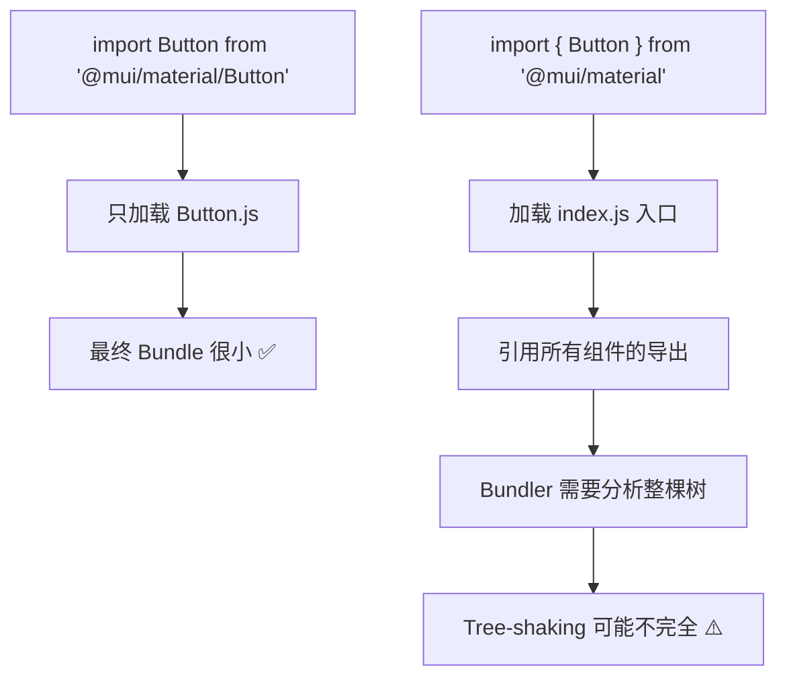
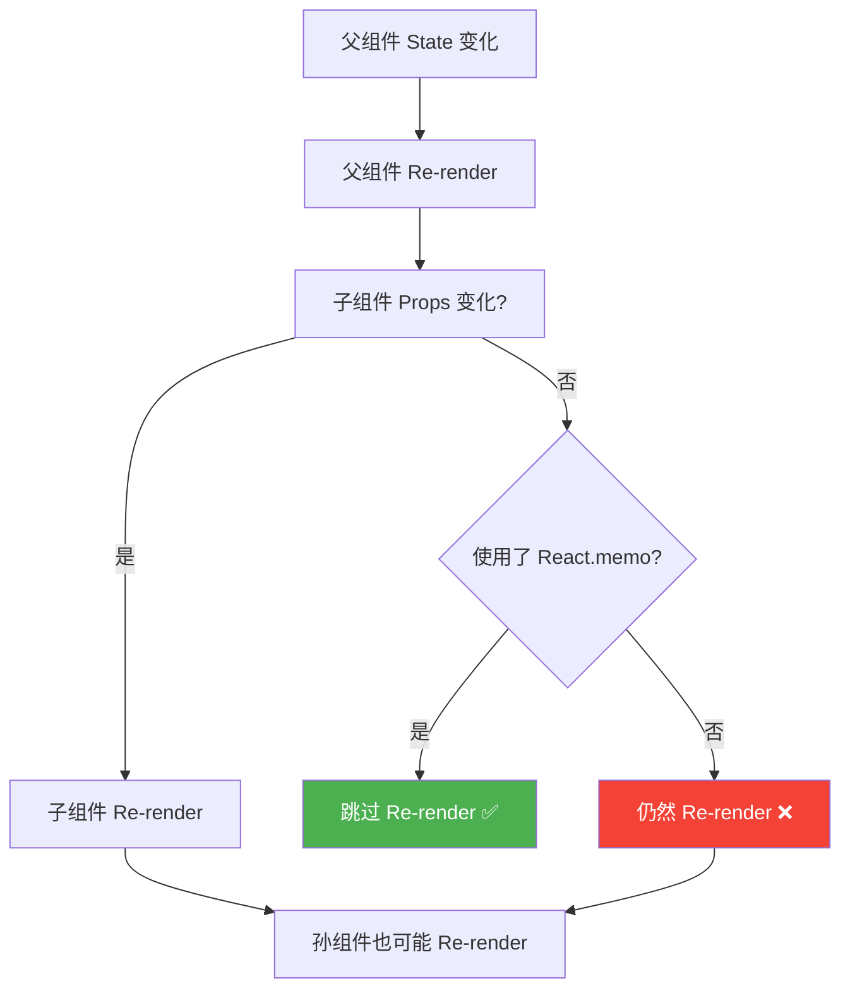
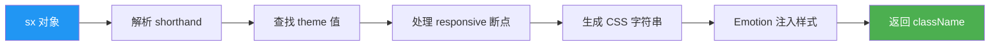
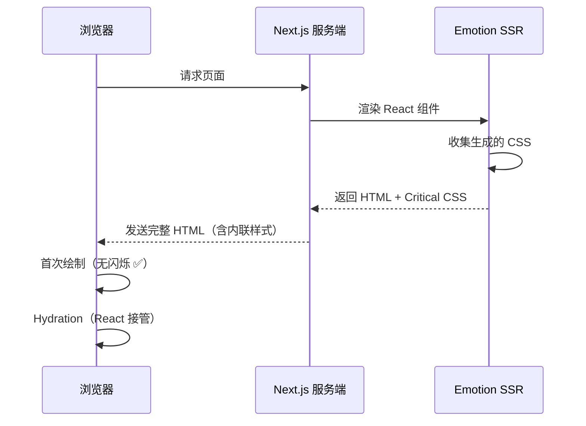
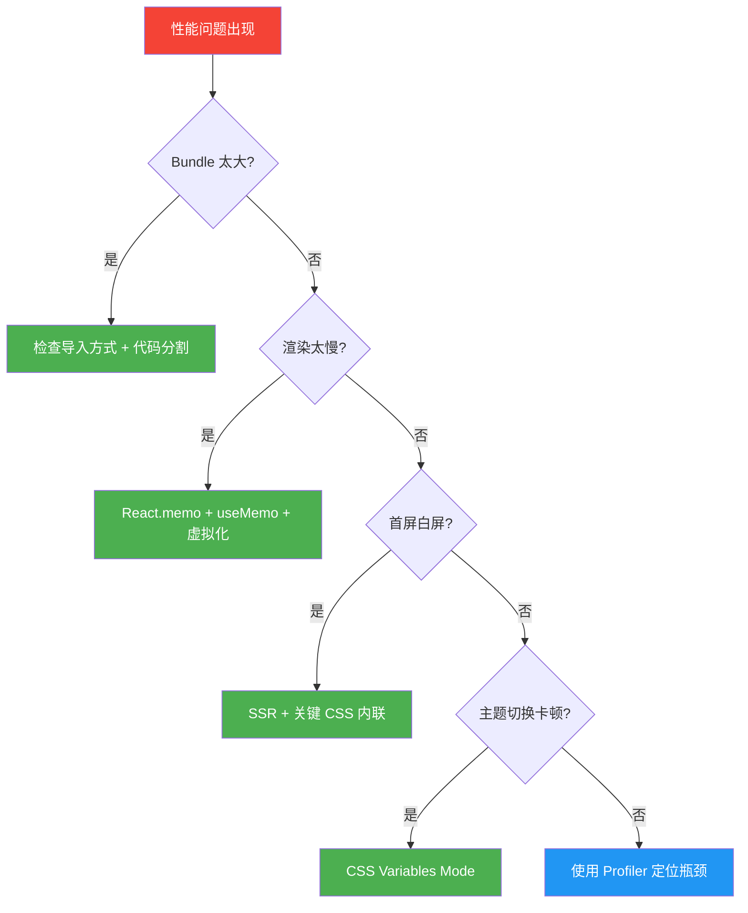

# 🚀 性能优化

> **Material UI 前端开发学习路径 - 第13章**
>
> 让你的 Material UI 应用像跑车一样快！本章涵盖 bundle 优化、渲染性能、SSR 以及懒加载策略。

---

## 📦 1. Bundle Size 优化

### 1.1 Tree-shaking：一级深度导入的秘密

想象一个巨大的仓库 🏭，你只需要一把螺丝刀，但如果你说"把整个工具箱搬来"，你就得扛着几十公斤的工具走。**Tree-shaking** 就像是只挑你需要的工具带走。

Material UI 支持**一级深度导入（one-level deep imports）**，这是 tree-shaking 的关键：

```tsx
// ✅ 推荐：一级深度导入 - 只加载 Button 模块
import Button from '@mui/material/Button';
import TextField from '@mui/material/TextField';

// ❌ 避免：命名导入 - 可能导致整个包被打包
import { Button, TextField } from '@mui/material';
```

**为什么会有差别？**



> 💡 **类比**：一级深度导入就像在图书馆里直接走到某一排书架拿书，而命名导入则像先去前台查目录，再让管理员帮你找——效率差很多。

### 1.2 Bundle 分析工具

使用 `webpack-bundle-analyzer` 可视化你的 bundle 组成：

```bash
# 安装分析工具
pnpm add -D webpack-bundle-analyzer

# 在 next.config.js 中配置（Next.js 项目）
# 或使用 @next/bundle-analyzer
pnpm add -D @next/bundle-analyzer
```

```js
// next.config.js
const withBundleAnalyzer = require('@next/bundle-analyzer')({
  enabled: process.env.ANALYZE === 'true',
});

module.exports = withBundleAnalyzer({
  // 你的 Next.js 配置
});
```

```bash
# 运行分析
ANALYZE=true pnpm build
```

### 1.3 最小化 CSS-in-JS 开销

Emotion（Material UI 的默认 styling engine）会在运行时生成 CSS。以下策略可以减少开销：

```tsx
// ✅ 使用 styled() 创建静态样式 - 样式只计算一次
const StyledCard = styled(Card)(({ theme }) => ({
  padding: theme.spacing(2),
  borderRadius: theme.shape.borderRadius,
  backgroundColor: theme.palette.background.paper,
}));

// ❌ 避免：每次渲染都创建新的样式对象
function MyCard() {
  return (
    <Card
      sx={{
        // 每次渲染都会重新计算！
        padding: 2,
        borderRadius: 1,
        backgroundColor: 'background.paper',
      }}
    >
      内容
    </Card>
  );
}
```

### 1.4 Code Splitting 与 React.lazy

```tsx
import React, { Suspense, lazy } from 'react';
import CircularProgress from '@mui/material/CircularProgress';

// 懒加载重量级页面组件
const DashboardPage = lazy(() => import('./pages/DashboardPage'));
const SettingsPage = lazy(() => import('./pages/SettingsPage'));

function App() {
  return (
    <Suspense fallback={<CircularProgress sx={{ m: 'auto' }} />}>
      <Routes>
        <Route path="/dashboard" element={<DashboardPage />} />
        <Route path="/settings" element={<SettingsPage />} />
      </Routes>
    </Suspense>
  );
}
```

---

## 🔄 2. 渲染优化

### 2.1 MUI 组件的 Re-render 机制

Material UI 组件内部已经做了很多优化，但当你**包装**或**组合**它们时，需要注意 re-render 的传播：



> 💡 **类比**：Re-render 就像多米诺骨牌 🎯，一个倒下会带倒一串。`React.memo` 就像在骨牌之间放一个挡板。

### 2.2 React.memo 包装组件

```tsx
import React, { memo } from 'react';
import ListItem from '@mui/material/ListItem';
import ListItemText from '@mui/material/ListItemText';
import Avatar from '@mui/material/Avatar';

// ✅ 对列表项使用 memo 防止不必要的 re-render
const UserListItem = memo(function UserListItem({
  name,
  email,
  avatarUrl,
}: {
  name: string;
  email: string;
  avatarUrl: string;
}) {
  return (
    <ListItem>
      <Avatar src={avatarUrl} alt={name} />
      <ListItemText primary={name} secondary={email} />
    </ListItem>
  );
});

// 父组件更新时，只有 props 变化的 UserListItem 会 re-render
function UserList({ users }: { users: User[] }) {
  return (
    <List>
      {users.map((user) => (
        <UserListItem
          key={user.id}
          name={user.name}
          email={user.email}
          avatarUrl={user.avatarUrl}
        />
      ))}
    </List>
  );
}
```

### 2.3 useMemo 缓存计算样式

```tsx
import { useMemo } from 'react';
import type { SxProps, Theme } from '@mui/material/styles';

function DataGrid({ highlighted, density }: Props) {
  // ✅ 用 useMemo 缓存 sx 对象，保持引用稳定
  const containerSx = useMemo<SxProps<Theme>>(
    () => ({
      border: highlighted ? '2px solid' : '1px solid',
      borderColor: highlighted ? 'primary.main' : 'divider',
      padding: density === 'compact' ? 1 : 2,
    }),
    [highlighted, density],
  );

  return <Box sx={containerSx}>...</Box>;
}
```

### 2.4 避免内联 sx 对象

```tsx
// ❌ 每次渲染都创建新对象 → 触发 Emotion 重新计算样式
function BadExample() {
  return <Button sx={{ mt: 2, color: 'primary.main' }}>点击</Button>;
}

// ✅ 将静态 sx 提取到组件外部
const buttonSx = { mt: 2, color: 'primary.main' } as const;

function GoodExample() {
  return <Button sx={buttonSx}>点击</Button>;
}
```

### 2.5 useCallback 稳定事件处理器

```tsx
import { useCallback } from 'react';
import Button from '@mui/material/Button';

function FormActions({ onSave, onCancel }: Props) {
  // ✅ 使用 useCallback 保持回调引用稳定
  const handleSave = useCallback(() => {
    // 验证并保存
    onSave();
  }, [onSave]);

  const handleCancel = useCallback(() => {
    onCancel();
  }, [onCancel]);

  return (
    <Box sx={{ display: 'flex', gap: 1 }}>
      <Button onClick={handleSave} variant="contained">保存</Button>
      <Button onClick={handleCancel}>取消</Button>
    </Box>
  );
}
```

### 2.6 虚拟化长列表

当列表超过几百项时，虚拟化（Virtualization）是必须的。它只渲染可见区域的元素：

```tsx
import { FixedSizeList } from 'react-window';
import ListItem from '@mui/material/ListItem';
import ListItemText from '@mui/material/ListItemText';

// ✅ 使用 react-window 虚拟化长列表
function VirtualizedUserList({ users }: { users: User[] }) {
  const Row = ({ index, style }: { index: number; style: React.CSSProperties }) => (
    <ListItem style={style} component="div">
      <ListItemText
        primary={users[index].name}
        secondary={users[index].email}
      />
    </ListItem>
  );

  return (
    <FixedSizeList
      height={400}
      width="100%"
      itemCount={users.length}
      itemSize={72} // 每项高度
    >
      {Row}
    </FixedSizeList>
  );
}
```

> 💡 **类比**：虚拟化就像电梯里的楼层显示器 🏢 — 大楼有100层，但显示器同一时间只显示当前附近的几层，而不是把所有楼层都画出来。

---

## 🎨 3. Styling 性能

### 3.1 sx Prop 的运行时成本分析

`sx` prop 是 Material UI 最方便的样式工具，但它有运行时成本：



每次组件渲染时，如果 `sx` 对象引用不稳定，上述整个流程都会重新执行。

### 3.2 styled() vs sx：性能对比

| 特性 | `styled()` | `sx` prop |
|------|-----------|-----------|
| 样式计算时机 | 组件定义时（一次） | 每次渲染时 |
| 适用场景 | 可复用的样式组件 | 一次性快速样式 |
| Theme 访问 | ✅ 通过回调 | ✅ 通过 shorthand |
| 动态样式 | 通过 props 控制 | 直接写在 JSX 中 |
| 性能 | ⚡ 更快（静态部分缓存） | 🐢 稍慢（运行时解析） |

```tsx
// ⚡ styled() - 静态样式只计算一次
const PrimaryButton = styled(Button)(({ theme }) => ({
  background: `linear-gradient(45deg, ${theme.palette.primary.main}, ${theme.palette.secondary.main})`,
  borderRadius: theme.shape.borderRadius * 2,
  padding: theme.spacing(1, 3),
  color: '#fff',
  fontWeight: 700,
}));

// 使用时无额外开销
function Header() {
  return <PrimaryButton>开始使用</PrimaryButton>;
}
```

### 3.3 CSS Variables Mode：减少 Theme 切换的 Re-render

Material UI v9 支持 **CSS variables mode**，它将 theme token 映射为 CSS 自定义属性：

```tsx
import { extendTheme, CssVarsProvider } from '@mui/material/styles';

const theme = extendTheme({
  colorSchemes: {
    light: { palette: { primary: { main: '#1976d2' } } },
    dark: { palette: { primary: { main: '#90caf9' } } },
  },
});

// ✅ 主题切换只改变 CSS 变量，不触发 React re-render！
function App() {
  return (
    <CssVarsProvider theme={theme}>
      <MyApp />
    </CssVarsProvider>
  );
}
```

> 💡 **类比**：传统模式切换主题像换整套衣服 👔，CSS variables mode 像只换衣服颜色 🎨 — 衣服结构不变，改变的只是颜色值。

### 3.4 静态 vs 动态样式

```tsx
// ✅ 优先使用静态样式
const staticSx = {
  display: 'flex',
  alignItems: 'center',
  gap: 2,
  p: 2,
} as const;

// ✅ 动态部分单独处理
function Card({ elevated }: { elevated: boolean }) {
  return (
    <Box
      sx={{
        ...staticSx,
        boxShadow: elevated ? 4 : 1, // 只有这部分是动态的
      }}
    >
      内容
    </Box>
  );
}
```

### 3.5 Emotion Cache 与样式去重

Emotion 内置样式去重机制。相同的 CSS 只会注入一次：

```tsx
import createCache from '@emotion/cache';
import { CacheProvider } from '@emotion/react';

// 自定义 Emotion cache（适用于 micro-frontend 或 Shadow DOM）
const emotionCache = createCache({
  key: 'mui',        // CSS class 前缀
  prepend: true,      // 将 <style> 插到 <head> 顶部，避免优先级问题
});

function App() {
  return (
    <CacheProvider value={emotionCache}>
      <ThemeProvider theme={theme}>
        <MyApp />
      </ThemeProvider>
    </CacheProvider>
  );
}
```

---

## 🖥️ 4. SSR 优化

### 4.1 Next.js 中的服务端渲染

Material UI 与 Next.js 深度集成，通过 `@mui/material-nextjs` 简化配置：

```bash
pnpm add @mui/material-nextjs @emotion/cache
```

### 4.2 Emotion SSR 配置

```tsx
// app/layout.tsx (Next.js App Router)
import { AppRouterCacheProvider } from '@mui/material-nextjs/v15-appRouter';
import { ThemeProvider } from '@mui/material/styles';
import CssBaseline from '@mui/material/CssBaseline';
import theme from './theme';

export default function RootLayout({ children }: { children: React.ReactNode }) {
  return (
    <html lang="zh-CN">
      <body>
        <AppRouterCacheProvider options={{ key: 'mui', prepend: true }}>
          <ThemeProvider theme={theme}>
            <CssBaseline />
            {children}
          </ThemeProvider>
        </AppRouterCacheProvider>
      </body>
    </html>
  );
}
```



### 4.3 避免 Hydration Mismatch

```tsx
// ❌ 服务端和客户端渲染不同内容 → hydration 错误
function BadComponent() {
  return <Typography>{new Date().toLocaleTimeString()}</Typography>;
}

// ✅ 使用 useEffect 处理客户端特有逻辑
function GoodComponent() {
  const [time, setTime] = React.useState<string | null>(null);

  React.useEffect(() => {
    setTime(new Date().toLocaleTimeString());
  }, []);

  return <Typography>{time ?? '加载中...'}</Typography>;
}
```

### 4.4 First Paint 优化

```tsx
// ✅ 关键路径上只加载必要组件
// 非关键组件使用动态导入
import dynamic from 'next/dynamic';

const HeavyChart = dynamic(() => import('../components/HeavyChart'), {
  ssr: false, // 不在服务端渲染图表
  loading: () => <Skeleton variant="rectangular" height={300} />,
});
```

---

## ⏳ 5. 懒加载策略

### 5.1 懒加载重量级组件

某些 MUI 组件（如 Dialog、Drawer、DatePicker）很少在首屏展示，适合懒加载：

```tsx
import React, { Suspense, lazy, useState } from 'react';
import Button from '@mui/material/Button';
import Skeleton from '@mui/material/Skeleton';

// 按需加载 Dialog 及其内容
const FeedbackDialog = lazy(() => import('./FeedbackDialog'));

function App() {
  const [open, setOpen] = useState(false);

  return (
    <>
      <Button onClick={() => setOpen(true)}>提交反馈</Button>
      {open && (
        <Suspense fallback={<Skeleton variant="rectangular" height={200} />}>
          <FeedbackDialog open={open} onClose={() => setOpen(false)} />
        </Suspense>
      )}
    </>
  );
}
```

### 5.2 Intersection Observer 加载视口外内容

```tsx
import { useEffect, useRef, useState } from 'react';
import Skeleton from '@mui/material/Skeleton';

function LazySection({ children }: { children: React.ReactNode }) {
  const ref = useRef<HTMLDivElement>(null);
  const [isVisible, setIsVisible] = useState(false);

  useEffect(() => {
    const observer = new IntersectionObserver(
      ([entry]) => {
        if (entry.isIntersecting) {
          setIsVisible(true);
          observer.disconnect(); // 只触发一次
        }
      },
      { rootMargin: '200px' }, // 提前 200px 开始加载
    );

    if (ref.current) observer.observe(ref.current);
    return () => observer.disconnect();
  }, []);

  return (
    <div ref={ref}>
      {isVisible ? children : <Skeleton variant="rectangular" height={300} />}
    </div>
  );
}

// 使用
function ProductPage() {
  return (
    <div>
      <HeroSection /> {/* 首屏内容，立即加载 */}
      <LazySection>
        <RecommendedProducts /> {/* 滚动到附近时加载 */}
      </LazySection>
      <LazySection>
        <ReviewSection /> {/* 更下方，更晚加载 */}
      </LazySection>
    </div>
  );
}
```

### 5.3 Skeleton 占位符

```tsx
import Skeleton from '@mui/material/Skeleton';
import Card from '@mui/material/Card';
import CardContent from '@mui/material/CardContent';

// ✅ 用 Skeleton 模拟组件加载状态
function ProductCardSkeleton() {
  return (
    <Card>
      <Skeleton variant="rectangular" height={200} />
      <CardContent>
        <Skeleton variant="text" sx={{ fontSize: '1.5rem' }} />
        <Skeleton variant="text" width="60%" />
        <Skeleton variant="rounded" width={100} height={36} sx={{ mt: 1 }} />
      </CardContent>
    </Card>
  );
}
```

### 5.4 动态导入 Icon

Material UI 有数千个 icon，一次性导入代价高昂：

```tsx
// ❌ 导入所有 icon（打包体积膨胀！）
import * as Icons from '@mui/icons-material';

// ✅ 按需导入具体 icon
import SearchIcon from '@mui/icons-material/Search';
import HomeIcon from '@mui/icons-material/Home';

// ✅ 超级动态场景：运行时按名称加载
async function loadIcon(iconName: string) {
  const module = await import(`@mui/icons-material/${iconName}`);
  return module.default;
}
```

---

## ✅ 6. 性能优化 Checklist

### 总结对比表

| 优化项 | 优化前 | 优化后 | 影响 |
|--------|--------|--------|------|
| 导入方式 | `import { Button } from '@mui/material'` | `import Button from '@mui/material/Button'` | Bundle 体积减小 📦 |
| sx 引用稳定性 | 内联 `sx={{ ... }}` | 提取为常量或 `useMemo` | 减少不必要 re-render 🔄 |
| 列表渲染 | 直接 `.map()` 所有项 | `react-window` 虚拟化 | 大列表性能提升 10x+ ⚡ |
| 样式方案 | 全部用 `sx` | 复用样式用 `styled()` | 运行时样式计算减少 🎨 |
| 主题切换 | 传统 `ThemeProvider` | CSS variables mode | 0 次 React re-render 🖥️ |
| 重组件加载 | 首屏同步加载 | `React.lazy` + `Suspense` | 首屏加载加速 🚀 |
| Icon 导入 | `import * as Icons` | 按需 `import SearchIcon` | 体积减少数百 KB 📉 |
| SSR | 无 SSR | `@mui/material-nextjs` | FCP 提前，SEO 更好 🌐 |

### 使用 React DevTools Profiler 监控

```tsx
// 在开发环境中开启 Profiler
import { Profiler } from 'react';

function onRenderCallback(
  id: string,
  phase: 'mount' | 'update',
  actualDuration: number,
) {
  if (actualDuration > 16) {
    // 超过一帧（16ms）就需要关注
    console.warn(`⚠️ 慢渲染: ${id} (${phase}) 耗时 ${actualDuration.toFixed(1)}ms`);
  }
}

function App() {
  return (
    <Profiler id="App" onRender={onRenderCallback}>
      <MyApp />
    </Profiler>
  );
}
```

### 🎯 快速决策流程图



---

## 📝 小结

| 要点 | 说明 |
|------|------|
| 🔑 核心原则 | 减少 bundle 体积、减少 re-render、加快首屏 |
| 📦 导入优化 | 始终使用一级深度导入 |
| 🔄 渲染优化 | `React.memo` + `useMemo` + `useCallback` |
| 🎨 样式优化 | 复用样式用 `styled()`，一次性用 `sx` |
| 🖥️ SSR | 使用 `@mui/material-nextjs` 简化配置 |
| ⏳ 懒加载 | 非首屏组件 `React.lazy`，长列表虚拟化 |

> 🏁 **下一章**：我们将学习如何为 Material UI 组件编写高质量的测试，确保优化不会引入 bug！
