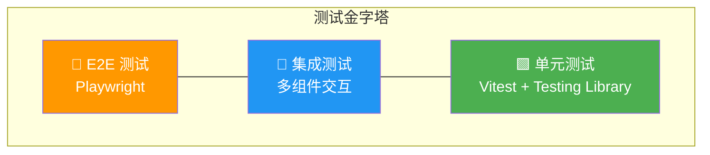
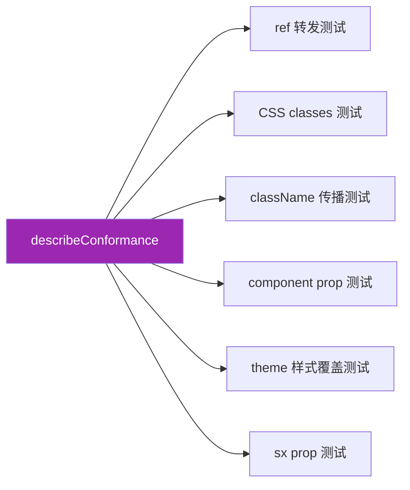
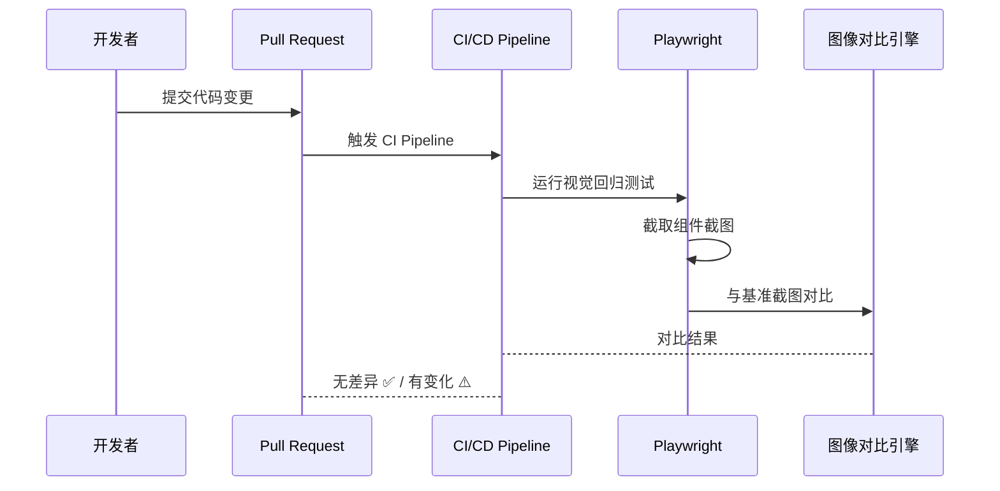
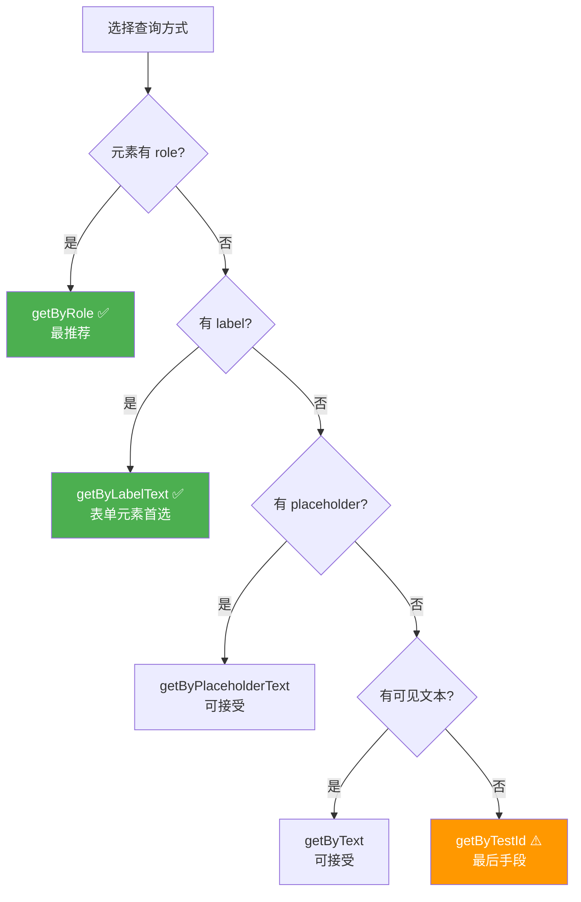
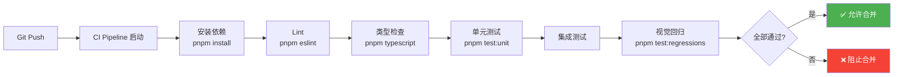

# 🧪 测试实践

> **Material UI 前端开发学习路径 - 第14章**
>
> 好的测试就像安全网 🥅 — 让你放心大胆地重构和优化。本章介绍 Material UI 项目中的测试工具、模式和最佳实践。

---

## 🛠️ 1. Material UI 的测试工具链

### 1.1 工具总览

Material UI 仓库使用以下测试工具：

| 工具 | 用途 | 层级 |
|------|------|------|
| **Vitest** | 测试运行器（test runner） | 单元 / 集成 |
| **@testing-library/react** | 组件渲染与交互 | 单元 / 集成 |
| **@mui/internal-test-utils** | MUI 内部测试工具 | 单元 |
| **Playwright** | E2E 与视觉回归测试 | 端到端 |
| **Chai** | BDD 风格断言 | 所有层级 |



> 💡 **类比**：测试金字塔就像体检 🏥 — 基础体检（单元测试）要多做，专科检查（集成测试）适量做，全面体检（E2E）定期做。

### 1.2 Vitest：测试运行器

Material UI 使用 **Vitest** 作为测试运行器，它与 Vite 生态紧密集成：

```bash
# 运行所有单元测试
pnpm test:unit

# 运行匹配特定模式的测试
pnpm test:unit Button

# 运行包含特定测试名称的测试
pnpm test:unit -t "renders children"

# 在浏览器中运行测试
pnpm test:browser
```

### 1.3 @mui/internal-test-utils

MUI 提供了一个内部测试工具包，核心是 `createRenderer`：

```tsx
import { createRenderer } from '@mui/internal-test-utils';

describe('MyComponent', () => {
  const { render } = createRenderer();

  it('renders correctly', () => {
    const { getByText } = render(<MyComponent>Hello</MyComponent>);
    expect(getByText('Hello')).to.not.equal(null);
  });
});
```

`createRenderer` 会自动：
- 包裹 `ThemeProvider`
- 处理 cleanup
- 提供一致的渲染环境

### 1.4 Chai BDD 断言风格

MUI 测试使用 Chai 的 BDD 风格断言（`expect(...).to`）：

```tsx
// 常用断言
expect(element).to.not.equal(null);           // 存在性
expect(element).to.have.text('Hello');         // 文本内容
expect(element).to.have.class('MuiButton-root'); // CSS class
expect(element).to.have.attribute('role', 'button'); // HTML 属性
expect(container.querySelectorAll('.item')).to.have.length(3); // 数量
```

---

## 🧩 2. 单元测试组件

### 2.1 测试环境搭建

对于你自己的项目，安装测试依赖：

```bash
pnpm add -D vitest @testing-library/react @testing-library/user-event @testing-library/jest-dom jsdom
```

```ts
// vitest.config.ts
import { defineConfig } from 'vitest/config';

export default defineConfig({
  test: {
    environment: 'jsdom',
    globals: true,
    setupFiles: ['./test/setup.ts'],
  },
});
```

```ts
// test/setup.ts
import '@testing-library/jest-dom/vitest';
```

### 2.2 测试组件渲染

```tsx
import { describe, it, expect } from 'vitest';
import { render, screen } from '@testing-library/react';
import Button from '@mui/material/Button';

describe('Button', () => {
  it('renders children text', () => {
    render(<Button>Click Me</Button>);
    expect(screen.getByRole('button', { name: 'Click Me' })).toBeInTheDocument();
  });

  it('applies variant classes', () => {
    render(<Button variant="contained">Submit</Button>);
    const button = screen.getByRole('button');
    expect(button).toHaveClass('MuiButton-contained');
  });
});
```

### 2.3 测试用户交互

```tsx
import { describe, it, expect, vi } from 'vitest';
import { render, screen } from '@testing-library/react';
import userEvent from '@testing-library/user-event';
import TextField from '@mui/material/TextField';
import IconButton from '@mui/material/IconButton';

describe('用户交互测试', () => {
  it('handles click events', async () => {
    const handleClick = vi.fn();
    render(<IconButton onClick={handleClick}>🗑️</IconButton>);

    await userEvent.click(screen.getByRole('button'));
    expect(handleClick).toHaveBeenCalledOnce();
  });

  it('handles text input', async () => {
    const handleChange = vi.fn();
    render(<TextField label="用户名" onChange={handleChange} />);

    const input = screen.getByRole('textbox', { name: '用户名' });
    await userEvent.type(input, 'MUI Fan');

    expect(input).toHaveValue('MUI Fan');
    expect(handleChange).toHaveBeenCalled();
  });
});
```

### 2.4 测试 Props 与 Variants

```tsx
import { describe, it, expect } from 'vitest';
import { render, screen } from '@testing-library/react';
import Chip from '@mui/material/Chip';

describe('Chip variants', () => {
  it('renders outlined variant', () => {
    render(<Chip label="标签" variant="outlined" />);
    const chip = screen.getByText('标签').closest('.MuiChip-root');
    expect(chip).toHaveClass('MuiChip-outlined');
  });

  it('renders deletable chip', async () => {
    const handleDelete = vi.fn();
    render(<Chip label="可删除" onDelete={handleDelete} />);

    const deleteIcon = screen.getByTestId('CancelIcon');
    await userEvent.click(deleteIcon);
    expect(handleDelete).toHaveBeenCalledOnce();
  });

  it('renders disabled chip', () => {
    render(<Chip label="禁用" disabled />);
    const chip = screen.getByText('禁用').closest('.MuiChip-root');
    expect(chip).toHaveClass('Mui-disabled');
  });
});
```

### 2.5 测试 Accessibility

```tsx
import { describe, it, expect } from 'vitest';
import { render, screen } from '@testing-library/react';
import Alert from '@mui/material/Alert';
import FormControl from '@mui/material/FormControl';
import InputLabel from '@mui/material/InputLabel';
import Select from '@mui/material/Select';
import MenuItem from '@mui/material/MenuItem';

describe('Accessibility', () => {
  it('Alert has correct ARIA role', () => {
    render(<Alert severity="error">出错了！</Alert>);
    expect(screen.getByRole('alert')).toHaveTextContent('出错了！');
  });

  it('Select is accessible via label', () => {
    render(
      <FormControl>
        <InputLabel id="color-label">颜色</InputLabel>
        <Select labelId="color-label" label="颜色" value="">
          <MenuItem value="red">红色</MenuItem>
          <MenuItem value="blue">蓝色</MenuItem>
        </Select>
      </FormControl>,
    );

    expect(screen.getByRole('combobox', { name: '颜色' })).toBeInTheDocument();
  });
});
```

### 2.6 Mock Theme 与 Media Queries

```tsx
import { describe, it, expect } from 'vitest';
import { render, screen } from '@testing-library/react';
import { ThemeProvider, createTheme } from '@mui/material/styles';
import useMediaQuery from '@mui/material/useMediaQuery';
import Typography from '@mui/material/Typography';

// 被测组件
function ResponsiveTitle() {
  const isMobile = useMediaQuery('(max-width:600px)');
  return (
    <Typography variant={isMobile ? 'h6' : 'h4'}>
      {isMobile ? '移动端' : '桌面端'}
    </Typography>
  );
}

describe('响应式组件', () => {
  it('renders mobile view', () => {
    // 通过 matchMedia mock 模拟移动端
    window.matchMedia = vi.fn().mockImplementation((query) => ({
      matches: query === '(max-width:600px)',
      media: query,
      addEventListener: vi.fn(),
      removeEventListener: vi.fn(),
    }));

    const theme = createTheme();
    render(
      <ThemeProvider theme={theme}>
        <ResponsiveTitle />
      </ThemeProvider>,
    );

    expect(screen.getByText('移动端')).toBeInTheDocument();
  });
});
```

### 2.7 完整示例：测试自定义 Button 包装器

```tsx
// components/LoadingButton.tsx
import Button, { ButtonProps } from '@mui/material/Button';
import CircularProgress from '@mui/material/CircularProgress';

interface LoadingButtonProps extends ButtonProps {
  loading?: boolean;
}

export default function LoadingButton({
  loading = false,
  disabled,
  children,
  ...props
}: LoadingButtonProps) {
  return (
    <Button disabled={disabled || loading} {...props}>
      {loading ? <CircularProgress size={20} color="inherit" /> : children}
    </Button>
  );
}

// components/LoadingButton.test.tsx
import { describe, it, expect, vi } from 'vitest';
import { render, screen } from '@testing-library/react';
import userEvent from '@testing-library/user-event';
import LoadingButton from './LoadingButton';

describe('LoadingButton', () => {
  it('renders children when not loading', () => {
    render(<LoadingButton>保存</LoadingButton>);
    expect(screen.getByRole('button', { name: '保存' })).toBeInTheDocument();
  });

  it('shows spinner when loading', () => {
    render(<LoadingButton loading>保存</LoadingButton>);
    expect(screen.getByRole('progressbar')).toBeInTheDocument();
    expect(screen.queryByText('保存')).not.toBeInTheDocument();
  });

  it('disables button when loading', () => {
    render(<LoadingButton loading>保存</LoadingButton>);
    expect(screen.getByRole('button')).toBeDisabled();
  });

  it('calls onClick when not loading', async () => {
    const handleClick = vi.fn();
    render(<LoadingButton onClick={handleClick}>保存</LoadingButton>);

    await userEvent.click(screen.getByRole('button'));
    expect(handleClick).toHaveBeenCalledOnce();
  });

  it('does not call onClick when loading', async () => {
    const handleClick = vi.fn();
    render(<LoadingButton loading onClick={handleClick}>保存</LoadingButton>);

    await userEvent.click(screen.getByRole('button'));
    expect(handleClick).not.toHaveBeenCalled();
  });
});
```

---

## 📐 3. 仓库中的测试模式

### 3.1 describe/it 代码块结构

MUI 仓库遵循清晰的嵌套结构：

```tsx
describe('<Button />', () => {
  const { render } = createRenderer();

  // 按功能分组
  describe('prop: variant', () => {
    it('should render contained variant', () => {
      // ...
    });

    it('should render outlined variant', () => {
      // ...
    });
  });

  describe('prop: disabled', () => {
    it('should disable the button', () => {
      // ...
    });
  });

  describe('event: click', () => {
    it('should fire onClick', () => {
      // ...
    });
  });
});
```

### 3.2 describeConformance：标准组件一致性测试

MUI 使用 `describeConformance` 自动验证组件是否符合标准规范：

```tsx
import { describeConformance, createRenderer } from '@mui/internal-test-utils';
import Button from '@mui/material/Button';
import { buttonClasses as classes } from '@mui/material/Button';

describe('<Button />', () => {
  const { render } = createRenderer();

  describeConformance(<Button>Conformance</Button>, () => ({
    render,
    classes,
    inheritComponent: 'button',
    muiName: 'MuiButton',
    refInstanceof: window.HTMLButtonElement,
    testVariantProps: { variant: 'contained' },
    skip: ['componentProp'],
  }));
});
```

`describeConformance` 会自动测试：
- ✅ 是否正确转发 `ref`
- ✅ 是否正确应用 CSS classes
- ✅ 是否正确传播 `className`
- ✅ 是否支持 `component` prop
- ✅ 是否正确合并 `style` 和 `sx`



### 3.3 toErrorDev() 和 toWarnDev()

MUI 提供了特殊的 matcher 来测试开发模式下的 console 输出：

```tsx
import { createRenderer } from '@mui/internal-test-utils';

describe('development warnings', () => {
  const { render } = createRenderer();

  it('warns when using invalid color', () => {
    expect(() => {
      render(<Button color="invalid">Test</Button>);
    }).toErrorDev(
      'MUI: The value found in theme for prop: "color" is "invalid"',
    );
  });

  it('warns about deprecated prop', () => {
    expect(() => {
      render(<Component deprecatedProp="value" />);
    }).toWarnDev('MUI: The `deprecatedProp` prop is deprecated.');
  });
});
```

### 3.4 测试 CSS Classes 与 Slots

```tsx
import { createRenderer } from '@mui/internal-test-utils';
import Card from '@mui/material/Card';
import { cardClasses } from '@mui/material/Card';

describe('<Card />', () => {
  const { render } = createRenderer();

  it('applies root class', () => {
    const { container } = render(<Card>Content</Card>);
    expect(container.firstChild).to.have.class(cardClasses.root);
  });

  // 测试 slotProps
  it('passes slotProps to internal elements', () => {
    const { getByTestId } = render(
      <Alert
        slotProps={{
          closeButton: { 'data-testid': 'close-btn' },
        }}
        onClose={() => {}}
      >
        消息
      </Alert>,
    );

    expect(getByTestId('close-btn')).to.not.equal(null);
  });
});
```

---

## 🔗 4. 集成测试

### 4.1 测试表单（多组件协作）

```tsx
import { describe, it, expect, vi } from 'vitest';
import { render, screen, within } from '@testing-library/react';
import userEvent from '@testing-library/user-event';
import {
  TextField, Button, Select, MenuItem,
  FormControl, InputLabel, Checkbox, FormControlLabel,
} from '@mui/material';

function RegistrationForm({ onSubmit }: { onSubmit: (data: any) => void }) {
  const handleSubmit = (e: React.FormEvent) => {
    e.preventDefault();
    const form = e.target as HTMLFormElement;
    const data = new FormData(form);
    onSubmit(Object.fromEntries(data));
  };

  return (
    <form onSubmit={handleSubmit}>
      <TextField name="username" label="用户名" required />
      <TextField name="email" label="邮箱" type="email" required />
      <FormControl required>
        <InputLabel>角色</InputLabel>
        <Select name="role" label="角色" defaultValue="">
          <MenuItem value="user">普通用户</MenuItem>
          <MenuItem value="admin">管理员</MenuItem>
        </Select>
      </FormControl>
      <FormControlLabel
        control={<Checkbox name="agree" />}
        label="同意条款"
      />
      <Button type="submit" variant="contained">注册</Button>
    </form>
  );
}

describe('RegistrationForm', () => {
  it('submits form data correctly', async () => {
    const handleSubmit = vi.fn();
    render(<RegistrationForm onSubmit={handleSubmit} />);

    // 填写用户名
    await userEvent.type(
      screen.getByRole('textbox', { name: '用户名' }),
      '张三',
    );

    // 填写邮箱
    await userEvent.type(
      screen.getByRole('textbox', { name: '邮箱' }),
      'zhangsan@example.com',
    );

    // 选择角色
    await userEvent.click(screen.getByRole('combobox', { name: '角色' }));
    await userEvent.click(screen.getByRole('option', { name: '管理员' }));

    // 勾选同意条款
    await userEvent.click(screen.getByRole('checkbox', { name: '同意条款' }));

    // 提交
    await userEvent.click(screen.getByRole('button', { name: '注册' }));

    expect(handleSubmit).toHaveBeenCalledOnce();
  });
});
```

### 4.2 测试导航（Router + AppBar + Drawer）

```tsx
import { describe, it, expect } from 'vitest';
import { render, screen } from '@testing-library/react';
import userEvent from '@testing-library/user-event';
import { MemoryRouter, Routes, Route } from 'react-router-dom';
import AppBar from '@mui/material/AppBar';
import Toolbar from '@mui/material/Toolbar';
import Drawer from '@mui/material/Drawer';
import List from '@mui/material/List';
import ListItemButton from '@mui/material/ListItemButton';
import ListItemText from '@mui/material/ListItemText';
import IconButton from '@mui/material/IconButton';
import Typography from '@mui/material/Typography';

function AppShell() {
  const [drawerOpen, setDrawerOpen] = React.useState(false);
  return (
    <>
      <AppBar position="static">
        <Toolbar>
          <IconButton onClick={() => setDrawerOpen(true)} aria-label="打开菜单">
            ☰
          </IconButton>
          <Typography variant="h6">My App</Typography>
        </Toolbar>
      </AppBar>
      <Drawer open={drawerOpen} onClose={() => setDrawerOpen(false)}>
        <List>
          <ListItemButton component="a" href="/dashboard">
            <ListItemText primary="仪表盘" />
          </ListItemButton>
          <ListItemButton component="a" href="/settings">
            <ListItemText primary="设置" />
          </ListItemButton>
        </List>
      </Drawer>
    </>
  );
}

describe('AppShell 导航', () => {
  it('opens drawer on menu click', async () => {
    render(
      <MemoryRouter>
        <AppShell />
      </MemoryRouter>,
    );

    // Drawer 初始关闭
    expect(screen.queryByText('仪表盘')).not.toBeVisible();

    // 点击菜单按钮
    await userEvent.click(screen.getByRole('button', { name: '打开菜单' }));

    // Drawer 打开
    expect(screen.getByText('仪表盘')).toBeVisible();
    expect(screen.getByText('设置')).toBeVisible();
  });
});
```

### 4.3 测试主题切换

```tsx
import { describe, it, expect } from 'vitest';
import { render, screen } from '@testing-library/react';
import userEvent from '@testing-library/user-event';
import { ThemeProvider, createTheme } from '@mui/material/styles';
import CssBaseline from '@mui/material/CssBaseline';
import Button from '@mui/material/Button';
import React, { useState } from 'react';

function ThemedApp() {
  const [mode, setMode] = useState<'light' | 'dark'>('light');
  const theme = createTheme({ palette: { mode } });

  return (
    <ThemeProvider theme={theme}>
      <CssBaseline />
      <Button onClick={() => setMode(mode === 'light' ? 'dark' : 'light')}>
        当前模式: {mode === 'light' ? '☀️ 浅色' : '🌙 深色'}
      </Button>
    </ThemeProvider>
  );
}

describe('主题切换', () => {
  it('toggles between light and dark mode', async () => {
    render(<ThemedApp />);

    // 初始为浅色模式
    expect(screen.getByRole('button')).toHaveTextContent('☀️ 浅色');

    // 切换到深色模式
    await userEvent.click(screen.getByRole('button'));
    expect(screen.getByRole('button')).toHaveTextContent('🌙 深色');

    // 再切回浅色模式
    await userEvent.click(screen.getByRole('button'));
    expect(screen.getByRole('button')).toHaveTextContent('☀️ 浅色');
  });
});
```

### 4.4 测试响应式行为

```tsx
import { describe, it, expect, beforeEach } from 'vitest';
import { render, screen } from '@testing-library/react';
import { ThemeProvider, createTheme } from '@mui/material/styles';
import useMediaQuery from '@mui/material/useMediaQuery';
import Box from '@mui/material/Box';
import Typography from '@mui/material/Typography';

function ResponsiveLayout() {
  const theme = createTheme();
  const isMobile = useMediaQuery(theme.breakpoints.down('sm'));

  return (
    <Box>
      <Typography data-testid="layout-label">
        {isMobile ? '单列布局' : '多列布局'}
      </Typography>
    </Box>
  );
}

describe('响应式布局', () => {
  beforeEach(() => {
    // 清理 matchMedia mock
    vi.restoreAllMocks();
  });

  function mockMatchMedia(matches: boolean) {
    window.matchMedia = vi.fn().mockImplementation(() => ({
      matches,
      addEventListener: vi.fn(),
      removeEventListener: vi.fn(),
    }));
  }

  it('shows single column on mobile', () => {
    mockMatchMedia(true); // 模拟窄屏
    render(
      <ThemeProvider theme={createTheme()}>
        <ResponsiveLayout />
      </ThemeProvider>,
    );
    expect(screen.getByTestId('layout-label')).toHaveTextContent('单列布局');
  });
});
```

---

## 🖼️ 5. 视觉回归测试与 E2E

### 5.1 MUI 如何使用视觉回归测试

MUI 仓库使用 Playwright 进行视觉回归测试，确保组件在不同状态下的外观不变：



```bash
# 在 MUI 仓库中运行视觉回归测试
pnpm test:regressions

# 运行 E2E 测试
pnpm test:e2e
```

### 5.2 Playwright 配置

```ts
// playwright.config.ts
import { defineConfig, devices } from '@playwright/test';

export default defineConfig({
  testDir: './tests/e2e',
  fullyParallel: true,
  use: {
    baseURL: 'http://localhost:3000',
    trace: 'on-first-retry',
  },
  projects: [
    { name: 'chromium', use: { ...devices['Desktop Chrome'] } },
    { name: 'firefox', use: { ...devices['Desktop Firefox'] } },
    { name: 'webkit', use: { ...devices['Desktop Safari'] } },
    { name: 'mobile', use: { ...devices['iPhone 14'] } },
  ],
});
```

### 5.3 测试 Portal 组件（Dialog、Menu、Popper）

Portal 组件渲染在 DOM 树之外，需要特殊处理：

```tsx
import { test, expect } from '@playwright/test';

test.describe('Dialog', () => {
  test('opens and closes correctly', async ({ page }) => {
    await page.goto('/dialog-demo');

    // 点击打开 Dialog
    await page.getByRole('button', { name: '打开对话框' }).click();

    // Dialog 通过 Portal 渲染在 body 末尾
    const dialog = page.getByRole('dialog');
    await expect(dialog).toBeVisible();
    await expect(dialog).toContainText('对话框标题');

    // 点击关闭按钮
    await page.getByRole('button', { name: '关闭' }).click();
    await expect(dialog).not.toBeVisible();
  });

  test('closes on backdrop click', async ({ page }) => {
    await page.goto('/dialog-demo');
    await page.getByRole('button', { name: '打开对话框' }).click();

    // 点击 backdrop（遮罩层）关闭
    await page.locator('.MuiBackdrop-root').click({ force: true });
    await expect(page.getByRole('dialog')).not.toBeVisible();
  });

  test('closes on Escape key', async ({ page }) => {
    await page.goto('/dialog-demo');
    await page.getByRole('button', { name: '打开对话框' }).click();

    await page.keyboard.press('Escape');
    await expect(page.getByRole('dialog')).not.toBeVisible();
  });
});

test.describe('Menu', () => {
  test('keyboard navigation works', async ({ page }) => {
    await page.goto('/menu-demo');

    // 打开 Menu
    await page.getByRole('button', { name: '选项' }).click();
    const menu = page.getByRole('menu');
    await expect(menu).toBeVisible();

    // 键盘导航
    await page.keyboard.press('ArrowDown');
    await page.keyboard.press('ArrowDown');
    await page.keyboard.press('Enter');

    await expect(menu).not.toBeVisible();
  });
});
```

### 5.4 Accessibility 测试与 axe

```tsx
import { test, expect } from '@playwright/test';
import AxeBuilder from '@axe-core/playwright';

test.describe('Accessibility', () => {
  test('main page has no a11y violations', async ({ page }) => {
    await page.goto('/');

    const results = await new AxeBuilder({ page })
      .include('.main-content')
      .analyze();

    expect(results.violations).toEqual([]);
  });

  test('form components are accessible', async ({ page }) => {
    await page.goto('/form-demo');

    const results = await new AxeBuilder({ page })
      .include('form')
      .withRules(['label', 'color-contrast', 'aria-required-attr'])
      .analyze();

    expect(results.violations).toEqual([]);
  });

  test('keyboard navigation through form', async ({ page }) => {
    await page.goto('/form-demo');

    // Tab 到第一个输入框
    await page.keyboard.press('Tab');
    const firstInput = page.getByRole('textbox', { name: '姓名' });
    await expect(firstInput).toBeFocused();

    // Tab 到下一个
    await page.keyboard.press('Tab');
    const secondInput = page.getByRole('textbox', { name: '邮箱' });
    await expect(secondInput).toBeFocused();

    // Tab 到提交按钮
    await page.keyboard.press('Tab');
    await page.keyboard.press('Tab');
    const submitBtn = page.getByRole('button', { name: '提交' });
    await expect(submitBtn).toBeFocused();

    // 回车提交
    await page.keyboard.press('Enter');
  });
});
```

---

## ✅ 6. 测试最佳实践

### 6.1 测试行为，而非实现

```tsx
// ❌ 测试实现细节 — 内部重构就会挂
it('sets internal state to true', () => {
  const { result } = renderHook(() => useToggle());
  act(() => result.current.toggle());
  expect(result.current.state).toBe(true); // 依赖内部 state 名称
});

// ✅ 测试用户可见的行为
it('shows content after toggle button click', async () => {
  render(<TogglePanel />);

  expect(screen.queryByText('面板内容')).not.toBeVisible();

  await userEvent.click(screen.getByRole('button', { name: '展开' }));

  expect(screen.getByText('面板内容')).toBeVisible();
});
```

> 💡 **类比**：测试实现就像检查厨师切菜的角度 🔪，测试行为就像品尝菜品的味道 🍽️ — 用户只关心味道好不好。

### 6.2 使用 Accessible Query



```tsx
// ✅ 优先级从高到低
screen.getByRole('button', { name: '提交' });     // 1. getByRole
screen.getByLabelText('邮箱地址');                   // 2. getByLabelText
screen.getByPlaceholderText('请输入...');            // 3. getByPlaceholderText
screen.getByText('欢迎回来');                        // 4. getByText
screen.getByTestId('custom-element');               // 5. getByTestId（最后手段）
```

### 6.3 测试 Checklist 总结

| 检查项 | 描述 | 重要性 |
|--------|------|--------|
| 🎯 使用 accessible query | `getByRole` > `getByLabelText` > `getByText` > `getByTestId` | ⭐⭐⭐ |
| 🧑 测试用户行为 | 模拟真实用户操作（click、type、select） | ⭐⭐⭐ |
| ♿ 验证 a11y | 使用 axe 检查无障碍合规性 | ⭐⭐⭐ |
| 📱 测试响应式 | mock `matchMedia` 覆盖不同断点 | ⭐⭐ |
| 🎨 视觉回归 | 使用 Playwright 截图对比关键 UI | ⭐⭐ |
| 🔄 测试异步行为 | `findByRole`、`waitFor` 处理异步更新 | ⭐⭐ |
| 📦 隔离测试 | 每个 test 独立，不依赖其他 test 的状态 | ⭐⭐⭐ |
| 🏗️ 使用 `createRenderer` | MUI 仓库内使用标准化渲染工具 | ⭐⭐ |
| ⚡ 保持测试快速 | 单元测试 < 100ms，集成测试 < 1s | ⭐⭐ |

### 6.4 CI/CD 集成



```yaml
# .github/workflows/test.yml 示例
name: Tests
on: [push, pull_request]

jobs:
  test:
    runs-on: ubuntu-latest
    steps:
      - uses: actions/checkout@v4
      - uses: pnpm/action-setup@v4
      - uses: actions/setup-node@v4
        with:
          node-version: 20
          cache: pnpm

      - run: pnpm install --frozen-lockfile
      - run: pnpm eslint
      - run: pnpm typescript
      - run: pnpm test:unit
      - run: pnpm test:browser

  e2e:
    runs-on: ubuntu-latest
    steps:
      - uses: actions/checkout@v4
      - uses: pnpm/action-setup@v4
      - run: pnpm install --frozen-lockfile
      - run: npx playwright install --with-deps
      - run: pnpm test:e2e
```

---

## 📝 小结

| 要点 | 说明 |
|------|------|
| 🛠️ 工具链 | Vitest + @testing-library/react + Playwright |
| 🧩 单元测试 | 用 `createRenderer` 或 `render` 测试单个组件 |
| 📐 一致性测试 | `describeConformance` 自动验证组件规范 |
| 🔗 集成测试 | 测试多组件协作（表单、导航、主题） |
| 🖼️ 视觉回归 | Playwright 截图对比，CI 中自动运行 |
| ✅ 最佳实践 | 测试行为不测实现，优先 accessible query |

> 💡 记住：**好的测试让你睡得安稳** 😴 — 它们是你代码质量的守护者！
