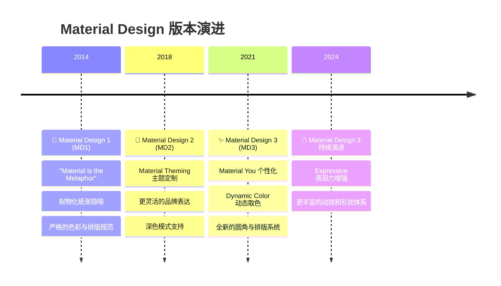
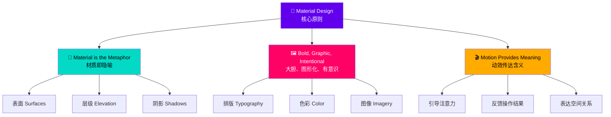
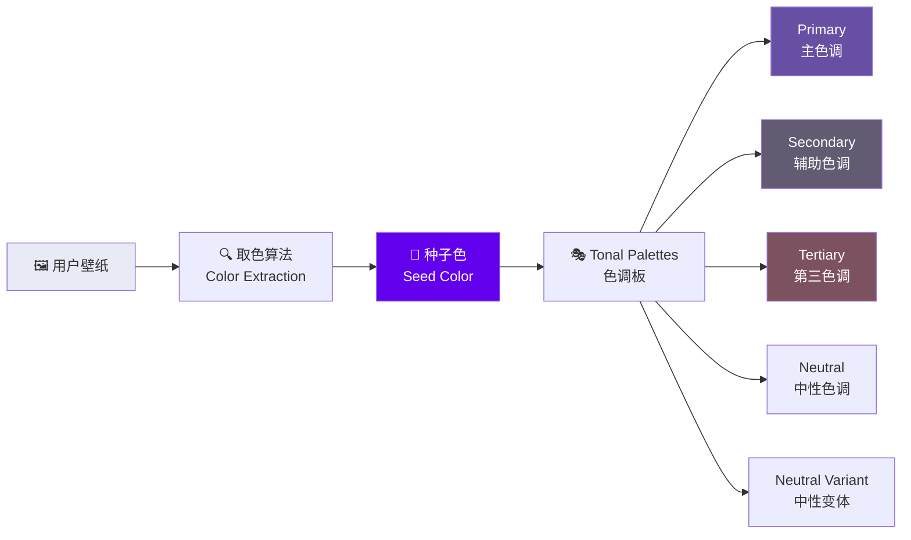
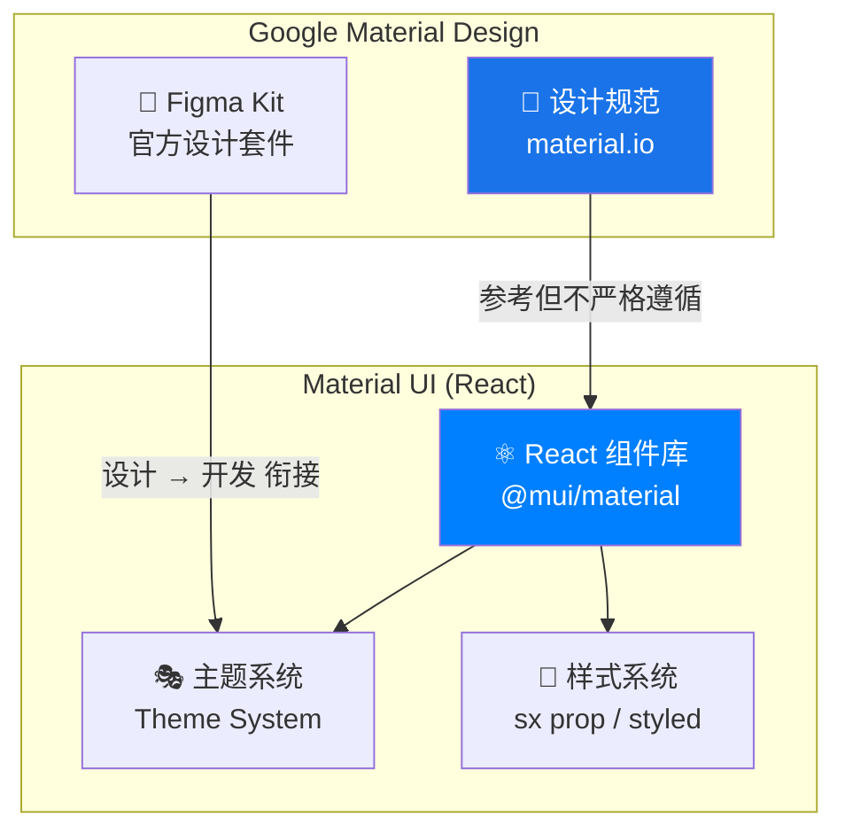
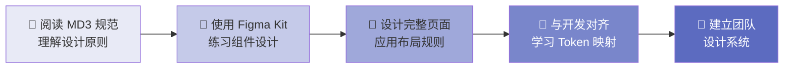
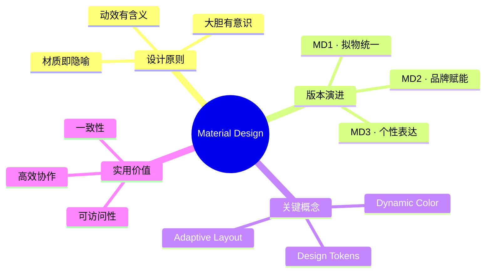

# 🎨 Material Design 设计语言

> **适用对象：** UI/UX 设计师 · **阅读时间：** 约 20 分钟
>
> 本教程帮助你理解 Google 的 Material Design 设计语言，以及 Material UI 如何将其落地为实用的 React 组件库。

---

## 📖 目录

1. [什么是 Material Design](#-什么是-material-design)
2. [演进历程：从 MD1 到 MD3](#-演进历程从-md1-到-md3)
3. [核心设计原则](#-核心设计原则)
4. [MD3 / Material You 关键概念](#-md3--material-you-关键概念)
5. [Material UI 与 Material Design 的关系](#-material-ui-与-material-design-的关系)
6. [设计师为什么需要理解 Material Design](#-设计师为什么需要理解-material-design)
7. [三大设计体系横向对比](#-三大设计体系横向对比)
8. [关键设计资源](#-关键设计资源)
9. [本章小结与实践建议](#-本章小结与实践建议)

---

## 🏛️ 什么是 Material Design

### 一句话定义

Material Design 是 Google 于 2014 年发布的**跨平台设计语言**，为 Android、iOS、Web 及桌面应用提供统一的视觉与交互规范。

### 类比理解 🏗️

> **Material Design 就像一套建筑风格指南——**
> 它规定了建筑应该使用什么材料（表面与阴影）、窗户应该什么样（组件规范）、空间如何流动（动效与布局），
> 但每栋建筑（应用）仍然可以拥有自己的个性与特色。
>
> 就像包豪斯风格下可以有各式各样的建筑，Material Design 下也能诞生风格各异的应用。

### 设计语言 vs 组件库

| 概念 | 说明 | 举例 |
|------|------|------|
| **Design Language（设计语言）** | 一套完整的设计哲学、原则与规范 | Material Design, Human Interface Guidelines |
| **Design System（设计系统）** | 基于设计语言的可复用组件、Token 和文档集合 | Material Design System |
| **Component Library（组件库）** | 设计系统的代码实现 | Material UI (React), Angular Material |

---

## 📅 演进历程：从 MD1 到 MD3



### MD1（2014）—— 奠基之作

- 🧱 **纸张隐喻：** 界面中的每个元素都像一张"纸"——有厚度、能投下阴影、能堆叠
- 🎯 **严格规范：** 统一的 8dp 网格、固定的色彩板、标准化的组件尺寸
- 📏 **设计初衷：** 解决 Android 生态碎片化的视觉不一致问题

### MD2（2018）—— 品牌赋能

- 🎨 **Material Theming：** 品牌可以自定义色彩、字体和形状
- 🔧 **灵活性提升：** 从"必须遵循"变为"推荐框架"
- 🌙 **深色模式：** 首次提供完善的 Dark Theme 规范

### MD3 / Material You（2021）—— 个性化

- 🌈 **Dynamic Color：** 从壁纸自动提取主题色
- 💫 **个人表达：** 更大的圆角、更柔和的色彩、更包容的设计
- 📱 **自适应布局：** 从手机到折叠屏到平板到桌面的流畅适配

---

## 🧭 核心设计原则

Material Design 建立在三个核心原则之上：



### 原则一：材质即隐喻 🧱

Material Design 将界面元素想象为**有物理属性的材质表面**：

- **表面（Surfaces）：** 每个 UI 元素都存在于一个"平面"上
- **层级（Elevation）：** 元素之间通过不同的"高度"来表示层级关系
- **阴影（Shadows）：** 阴影是层级的视觉暗示——越高的元素，阴影越大、越模糊

```
          ┌─────────────────────────────┐
          │                             │ ← Dialog（elevation: 24dp）
          │    🪟 弹窗/Dialog           │    最大阴影，最高层级
          │                             │
          └─────────────────────────────┘

     ┌──────────────────────────────────────┐
     │                                      │ ← App Bar（elevation: 4dp）
     │    📌 导航栏                          │    中等阴影
     │                                      │
     └──────────────────────────────────────┘

┌──────────────────────────────────────────────┐
│                                              │ ← Card（elevation: 1dp）
│    🃏 卡片内容                                │    轻微阴影
│                                              │
└──────────────────────────────────────────────┘

━━━━━━━━━━━━━━━━━━━━━━━━━━━━━━━━━━━━━━━━━━━━━━━ ← Background（elevation: 0dp）
                                                     无阴影，基础层
```

> 💡 **设计师要点：** 在设计稿中合理使用 elevation 可以让用户直觉地理解哪些元素"更重要"或"更临时"。

### 原则二：大胆、图形化、有意识 🖼️

- **排版（Typography）：** 大而有力的标题，清晰的层级结构
- **色彩（Color）：** 有意义的色彩使用——不是为了好看，而是为了**传达信息**
- **图像（Imagery）：** 精心挑选的图像，不是装饰，而是**内容的一部分**

> 💡 **设计师要点：** 每一个设计元素都应该有存在的理由。如果你不能解释为什么选择了这个颜色或这个字号——重新思考。

### 原则三：动效传达含义 🎬

Material Design 中的动效不是"花哨的装饰"，而是有功能价值的：

| 动效类型 | 作用 | 示例 |
|---------|------|------|
| **引导注意力** | 告诉用户"看这里" | FAB 的缩放出现 |
| **操作反馈** | 确认用户的操作已被接收 | 按钮的 Ripple 波纹效果 |
| **空间关系** | 展示元素从哪里来、到哪里去 | 页面之间的共享元素过渡 |
| **状态变化** | 平滑地展示状态改变 | Switch 开关的滑动动画 |
| **层级暗示** | 展示前后关系 | 底部抽屉的滑入/滑出 |

---

## ✨ MD3 / Material You 关键概念

### 1. Dynamic Color（动态取色）🌈

MD3 最革命性的特性——应用可以根据用户壁纸自动生成协调的配色方案：



> 💡 **设计师要点：** 动态取色意味着你的设计需要在**任意配色**下都能正常工作。这要求你的设计更加依赖"角色"而非"具体颜色"。

### 2. Personal Expression（个人表达）💫

MD3 鼓励更丰富的个性化：

- **更大的圆角：** 从 MD2 的 4dp 默认圆角变为更大、更柔和的圆角
- **更丰富的形状：** 不再只有矩形，还有切角、圆形等
- **更多留白：** 更宽松的间距让界面更"呼吸"

### 3. Adaptive Layouts（自适应布局）📐

MD3 为多设备世界提供了布局框架：

```
📱 手机（< 600dp）      📱 折叠屏（600-840dp）    💻 桌面（> 840dp）
┌──────────┐           ┌───────┬────────┐        ┌────┬───────────────┐
│          │           │       │        │        │    │               │
│  单栏    │           │ 导航  │  内容  │        │导航│    内容        │
│  布局    │           │  栏   │   区   │        │ 栏 │     区        │
│          │           │       │        │        │    │               │
│          │           │       │        │        │    │               │
└──────────┘           └───────┴────────┘        └────┴───────────────┘
  Bottom Nav              Navigation Rail           Navigation Drawer
```

---

## 🔗 Material UI 与 Material Design 的关系

### 不是 1:1 复制

Material UI（当前版本 v9.0.0-beta.0）并不是 Material Design 规范的逐像素复制，而是一个**实用主义的实现**：



### 关键差异

| 方面 | Material Design 规范 | Material UI 实现 |
|------|---------------------|-----------------|
| **设计忠实度** | 严格的像素级规范 | 实用优先，允许偏差 |
| **组件范围** | MD 规范定义的组件 | 额外增加了许多常用组件 |
| **主题能力** | Material Theming 指南 | 强大的 Theme 系统，超越 MD 规范 |
| **平台** | 跨平台通用 | Web 专注，React 生态 |
| **版本对应** | 当前主推 MD3 | 默认 MD2 风格，逐步支持 MD3 |
| **自定义程度** | 在规范框架内 | 高度自由，可完全覆盖 |

### 对设计师的意义

> 作为使用 Material UI 的团队中的设计师，你需要理解：
>
> 1. **Material Design 规范**是你的设计基础和灵感来源
> 2. **Material UI 的主题系统**是你与开发对齐的桥梁
> 3. 你可以**偏离规范**，但要有意识地、系统地偏离，而非随意为之

---

## 🎯 设计师为什么需要理解 Material Design

### 1. 一致性 🔄

Material Design 提供了经过验证的设计模式，避免"每个页面看起来像不同的应用"。

### 2. 内置可访问性 ♿

- 对比度标准已融入色彩系统
- 触摸目标尺寸已规范化
- 键盘导航模式已定义
- 屏幕阅读器支持已考虑

### 3. 设计-开发高效协作 🤝

当设计师和开发者都"说同一种语言"时：

```
❌ 设计师说："这个按钮用那个蓝色，大概 14 号字，圆角多一点"
✅ 设计师说："这是一个 contained Button，使用 primary 色，medium 尺寸"
```

### 4. 经过验证的设计模式 📊

Material Design 的每个组件和模式都经过 Google 在数十亿用户中的实践检验。

### 5. 降低决策疲劳 🧠

不必从零开始思考每一个间距、每一个圆角——Material Design 提供了合理的默认值，让你把精力集中在真正需要创造力的地方。

---

## 📊 三大设计体系横向对比

| 特性 | 🟢 Material Design (Google) | 🔵 Human Interface Guidelines (Apple) | 🟣 Fluent Design (Microsoft) |
|------|:---:|:---:|:---:|
| **发布年份** | 2014 | 2006（持续更新） | 2017 |
| **设计隐喻** | 纸张/材质 | 清晰/深度 | 光/深度/动效 |
| **核心理念** | 大胆、有意义 | 清晰、遵从、深度 | 流畅、自然 |
| **色彩策略** | 鲜明主色 + 辅色 | 系统调色板 + 动态颜色 | Accent Color 强调色 |
| **阴影使用** | 大量使用表达 Elevation | 谨慎使用，偏向模糊 | 适度使用，结合 Acrylic |
| **动效风格** | 物理隐喻（加速/减速） | 弹性、流畅 | 连接性动效 |
| **主要平台** | Android、Web、跨平台 | iOS、macOS | Windows、Web、跨平台 |
| **开源程度** | 高（规范 + 代码） | 中（规范公开） | 高（规范 + 代码） |
| **适合场景** | 跨平台应用、Web 应用 | Apple 生态应用 | Windows/企业应用 |

> 💡 **设计师要点：** 没有"最好"的设计体系。选择取决于目标平台、品牌调性和团队技术栈。Material Design 的优势在于**跨平台一致性**和**丰富的开源工具**。

---

## 📚 关键设计资源

### 官方资源

| 资源 | 链接 | 说明 |
|------|------|------|
| 📐 Material Design 3 官网 | [material.io](https://material.io) | 完整规范文档 |
| 🎨 Material Design Figma Kit | Figma Community 搜索 "Material 3 Design Kit" | 官方组件设计套件 |
| 🎨 Material Theme Builder | [material-foundation.github.io](https://material-foundation.github.io/material-theme-builder/) | 在线主题生成器 |
| 🔤 Google Fonts | [fonts.google.com](https://fonts.google.com) | 免费字体库 |
| 🎵 Material Symbols | [fonts.google.com/icons](https://fonts.google.com/icons) | 图标库 |

### Material UI 专属

| 资源 | 链接 | 说明 |
|------|------|------|
| 📖 Material UI 文档 | [mui.com](https://mui.com) | 组件文档与示例 |
| 🎨 Material UI Figma Kit | MUI Store | 与代码组件对齐的 Figma 设计套件 |
| 🧩 Template 模板 | [mui.com/material-ui/getting-started/templates](https://mui.com/material-ui/getting-started/templates/) | 预设页面模板 |

### 推荐学习路径



---

## ✅ 本章小结与实践建议

### 核心要点回顾



### 🎯 实践清单

- [ ] 浏览 [material.io](https://material.io)，通读 Material Design 3 的 **Style** 章节
- [ ] 在 Figma 中导入 Material 3 Design Kit，熟悉组件结构
- [ ] 用 Material Theme Builder 创建一个自定义配色方案
- [ ] 选择一个现有应用截图，尝试分析它是否遵循了 Material Design 原则
- [ ] 与你的开发同事讨论：项目中使用的 Material UI 版本和自定义程度

### 💬 与开发者沟通的关键术语

| 设计师语言 | 开发者语言（Material UI） |
|-----------|------------------------|
| "主色调" | `theme.palette.primary` |
| "卡片阴影层级" | `elevation` prop |
| "圆角大小" | `theme.shape.borderRadius` |
| "间距" | `theme.spacing()` |
| "深色模式" | `mode: 'dark'` |
| "字号层级" | Typography `variant` |

---

> 📌 **下一章预告：** [设计令牌（Design Tokens）](./02-design-tokens.md) —— 了解设计系统的"原子"如何在设计工具和代码之间建立桥梁。
