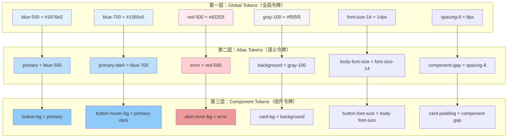
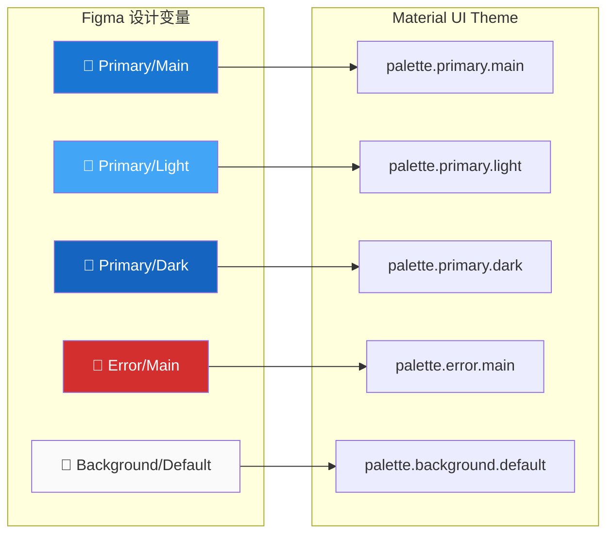
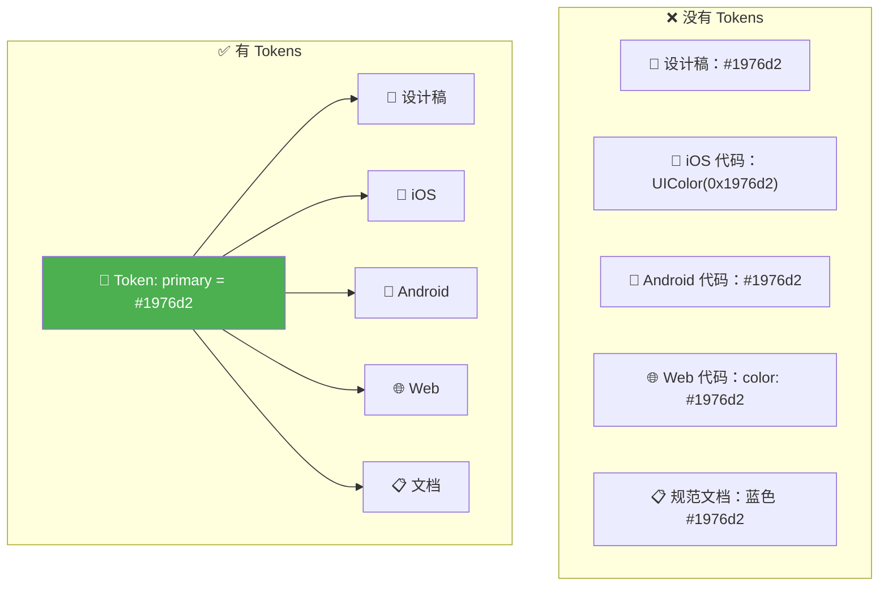
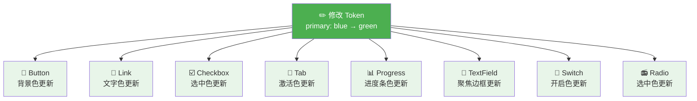
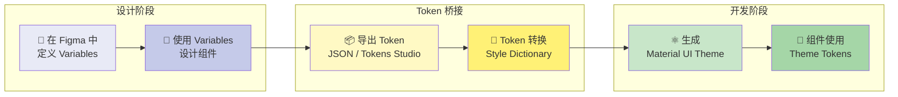
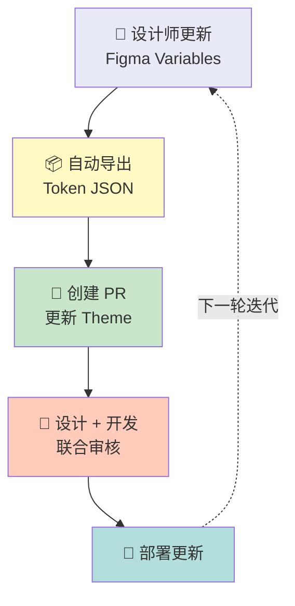
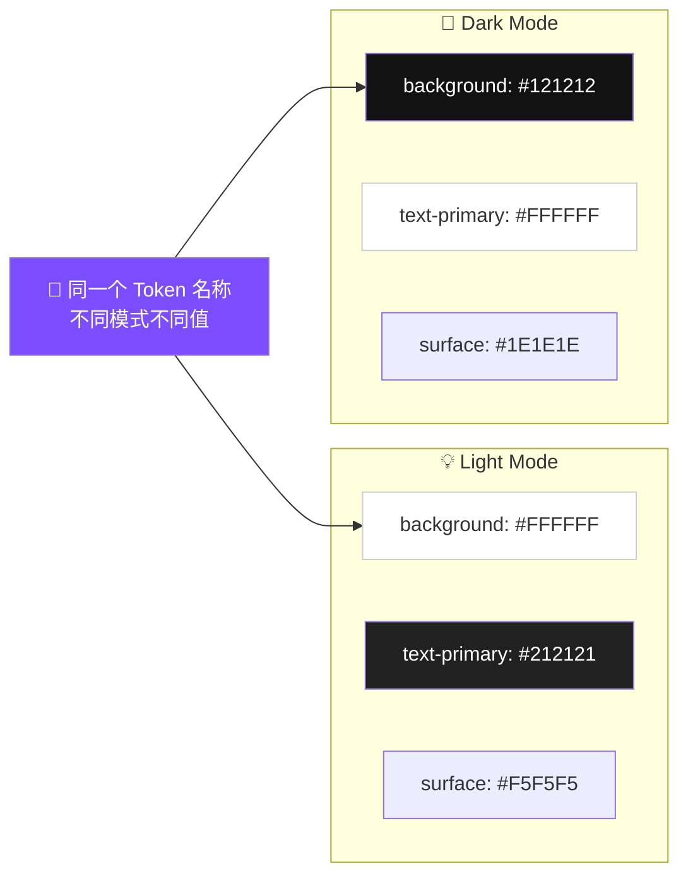
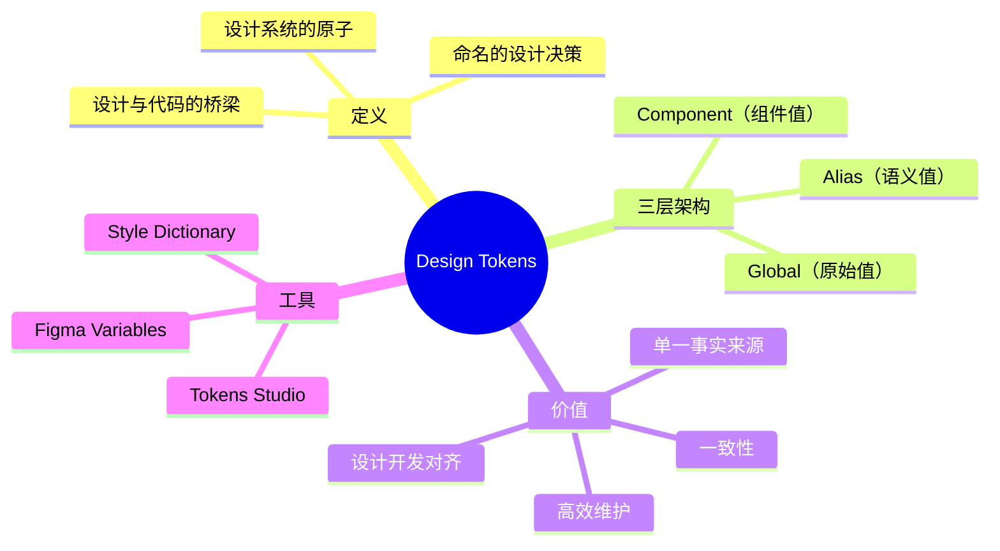

# 🧩 设计令牌（Design Tokens）

> **适用对象：** UI/UX 设计师 · **阅读时间：** 约 25 分钟
>
> Design Tokens 是现代设计系统的基石。本教程将帮助你理解什么是 Design Tokens，以及如何在 Material UI 项目中利用它们实现设计与开发的高效协作。

---

## 📖 目录

1. [什么是 Design Tokens](#-什么是-design-tokens)
2. [类比理解](#-类比理解)
3. [三层 Token 架构](#-三层-token-架构)
4. [Material UI 中的 Token 映射](#-material-ui-中的-token-映射)
5. [Token 格式与工具](#-token-格式与工具)
6. [Design Tokens 的核心价值](#-design-tokens-的核心价值)
7. [实战演练：品牌色替换](#-实战演练品牌色替换)
8. [在 Figma 中定义和管理 Tokens](#-在-figma-中定义和管理-tokens)
9. [Token 工作流：从设计到代码](#-token-工作流从设计到代码)
10. [常见问题与最佳实践](#-常见问题与最佳实践)
11. [本章小结](#-本章小结)

---

## 🔬 什么是 Design Tokens

### 定义

**Design Tokens** 是设计系统中最小的、可命名的设计决策单元。它们是设计属性（颜色、字号、间距、圆角等）的**命名抽象**，让设计值可以在设计工具和代码之间无缝传递。

```
传统做法：                          Token 做法：
"按钮背景用 #1976d2"              "按钮背景用 primary.main"
"标题用 24px"                      "标题用 typography.h4.fontSize"
"卡片圆角 8px"                     "卡片圆角用 shape.borderRadius"
```

### Token 不是什么

| ❌ Token 不是 | ✅ Token 是 |
|--------------|------------|
| 一个具体的颜色值 | 一个有语义名称的颜色引用 |
| 一次性的设计决策 | 可复用的设计决策 |
| 只在设计工具中存在 | 在设计和代码之间共享 |
| 静态的设计规范文档 | 活的、可同步的设计数据 |

---

## 💡 类比理解

### 类比一：电子表格中的变量 📊

> **Design Tokens 就像电子表格中的单元格引用——**
>
> 想象你有一个 Excel 表格，A1 单元格写着 `#1976d2`（蓝色）。
> 在 B1 到 B100 中，你不会直接写 `#1976d2`，而是写 `=A1`。
>
> 当老板说"我们换成绿色吧"，你只需要改 A1 的值，B1 到 B100 **自动更新**。
>
> Design Tokens 就是这个 A1——**改一处，处处生效。**

### 类比二：建筑材料清单 🏗️

```
传统做法（没有 Token）：
  "客厅墙壁用莫兰迪灰 NCS S 2005-R80B"
  "卧室墙壁用莫兰迪灰 NCS S 2005-R80B"
  "书房墙壁用莫兰迪灰 NCS S 2005-R80B"
  → 换色？找遍所有房间手动改。

Token 做法：
  材料清单中定义：wall-color = 莫兰迪灰 NCS S 2005-R80B
  所有房间引用：墙壁 = wall-color
  → 换色？改材料清单一行即可。
```

---

## 🏗️ 三层 Token 架构

Design Tokens 通常分为三个层级，从最底层（原始值）到最顶层（组件级使用）：



### 第一层：Global Tokens（全局令牌）🌍

**原始设计值**，没有任何语义含义——它们就是"原材料"。

| Token 名称 | 值 | 说明 |
|-----------|-----|------|
| `blue-50` | `#e3f2fd` | 最浅的蓝色 |
| `blue-500` | `#1976d2` | 标准蓝色 |
| `blue-900` | `#0d47a1` | 最深的蓝色 |
| `red-500` | `#d32f2f` | 标准红色 |
| `spacing-4` | `4px` | 4 像素间距 |
| `font-size-16` | `16px` | 16 像素字号 |

> 💡 这一层回答的问题是：**"我们有什么原材料？"**

### 第二层：Alias Tokens（语义令牌）🏷️

将原始值赋予**设计语义**——告诉你这个值的**用途**。

| Token 名称 | 引用 | 语义 |
|-----------|------|------|
| `color-primary` | `→ blue-500` | 品牌主色 |
| `color-error` | `→ red-500` | 错误状态色 |
| `color-background` | `→ gray-50` | 页面背景色 |
| `spacing-component` | `→ spacing-8` | 组件内间距 |
| `font-size-body` | `→ font-size-16` | 正文字号 |

> 💡 这一层回答的问题是：**"这个原材料用来做什么？"**

### 第三层：Component Tokens（组件令牌）🧱

最具体的层级——定义**特定组件**中**特定属性**的值。

| Token 名称 | 引用 | 说明 |
|-----------|------|------|
| `button-contained-bg` | `→ color-primary` | 实心按钮背景色 |
| `button-contained-text` | `→ color-on-primary` | 实心按钮文字色 |
| `card-border-radius` | `→ shape-medium` | 卡片圆角 |
| `input-padding-x` | `→ spacing-component` | 输入框水平内边距 |

> 💡 这一层回答的问题是：**"这个组件的这个部分长什么样？"**

### 三层架构的威力

```
场景：品牌从蓝色换成紫色

只需修改：blue-500 = #1976d2  →  purple-500 = #7b1fa2
         primary = blue-500   →  primary = purple-500

所有引用 primary 的组件自动更新！
  ✅ 按钮背景色
  ✅ 链接文字色
  ✅ 选中状态色
  ✅ 进度条颜色
  ✅ ... 数百个组件和状态
```

---

## 🎯 Material UI 中的 Token 映射

Material UI 的 Theme 系统本质上就是一套 Design Tokens。以下是 Figma 中的设计概念如何映射到 Material UI 的主题属性：

### 颜色 Tokens → `palette`



| 设计概念 | Material UI Theme 路径 | 默认值 |
|---------|----------------------|--------|
| 主色 | `palette.primary.main` | `#1976d2` |
| 主色（浅） | `palette.primary.light` | `#42a5f5` |
| 主色（深） | `palette.primary.dark` | `#1565c0` |
| 主色上的文字 | `palette.primary.contrastText` | `#fff` |
| 辅色 | `palette.secondary.main` | `#9c27b0` |
| 错误色 | `palette.error.main` | `#d32f2f` |
| 警告色 | `palette.warning.main` | `#ed6c02` |
| 信息色 | `palette.info.main` | `#0288d1` |
| 成功色 | `palette.success.main` | `#2e7d32` |
| 页面背景 | `palette.background.default` | `#fff` |
| 组件背景 | `palette.background.paper` | `#fff` |
| 主要文字 | `palette.text.primary` | `rgba(0,0,0,0.87)` |
| 次要文字 | `palette.text.secondary` | `rgba(0,0,0,0.6)` |

### 字体 Tokens → `typography`

| 设计概念 | Material UI Theme 路径 | 默认值 |
|---------|----------------------|--------|
| 主字体 | `typography.fontFamily` | `"Roboto", "Helvetica", "Arial", sans-serif` |
| H1 字号 | `typography.h1.fontSize` | `6rem (96px)` |
| Body1 字号 | `typography.body1.fontSize` | `1rem (16px)` |
| 字重（正常） | `typography.fontWeightRegular` | `400` |
| 字重（加粗） | `typography.fontWeightBold` | `700` |

### 间距 Tokens → `spacing`

| 设计概念 | Material UI Theme 路径 | 默认值 |
|---------|----------------------|--------|
| 基础间距单位 | `spacing(1)` | `8px` |
| 小间距 | `spacing(0.5)` | `4px` |
| 中间距 | `spacing(2)` | `16px` |
| 大间距 | `spacing(3)` | `24px` |
| 特大间距 | `spacing(4)` | `32px` |

### 形状 Tokens → `shape`

| 设计概念 | Material UI Theme 路径 | 默认值 |
|---------|----------------------|--------|
| 默认圆角 | `shape.borderRadius` | `4px` |

### 阴影 Tokens → `shadows`

| 设计概念 | Material UI Theme 路径 | 说明 |
|---------|----------------------|------|
| 无阴影 | `shadows[0]` | `none` |
| 卡片阴影 | `shadows[1]` | 轻微阴影 |
| 导航栏阴影 | `shadows[4]` | 中等阴影 |
| 弹窗阴影 | `shadows[24]` | 最大阴影 |

---

## 🛠️ Token 格式与工具

### 常见 Token 格式

Design Tokens 可以用不同的格式来表达和存储。以下是同一组 Tokens 在不同格式下的表现：

#### JSON 格式（W3C Design Tokens 标准）

```json
{
  "color": {
    "primary": {
      "$value": "#1976d2",
      "$type": "color",
      "$description": "品牌主色"
    },
    "error": {
      "$value": "#d32f2f",
      "$type": "color",
      "$description": "错误状态色"
    }
  },
  "spacing": {
    "sm": {
      "$value": "8px",
      "$type": "dimension"
    },
    "md": {
      "$value": "16px",
      "$type": "dimension"
    }
  }
}
```

#### CSS Custom Properties

```css
:root {
  /* 颜色 */
  --color-primary: #1976d2;
  --color-error: #d32f2f;

  /* 间距 */
  --spacing-sm: 8px;
  --spacing-md: 16px;

  /* 字体 */
  --font-family-primary: "Roboto", sans-serif;
  --font-size-body: 16px;
}
```

#### Figma Variables

Figma 的 Variables 功能（2023 年推出）让你可以在设计工具中直接定义和使用 Design Tokens：

```
Collection: Brand Colors
├── primary/main     → #1976d2
├── primary/light    → #42a5f5
├── primary/dark     → #1565c0
├── secondary/main   → #9c27b0
└── error/main       → #d32f2f

Collection: Spacing
├── xs   → 4
├── sm   → 8
├── md   → 16
├── lg   → 24
└── xl   → 32
```

### Token 管理工具

| 工具 | 类型 | 特点 |
|------|------|------|
| **Figma Variables** | 设计工具内置 | 与设计稿深度集成 |
| **Tokens Studio** | Figma 插件 | 支持 JSON 导出，Git 同步 |
| **Style Dictionary** | 构建工具 | Amazon 开源，多平台输出 |
| **Theo** | 构建工具 | Salesforce 开源 |
| **Specify** | SaaS 平台 | 设计 → 代码自动同步 |

---

## 💎 Design Tokens 的核心价值

### 1. 单一事实来源（Single Source of Truth）📌



### 2. 一致性（Consistency）🔗

所有平台、所有组件、所有页面使用**同一套值**。

### 3. 高效维护（Maintainability）⚡

品牌升级？主题切换？深色模式？——改 Token 定义，不改每个组件。

### 4. 设计-开发对齐（Design-Dev Alignment）🤝

设计师和开发者使用**相同的命名**，减少沟通歧义：

```
❌ "那个按钮的蓝色再深一点" → 深多少？哪个蓝？
✅ "按钮使用 primary.dark" → 开发者立即知道对应的值
```

### 5. 规模化（Scalability）📈

新增产品线、子品牌？创建新的 Token 集，而非从零开始。

---

## 🔄 实战演练：品牌色替换

### 场景

你的公司从蓝色品牌升级为绿色品牌。让我们看看有无 Token 的差异。

### ❌ 没有 Token 的痛苦

```
要做的事：
1. 找出设计稿中所有使用蓝色的地方 → 😱 300+ 个元素
2. 逐一替换颜色 → ⏰ 预估 2 天
3. 确认没有遗漏 → 😰 总会遗漏几个
4. 通知开发对应修改 → 📝 写一份长长的变更清单
5. 开发者在代码中逐一替换 → ⏰ 又是 2 天
6. QA 逐页检查 → 🔍 又是 1 天

总耗时：约 5 个工作日 😫
```

### ✅ 有 Token 的高效

```
要做的事：
1. 在 Token 定义中修改 primary 色值
   primary.main: #1976d2 → #2e7d32
   primary.light: #42a5f5 → #4caf50
   primary.dark: #1565c0 → #1b5e20

2. 更新 Figma Variables → 🎨 设计稿自动更新
3. 同步 Token 到代码 → 💻 代码自动更新
4. 快速验证 → ✅ 完成

总耗时：约 2 小时 🎉
```

### Token 级联效果图



---

## 🎨 在 Figma 中定义和管理 Tokens

### 使用 Figma Variables

Figma 的 Variables 功能是定义 Design Tokens 的最佳方式之一：

#### 步骤 1：创建 Variable Collections

```
📁 Collection: Primitives（原始值）
   ├── Colors/
   │   ├── blue-50    → #e3f2fd
   │   ├── blue-100   → #bbdefb
   │   ├── blue-500   → #1976d2
   │   ├── blue-700   → #1565c0
   │   ├── blue-900   → #0d47a1
   │   ├── red-500    → #d32f2f
   │   └── ...
   ├── Spacing/
   │   ├── 4          → 4
   │   ├── 8          → 8
   │   ├── 16         → 16
   │   └── ...
   └── Font Size/
       ├── 12         → 12
       ├── 14         → 14
       ├── 16         → 16
       └── ...
```

#### 步骤 2：创建语义 Variables

```
📁 Collection: Semantic（语义值）
   ├── Color/
   │   ├── primary         → {Primitives/Colors/blue-500}
   │   ├── primary-light   → {Primitives/Colors/blue-100}
   │   ├── primary-dark    → {Primitives/Colors/blue-700}
   │   ├── error           → {Primitives/Colors/red-500}
   │   ├── text-primary    → {Primitives/Colors/gray-900}
   │   └── background      → {Primitives/Colors/white}
   ├── Spacing/
   │   ├── xs              → {Primitives/Spacing/4}
   │   ├── sm              → {Primitives/Spacing/8}
   │   ├── md              → {Primitives/Spacing/16}
   │   └── lg              → {Primitives/Spacing/24}
   └── ...
```

#### 步骤 3：支持多模式（Light / Dark）

```
📁 Collection: Semantic
   Mode: Light                          Mode: Dark
   ├── background → white              ├── background → gray-900
   ├── text-primary → gray-900         ├── text-primary → white
   ├── surface → gray-50               ├── surface → gray-800
   └── ...                             └── ...
```

### 映射到 Material UI Theme

| Figma Variable 路径 | Material UI Theme 路径 |
|---------------------|----------------------|
| `Semantic/Color/primary` | `palette.primary.main` |
| `Semantic/Color/primary-light` | `palette.primary.light` |
| `Semantic/Color/primary-dark` | `palette.primary.dark` |
| `Semantic/Color/error` | `palette.error.main` |
| `Semantic/Color/background` | `palette.background.default` |
| `Semantic/Color/text-primary` | `palette.text.primary` |
| `Semantic/Spacing/sm` | `spacing(1)` = 8px |
| `Semantic/Spacing/md` | `spacing(2)` = 16px |

> 💡 **设计师要点：** 在 Figma 中使用与 Material UI Theme 相同的命名结构，可以让设计稿和代码之间的 Token 映射一目了然。

---

## 🔄 Token 工作流：从设计到代码



### 工作流详解

#### 阶段 1：设计定义 🎨

- 设计师在 Figma 中创建 Variable Collections
- 所有组件和页面设计使用 Variables 而非硬编码值
- 设计评审确认 Token 结构合理

#### 阶段 2：Token 导出 📦

- 使用 Tokens Studio 插件将 Figma Variables 导出为 JSON
- 或手动整理 Token 文档交付给开发者

#### 阶段 3：代码转换 🔄

- 开发者将 Token JSON 转换为 Material UI 的 `createTheme()` 配置
- 或使用 Style Dictionary 等工具自动生成

#### 阶段 4：组件使用 🧩

- Material UI 组件自动使用 Theme 中定义的 Tokens
- 自定义组件通过 `theme.palette.*`、`theme.spacing()` 等 API 引用 Tokens

### 持续同步



---

## ❓ 常见问题与最佳实践

### Token 命名规范

#### ✅ 好的命名

```
color-primary          → 语义清晰
color-error            → 描述用途
spacing-component-gap  → 具体使用场景
font-size-body         → 指明层级
```

#### ❌ 差的命名

```
blue                → 如果品牌色换了呢？
color-1             → 无语义
big-spacing         → "大"是多大？
my-font-size        → 无标准
```

### 命名规则总结

| 规则 | 说明 | 示例 |
|------|------|------|
| 使用语义名称 | 描述用途而非值 | `primary` 而非 `blue` |
| 使用连字符分隔 | 统一分隔符 | `font-size-body` |
| 分组一致 | 按类别组织 | `color-*`, `spacing-*`, `font-*` |
| 避免特定值引用 | 不用值做名字 | `spacing-sm` 而非 `spacing-8px` |

### Token 数量建议

```
🎯 建议的 Token 数量范围：

颜色 Tokens:    20-40 个（包括语义色和状态色）
间距 Tokens:    6-10 个（基于 8px 网格的等比数列）
字体 Tokens:    10-15 个（对应 Typography 层级）
圆角 Tokens:    3-5 个（小/中/大/全圆）
阴影 Tokens:    3-5 个（对应 Elevation 层级）
──────────────────────────
总计:           ~50-75 个 Tokens

⚠️ 太少（<30）→ 覆盖不了使用场景
⚠️ 太多（>150）→ 维护成本高，使用困难
```

### 深色模式 Token 策略



> 💡 **关键原则：** Token 名称不变，值随模式切换。设计师在 Figma 中为 Light 和 Dark 模式分别定义值，代码中通过 Theme 的 `mode` 自动切换。

---

## ✅ 本章小结

### 核心概念回顾



### 🎯 实践清单

- [ ] 在 Figma 中创建一个 Variable Collection，定义 5 个颜色 Token（primary、secondary、error、background、text）
- [ ] 为 Token 创建 Light 和 Dark 两个模式
- [ ] 制作一份 Token 映射表，将你的 Figma Variables 对应到 Material UI Theme 路径
- [ ] 练习"品牌色替换"——只修改 Global Token 的值，观察所有引用的组件如何自动更新
- [ ] 与开发同事讨论：项目中是否已经有 Token 系统？如何改进？

### 💬 与开发者沟通的关键术语

| 设计师说 | 开发者对应 |
|---------|-----------|
| "这个颜色用我们的 primary" | `theme.palette.primary.main` |
| "间距用标准的 sm" | `theme.spacing(1)` → 8px |
| "圆角用默认的" | `theme.shape.borderRadius` → 4px |
| "这是深色模式的值" | `mode: 'dark'` 下的 palette |

---

> 📌 **下一章预告：** [色彩系统](./03-color-system.md) —— 深入理解 Material UI 的完整色彩体系，学习如何设计出既美观又无障碍的配色方案。
