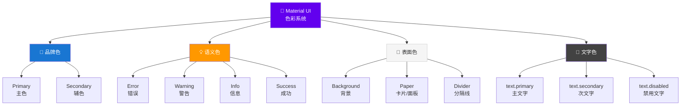
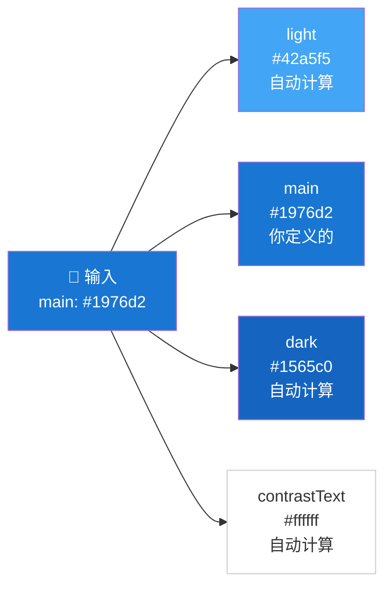
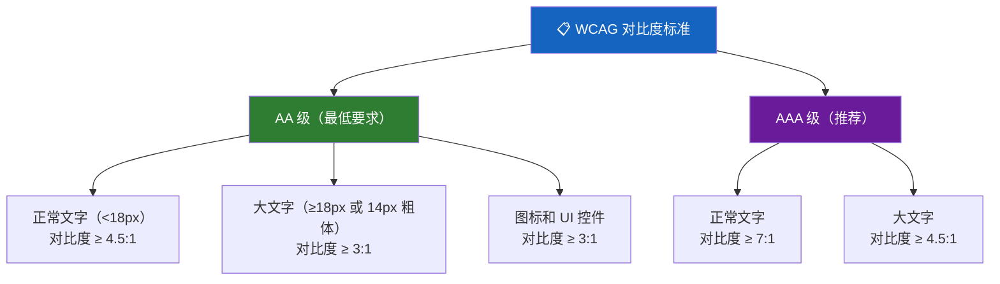
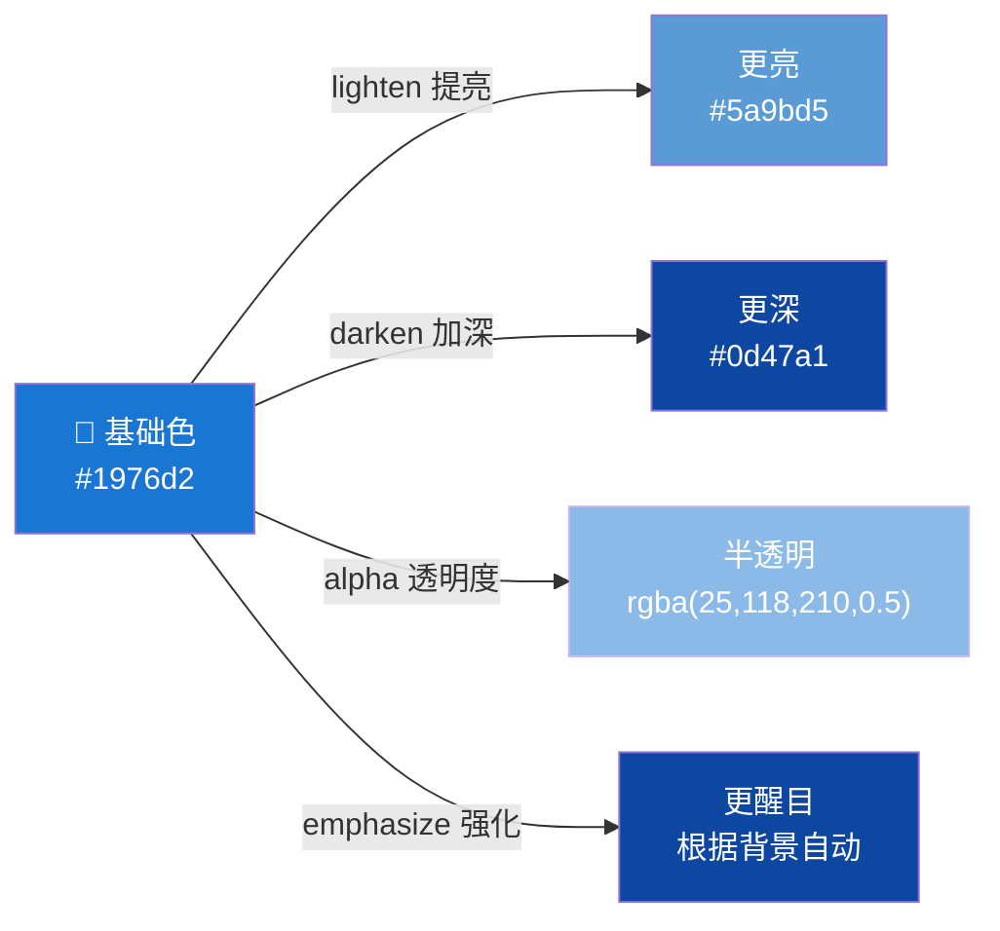
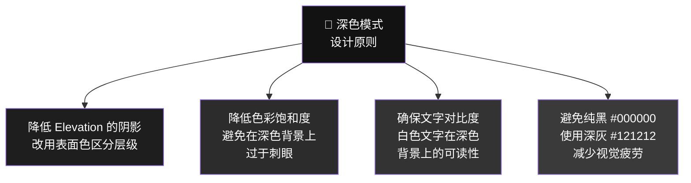
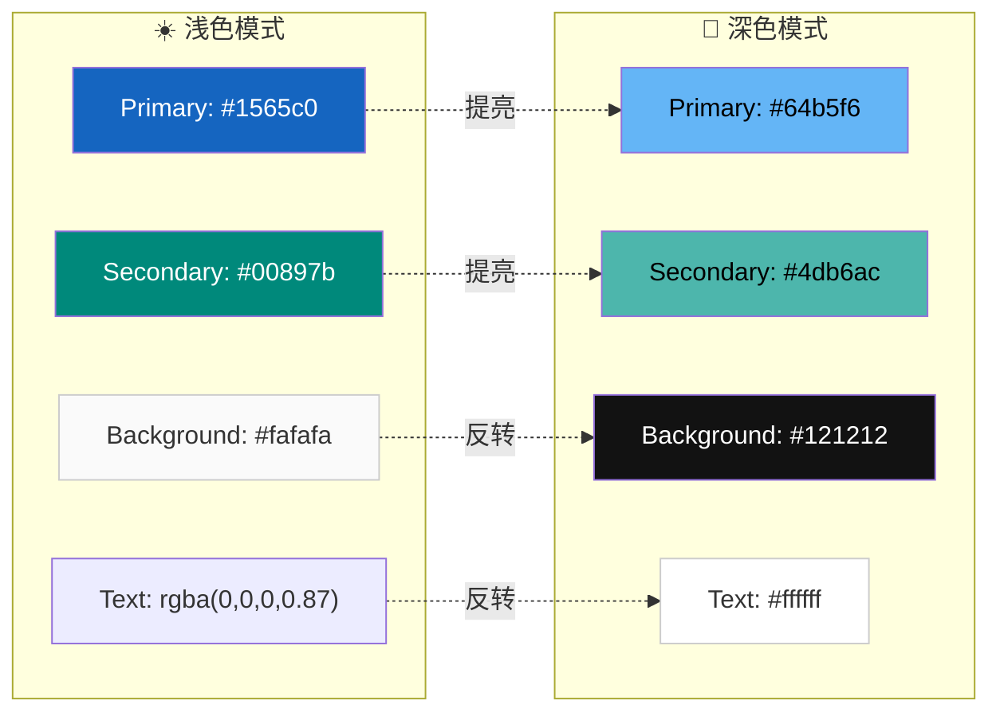
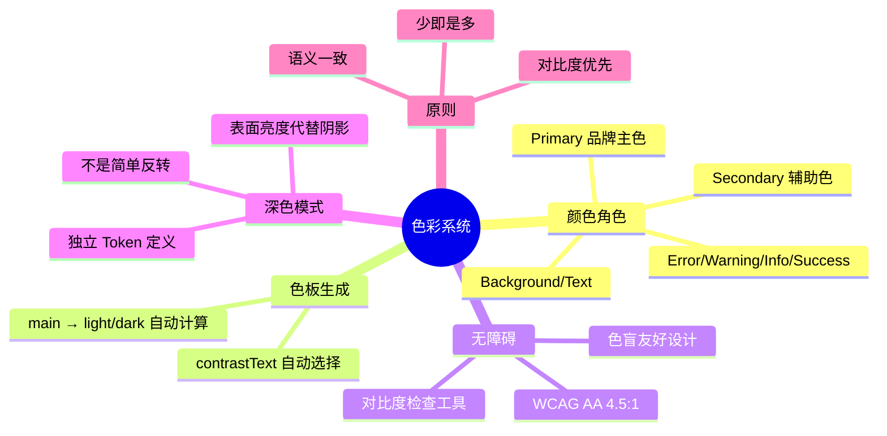

# 🎨 色彩系统

> **适用对象：** UI/UX 设计师 · **阅读时间：** 约 25 分钟
>
> 色彩是设计中最具情感力量的元素。本教程将帮助你全面理解 Material UI 的色彩系统，并学会设计出既美观又符合无障碍标准的配色方案。

---

## 📖 目录

1. [Material Design 色彩系统概览](#-material-design-色彩系统概览)
2. [Material UI 中的颜色角色](#-material-ui-中的颜色角色)
3. [色板自动生成](#-色板自动生成)
4. [无障碍与对比度](#-无障碍与对比度)
5. [色彩操作函数](#-色彩操作函数)
6. [深色模式设计](#-深色模式设计)
7. [实战练习：金融科技应用配色](#-实战练习金融科技应用配色)
8. [常见错误与避坑指南](#-常见错误与避坑指南)
9. [本章小结](#-本章小结)

---

## 🌈 Material Design 色彩系统概览

### 类比理解 👗

> **色彩系统就像你的衣橱——**
>
> 你有几套核心穿搭（Primary、Secondary），它们代表你的风格。
> 你还有一些配饰（Error、Warning、Success），在特定场合使用。
> 所有的单品都是协调搭配的，不会出现"红配绿"的灾难。
>
> 好的色彩系统就像一个精心策划的胶囊衣橱——**少而精，搭配自如。**

### 色彩系统的层次



---

## 🎭 Material UI 中的颜色角色

每种颜色在 Material UI 中都有明确的"角色"——它不仅仅是一个好看的颜色，而是承载着特定的**功能含义**。

### Primary（主色）—— 品牌身份 🏢

**用途：** 最重要的 UI 元素——主要按钮、活跃状态、关键操作入口

```
┌──────────────────────────────────────────────────────┐
│                                                      │
│  ┌──────────────────────────────────────┐            │
│  │ 🔵 App Bar                         │  ← Primary  │
│  └──────────────────────────────────────┘            │
│                                                      │
│  标题文字                                             │
│  正文内容正文内容正文内容正文内容                         │
│                                                      │
│  🔗 这是一个链接                         ← Primary    │
│                                                      │
│             ┌──────────────┐                         │
│             │ 🔵 提交表单  │             ← Primary    │
│             └──────────────┘                         │
│                                                      │
│  ☑️ 已选中的复选框                       ← Primary    │
│  ○ 未选中的单选框                                     │
│  ◉ 已选中的单选框                        ← Primary    │
│                                                      │
└──────────────────────────────────────────────────────┘
```

> 💡 **设计师要点：** Primary 色不宜使用过于极端的颜色（如纯黄色），因为它需要在白色和深色背景上都保证足够的对比度。

### Secondary（辅色）—— 品牌支撑 🎨

**用途：** 次要操作、辅助信息、补充品牌表达

| 使用场景 | 示例 |
|---------|------|
| 次要按钮 | "取消"按钮使用 Secondary |
| Floating Action Button | 可使用 Secondary 色 |
| 标签 / Chip | 次要分类标签 |
| 选中/高亮 | 辅助的选择状态 |

### Error（错误色）—— 红色警报 🔴

**用途：** 错误状态、删除操作、表单验证失败

**默认值：** `#d32f2f`（Material Red 700）

```
┌─────────────────────────────────────────┐
│                                         │
│  邮箱地址                                │
│  ┌───────────────────────────────────┐  │
│  │ abc@                      ← 红边框 │  │
│  └───────────────────────────────────┘  │
│  ⚠️ 请输入有效的邮箱地址      ← 红文字  │
│                                         │
│  ┌───────────────┐                      │
│  │ 🗑️ 删除账号  │  ← Error 色按钮      │
│  └───────────────┘                      │
│                                         │
└─────────────────────────────────────────┘
```

### Warning（警告色）—— 橙色提示 🟠

**用途：** 潜在问题提示、需要注意但不致命的信息

**默认值：** `#ed6c02`（Orange 800）

### Info（信息色）—— 蓝色通知 🔵

**用途：** 中性的信息提示、帮助文本、引导说明

**默认值：** `#0288d1`（Light Blue 700）

### Success（成功色）—— 绿色确认 🟢

**用途：** 操作成功反馈、验证通过、正面状态

**默认值：** `#2e7d32`（Green 800）

### 颜色角色使用指南

```mermaid
graph LR
    Action["用户操作"]

    Action -->|"主要操作"| P["🔵 Primary<br/>提交、确认、导航"]
    Action -->|"次要操作"| S["🟣 Secondary<br/>取消、替代选项"]
    Action -->|"危险操作"| E["🔴 Error<br/>删除、禁止"]

    Feedback["系统反馈"]

    Feedback -->|"出错了"| E2["🔴 Error<br/>验证失败、系统错误"]
    Feedback -->|"注意"| W["🟠 Warning<br/>潜在风险、限制"]
    Feedback -->|"参考"| I["🔵 Info<br/>提示、帮助"]
    Feedback -->|"完成"| Su["🟢 Success<br/>操作成功、验证通过"]

    style P fill:#1976d2,color:#fff
    style S fill:#9c27b0,color:#fff
    style E fill:#d32f2f,color:#fff
    style E2 fill:#d32f2f,color:#fff
    style W fill:#ed6c02,color:#fff
    style I fill:#0288d1,color:#fff
    style Su fill:#2e7d32,color:#fff
```



### 背景与文字色

| Token | 浅色模式 | 深色模式 | 用途 |
|-------|---------|---------|------|
| `background.default` | `#fff` | `#121212` | 页面背景 |
| `background.paper` | `#fff` | `#121212` | Card, Dialog 等容器 |
| `text.primary` | `rgba(0,0,0,0.87)` | `#fff` | 主要文字 |
| `text.secondary` | `rgba(0,0,0,0.6)` | `rgba(255,255,255,0.7)` | 次要文字 |
| `text.disabled` | `rgba(0,0,0,0.38)` | `rgba(255,255,255,0.5)` | 禁用状态文字 |
| `divider` | `rgba(0,0,0,0.12)` | `rgba(255,255,255,0.12)` | 分隔线 |

> 💡 **设计师要点：** 注意文字色使用了 `rgba` 透明度而非纯灰色。这是因为带透明度的黑色文字在任何浅色背景上都能保持和谐，比 `#757575` 这样的固定灰色更灵活。

---

## 🔧 色板自动生成

### 从一个颜色到一组色板

Material UI 的魔法之一：你只需要提供一个 `main` 色值，它就能自动生成完整的色板。



### 四个色阶说明

| 色阶 | 生成方式 | 用途 |
|------|---------|------|
| **light** | `main` 色提亮 | Hover 状态、浅色背景、辅助元素 |
| **main** | 你定义的 | 默认状态、主要使用 |
| **dark** | `main` 色加深 | Active/Pressed 状态、强调 |
| **contrastText** | 自动计算对比色 | 在该颜色背景上的文字颜色 |

### 按钮状态色示例

```
  Normal 正常       Hover 悬停        Active 按下       Disabled 禁用
┌──────────────┐  ┌──────────────┐  ┌──────────────┐  ┌──────────────┐
│              │  │              │  │              │  │              │
│   提交订单   │  │   提交订单   │  │   提交订单   │  │   提交订单   │
│              │  │              │  │              │  │              │
└──────────────┘  └──────────────┘  └──────────────┘  └──────────────┘
  main #1976d2      light 区域        dark #1565c0      action.disabled
  contrastText:     叠加透明层        contrastText:     灰色调
  白色文字          白色文字           白色文字          浅灰文字
```

### 自定义覆盖

虽然自动生成通常足够好，但设计师也可以手动指定每个色阶：

```
场景：自动生成的 light 太亮了

方案 A（自动）：只提供 main → light 自动计算
方案 B（手动）：提供 main + light + dark → 完全控制
```

> 💡 **设计师要点：** 在 Figma 中设计时，建议为每个颜色角色都定义 light / main / dark 三个值，即使 Material UI 可以自动生成。这样设计稿和最终代码的颜色会完全一致。

---

## ♿ 无障碍与对比度

### 为什么对比度如此重要

全球约有 **3 亿人**有某种形式的视觉障碍。即使是视力正常的人，在强光下看手机时也会面临对比度不足的问题。

> 💡 色彩无障碍不是"加分项"——它是**基本要求**。

### WCAG 对比度标准



### 对比度直观理解

```
对比度 1:1   （完全相同）    ██████████  → 不可读 ❌
对比度 2:1   （勉强可见）    ██████████  → 不推荐 ⚠️
对比度 3:1   （最低 UI）     ██████████  → 大文字/图标 OK ✅
对比度 4.5:1 （AA 标准）     ██████████  → 正常文字 OK ✅
对比度 7:1   （AAA 标准）    ██████████  → 完美 ✅✅
对比度 21:1  （黑白极限）    ██████████  → 最高对比度 ✅✅✅
```

### Material UI 如何自动处理

Material UI 的 `contrastText` 会自动选择黑色或白色文字：

```
背景色较深 → contrastText = 白色
  示例：primary.main (#1976d2) → contrastText (#ffffff)

背景色较浅 → contrastText = 黑色
  示例：warning.main (#ff9800) → contrastText (#000000)
```

### 常见对比度问题

```
❌ 常见问题：

1. 浅灰色文字在白色背景上     → 对比度 ≈ 2:1  ❌
   #bdbdbd on #ffffff

2. 亮黄色按钮上的白色文字     → 对比度 ≈ 1.5:1 ❌
   #ffffff on #ffeb3b

3. 浅蓝色链接在白色背景上     → 对比度 ≈ 2.8:1 ❌
   #64b5f6 on #ffffff

✅ 修正方案：

1. 使用 text.secondary           → 对比度 ≈ 4.6:1 ✅
   rgba(0,0,0,0.6) on #ffffff

2. 使用深色文字或深色背景        → 对比度 ≥ 4.5:1 ✅
   #000000 on #ffeb3b

3. 使用更深的蓝色                → 对比度 ≈ 4.7:1 ✅
   #1976d2 on #ffffff
```

### 对比度检查工具

| 工具 | 类型 | 特点 |
|------|------|------|
| **WebAIM Contrast Checker** | 在线工具 | 最常用，即时检查 |
| **Stark** | Figma 插件 | 在设计稿中直接检查 |
| **Color Review** | 在线工具 | 可视化对比度评级 |
| **Accessible Colors** | 在线工具 | 推荐符合标准的替代色 |
| **axe DevTools** | 浏览器插件 | 在已上线页面中检查 |

> 💡 **设计师要点：** 养成习惯——每次选择颜色时，立刻检查对比度。Figma 的 Stark 插件可以让这个过程毫不费力。

---

## 🎛️ 色彩操作函数

Material UI 提供了一组色彩操作函数。虽然设计师不需要写代码，但理解这些概念有助于与开发者沟通：

### 常用色彩操作



| 操作 | 设计师理解 | 使用场景 |
|------|-----------|---------|
| `lighten(color, 0.2)` | 向白色混合 20% | Hover 背景、浅色变体 |
| `darken(color, 0.2)` | 向黑色混合 20% | Pressed 状态、强调 |
| `alpha(color, 0.5)` | 设置 50% 透明度 | 遮罩层、禁用状态 |
| `emphasize(color, 0.15)` | 自动选择提亮或加深 | 在任何背景上增强可见度 |

### 在设计中的对应操作

在 Figma 中，你可以用以下方式模拟这些操作：

- **lighten：** 将颜色与白色叠加（降低不透明度）
- **darken：** 将颜色与黑色叠加（降低不透明度）
- **alpha：** 直接调整图层的不透明度
- **emphasize：** 根据背景明度，选择提亮或加深

---

## 🌙 深色模式设计

### 深色模式不仅仅是"反转颜色"

```
❌ 错误做法：把所有白色换成黑色，黑色换成白色
✅ 正确做法：重新定义每个颜色角色在深色环境下的表现
```

### 深色模式关键原则



### Material UI 深色模式色值

| Token | 浅色模式 | 深色模式 | 原因 |
|-------|---------|---------|------|
| `background.default` | `#fff` | `#121212` | 深灰比纯黑更舒适 |
| `background.paper` | `#fff` | `#121212` | 表面色 |
| `primary.main` | `#1976d2` | `#90caf9` | 深色背景需要更亮的主色 |
| `text.primary` | `rgba(0,0,0,0.87)` | `#fff` | 确保可读性 |
| `text.secondary` | `rgba(0,0,0,0.6)` | `rgba(255,255,255,0.7)` | 次要信息降低对比 |

### 深色模式中的 Elevation

在浅色模式中，Elevation 通过阴影表达。但在深色模式中，阴影几乎不可见。Material Design 用**表面色提亮**来代替：

```
浅色模式：                          深色模式：
Elevation 通过阴影表达               Elevation 通过亮度表达

 elevation: 0  ──  无阴影            elevation: 0  ──  #121212 (最暗)
 elevation: 1  ──  小阴影            elevation: 1  ──  #1e1e1e (稍亮)
 elevation: 4  ──  中阴影            elevation: 4  ──  #272727 (更亮)
 elevation: 8  ──  大阴影            elevation: 8  ──  #2c2c2c (再亮)
 elevation: 24 ──  最大阴影          elevation: 24 ──  #383838 (最亮)
```

> 💡 **设计师要点：** 设计深色模式时，不要依赖阴影来表达层级——使用不同的表面亮度。在 Figma 中为深色模式创建单独的 surface 色阶。

---

## 🏦 实战练习：金融科技应用配色

### 场景

你正在为一个金融科技（Fintech）应用设计配色方案。要求：
- 传达信任感和专业感
- 清晰的数据可视化
- 无障碍合规
- 支持深色模式

### 步骤 1：选择品牌色

```
金融行业常用色彩心理学：
🔵 蓝色 → 信任、稳定、安全感（银行最爱）
🟢 绿色 → 增长、财富、正面收益
🟣 紫色 → 创新、高端、科技感

我们选择：深蓝色作为 Primary
```

### 步骤 2：定义色彩角色

```
┌────────────────────────────────────────────────────────────┐
│                                                            │
│  🏦 FinTech App 配色方案                                    │
│                                                            │
│  ┌────────┐  ┌────────┐  ┌────────┐  ┌────────┐          │
│  │████████│  │████████│  │████████│  │████████│          │
│  │████████│  │████████│  │████████│  │████████│          │
│  │#1565c0│  │#00897b│  │#c62828│  │#f9a825│          │
│  │Primary │  │Secondary│ │ Error  │  │Warning │          │
│  │深蓝    │  │ 青绿   │  │ 深红   │  │ 琥珀   │          │
│  └────────┘  └────────┘  └────────┘  └────────┘          │
│                                                            │
│  ┌────────┐  ┌────────┐                                   │
│  │████████│  │████████│                                   │
│  │████████│  │████████│                                   │
│  │#0277bd│  │#2e7d32│                                   │
│  │  Info  │  │Success │                                   │
│  │ 蓝色   │  │ 深绿   │                                   │
│  └────────┘  └────────┘                                   │
│                                                            │
└────────────────────────────────────────────────────────────┘
```

### 步骤 3：验证对比度

| 组合 | 对比度 | AA 合规 | AAA 合规 |
|------|--------|---------|---------|
| Primary (#1565c0) + 白色文字 | 5.6:1 | ✅ | ❌ |
| Secondary (#00897b) + 白色文字 | 4.6:1 | ✅ | ❌ |
| Error (#c62828) + 白色文字 | 6.0:1 | ✅ | ❌ |
| Success (#2e7d32) + 白色文字 | 5.1:1 | ✅ | ❌ |
| text.primary + 白色背景 | 15.4:1 | ✅ | ✅ |

### 步骤 4：数据可视化色彩

```
收益/亏损场景：
  📈 上涨/盈利 → Success (#2e7d32)
  📉 下跌/亏损 → Error (#c62828)
  ➡️ 持平      → text.secondary

图表配色（确保色盲友好）：
  系列 1: #1565c0 (蓝)
  系列 2: #00897b (青)
  系列 3: #f9a825 (黄)
  系列 4: #c62828 (红)
  系列 5: #6a1b9a (紫)
```

### 步骤 5：深色模式适配



> 💡 **关键：** 深色模式不是简单反转——Primary 需要提亮以保证在深色背景上的对比度。

---

## ⚠️ 常见错误与避坑指南

### 错误 1：使用太多颜色 🌈

```
❌ 问题：
  "我们有 12 个功能模块，每个模块一个颜色！"
  → 用户无法建立色彩与功能的关联
  → 界面看起来像调色板爆炸

✅ 解决：
  坚持 2 个品牌色（Primary + Secondary）
  + 4 个语义色（Error + Warning + Info + Success）
  = 最多 6 个"有意义"的颜色

  功能模块可以通过图标、文字、布局来区分，不需要颜色来区分。
```

### 错误 2：对比度不足 👀

```
❌ 问题：
  设计师在精美的 Retina 显示器上看着很好
  但用户在阳光下看手机时完全看不清

✅ 解决：
  始终使用对比度检查工具
  至少达到 WCAG AA 标准（4.5:1）
  在设计评审中加入对比度检查环节
```

### 错误 3：语义不一致 🔀

```
❌ 问题：
  "删除"按钮有时用红色，有时用灰色
  成功提示有时绿色，有时蓝色

✅ 解决：
  建立色彩使用规则文档
  每种语义色只有一个用途
  Error = 永远是错误/危险
  Success = 永远是成功/确认
```

### 错误 4：忽略色盲用户 🎨

```
❌ 问题：
  仅用红/绿来区分"盈利"和"亏损"
  → 约 8% 的男性有红绿色盲

✅ 解决：
  颜色 + 图标/文字/形状的组合表达
  📈 +2.5%（绿色 + 上箭头 + 正号）
  📉 -1.3%（红色 + 下箭头 + 负号）
  → 即使看不到颜色，仍然可以理解含义
```

### 错误 5：深色模式直接反转 🔄

```
❌ 问题：
  浅色模式的 Primary (#1565c0) 直接用在深色模式
  → 在深色背景上对比度不足

✅ 解决：
  为深色模式创建独立的色彩 Token
  深色模式的 Primary 应该更亮（如 #64b5f6）
  单独验证每种模式下的对比度
```

---

## ✅ 本章小结

### 核心要点回顾



### 🎯 实践清单

- [ ] 为你的项目定义 Primary 和 Secondary 色，并检查它们在白色和深色背景上的对比度
- [ ] 使用 WebAIM Contrast Checker 验证所有颜色组合达到 WCAG AA 标准
- [ ] 安装 Figma 的 Stark 或类似插件，在设计中实时检查对比度
- [ ] 为你的配色方案创建深色模式版本
- [ ] 制作一份"色彩使用规范"——列出每种颜色的语义和使用场景
- [ ] 使用色盲模拟器（如 Figma 的 Color Blindness 插件）检查你的设计

### 💬 与开发者沟通的关键术语

| 设计师说 | 开发者对应 |
|---------|-----------|
| "用品牌主色" | `theme.palette.primary.main` |
| "错误状态用红色" | `theme.palette.error.main` |
| "文字用次要色" | `theme.palette.text.secondary` |
| "这个背景色" | `theme.palette.background.paper` |
| "需要白色文字" | `theme.palette.primary.contrastText` |
| "切到深色模式" | `mode: 'dark'` |

---

> 📌 **下一章预告：** [字体排版](./04-typography.md) —— 探索 Material UI 的 13 种排版层级，学习如何用文字创造清晰的视觉层次。
