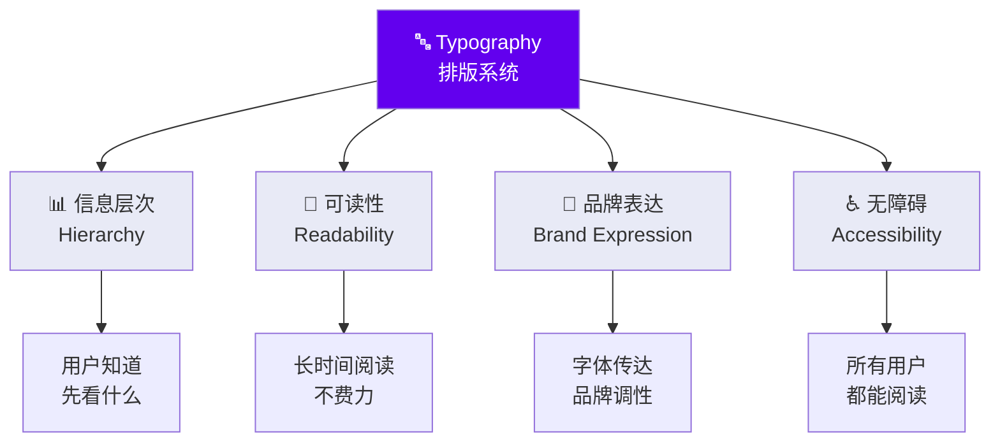
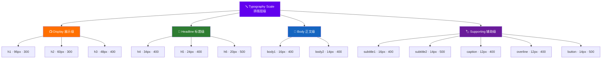
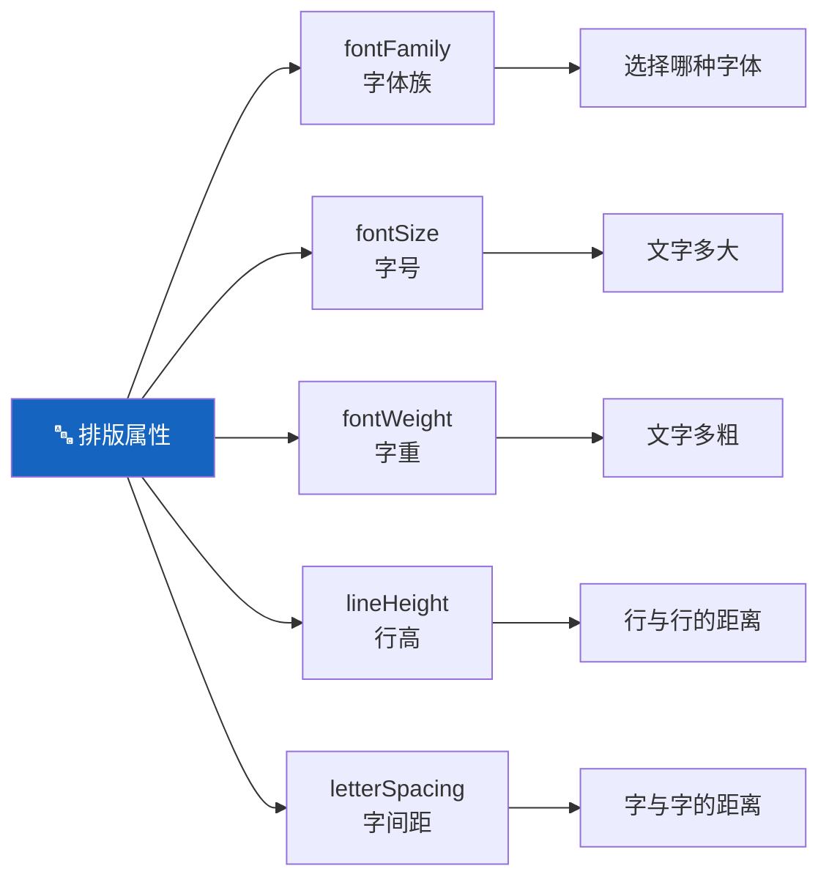
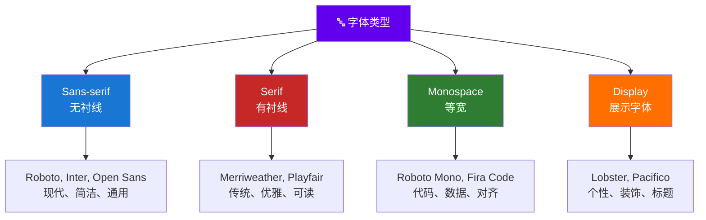
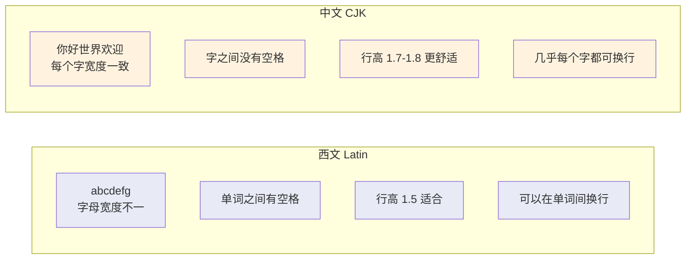
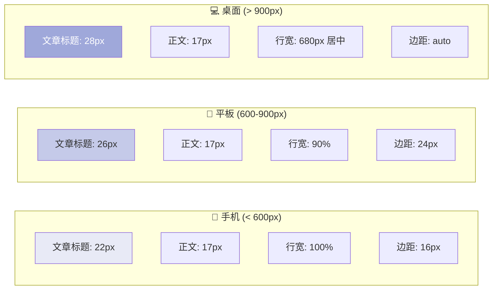
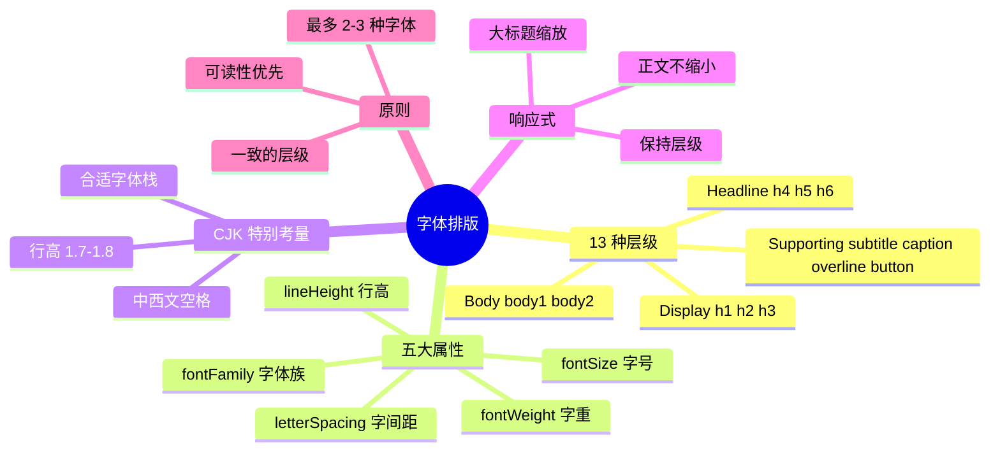

# 🔤 字体排版

> **适用对象：** UI/UX 设计师 · **阅读时间：** 约 25 分钟
>
> 字体排版是 UI 设计中最基础也最重要的技能之一。本教程将深入讲解 Material UI 的排版系统，帮助你用文字创造清晰、优美的信息层次。

---

## 📖 目录

1. [Typography 在 Material Design 中的角色](#-typography-在-material-design-中的角色)
2. [Material UI 的 13 种排版层级](#-material-ui-的-13-种排版层级)
3. [排版属性详解](#-排版属性详解)
4. [字体选择指南](#-字体选择指南)
5. [字体加载与性能](#-字体加载与性能)
6. [国际化排版：CJK 特别考量](#-国际化排版cjk-特别考量)
7. [响应式排版](#-响应式排版)
8. [实战练习：新闻阅读应用排版](#-实战练习新闻阅读应用排版)
9. [最佳实践与常见错误](#-最佳实践与常见错误)
10. [本章小结](#-本章小结)

---

## 🎵 Typography 在 Material Design 中的角色

### 类比理解 🎹

> **排版层级就像音乐中的音阶——**
>
> 每个音符（Typography variant）都有自己的音高（字号）和音色（字重），
> 它们各自有不同的情感表达力。
> 单独的音符没有意义，但按照规则组合在一起，就能创造出和谐的旋律。
>
> 一个好的排版系统，就像一首和谐的曲子——**每个层级都在正确的位置发声。**

### 排版的核心目的



---

## 📐 Material UI 的 13 种排版层级

Material UI 定义了 13 种 Typography variant，分为四组，覆盖了界面中几乎所有的文字场景。

### 总览图



### Display 展示级（h1 / h2 / h3）

**用途：** 大型展示文字，通常在页面最显眼的位置

```
┌────────────────────────────────────────────────────────────┐
│                                                            │
│                                                            │
│   Welcome to                           ← h1 (96px)        │
│   Material UI                          极大、极轻 (300)     │
│                                                            │
│                                                            │
│   构建美观的 React                      ← h2 (60px)        │
│   应用                                  大而轻 (300)        │
│                                                            │
│                                                            │
│   快速开始你的项目                       ← h3 (48px)        │
│                                         中大、正常 (400)    │
│                                                            │
└────────────────────────────────────────────────────────────┘
```

| Variant | 字号 | 字重 | 行高 | 字间距 | 适用场景 |
|---------|------|------|------|--------|---------|
| **h1** | 96px (6rem) | 300 (Light) | 1.167 | -1.5px | Hero 区域、启动画面 |
| **h2** | 60px (3.75rem) | 300 (Light) | 1.2 | -0.5px | 页面主标题、大型标题 |
| **h3** | 48px (3rem) | 400 (Regular) | 1.167 | 0 | 区域标题、特色内容 |

> 💡 **设计师要点：** Display 级别的文字很少出现在同一页面中——通常一个页面只用一个。字重较轻（300），因为在大字号下粗体会显得过于沉重。

### Headline 标题级（h4 / h5 / h6）

**用途：** 页面内的分区标题和模块标题

```
┌────────────────────────────────────────────────────────────┐
│                                                            │
│   产品特色                               ← h4 (34px)       │
│   ─────────────────────────                                │
│                                                            │
│   组件丰富                               ← h5 (24px)       │
│   Material UI 提供了 50+ 个组件...                          │
│                                                            │
│   高度可定制                              ← h5 (24px)       │
│   通过 Theme 系统自定义品牌...                              │
│                                                            │
│   快速开始                                ← h6 (20px)       │
│   安装只需要一行命令...                                     │
│                                                            │
└────────────────────────────────────────────────────────────┘
```

| Variant | 字号 | 字重 | 行高 | 字间距 | 适用场景 |
|---------|------|------|------|--------|---------|
| **h4** | 34px (2.125rem) | 400 (Regular) | 1.235 | 0.25px | 页面大标题 |
| **h5** | 24px (1.5rem) | 400 (Regular) | 1.334 | 0 | 模块标题、卡片标题 |
| **h6** | 20px (1.25rem) | 500 (Medium) | 1.6 | 0.15px | 小标题、对话框标题 |

### Body 正文级（body1 / body2）

**用途：** 文章正文、段落文字、描述文本

```
┌────────────────────────────────────────────────────────────┐
│                                                            │
│   Material UI 是一个全面的 React 组件库，实现了              │
│   Google 的 Material Design 设计系统。它提供了丰富           │
│   的预构建组件，可以直接在生产环境中使用。                     │
│                                                  ← body1   │
│                                                   (16px)   │
│                                                            │
│   最后更新：2024年1月15日 · 阅读时间 5 分钟                  │
│                                          ← body2 (14px)    │
│                                                            │
└────────────────────────────────────────────────────────────┘
```

| Variant | 字号 | 字重 | 行高 | 字间距 | 适用场景 |
|---------|------|------|------|--------|---------|
| **body1** | 16px (1rem) | 400 | 1.5 | 0.15px | 主要正文、段落 |
| **body2** | 14px (0.875rem) | 400 | 1.43 | 0.15px | 次要正文、辅助说明 |

> 💡 **设计师要点：** body1 (16px) 是 Web 的推荐最小正文字号。body2 (14px) 适合辅助信息，但不建议用于大段阅读。

### Supporting 辅助级

**用途：** 字幕、标签、图注、按钮文字等辅助信息

```
┌────────────────────────────────────────────────────────────┐
│                                                            │
│   OVERLINE · 最新发布                    ← overline (12px) │
│                                           全大写、字间距大  │
│   新版本亮点                              ← subtitle1      │
│   Material UI v9.0.0-beta.0 带来了...     (16px, 中等字重)  │
│                                                            │
│   次要标题信息                            ← subtitle2      │
│                                           (14px, 中等字重)  │
│                                                            │
│   图片来源：Material Design 官网           ← caption (12px) │
│                                                            │
│   ┌──────────────┐                                         │
│   │   了解更多   │                       ← button (14px)   │
│   └──────────────┘                        全大写、字间距大  │
│                                                            │
└────────────────────────────────────────────────────────────┘
```

| Variant | 字号 | 字重 | 行高 | 字间距 | 适用场景 |
|---------|------|------|------|--------|---------|
| **subtitle1** | 16px | 400 | 1.75 | 0.15px | 列表项标题、卡片副标题 |
| **subtitle2** | 14px | 500 | 1.57 | 0.1px | 较小的副标题 |
| **caption** | 12px | 400 | 1.66 | 0.4px | 图注、时间戳、辅助文字 |
| **overline** | 12px | 400 | 2.66 | 1px | 分类标签、栏目名 |
| **button** | 14px | 500 | 1.75 | 0.4px | 按钮文字 |

### 视觉层级对照

```
h1    ████████████████████████████████████████████████  96px  Light
h2    ██████████████████████████████                    60px  Light
h3    ████████████████████████                          48px  Regular
h4    █████████████████                                 34px  Regular
h5    ████████████                                      24px  Regular
h6    ██████████                                        20px  Medium
sub1  ████████                                          16px  Regular
body1 ████████                                          16px  Regular
sub2  ███████                                           14px  Medium
body2 ███████                                           14px  Regular
btn   ███████                                           14px  Medium
cap   ██████                                            12px  Regular
over  ██████                                            12px  Regular
```

---

## 🔧 排版属性详解

### 五大排版属性



### fontFamily（字体族）

```
Material UI 默认字体栈：
"Roboto", "Helvetica", "Arial", sans-serif

含义：优先使用 Roboto
     → 没有 Roboto 就用 Helvetica
     → 没有 Helvetica 就用 Arial
     → 都没有就用系统默认无衬线字体
```

### fontSize（字号）

Material UI 使用 `rem` 单位（相对于根元素字号）：

| rem 值 | 像素值（基于 16px 根字号） | 用途 |
|--------|--------------------------|------|
| 0.75rem | 12px | caption, overline |
| 0.875rem | 14px | body2, subtitle2, button |
| 1rem | 16px | body1, subtitle1 |
| 1.25rem | 20px | h6 |
| 1.5rem | 24px | h5 |
| 2.125rem | 34px | h4 |
| 3rem | 48px | h3 |
| 3.75rem | 60px | h2 |
| 6rem | 96px | h1 |

> 💡 **为什么用 rem？** rem 允许用户在浏览器中调整默认字号（无障碍需求），所有文字会按比例缩放，而 px 会忽略用户设置。

### fontWeight（字重）

```
100  Thin        ──────────  极细
200  Extra Light ──────────  特轻
300  Light       ──────────  轻    ← h1, h2 使用
400  Regular     ──────────  正常  ← 大多数 variant 使用
500  Medium      ──────────  中等  ← h6, subtitle2, button 使用
600  Semi Bold   ──────────  半粗
700  Bold        ──────────  粗体  ← 强调使用
800  Extra Bold  ──────────  特粗
900  Black       ──────────  最粗
```

### lineHeight（行高）

行高决定了文字行之间的垂直距离：

```
行高 1.0（紧凑）               行高 1.5（推荐正文）            行高 2.0（宽松）
┌──────────────────┐          ┌──────────────────┐          ┌──────────────────┐
│这是第一行文字     │          │这是第一行文字     │          │这是第一行文字     │
│这是第二行文字     │          │                  │          │                  │
│这是第三行文字     │          │这是第二行文字     │          │                  │
│这是第四行文字     │          │                  │          │这是第二行文字     │
│                  │          │这是第三行文字     │          │                  │
└──────────────────┘          │                  │          │                  │
 文字粘在一起！❌               │这是第四行文字     │          │这是第三行文字     │
                              └──────────────────┘          └──────────────────┘
                               刚好，舒适 ✅                  太松散 ⚠️
```

> 💡 **推荐行高：**
> - 标题：1.1 ~ 1.3（较紧凑，因为字号大）
> - 正文：1.4 ~ 1.6（适合阅读）
> - 辅助文字：1.5 ~ 1.7（小字需要更多呼吸空间）

### letterSpacing（字间距）

```
字间距 -1.5px:  Material Design   ← 大标题适度收紧，更紧凑
字间距 0px:     Material Design   ← 默认
字间距 0.5px:   M a t e r i a l   ← 小字号适度放宽
字间距 1px:     M a t e r i a l   ← overline 等标签用途
```

> 💡 **规律：** 字号越大，字间距越小（甚至为负）；字号越小，字间距越大。

---

## 🔤 字体选择指南

### 字体分类



### 推荐搭配方案

| 场景 | 标题字体 | 正文字体 | 调性 |
|------|---------|---------|------|
| **科技产品** | Inter | Inter | 简洁、现代 |
| **新闻媒体** | Playfair Display | Source Sans Pro | 经典、权威 |
| **金融应用** | Roboto | Roboto | 专业、稳健 |
| **创意平台** | Poppins | Open Sans | 活力、友好 |
| **企业后台** | Inter | Inter | 效率、清晰 |
| **教育产品** | Nunito | Lato | 亲和、温暖 |

### 字体搭配原则

```
✅ 好的搭配：
  1. 同一字体族的不同字重    → Roboto Light + Roboto Regular
  2. 衬线标题 + 无衬线正文  → Playfair Display + Source Sans Pro
  3. 最多 2-3 种字体        → 保持一致性

❌ 差的搭配：
  1. 超过 3 种字体          → 混乱，缺乏统一感
  2. 两种相似的无衬线字体    → 区分度不够
  3. 装饰字体用于正文        → 可读性灾难
```

---

## ⚡ 字体加载与性能

### 为什么设计师需要关心性能

字体文件通常较大，加载时间直接影响用户体验：

```
用户打开页面时的字体加载时序：

时间 →→→→→→→→→→→→→→→→→→→→→→→→→→→→→→→→→→→→→→

0s          0.5s         1s          1.5s         2s
|           |            |           |            |
▼ HTML 加载  ▼ CSS 解析    ▼ 字体请求   ▼ 字体下载中   ▼ 字体就绪
|           |            |           |            |
│  空白页面  │  系统字体   │  等待中...  │  等待中...   │ ✅ 品牌字体
│           │  作为后备   │  系统字体   │  系统字体    │    显示
│           │  显示       │  显示      │  显示       │
```

### 三种字体策略

| 策略 | 说明 | 体验 | 推荐场景 |
|------|------|------|---------|
| **System Fonts** | 使用操作系统内置字体 | ⚡ 即时显示，零加载 | 效率优先的工具型应用 |
| **Google Fonts** | 从 Google CDN 加载 | 🔄 可能有延迟，但可缓存 | 大多数 Web 应用 |
| **Self-hosted** | 从自己的服务器加载 | 🎯 可控但需优化 | 需要品牌一致性的应用 |

### System Font Stack

```
系统字体栈示例：
-apple-system, BlinkMacSystemFont, "Segoe UI", Roboto,
 "Helvetica Neue", Arial, sans-serif

含义：
  macOS/iOS     → San Francisco
  Android       → Roboto
  Windows       → Segoe UI
  其他          → Helvetica Neue 或 Arial
```

> 💡 **设计师要点：** System Font Stack 意味着你的设计在不同平台上会使用不同字体。如果品牌一致性是首要考虑——使用 Web Font。如果性能是首要考虑——使用 System Font。

---

## 🌏 国际化排版：CJK 特别考量

### 什么是 CJK

CJK 指中文（Chinese）、日文（Japanese）、韩文（Korean）三种东亚文字系统。它们与西文有显著不同的排版需求。

### CJK 排版关键差异



### 行高调整

```
英文正文（body1）：
lineHeight: 1.5

The quick brown fox jumps over
the lazy dog. This is a sample
paragraph in English.          ← 1.5 行高足够舒适


中文正文（body1）需要增加：
lineHeight: 1.7 ~ 1.8

这是一段中文示例文字。中文字符
比西文字母更加复杂，笔画更多，
因此需要更大的行间距来保证每一
行文字都能舒适阅读。            ← 1.7-1.8 行高更舒适
```

### 中西文混排

当中文和英文混合出现时，需要特别注意：

```
✅ 好的混排：
"Material UI 是一个优秀的 React 组件库，实现了 Google 的 Material Design。"
 → 中英文之间有空格
 → 字体栈中包含中文后备字体

❌ 差的混排：
"Material UI是一个优秀的React组件库"
 → 中英文之间没有空格，看起来拥挤
```

### CJK 字体推荐

| 语言 | 推荐字体 | 英文搭配 |
|------|---------|---------|
| 简体中文 | Noto Sans SC, PingFang SC, Microsoft YaHei | Roboto, Inter |
| 繁体中文 | Noto Sans TC, PingFang TC | Roboto, Inter |
| 日文 | Noto Sans JP, Hiragino Sans | Roboto, Inter |
| 韩文 | Noto Sans KR, Malgun Gothic | Roboto, Inter |

> 💡 **设计师要点：** 在字体栈中，将英文字体放在中文字体前面。这样英文字符使用英文字体渲染（更美观），中文字符 fallback 到中文字体。

---

## 📱 响应式排版

### 为什么需要响应式排版

在手机上，96px 的 h1 会占据整个屏幕。排版层级需要根据屏幕尺寸自适应缩放。

### Material UI 的 responsiveFontSizes 概念

```
┌──────────────────┐   ┌──────────────────────────┐   ┌──────────────────────────────────────┐
│ 📱 手机           │   │ 📱 平板                   │   │ 💻 桌面                               │
│ (< 600px)        │   │ (600-900px)              │   │ (> 900px)                            │
│                  │   │                          │   │                                      │
│ h1: 48px         │   │ h1: 72px                 │   │ h1: 96px                             │
│ h2: 36px         │   │ h2: 48px                 │   │ h2: 60px                             │
│ h3: 30px         │   │ h3: 39px                 │   │ h3: 48px                             │
│ h4: 24px         │   │ h4: 29px                 │   │ h4: 34px                             │
│ body1: 16px      │   │ body1: 16px              │   │ body1: 16px                          │
│ body2: 14px      │   │ body2: 14px              │   │ body2: 14px                          │
│                  │   │                          │   │                                      │
└──────────────────┘   └──────────────────────────┘   └──────────────────────────────────────┘

注意：body1 和 body2 在所有尺寸下保持不变——正文字号不应缩小！
```

### 响应式排版原则

| 原则 | 说明 |
|------|------|
| **大标题缩放** | h1-h3 在小屏上显著缩小 |
| **正文不缩小** | body1 (16px) 是最小正文字号，不应再小 |
| **保持层级** | 缩放后层级关系不变（h1 > h2 > h3 > ...） |
| **使用 rem** | 使用相对单位，让系统设置也能影响字号 |

---

## 📰 实战练习：新闻阅读应用排版

### 场景

你正在为一个中文新闻阅读应用设计排版方案。要求：
- 长文章阅读舒适
- 中西文混排支持
- 移动端和桌面端自适应
- 清晰的信息层次

### 步骤 1：选择字体

```
标题字体：Noto Serif SC（衬线，增加阅读沉浸感）
正文字体：Noto Sans SC（无衬线，长文阅读舒适）
英文后备：Source Serif Pro / Source Sans Pro
```

### 步骤 2：定义排版层级

```
新闻阅读应用排版层级：

┌────────────────────────────────────────────────────────────┐
│                                                            │
│  OVERLINE (12px, letter-spacing: 1px)                      │
│  时政 · 头条                                                │
│                                                            │
│  h4 (28px, Noto Serif SC, 600)                             │
│  国务院发布关于推进人工智能产业                                │
│  健康发展的指导意见                                          │
│                                                            │
│  subtitle1 (16px, text.secondary)                          │
│  2024年12月15日 · 新华社 · 阅读 8 分钟                       │
│                                                            │
│  ─────────────────────────────────────                      │
│                                                            │
│  body1 (17px, lineHeight: 1.8, Noto Sans SC)               │
│  据新华社北京12月15日电，国务院日前印发《关于                   │
│  推进人工智能产业健康发展的指导意见》（以下简称                 │
│  《意见》），从顶层设计的高度，明确了人工智能                   │
│  产业发展的总体要求、重点任务和保障措施。                      │
│                                                            │
│  h6 (20px, Noto Serif SC, 600)                             │
│  一、总体要求                                               │
│                                                            │
│  body1 (17px, lineHeight: 1.8)                             │
│  《意见》指出，人工智能是引领未来的战略性技术，               │
│  是新一轮科技革命和产业变革的重要驱动力量......               │
│                                                            │
│  caption (12px, text.secondary)                            │
│  责任编辑：张三 · 版权所有，转载请注明出处                    │
│                                                            │
└────────────────────────────────────────────────────────────┘
```

### 步骤 3：CJK 优化参数

| 属性 | 值 | 原因 |
|------|-----|------|
| 正文字号 | 17px | 比默认 16px 稍大，中文更舒适 |
| 正文行高 | 1.8 | 中文需要更大行高 |
| 段落间距 | 24px | 段落之间需要明显分隔 |
| 字间距 | 0 | 中文不需要额外字间距 |
| 最大行宽 | 40em (~680px) | 中文一行 35-40 字最佳 |

### 步骤 4：响应式调整



---

## 📏 最佳实践与常见错误

### ✅ 最佳实践

#### 1. 限制字体数量

```
推荐：1-2 种字体族
  ✅ 标题和正文使用同一字体族的不同字重
  ✅ 标题使用衬线字体 + 正文使用无衬线字体

不推荐：3 种以上字体族
  ❌ 标题、正文、按钮各用一种不同字体
```

#### 2. 维持一致的层级

```
✅ 整个应用中，h5 始终是 24px / 400
❌ 页面 A 的"标题"是 24px，页面 B 的"标题"是 28px
```

#### 3. 测试可读性

```
✅ 在真实设备上阅读一段 500 字的段落
✅ 在阳光下测试手机上的字号和对比度
✅ 请非设计师同事反馈阅读舒适度
```

#### 4. 使用排版层级来组织内容

```
✅ 用字号和字重建立信息层级
   h4 → 页面标题（最重要）
   h6 → 区域标题（次要）
   body1 → 正文内容
   caption → 辅助信息（最次要）

❌ 所有文字都是同一字号，用颜色或加粗来区分
```

### ❌ 常见错误

| 错误 | 问题 | 解决方案 |
|------|------|---------|
| 正文字号 < 14px | 可读性差，尤其移动端 | 最小 16px (body1) |
| 行高太低 (< 1.3) | 文字粘在一起 | 正文使用 1.5+ |
| 行宽太大 (> 80字/行) | 阅读时跟丢行 | 限制 60-75 字符/行 |
| 对比度不足 | 浅灰文字看不清 | 使用 text.primary / text.secondary |
| 层级不一致 | 同一含义的元素字号不同 | 严格使用 Typography variant |
| 字体太多 | 界面混乱 | 最多 2-3 种字体族 |

---

## ✅ 本章小结

### 核心要点回顾



### 🎯 实践清单

- [ ] 列出你的项目中使用的所有字号——是否超过 13 种？是否能映射到 Material UI 的 variant？
- [ ] 检查正文字号是否 ≥ 16px，行高是否 ≥ 1.5
- [ ] 如果产品需要支持中文——测试行高是否足够（≥ 1.7）
- [ ] 用"眯眼测试"检查页面层级：眯起眼睛看页面，能否区分标题和正文？
- [ ] 在 Figma 中创建 Typography Styles，与 Material UI 的 variant 一一对应
- [ ] 检查所有文字颜色的对比度是否达标

### 💬 与开发者沟通的关键术语

| 设计师说 | 开发者对应 |
|---------|-----------|
| "这是页面大标题" | `variant="h4"` |
| "这是正文" | `variant="body1"` |
| "这是辅助说明" | `variant="caption"` |
| "这是分类标签" | `variant="overline"` |
| "字号响应式缩放" | `responsiveFontSizes()` |
| "改成 Medium 字重" | `fontWeight: 500` |

---

> 📌 **下一章预告：** [间距与布局](./05-spacing-layout.md) —— 掌握 8px 网格系统和 Material UI 的布局组件，让你的设计整齐有序、呼吸自如。
