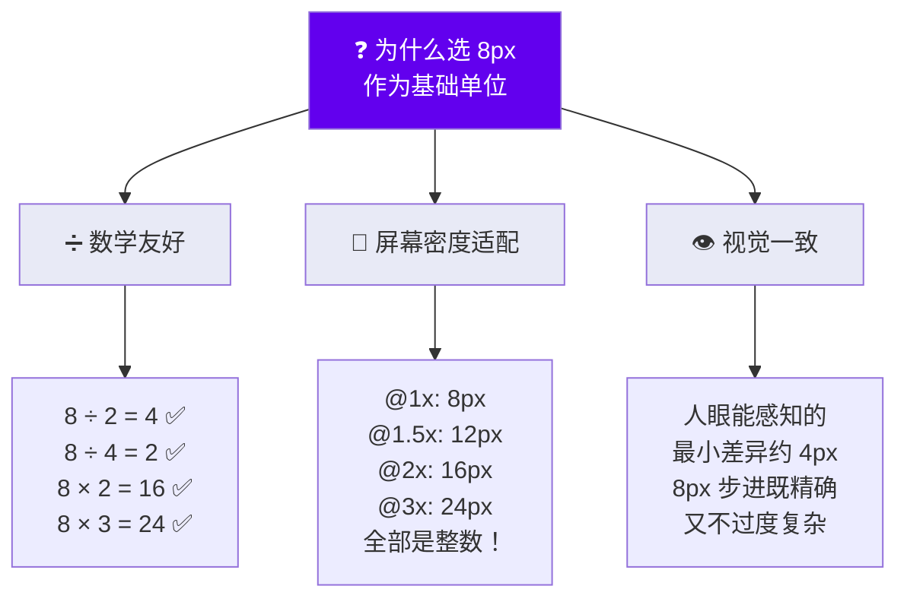
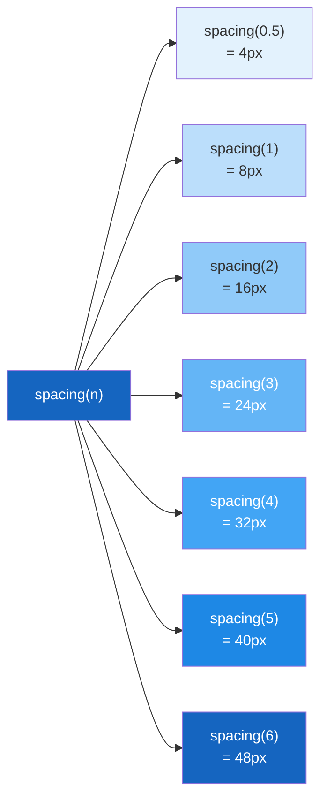
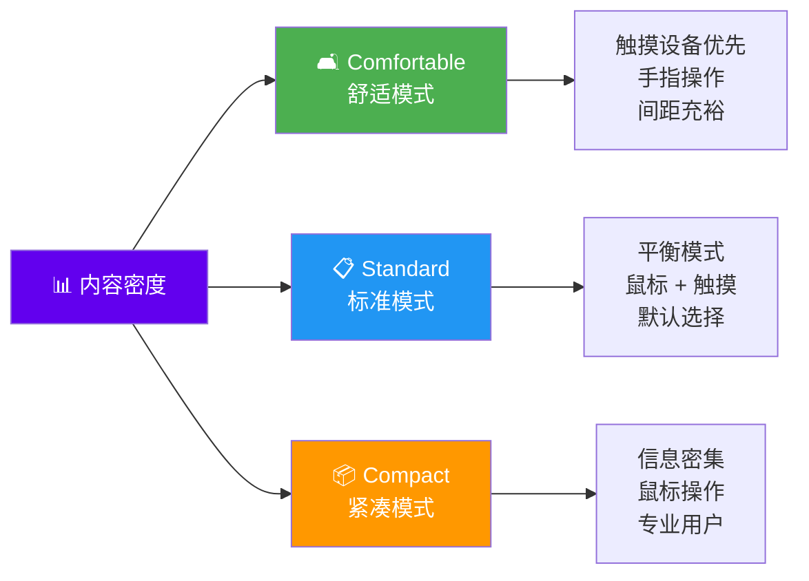
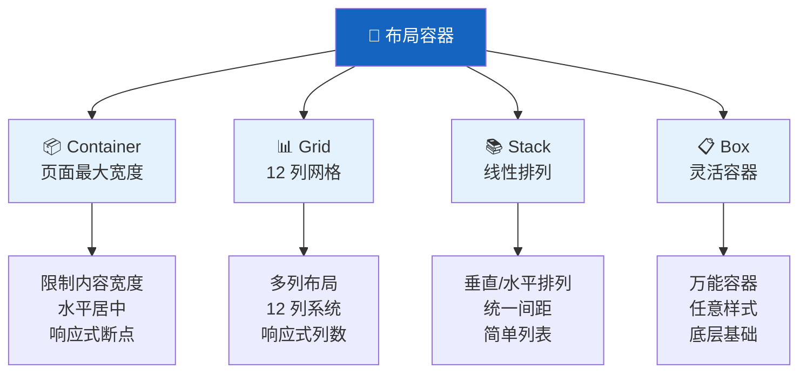
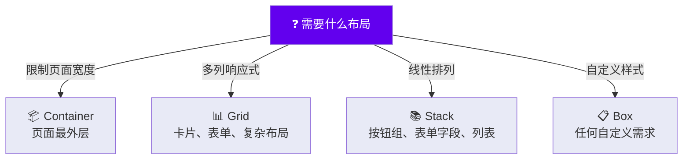
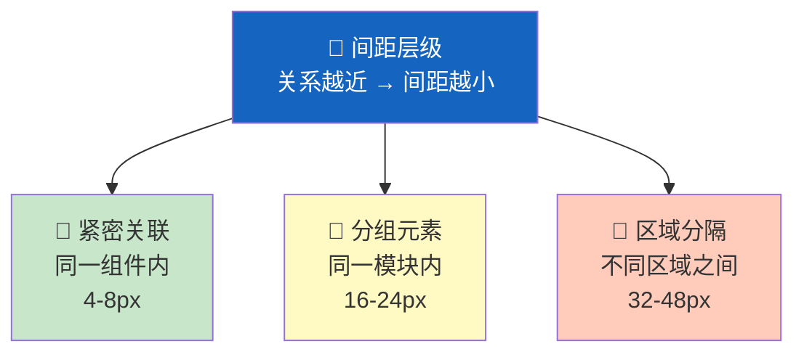
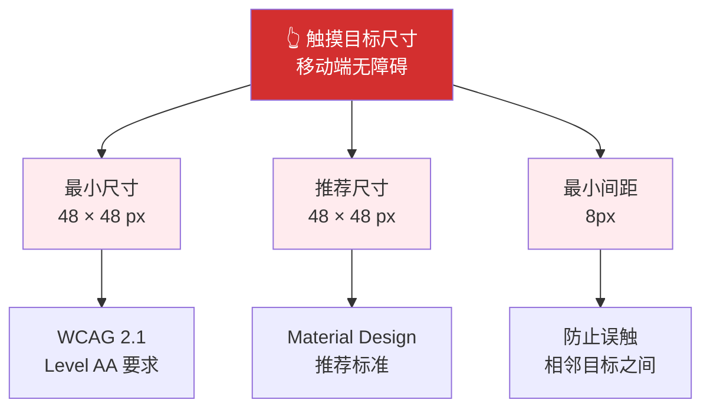
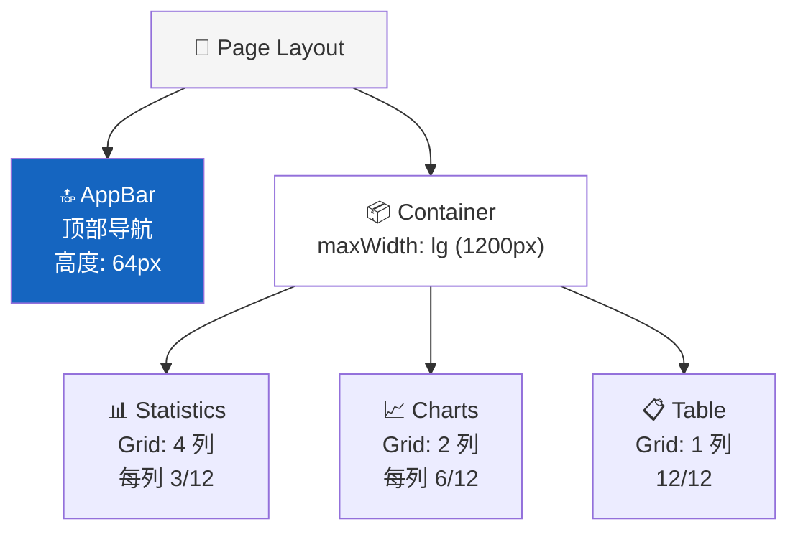
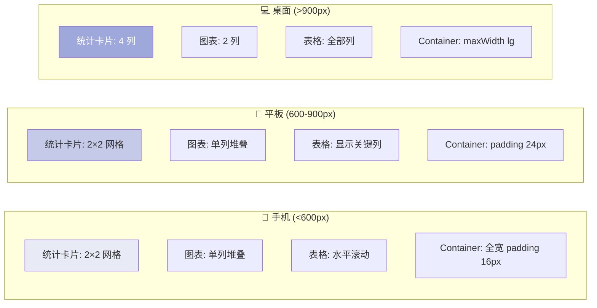
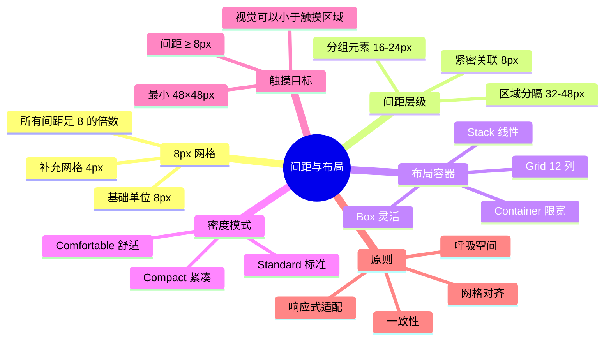

# 📐 间距与布局

> **适用对象：** UI/UX 设计师 · **阅读时间：** 约 25 分钟
>
> 间距和布局是 UI 设计中最容易被忽视却最影响品质感的要素。本教程将帮助你掌握 Material UI 的 8px 网格系统和布局组件，让你的设计整齐有序、呼吸自如。

---

## 📖 目录

1. [8px 网格系统](#-8px-网格系统)
2. [Material UI 间距体系](#-material-ui-间距体系)
3. [Padding vs Margin](#-padding-vs-margin)
4. [内容密度](#-内容密度)
5. [布局容器详解](#-布局容器详解)
6. [间距一致性规则](#-间距一致性规则)
7. [触摸目标与移动端无障碍](#-触摸目标与移动端无障碍)
8. [实战练习：Dashboard 布局设计](#-实战练习dashboard-布局设计)
9. [常见错误与避坑指南](#-常见错误与避坑指南)
10. [本章小结](#-本章小结)

---

## 📏 8px 网格系统

### 类比理解 📖

> **间距就像书页中的留白——**
>
> 页边距（margin）为内容框定边界；
> 行间距（line spacing）保证每行文字都能舒适阅读；
> 段落间距（paragraph spacing）把不同的想法分开。
>
> 没有留白的书页让人窒息，没有间距的界面同样让人疲惫。
> **间距不是"空"的——它在组织、引导、让设计"呼吸"。**

### 为什么是 8px



### 8px 网格可视化

```
8px 网格（每个 □ = 8px）：

□ □ □ □ □ □ □ □ □ □ □ □ □ □ □ □ □ □ □ □ □ □ □ □
□ □ □ □ □ □ □ □ □ □ □ □ □ □ □ □ □ □ □ □ □ □ □ □
□ □ ┌──────────────────────────────────────┐ □ □
□ □ │                                      │ □ □
□ □ │   ┌──────────┐    ┌──────────┐      │ □ □
□ □ │   │  Card A  │    │  Card B  │      │ □ □
□ □ │   │          │    │          │      │ □ □
□ □ │   └──────────┘    └──────────┘      │ □ □
□ □ │                                      │ □ □
□ □ │   ┌──────────────────────────┐      │ □ □
□ □ │   │  Card C                  │      │ □ □
□ □ │   │                          │      │ □ □
□ □ │   └──────────────────────────┘      │ □ □
□ □ │                                      │ □ □
□ □ └──────────────────────────────────────┘ □ □
□ □ □ □ □ □ □ □ □ □ □ □ □ □ □ □ □ □ □ □ □ □ □ □

所有元素的位置、大小、间距都对齐到 8px 网格上。
```

### 4px 补充网格

有时 8px 步进太粗——Material Design 允许使用 **4px 补充网格**：

```
可用的间距值：
4px  (0.5 × 8)  → 极小间距，如图标内间距
8px  (1 × 8)    → 小间距
12px (1.5 × 8)  → 中小间距
16px (2 × 8)    → 中间距
20px (2.5 × 8)  → 中大间距
24px (3 × 8)    → 大间距
32px (4 × 8)    → 特大间距
40px (5 × 8)    → 区域间距
48px (6 × 8)    → 大区域间距
```

> 💡 **设计师要点：** 在 Figma 中设置 8px 网格线（View → Layout Grid → 8px），所有元素对齐到网格上。

---

## 🔢 Material UI 间距体系

### spacing 函数

Material UI 的间距系统基于一个简单的乘法公式：

```
theme.spacing(n) = n × 8px
```



### 常用间距值与使用场景

| spacing 值 | 像素值 | 使用场景 | 示例 |
|-----------|--------|---------|------|
| `spacing(0.5)` | 4px | 极紧凑间距 | 图标与文字间距、密集数据 |
| `spacing(1)` | 8px | 相关元素间 | 按钮组内部间距、表单项标签 |
| `spacing(1.5)` | 12px | 小组件内部 | Chip 内边距、紧凑输入框 |
| `spacing(2)` | 16px | 标准内外间距 | 卡片内边距、列表项间距 |
| `spacing(3)` | 24px | 分组间距 | 表单分组间距、内容分区 |
| `spacing(4)` | 32px | 区域分隔 | 页面区域间距 |
| `spacing(5)` | 40px | 大区域间距 | 导航与内容之间 |
| `spacing(6)` | 48px | 页面级间距 | 页头/页脚与内容之间 |

### 间距可视化

```
spacing(0.5) = 4px   ╎
spacing(1)   = 8px   ╎╎
spacing(1.5) = 12px  ╎╎╎
spacing(2)   = 16px  ╎╎╎╎
spacing(3)   = 24px  ╎╎╎╎╎╎
spacing(4)   = 32px  ╎╎╎╎╎╎╎╎
spacing(5)   = 40px  ╎╎╎╎╎╎╎╎╎╎
spacing(6)   = 48px  ╎╎╎╎╎╎╎╎╎╎╎╎
```

---

## 🔲 Padding vs Margin

### 概念区分

```
                    ← Margin（外边距）→
              ┌─────────────────────────────┐
              │     ← Padding（内边距）→     │
              │   ┌─────────────────────┐   │
              │   │                     │   │
              │   │     Content         │   │
              │   │     内容区域         │   │
              │   │                     │   │
              │   └─────────────────────┘   │
              │                             │
              └─────────────────────────────┘

Padding = 组件内部的留白（内容到边框的距离）
Margin  = 组件外部的留白（组件到组件的距离）
```

### 类比理解 🖼️

```
Padding 就像画框内的衬纸 → 画作与画框之间的空间
Margin  就像画框之间的墙壁 → 画框与画框之间的空间

┌─────────────────┐           ┌─────────────────┐
│  ┌───────────┐  │           │  ┌───────────┐  │
│  │           │  │ ← Margin →│  │           │  │
│  │   画作    │  │           │  │   画作    │  │
│  │           │  │           │  │           │  │
│  └───────────┘  │           │  └───────────┘  │
│    ↑ Padding    │           │    ↑ Padding    │
└─────────────────┘           └─────────────────┘
```

### 实际应用

| 场景 | 使用 | 值 |
|------|------|-----|
| 卡片内容到卡片边缘 | Padding | 16px (spacing(2)) |
| 卡片与卡片之间 | Margin 或 Gap | 16px (spacing(2)) |
| 按钮文字到按钮边缘 | Padding | 8px 上下, 16px 左右 |
| 按钮与按钮之间 | Margin 或 Gap | 8px (spacing(1)) |
| 列表项内容到列表项边缘 | Padding | 16px 左右 |
| 列表项与列表项之间 | 无额外 Margin | 通过高度区分 |

---

## 📊 内容密度

### 三种密度模式

Material Design 定义了三种内容密度，适用于不同的使用场景：



### 密度对比

```
🛋️ Comfortable（舒适）      📋 Standard（标准）         📦 Compact（紧凑）

┌─────────────────┐       ┌─────────────────┐       ┌─────────────────┐
│                 │       │                 │       │ ○ 列表项 1      │
│  ○ 列表项 1    │       │  ○ 列表项 1    │       │ ○ 列表项 2      │
│                 │       │                 │       │ ○ 列表项 3      │
│                 │       │  ○ 列表项 2    │       │ ○ 列表项 4      │
│  ○ 列表项 2    │       │                 │       │ ○ 列表项 5      │
│                 │       │  ○ 列表项 3    │       │ ○ 列表项 6      │
│                 │       │                 │       │ ○ 列表项 7      │
│  ○ 列表项 3    │       │  ○ 列表项 4    │       │ ○ 列表项 8      │
│                 │       │                 │       │ ○ 列表项 9      │
│                 │       │                 │       │ ○ 列表项 10     │
└─────────────────┘       └─────────────────┘       └─────────────────┘
  显示 3 项                  显示 4 项                  显示 10 项
  行高 72px                  行高 56px                  行高 36px
  适合：消费级应用            适合：通用应用              适合：专业后台
```

### 密度参数对照

| 组件 | Comfortable | Standard (默认) | Compact |
|------|------------|-----------------|---------|
| **列表项高度** | 72px | 56px | 36px |
| **表格行高** | 68px | 52px | 36px |
| **按钮高度** | 42px | 36px | 28px |
| **输入框高度** | 56px | 40px | 32px |
| **图标按钮** | 48px | 40px | 28px |

> 💡 **设计师要点：** 密度选择取决于你的用户群体。面向普通用户的消费级应用用 Comfortable；面向专业用户的后台系统用 Compact；大多数情况下 Standard 是安全选择。

---

## 🧱 布局容器详解

Material UI 提供了四种主要的布局容器组件，每种解决不同的布局需求：

### 布局组件总览



### Container（容器）

**作用：** 限制页面内容的最大宽度，保持水平居中

```
浏览器窗口（全宽）
┌──────────────────────────────────────────────────────────────────┐
│                                                                  │
│    ┌──────────────────────────────────────────────────────┐      │
│    │                                                      │      │
│    │              Container (maxWidth: lg)                │      │
│    │              最大宽度 1200px                          │      │
│    │              内容区域                                 │      │
│    │                                                      │      │
│    └──────────────────────────────────────────────────────┘      │
│                                                                  │
└──────────────────────────────────────────────────────────────────┘
```

#### Container 断点

| 断点 | maxWidth | 适用场景 |
|------|----------|---------|
| `xs` | 444px | 极窄内容（阅读文章） |
| `sm` | 600px | 窄内容 |
| `md` | 900px | 中等宽度 |
| `lg` | 1200px | 标准页面（最常用） |
| `xl` | 1536px | 宽屏页面 |

### Grid（网格）

**作用：** 12 列网格系统，实现复杂的多列响应式布局

```
12 列网格系统：
│ 1 │ 2 │ 3 │ 4 │ 5 │ 6 │ 7 │ 8 │ 9 │10 │11 │12 │

常见分栏方式：

2 等分（各占 6 列）：
│█████████████████████│█████████████████████│

3 等分（各占 4 列）：
│█████████████│█████████████│█████████████│

侧边栏 + 主内容（3 + 9 列）：
│█████████│███████████████████████████████│

三段式（3 + 6 + 3 列）：
│█████████│██████████████████│█████████│
```

#### 响应式网格

```
💻 桌面（lg）：3 等分
┌──────────┬──────────┬──────────┐
│  Card 1  │  Card 2  │  Card 3  │
│  (4 列)  │  (4 列)  │  (4 列)  │
└──────────┴──────────┴──────────┘

📱 平板（md）：2 等分
┌───────────────┬───────────────┐
│    Card 1     │    Card 2     │
│    (6 列)     │    (6 列)     │
├───────────────┼───────────────┘
│    Card 3     │
│    (6 列)     │
└───────────────┘

📱 手机（xs）：单列
┌──────────────────────────────┐
│           Card 1             │
│           (12 列)            │
├──────────────────────────────┤
│           Card 2             │
│           (12 列)            │
├──────────────────────────────┤
│           Card 3             │
│           (12 列)            │
└──────────────────────────────┘
```

### Stack（堆叠）

**作用：** 在一个方向上（垂直或水平）排列子元素，统一间距

```
垂直 Stack (direction: column)        水平 Stack (direction: row)

┌──────────────────┐                 ┌──────┐  ┌──────┐  ┌──────┐
│     Item 1       │                 │      │  │      │  │      │
└──────────────────┘                 │ Item │  │ Item │  │ Item │
       ↕ gap: 16px                   │  1   │  │  2   │  │  3   │
┌──────────────────┐                 │      │  │      │  │      │
│     Item 2       │                 └──────┘  └──────┘  └──────┘
└──────────────────┘                    ↔ gap: 16px
       ↕ gap: 16px
┌──────────────────┐
│     Item 3       │
└──────────────────┘
```

### Box（盒子）

**作用：** 最基础的容器组件，可以应用任何样式

> 💡 Box 就像一张白纸——你可以把它变成任何你需要的容器。

### 选择哪个容器



---

## 📏 间距一致性规则

### 间距层级

Material Design 的间距遵循一个简单原则：**关系越紧密，间距越小**。



### 具体规则

```
规则 1：紧密关联的元素 → 8px
─────────────────────────────────────────
┌──────────────────────────────────────┐
│  🏷️ 标签名                          │ ← 标签与输入框：8px
│  ┌──────────────────────────────┐   │
│  │  输入内容...                  │   │
│  └──────────────────────────────┘   │
│  ⓘ 帮助提示文字                     │ ← 输入框与帮助文字：4px
└──────────────────────────────────────┘

规则 2：分组元素之间 → 16-24px
─────────────────────────────────────────
┌──────────────────────────────────────┐
│  用户名                              │
│  ┌──────────────────────────────┐   │
│  │  请输入用户名                 │   │
│  └──────────────────────────────┘   │
│                                      │ ← 表单字段之间：24px
│  密码                                │
│  ┌──────────────────────────────┐   │
│  │  请输入密码                   │   │
│  └──────────────────────────────┘   │
│                                      │ ← 表单字段之间：24px
│  确认密码                            │
│  ┌──────────────────────────────┐   │
│  │  再次输入密码                 │   │
│  └──────────────────────────────┘   │
└──────────────────────────────────────┘

规则 3：区域之间 → 32-48px
─────────────────────────────────────────
┌──────────────────────────────────────┐
│  📋 个人信息                          │
│  ...                                 │
│                                      │
│                                      │ ← 区域之间：32-48px
│                                      │
│  🔐 安全设置                          │
│  ...                                 │
└──────────────────────────────────────┘
```

### 格式塔原则（Gestalt Principles）

间距一致性的背后是心理学中的格式塔原则——**接近性原则**：

```
接近性原则：距离近的元素被感知为一组

✅ 正确的间距——清晰的分组：

  ○ 选项 A        ←┐
  ○ 选项 B        ←┤ 8px 间距 → 感知为一组
  ○ 选项 C        ←┘
                      ← 24px 间距 → 感知为分隔
  ○ 选项 D        ←┐
  ○ 选项 E        ←┤ 8px 间距 → 感知为另一组
  ○ 选项 F        ←┘


❌ 错误的间距——模糊的分组：

  ○ 选项 A        ←┐
                      ← 16px → 是一组还是两组？
  ○ 选项 B        ←┤
                      ← 16px → 无法区分
  ○ 选项 C        ←┘
                      ← 16px → 所有间距一样
  ○ 选项 D
```

---

## 👆 触摸目标与移动端无障碍

### 最小触摸目标



### 触摸目标可视化

```
最小触摸目标：48 × 48 px

  ┌────────────────────────────────────────┐
  │                                        │
  │    ┌──────────┐                        │
  │    │ 48 × 48  │  ← 这个区域至少       │
  │    │   px     │     48×48 像素         │
  │    └──────────┘                        │
  │                                        │
  │    视觉元素可以更小，但可触摸区域         │
  │    不能小于 48×48 px                    │
  │                                        │
  │    ┌──┐                                │
  │    │☆│ ← 图标视觉上只有 24px           │
  │    └──┘                                │
  │    但是↓                               │
  │    ┌──────────┐                        │
  │    │          │                        │
  │    │  ☆      │ ← 可触摸区域扩展到     │
  │    │          │    48×48 px            │
  │    └──────────┘                        │
  │                                        │
  └────────────────────────────────────────┘
```

### Material UI 组件默认触摸目标

| 组件 | 默认尺寸 | 是否满足 48px | 备注 |
|------|---------|-------------|------|
| Button (medium) | 36px 高 | ❌ 高度不足 | 加 padding 或使用 large |
| IconButton | 40px | ❌ 略小 | 默认有 padding 区域补足 |
| Checkbox | 42px (含 padding) | ❌ 略小 | 点击区域含周围 padding |
| Switch | 38px 高 | ❌ 高度不足 | 手指滑动区域更大 |
| Tab | 48px 高 | ✅ | 满足标准 |
| BottomNavigationAction | 56px | ✅ | 专为触摸设计 |
| ListItem | 48-72px | ✅ | 取决于密度 |

> 💡 **设计师要点：** 在移动端设计中，确保所有可交互元素的**实际可触摸区域**≥ 48×48px。视觉元素可以更小（如 24px 图标），但要通过 padding 扩展触摸区域。

---

## 📊 实战练习：Dashboard 布局设计

### 场景

你正在设计一个数据分析 Dashboard 页面，需要展示：
- 顶部导航栏
- 4 个数据统计卡片
- 2 个图表区域
- 1 个数据表格

### 步骤 1：确定布局结构



### 步骤 2：应用间距规则

```
┌──────────────────────────────────────────────────────────┐
│  🔝 AppBar (高度 64px)                                    │
│  Dashboard        搜索...                    👤 用户名   │
└──────────────────────────────────────────────────────────┘
                    ↕ 24px (spacing(3)) — AppBar 与内容之间
┌──────────────────────────────────────────────────────────┐
│  Container (maxWidth: lg, padding: 24px)                 │
│                                                          │
│  ┌────────┐ 16px ┌────────┐ 16px ┌────────┐ 16px ┌────────┐
│  │ 📊     │      │ 📊     │      │ 📊     │      │ 📊     │
│  │ 总用户 │      │ 活跃   │      │ 收入   │      │ 转化率 │
│  │ 12,450 │      │ 8,320  │      │ ¥45.2M │      │ 3.2%  │
│  │ ↑12%   │      │ ↑5.8%  │      │ ↑22%   │      │ ↓0.5% │
│  └────────┘      └────────┘      └────────┘      └────────┘
│              ↕ 24px (spacing(3)) — 统计卡片与图表之间
│  ┌────────────────────────┐ 16px ┌────────────────────────┐
│  │ 📈 用户增长趋势         │      │ 📊 收入分布             │
│  │                        │      │                        │
│  │     /\    /\           │      │  ████                  │
│  │    /  \  /  \          │      │  ██████                │
│  │   /    \/    \         │      │  ████████              │
│  │  /            \        │      │  ██████████            │
│  │                        │      │                        │
│  └────────────────────────┘      └────────────────────────┘
│              ↕ 24px (spacing(3)) — 图表与表格之间
│  ┌──────────────────────────────────────────────────────┐
│  │ 📋 最近订单                                          │
│  ├──────────┬──────────┬──────────┬─────────┬──────────┤
│  │ 订单号   │ 客户     │ 金额     │ 状态    │ 日期      │
│  ├──────────┼──────────┼──────────┼─────────┼──────────┤
│  │ #12345  │ 张三     │ ¥2,450   │ ✅ 完成 │ 12/15    │
│  ├──────────┼──────────┼──────────┼─────────┼──────────┤
│  │ #12344  │ 李四     │ ¥1,890   │ 🔄 处理 │ 12/14    │
│  └──────────┴──────────┴──────────┴─────────┴──────────┘
│                                                          │
└──────────────────────────────────────────────────────────┘
```

### 步骤 3：标注间距规格

| 位置 | 间距值 | spacing 函数 | 原因 |
|------|--------|-------------|------|
| AppBar 与内容 | 24px | `spacing(3)` | 主区域分隔 |
| Container 内边距 | 24px | `spacing(3)` | 内容与页边的呼吸空间 |
| 统计卡片之间 | 16px | `spacing(2)` | 同级元素间距 |
| 统计与图表之间 | 24px | `spacing(3)` | 区域分隔 |
| 图表之间 | 16px | `spacing(2)` | 同级元素间距 |
| 图表与表格之间 | 24px | `spacing(3)` | 区域分隔 |
| 卡片内边距 | 16px | `spacing(2)` | 卡片内容呼吸 |
| 表格行高 | 52px | Standard 密度 | 可扫描性 |

### 步骤 4：响应式适配



---

## ⚠️ 常见错误与避坑指南

### 错误 1：间距不一致 📐

```
❌ 问题：
  卡片 A 与卡片 B 之间 12px
  卡片 B 与卡片 C 之间 16px
  卡片 C 与卡片 D 之间 20px
  → 看起来"差不多"，但整体不整齐

✅ 解决：
  严格使用 spacing 系统
  同级元素之间始终 spacing(2) = 16px
  不要"差不多"——要精确！
```

### 错误 2：间距太紧凑 😰

```
❌ 问题：
  所有间距都用 8px
  元素挤在一起，没有呼吸空间
  → 界面看起来拥挤、压抑

✅ 解决：
  根据元素关系使用不同间距：
  紧密关联 → 8px
  同组元素 → 16px
  不同区域 → 24-48px
```

### 错误 3：间距太松散 🌊

```
❌ 问题：
  所有间距都用 32-48px
  大量空白，内容很少
  → 用户需要大量滚动才能看到信息

✅ 解决：
  只在区域分隔处使用大间距
  组内元素保持紧凑
  让信息密度与用户场景匹配
```

### 错误 4：忽略触摸目标 👆

```
❌ 问题：
  设计稿中的"关闭"按钮只有 24×24px
  在手机上几乎不可能精确点击

✅ 解决：
  所有可交互元素至少 48×48px 的触摸区域
  即使视觉上是小图标，也要扩大可点击区域
```

### 错误 5：不对齐到网格 📊

```
❌ 问题：
  元素位置是 13px、27px、35px...
  → 看起来"差不多对齐"，但总觉得哪里不对

✅ 解决：
  在 Figma 中开启 8px 网格
  所有元素的位置和尺寸对齐到网格
  使用 4px 补充网格处理细节
```

---

## ✅ 本章小结

### 核心要点回顾



### 🎯 实践清单

- [ ] 在 Figma 中启用 8px Layout Grid
- [ ] 审查你当前项目的间距——是否都是 8 的倍数？
- [ ] 检查所有可交互元素的触摸目标是否 ≥ 48×48px
- [ ] 设计一个 Dashboard 页面，使用 Container + Grid 布局
- [ ] 为设计稿创建"间距标注"，使用 spacing() 语法与开发者对齐
- [ ] 检查你的设计在手机、平板、桌面三种尺寸下的布局效果

### 💬 与开发者沟通的关键术语

| 设计师说 | 开发者对应 |
|---------|-----------|
| "这里间距 16px" | `spacing={2}` 或 `gap={2}` |
| "内边距 24px" | `p={3}` 或 `padding: theme.spacing(3)` |
| "页面最大宽度 1200px" | `<Container maxWidth="lg">` |
| "这里 3 等分" | `<Grid size={4}>` (每个占 4/12 列) |
| "这些元素垂直排列，间距 16px" | `<Stack spacing={2}>` |
| "紧凑模式" | `size="small"` 或 density prop |
| "这是 12 列的 4 列" | `<Grid size={4}>` |

### 📐 间距速查表

```
spacing(0.5) =  4px  → 极小：图标内间距
spacing(1)   =  8px  → 小：关联元素
spacing(1.5) = 12px  → 中小：组件内部
spacing(2)   = 16px  → 标准：同级元素 ⭐ 最常用
spacing(3)   = 24px  → 大：区域间距 ⭐ 常用
spacing(4)   = 32px  → 特大：主要分区
spacing(5)   = 40px  → 超大：页面级别
spacing(6)   = 48px  → 极大：最小触摸目标
```

---

> 🎉 **恭喜完成 UI Designer 学习轨道的基础篇！**
>
> 你已经学习了：
> 1. [Material Design 设计语言](./01-material-design-intro.md) —— 设计哲学与核心原则
> 2. [设计令牌（Design Tokens）](./02-design-tokens.md) —— 设计与代码的桥梁
> 3. [色彩系统](./03-color-system.md) —— 配色方案与无障碍
> 4. [字体排版](./04-typography.md) —— 排版层级与可读性
> 5. [间距与布局](./05-spacing-layout.md) —— 网格系统与布局组件
>
> 这些知识将帮助你更高效地与开发者协作，设计出更专业、更一致、更无障碍的用户界面。
