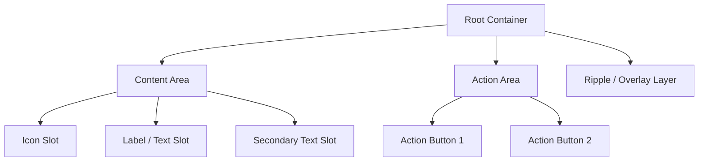
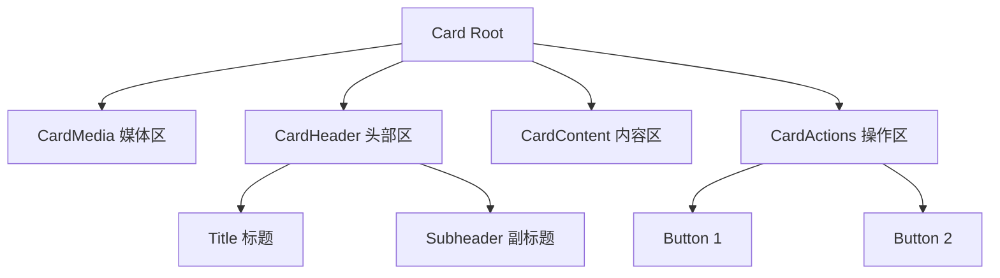
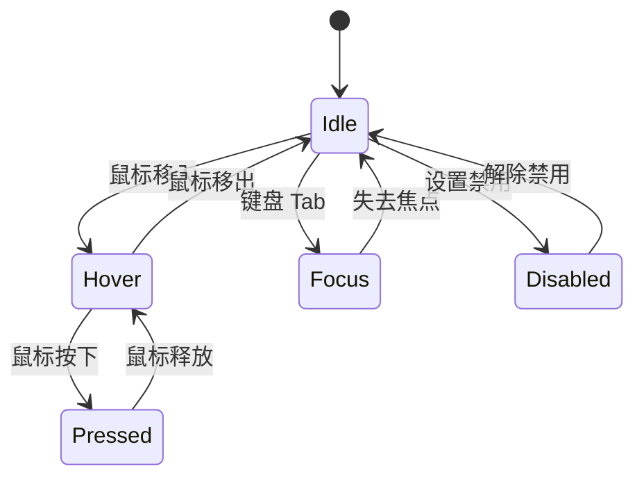

# 🔬 组件解剖

> **适用对象：** UI/UX 设计师 · **阅读时间：** 约 25 分钟
>
> 每个 UI 组件都是由多个子部件（slot）精心组装而成的。理解组件的内部结构，能帮助你做出更精确的设计决策，并与开发者高效沟通。本章将带你拆解 Material UI 中最常用的组件，深入了解它们的骨架与皮肤。

---

## 📖 目录

1. [组件解剖是什么](#-组件解剖是什么)
2. [通用组件结构](#-通用组件结构)
3. [核心组件深度拆解](#-核心组件深度拆解)
4. [组件状态](#-组件状态)
5. [可交互区域](#-可交互区域)
6. [尺寸变体](#-尺寸变体)
7. [无障碍设计](#-无障碍设计)
8. [实战练习：登录表单解剖](#-实战练习登录表单解剖)
9. [设计师↔开发者沟通对照表](#-设计师开发者沟通对照表)
10. [本章小结](#-本章小结)

---

## 🧩 组件解剖是什么

> 📖 **类比：** 组件解剖就像观察一辆汽车的仪表盘——每个按钮、旋钮和屏幕都有特定的用途、尺寸和位置，它们被精心设计以确保驾驶者能快速、安全地操作。UI 组件也是如此，每个子部件都经过深思熟虑的排布。

### 为什么设计师需要了解组件内部？

当你在 Figma 中绘制一个 Button 时，你看到的是一个整体。但在实际实现中，这个 Button 由多个 **slot（插槽）** 组成：

- **容器（Root container）** — 决定整体尺寸、圆角、背景色
- **标签（Label）** — 按钮上的文字
- **图标（Icon）** — 可选的起始或结束图标
- **涟漪（Ripple）** — 点击反馈效果

理解这些内部结构，你就能：

- ✅ 在设计稿中精确标注每个部件的样式
- ✅ 与开发者使用相同的词汇沟通
- ✅ 避免设计出无法实现或实现成本高的方案
- ✅ 更好地处理组件在不同状态下的表现

### 组件解剖示意图

```
┌─────────────────────────────────────────┐
│  Button (Root Container)                │
│  ┌──────┐  ┌───────────────┐            │
│  │ Icon │  │    Label      │            │
│  │ slot │  │    slot       │            │
│  └──────┘  └───────────────┘            │
│                                         │
│  ← padding-left    padding-right →      │
│  ~~~~~~~~~~~~ Ripple Layer ~~~~~~~~~~~~ │
└─────────────────────────────────────────┘
```

> 💡 **设计师提示：** 在 Figma 中使用 Auto Layout 来模拟组件的 slot 结构，可以让你的设计更接近真实实现。

---

## 🏗️ 通用组件结构

大多数 Material UI 组件都遵循一个通用的层级结构。理解这个模式后，你可以快速理解任何新组件。

### 通用 Slot 层级



### 各 Slot 职责一览

| Slot 名称 | 职责 | 示例 |
|-----------|------|------|
| Root Container | 定义组件的外边界、背景色、圆角、阴影 | Button 的外框、Card 的容器 |
| Content Area | 承载主要内容 | Card 的文字区域、TextField 的输入区 |
| Icon Slot | 放置图标 | Button 的 `startIcon`、TextField 的 `InputAdornment` |
| Label Slot | 显示文字标签 | Button 文字、TextField 的浮动标签 |
| Action Area | 放置操作按钮 | Card 底部的操作按钮组 |
| Overlay Layer | 状态反馈层（hover、focus 等） | Ripple 涟漪、hover 遮罩 |

> 💡 **记忆技巧：** 把组件想象成一个三明治 —— Root 是面包，Content 是馅料，Overlay 是酱料。

---

## 🔍 核心组件深度拆解

### Button 按钮

#### 结构解剖

```
含图标的 Button：
┌────────────────────────────────────┐
│  ┌────┐                           │
│  │ 🔍 │  Search                   │
│  └────┘                           │
│  ↑        ↑                       │
│  startIcon  label                 │
│                                   │
│  padding: 6px 16px               │
│  min-width: 64px                  │
│  border-radius: 4px              │
└────────────────────────────────────┘
```

#### 关键尺寸参数

| 属性 | 默认值 | 说明 |
|------|--------|------|
| padding | `6px 16px` | 内边距（上下 6px，左右 16px） |
| min-width | `64px` | 最小宽度，确保按钮不会太窄 |
| border-radius | `4px` | 圆角半径，来自 `theme.shape.borderRadius` |
| font-size | `0.875rem (14px)` | 按钮文字大小 |

#### 三种变体

| 变体 | 外观 | 使用场景 |
|------|------|---------|
| `contained` | 填充背景色 + 阴影 | 主要操作（如"提交"、"确认"） |
| `outlined` | 描边 + 透明背景 | 次要操作（如"取消"、"返回"） |
| `text` | 纯文字 + 透明背景 | 低优先级操作（如"了解更多"） |

#### 状态变化

| 状态 | 视觉变化（contained 变体） |
|------|--------------------------|
| Default | 主题色背景，白色文字 |
| Hover | 背景色加深（叠加 4% 黑色遮罩） |
| Pressed / Active | 背景色加深 + Ripple 涟漪扩散 |
| Focus | 背景色加深 + 12% 遮罩 + focus ring |
| Disabled | 背景变灰（opacity: 38%），不可点击 |

> ⚠️ **注意：** 设计稿中必须包含所有 5 种状态的样式，否则开发者将使用默认值，可能与你的预期不符。

---

### TextField 文本输入框

TextField 是表单设计中最复杂的组件之一。

#### 结构解剖

```
┌────────────────────────────────────────────────┐
│  ╭ Label (浮动标签) ╮                           │
│  │                                              │
│  │  ┌────────┐  ┌──────────────┐  ┌────────┐   │
│  │  │ Start  │  │    Input     │  │  End   │   │
│  │  │ Adorn. │  │    Area      │  │ Adorn. │   │
│  │  └────────┘  └──────────────┘  └────────┘   │
│  │                                              │
│  ╰──────────────────────────────────────────╯   │
│                                                  │
│  Helper Text / Error Message                     │
└────────────────────────────────────────────────┘
```

#### Slot 详解

| Slot | 说明 | 可选/必需 |
|------|------|----------|
| Label | 浮动标签，聚焦时上浮缩小 | 推荐 |
| Input Area | 用户输入区域 | 必需 |
| Start Adornment | 输入框前的装饰（如搜索图标） | 可选 |
| End Adornment | 输入框后的装饰（如密码切换） | 可选 |
| Helper Text | 输入框下方的提示文字 | 可选 |

#### 三种变体

| 变体 | 特征 | 推荐场景 |
|------|------|---------|
| `outlined` | 四边描边，标签浮动在边框上 | 最常用，适合大多数场景 |
| `filled` | 灰色填充背景 + 底部描边 | 密集表单，视觉层次丰富 |
| `standard` | 仅底部描边 | 简洁风格，移动端常见 |

#### 状态变化

| 状态 | 视觉变化 |
|------|---------|
| Empty | 标签在输入区内部，灰色描边 |
| Focused | 标签上浮缩小，描边变为主题色并加粗（2px） |
| Filled | 标签保持上浮，描边恢复常规 |
| Error | 描边和标签变为错误色（红色），显示错误提示 |
| Disabled | 整体透明度降低（opacity: 38%），不可输入 |

> 💡 **设计师提示：** 浮动标签动画是 TextField 的标志性特征。设计稿中需要提供 Empty 和 Focused 两种状态来说明标签位置变化。

---

### Card 卡片

#### 结构解剖



#### 关键属性

| 属性 | 默认值 | 说明 |
|------|--------|------|
| elevation | `1` | 阴影等级（0–24） |
| border-radius | `4px` | 圆角半径 |
| background | `#fff`（Light）/ `#121212`（Dark） | 背景色 |
| overflow | `hidden` | 内容超出时裁剪 |

#### 各区域内边距

| 区域 | padding |
|------|---------|
| CardHeader | `16px` |
| CardContent | `16px`（底部为 `24px`） |
| CardActions | `8px` |
| CardMedia | `0`（图片铺满） |

> 💡 **设计师提示：** Card 的 `elevation` 等级决定卡片"浮起"程度。日常设计使用 `elevation: 1` 即可。

---

### AppBar 应用栏

#### 结构解剖

```
┌──────────────────────────────────────────────────┐
│  ┌────┐  ┌──────────────┐           ┌────┬────┐ │
│  │ ☰  │  │   Title      │           │ 🔍 │ 👤 │ │
│  │Nav │  │              │           │Act │Act │ │
│  │Icon│  │              │           │ion1│ion2│ │
│  └────┘  └──────────────┘           └────┴────┘ │
│  ← Toolbar (height: 64px / 56px mobile) →        │
└──────────────────────────────────────────────────┘
```

#### 关键属性

| 属性 | 默认值 | 说明 |
|------|--------|------|
| elevation | `4` | 默认阴影等级 |
| height | `64px`（桌面）/ `56px`（移动端） | Toolbar 高度 |
| position | `fixed` 或 `static` | 是否固定在顶部 |
| background | `primary.main` | 使用主题主色 |

#### 定位方式

| 定位 | 行为 | 使用场景 |
|------|------|---------|
| `fixed` | 固定在视窗顶部，内容从下方滚过 | 大多数应用 |
| `static` | 随页面滚动 | 简单页面 |
| `sticky` | 滚动到顶部后固定 | 长页面 |

> ⚠️ **注意：** 使用 `fixed` 定位时，AppBar 会脱离文档流，需要在其下方预留等高的空白区域。

---

## 🎭 组件状态

每个可交互组件都有多种状态。理解状态转换关系是设计交互体验的基础。

### 状态转换流程



### 状态视觉规范

| 状态 | Light 主题 | Dark 主题 | 附加效果 |
|------|-----------|-----------|---------|
| Default | 无遮罩 | 无遮罩 | — |
| Hover | 叠加 4% 黑色遮罩 | 叠加 8% 白色遮罩 | 光标变为手型 |
| Focus | 叠加 12% 主题色遮罩 | 叠加 12% 主题色遮罩 | 显示 focus ring |
| Pressed | 叠加 12% 主题色遮罩 | 叠加 12% 主题色遮罩 | Ripple 涟漪扩散 |
| Disabled | 整体 opacity: 38% | 整体 opacity: 38% | 光标变为禁止符号 |

### Ripple 涟漪效果

Ripple 是 Material Design 的标志性反馈效果——用户点击时，从点击位置向外扩散圆形水波并逐渐淡出，传达"操作已被识别"的信号。

> 💡 **设计师提示：** 设计稿中不需要绘制 Ripple 动画的每一帧，但应在交互说明中注明"使用 Material Ripple 效果"。

### Focus 指示器

Focus 指示器（focus ring）是键盘导航的关键视觉反馈——组件周围出现高亮边框，仅在键盘 Tab 导航时显示。设计时必须确保 focus ring 清晰可见，不与组件边框混淆。

---

## 👆 可交互区域

### 视觉边界 vs 点击区域

组件的视觉边界和实际可点击区域可能不同。为了满足无障碍要求，即使按钮视觉上只有 36px 高，其可点击区域也应扩展到至少 **48 × 48px**。

### 触摸目标最小尺寸

| 规范 | 最小尺寸 |
|------|---------|
| Material Design 推荐 | **48 × 48px** |
| WCAG 2.1 AA | 44 × 44px |
| iOS Human Interface | 44 × 44pt |

> ⚠️ **关键规则：** 即使按钮视觉上较小，其可点击区域也必须至少 48 × 48px。这对移动端和无障碍体验至关重要。

### Ripple 作为反馈

Ripple 涟漪不仅美观，更具功能性——提供**视觉确认**（告知用户"你点击了这里"）、**位置反馈**（涟漪从点击位置扩散）和**过渡引导**（状态变化时的平滑过渡）。

---

## 📏 尺寸变体

Material UI 为常用组件提供了 `small`、`medium`、`large` 三种预设尺寸。

### 尺寸对照表

| 组件 | Small | Medium（默认） | Large |
|------|-------|---------------|-------|
| Button padding | `4px 10px` | `6px 16px` | `8px 22px` |
| Button font-size | `0.8125rem` | `0.875rem` | `0.9375rem` |
| IconButton 尺寸 | `34px` | `40px` | `48px` |
| FAB 尺寸 | `40px` | `48px` | `56px` |
| TextField 高度 | `40px` | `56px` | — |
| Chip 高度 | `24px` | `32px` | — |

### 何时使用哪种尺寸

| 尺寸 | 使用场景 |
|------|---------|
| Small | 工具栏、表格内操作、密集型界面 |
| Medium | 大多数场景的默认选择 |
| Large | 重要的行动号召、移动端主按钮、无障碍优先场景 |

> 💡 **设计师提示：** 在同一个界面中尽量统一使用一种尺寸，混用会导致视觉节奏混乱。

---

## ♿ 无障碍设计

组件解剖中的无障碍设计不是附加功能，而是基本要求。

### 五项核心原则

#### 1. Focus 指示器必须可见

键盘导航时，组件必须显示清晰的 focus ring。绝不能在样式中隐藏 `outline`。

#### 2. 颜色不能是唯一的状态传达方式

错误状态不能仅靠红色表达，还需要错误图标（如 ⚠️）、文字提示和边框样式变化。

#### 3. 触摸目标至少 48 × 48px

小于此尺寸的交互元素会让部分用户难以准确点击，移动端设计中尤为重要。

#### 4. 图标按钮需要 ARIA 标签

纯图标按钮没有可见文字，屏幕阅读器无法识别其功能。设计师应在标注中注明语义名称：

| 图标 | 标注 |
|------|------|
| 🔍 | `aria-label="搜索"` |
| ❌ | `aria-label="关闭"` |
| ☰ | `aria-label="打开菜单"` |

#### 5. 文字对比度

交互元素上的文字必须满足最低对比度要求：

| 文字类型 | 最低对比度 (WCAG AA) |
|---------|---------------------|
| 常规文字（≥ 14px） | 4.5:1 |
| 大号文字（≥ 18px 或 14px 加粗） | 3:1 |
| 非文本元素（图标、边框） | 3:1 |

> ⚠️ **关键提醒：** 禁用状态的低 opacity 可能导致文字对比度不足，应确保用户仍能识别该元素。

---

## 🛠️ 实战练习：登录表单解剖

为以下登录表单标注所有组件的解剖信息：

```
┌──────────────────────────────────────┐
│           🔒 用户登录                │
│                                      │
│  ┌──────────────────────────────┐    │
│  │  📧  邮箱地址                │    │
│  └──────────────────────────────┘    │
│  ┌──────────────────────────────┐    │
│  │  🔑  密码              👁️   │    │
│  └──────────────────────────────┘    │
│                                      │
│  ☐ 记住我                           │
│                                      │
│  ┌──────────────────────────────┐    │
│  │          登 录                │    │
│  └──────────────────────────────┘    │
│       忘记密码？ ·  注册账号         │
└──────────────────────────────────────┘
```

### 标注清单

- ☐ **Card 容器：** elevation 等级、border-radius、padding
- ☐ **标题区：** 字体大小、字重、颜色、与下方表单的间距
- ☐ **邮箱 TextField：** 变体（outlined/filled/standard）、Start Adornment（邮箱图标）、Label 文案
- ☐ **密码 TextField：** 变体、Start Adornment（密码图标）、End Adornment（显示/隐藏切换）
- ☐ **两个 TextField 的间距：** 使用 8px 网格倍数（如 16px 或 24px）
- ☐ **Checkbox "记住我"：** 尺寸、与 Label 的间距
- ☐ **登录 Button：** 变体（contained）、颜色、尺寸、全宽（fullWidth）
- ☐ **底部链接：** 使用 `text` 变体 Button 还是 `Link` 组件、字体大小
- ☐ **所有组件的状态：** Default、Hover、Focus、Disabled、Error
- ☐ **触摸目标：** 所有可交互元素是否满足 48 × 48px 最小尺寸
- ☐ **无障碍：** 密码切换按钮的 `aria-label`、错误提示文案

> 💡 **进阶挑战：** 尝试在 Figma 中为每个组件创建 Component Variants，涵盖所有状态。这将帮助你建立一套可复用的组件库。

---

## 🗣️ 设计师↔开发者沟通对照表

使用正确的术语与开发者沟通能大幅提高效率：

| 设计师语言 | 开发者语言（Material UI） |
|-----------|--------------------------|
| "主按钮" / "填充按钮" | `<Button variant="contained">` |
| "次要按钮" / "描边按钮" | `<Button variant="outlined">` |
| "文字按钮" | `<Button variant="text">` |
| "带图标的按钮" | `<Button startIcon={<Icon />}>` |
| "纯图标按钮" | `<IconButton>` |
| "输入框带搜索图标" | `<TextField InputProps={{ startAdornment: ... }}>` |
| "密码可见性切换" | `<TextField InputProps={{ endAdornment: ... }}>` |
| "输入框下方提示" | `<TextField helperText="...">` |
| "输入框错误状态" | `<TextField error helperText="...">` |
| "悬浮卡片" | `<Card elevation={8}>` |
| "扁平卡片" | `<Card variant="outlined">` |
| "固定顶部导航栏" | `<AppBar position="fixed">` |
| "小号按钮" | `<Button size="small">` |
| "全宽按钮" | `<Button fullWidth>` |
| "圆形浮动按钮" | `<Fab>` |
| "开关切换" | `<Switch>` |
| "下拉选择" | `<Select>` 或 `<Autocomplete>` |

> 💡 **沟通技巧：** 当你向开发者描述一个组件时，说"这是一个 contained Button，size 为 small，带 startIcon"比说"这是一个蓝色的小按钮，左边有个图标"要精确得多。

---

## 📝 本章小结

### 核心要点

1. **组件由 Slot 组成** — 每个组件都有明确的子部件结构，理解这些结构让你能做出精确的设计决策
2. **状态是组件的灵魂** — Default、Hover、Focus、Pressed、Disabled 五种状态构成了完整的交互体验
3. **尺寸需统一** — Small、Medium、Large 三种预设尺寸覆盖了大多数场景，尽量在同一界面中保持一致
4. **无障碍是基本要求** — 48px 触摸目标、可见 focus ring、ARIA 标签、足够的对比度
5. **用正确的术语沟通** — 使用组件的 slot 名称和属性名称与开发者交流，避免歧义

### 自我检查清单

- ☐ 我能说出 Button 的三种变体及其使用场景
- ☐ 我能画出 TextField 的 slot 结构图
- ☐ 我知道 hover 状态使用多少 opacity 的遮罩
- ☐ 我理解 Ripple 涟漪效果的功能意义
- ☐ 我能区分视觉边界和可点击区域
- ☐ 我知道触摸目标的最小尺寸是多少
- ☐ 我能使用 Material UI 术语与开发者沟通
- ☐ 我能完整标注一个登录表单的解剖信息

---

> 📌 **下一章预告：** [响应式设计](./07-responsive-design.md) — 学习如何让设计适配不同屏幕尺寸！
