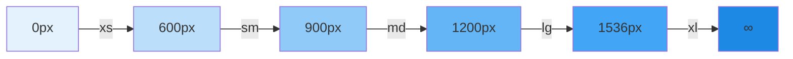
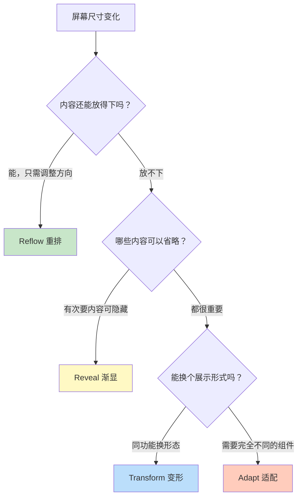
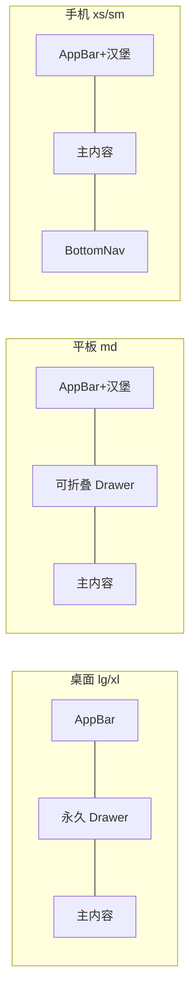

# 📱 响应式设计

> **适用对象：** UI/UX 设计师 · **阅读时间：** 约 30 分钟
>
> 用户通过手机、平板、笔记本、大屏幕访问你的产品——同一个界面需要在所有尺寸下都保持优秀的体验。本教程将帮助你理解 Material UI 的响应式设计体系，掌握断点、布局策略与设计交付规范，让你的设计从手机到桌面一气呵成。

---

## 📖 目录

1. [水一样的设计——为什么需要响应式](#-水一样的设计为什么需要响应式)
2. [Material UI 断点系统](#-material-ui-断点系统)
3. [四种响应式布局策略](#-四种响应式布局策略)
4. [12 列网格系统](#-12-列网格系统)
5. [导航模式随屏幕变化](#-导航模式随屏幕变化)
6. [响应式字体](#-响应式字体)
7. [图片与媒体的响应式处理](#-图片与媒体的响应式处理)
8. [设计交付物](#-设计交付物)
9. [实战练习：电商商品页](#-实战练习电商商品页)
10. [常见错误与避坑指南](#-常见错误与避坑指南)
11. [设计师 ↔ 开发者沟通对照表](#-设计师--开发者沟通对照表)
12. [本章小结与自测清单](#-本章小结与自测清单)

---

## 🌊 水一样的设计——为什么需要响应式

> 📖 **类比：** 响应式设计就像水——倒进杯子就是杯子的形状，倒进碗里就是碗的形状，但 H₂O 的本质从未改变。你的界面内容就是"水"，不同屏幕就是不同的"容器"。设计师的任务是让这些"水"在每个容器里都呈现出最佳状态。

### 为什么设计师必须关注响应式

| 原因 | 说明 |
|------|------|
| 用户习惯 | 超过 60% 的网页流量来自移动设备 |
| 搜索排名 | Google 以移动端体验作为排名因素 |
| 设计一致性 | 品牌体验不应因屏幕大小而割裂 |
| 开发效率 | 设计阶段考虑响应式，比开发后补救成本低 10 倍 |
| 无障碍 | 不同设备意味着不同的交互方式（触摸 vs 鼠标） |

> 💡 **提示：** 响应式不是"缩小版的桌面"，而是为每种屏幕尺寸提供最合适的体验。

---

## 📏 Material UI 断点系统

**断点（breakpoint）** 是屏幕宽度的分界点——当屏幕跨过某个宽度阈值时，布局会发生变化。

### 五个标准断点

| 断点 | 像素范围 | 典型设备 | 常见设计模式 |
|------|----------|----------|-------------|
| `xs` | 0 – 599 px | 手机竖屏 | 单列布局、底部导航 |
| `sm` | 600 – 899 px | 手机横屏、小平板 | 双列布局、侧边栏收起 |
| `md` | 900 – 1199 px | 平板 | 多列布局、可折叠侧边栏 |
| `lg` | 1200 – 1535 px | 笔记本 / 桌面 | 完整布局、固定侧边栏 |
| `xl` | ≥ 1536 px | 大屏幕 / 外接显示器 | 宽屏布局、额外信息面板 |

> 💡 **提示：** 断点值是"最小宽度"——`md` 表示 "≥ 900px 时生效"，这就是 **mobile-first（移动优先）** 的逻辑。

### 断点数轴示意



### 如何理解 mobile-first

Mobile-first 意味着：**先设计最小屏幕的布局，再逐步为更大屏幕添加内容和变化。** 设计顺序为 `xs → sm → md → lg → xl`（手机 → 平板 → 笔记本 → 大屏幕）。

> ⚠️ **警告：** 千万不要先画桌面稿再"适配"手机——这会导致手机端体验像被强行压缩的桌面版，用户体验极差。

---

## 🔄 四种响应式布局策略

当屏幕尺寸变化时，你的布局可以采用以下四种策略。它们并非互斥，一个页面中通常会组合使用。

### Reflow（重排）

**核心思路：** 重新组织内容的排列方向，最常见的是从水平排列变为垂直堆叠。

| 场景 | 大屏 | 小屏 |
|------|------|------|
| 商品列表 | 4 列网格 | 单列列表 |
| 表单字段 | 两列并排 | 逐行堆叠 |
| 图文区域 | 图片在左、文字在右 | 图片在上、文字在下 |

> 📖 **类比：** 就像书架上的书——书架宽时横着摆一排，书架窄时竖着叠起来。

### Reveal（渐显）

**核心思路：** 空间充足时展示更多信息；空间不足时隐藏次要内容。

- 桌面端显示完整数据表格 → 手机端只显示关键列
- 桌面端侧边栏常驻 → 手机端侧边栏隐藏，需点击展开
- 桌面端显示详细说明文字 → 手机端折叠为"查看更多"

### Transform（变形）

**核心思路：** 同一功能在不同屏幕下以不同的组件形态呈现。

| 功能 | 大屏组件 | 小屏组件 |
|------|----------|----------|
| 导航菜单 | 水平 Tabs | Dropdown 下拉菜单 |
| 数据展示 | 完整 Table | 卡片列表 Card |
| 操作按钮 | 文字按钮一排 | IconButton 或 Fab |

### Adapt（适配）

**核心思路：** 直接替换为完全不同的组件或交互模式。

- 桌面端：永久固定的 Drawer（`variant="permanent"`）
- 平板端：可折叠的 Drawer（`variant="persistent"`）
- 手机端：覆盖式的 Drawer（`variant="temporary"`）

### 策略选择流程



---

## 🏗️ 12 列网格系统

Material UI 使用 **12 列网格（Grid）** 来组织页面布局。对设计师来说，这是响应式设计的核心工具。

### 为什么是 12 列？

12 可以被 1、2、3、4、6、12 整除，轻松实现各种等分：

```
12 列 = 满宽 | 6+6 = 两等分 | 4+4+4 = 三等分
3+3+3+3 = 四等分 | 8+4 = 主内容+侧栏 | 9+3 = 宽主内容+窄侧栏
```

### 网格可视化

```
┌──────────────────────────────────────────────────┐
│ 1 │ 2 │ 3 │ 4 │ 5 │ 6 │ 7 │ 8 │ 9 │10 │11 │12 │
├──────────────────────────────────────────────────┤
│         6 列          │         6 列          │     ← 两等分
├──────────────────────────────────────────────────┤
│     4 列    │     4 列    │     4 列    │          ← 三等分
├──────────────────────────────────────────────────┤
│  3列 │  3列 │  3列 │  3列 │                       ← 四等分
├──────────────────────────────────────────────────┤
│       8 列（主内容）       │  4列  │                ← 主 + 侧栏
└──────────────────────────────────────────────────┘
```

### 不同断点下的列数变化

一个典型的商品卡片列表：

| 断点 | 每个卡片占列数 | 一行显示几个 | 效果 |
|------|---------------|-------------|------|
| `xs` | 12 列 | 1 个 | 单列全宽 |
| `sm` | 6 列 | 2 个 | 两列并排 |
| `md` | 4 列 | 3 个 | 三列网格 |
| `lg` / `xl` | 3 列 | 4 个 | 四列网格 |

> 📖 **类比：** 12 列网格就像 12 格置物架——你可以把一个大物件占满 12 格，也可以放 4 个各占 3 格的小物件。

### 常见布局模式

**模式一：均分布局** — `桌面: [3][3][3][3]` → `平板: [4][4][4]` → `手机: [12]`

**模式二：侧边栏布局** — `桌面: [3 侧栏][9 主区]` → `平板/手机: [12]（侧栏折叠/隐藏）`

### Gutter（间距）

Grid 中列与列之间的间距称为 **gutter**，通过 `spacing` 属性控制：

| spacing 值 | 实际像素 | 适用场景 |
|------------|---------|----------|
| 1 | 8 px | 紧凑型列表 |
| 2（默认） | 16 px | 通用布局 |
| 3 | 24 px | 卡片网格 |
| 4 | 32 px | 宽松的内容区 |

> 💡 **提示：** gutter 的值遵循 8px 网格系统（参见第 5 章间距与布局）。

---

## 🧭 导航模式随屏幕变化

导航是响应式设计中变化最大的部分。同一个导航系统在不同屏幕下需要呈现完全不同的形态。

### 三种典型导航模式



### 导航模式对照表

| 断点 | 导航模式 | 使用组件 | 交互方式 |
|------|----------|----------|----------|
| `xs` / `sm` | 底部标签栏 + 汉堡菜单 | BottomNavigation + 临时 Drawer | 拇指区操作 |
| `md` | 顶部栏 + 可折叠侧边栏 | AppBar + 可持续 Drawer | 点击展开/收起 |
| `lg` / `xl` | 顶部栏 + 固定侧边栏 | AppBar + 永久 Drawer | 常驻可见 |

### 导航设计要点

- **手机端：** 主要操作放在屏幕下半部分（BottomNavigation），拇指易触达
- **平板端：** 侧边栏可折叠，兼顾空间与效率
- **桌面端：** 侧边栏常驻，减少点击步骤

> ⚠️ **警告：** 不要在手机端使用"悬停展开"的导航——触摸屏没有 hover 状态！

---

## 🔤 响应式字体

字体大小不能"一刀切"——大屏上合适的字号在手机上可能大得离谱，反之亦然。

### 标题字号参考

| 层级 | 桌面 (lg/xl) | 平板 (md) | 手机 (xs/sm) |
|------|-------------|-----------|-------------|
| h1 | 96 px | 72 px | 48 – 60 px |
| h2 | 60 px | 48 px | 36 – 42 px |
| h3 | 48 px | 40 px | 30 – 36 px |
| h4 | 34 px | 30 px | 26 – 28 px |
| h5 | 24 px | 22 px | 20 px |
| h6 | 20 px | 18 px | 16 – 18 px |
| body1 | 16 px | 16 px | 16 px |
| body2 | 14 px | 14 px | 14 px |

### Material UI 的 `responsiveFontSizes()`

Material UI 提供 `responsiveFontSizes()` 工具函数，自动根据断点调整标题字号。设计师只需知道：启用后 **h1 – h6** 会在小屏上自动缩小，**body1 / body2** 保持不变，缩放过渡平滑自然。

### 字体设计守则

| 规则 | 说明 |
|------|------|
| 最小可读字号 | 正文不低于 **12 px**，推荐 14 – 16 px |
| 最佳行宽 | 每行 **45 – 75 个字符**（中文约 22 – 37 个字） |
| 行高比例 | 正文行高建议为字号的 **1.4 – 1.6 倍** |
| 标题层级 | 每个页面只有一个 h1，层级不要跳跃（h1 → h3 ✗） |

> 💡 **提示：** 如果你发现一行文字在手机上超过 40 个中文字符，说明字号太小或容器太宽，需要调整。

---

## 🖼️ 图片与媒体的响应式处理

### 流式图片

图片应随容器宽度自适应：宽度 `100%`，高度 `auto`，设置 `max-width` 防止大屏过度拉伸。

### Art Direction（艺术指导）

| 屏幕 | 图片策略 | 原因 |
|------|----------|------|
| 手机 | 正方形 / 竖版 | 屏幕窄，竖版信息密度更高 |
| 平板 | 4:3 或 16:10 | 兼顾宽度与视觉冲击 |
| 桌面 | 16:9 或全景 | 充分利用横向空间 |

### 组件级响应行为

| 组件 | 桌面行为 | 手机行为 |
|------|----------|----------|
| CardMedia | 固定高度横幅 | 等比缩放，高度自适应 |
| Avatar | 48 – 64 px | 32 – 40 px |
| 产品图 | 多图并排画廊 | 单图 + 缩略图滚动条 |
| Banner | 全宽背景图 | 裁剪为移动端比例 |

### 图片加载注意事项

- 为不同断点准备不同尺寸的图片（1x / 2x / 3x），手机端优先加载小图
- 使用懒加载（lazy loading），设置宽高比（aspect ratio）避免页面跳动

---

## 📋 设计交付物

### 需要提供多少个断点的设计稿？

| 优先级 | 断点 | 宽度 | 必要性 |
|--------|------|------|--------|
| ★★★ | `xs`（手机） | 375 px | 必须 |
| ★★★ | `lg`（桌面） | 1280 px | 必须 |
| ★★☆ | `md`（平板） | 900 px | 强烈建议 |
| ★☆☆ | `sm`（大手机） | 600 px | 可选 |
| ★☆☆ | `xl`（大屏） | 1536 px | 按需 |

> 💡 **提示：** 最低交付标准是 **3 个断点**：手机（xs）、平板（md）、桌面（lg）。覆盖这三个，开发者就能推断中间状态。

### 每个断点需要标注什么

1. **布局结构：** Grid 列数、间距、组件排列方向
2. **显隐规则：** 哪些元素在该断点下隐藏/显示
3. **组件变体：** 组件在该断点下使用哪种 variant
4. **字体大小：** 标题和正文的字号调整
5. **间距变化：** padding / margin 的断点差异
6. **交互差异：** hover vs touch、导航模式变化

### 标注示范

```
AppBar（xs: 汉堡菜单; lg: 完整导航）
├── Drawer（xs: 隐藏 / md: 折叠 / lg: 固定 240px）
└── 主内容区
    ├── xs: Grid 12 列（单列）
    ├── md: Grid 6+6（两列）
    └── lg: Grid 4+4+4（三列），spacing={2} (16px)
```

---

## 🛒 实战练习：电商商品页

设计一个响应式电商商品详情页，包含以下元素：

- 商品图片
- 商品标题和价格
- 商品描述
- "加入购物车"按钮
- 相关商品推荐网格

### 手机端 (xs: 375px)

```
┌───────────────────────┐
│       AppBar          │
├───────────────────────┤
│    商品图片 (满宽 1:1)  │
├───────────────────────┤
│  标题 (h5)            │
│  ¥ 299.00 (h4, 红色)  │
│  ★★★★☆ 4.2           │
├───────────────────────┤
│  商品描述（可展开）     │
├───────────────────────┤
│  [  加入购物车  ] 全宽  │
├───────────────────────┤
│  相关商品 [12列] 单列   │
├───────────────────────┤
│   BottomNavigation    │
└───────────────────────┘
```

### 平板端 (md: 900px)

```
┌─────────────────────────────────────┐
│         AppBar + 汉堡菜单            │
├─────────────────────────────────────┤
│  ┌──────────┐  ┌──────────────────┐ │
│  │ 商品图片  │  │ 标题 / 价格 / 描述│ │
│  │ Grid: 6  │  │ [加入购物车]      │ │
│  └──────────┘  └──────────────────┘ │
├─────────────────────────────────────┤
│  相关商品  [4列] [4列] [4列] 三列    │
└─────────────────────────────────────┘
```

### 桌面端 (lg: 1280px)

```
┌──────────────────────────────────────────┐
│             AppBar（完整导航）              │
├──────┬───────────────────────────────────┤
│  D   │  ┌────────┐ ┌──────────────────┐ │
│  r   │  │ 商品图片 │ │ 标题 / 价格 / 描述│ │
│  a   │  │ Grid: 5 │ │ 颜色/尺寸选择     │ │
│  w   │  │        │ │ [加入购物车][收藏] │ │
│  e   │  └────────┘ └──────────────────┘ │
│  r   ├───────────────────────────────────┤
│  固定 │  相关商品  [3列]×4 四列网格       │
└──────┴───────────────────────────────────┘
```

### 各断点变化要点

| 元素 | xs（手机） | md（平板） | lg（桌面） |
|------|-----------|-----------|-----------|
| 商品图片 | 满宽 1:1 | 左半 Grid 6 | 左侧 Grid 5 |
| 标题 | h5 | h4 | h3 |
| 描述 | 折叠 + 展开 | 完整显示 | 完整显示 |
| 购物车按钮 | 全宽 | 常规宽度 | 常规宽度 + 收藏按钮 |
| 相关商品 | 1 列 (12) | 3 列 (4+4+4) | 4 列 (3+3+3+3) |
| 导航 | BottomNav | AppBar + 汉堡 | AppBar + Drawer |

---

## ❌ 常见错误与避坑指南

### 1. 桌面优先思维

❌ 先设计桌面稿再删东西做手机版 → ✅ Mobile-first，先保证手机端核心体验

### 2. 断点行为不一致

❌ 页面 A 在 `md` 切换布局，页面 B 在 `sm` 切换 → ✅ 全产品统一断点规范

### 3. 忽视触摸目标

❌ 手机端按钮 24 × 24 px → ✅ 最小 **48 × 48 dp**（Material Design 标准）

### 4. 手机端文字过小

❌ 正文 10px → ✅ 移动端正文不低于 **14px**，辅助文字不低于 **12px**

### 5. 忘记横屏状态

❌ 只考虑竖屏 → ✅ 手机横屏（sm 断点）也需验证布局

### 6. 间距不随断点调整

❌ 桌面 32px padding 在手机上不变 → ✅ 手机端减小 padding（如 16px）

---

## 🔄 设计师 ↔ 开发者沟通对照表

| 设计师语言 | 开发者语言 | 说明 |
|-----------|-----------|------|
| "在手机上隐藏侧边栏" | `display: { xs: 'none', md: 'block' }` | 使用 `sx` 的响应式语法 |
| "手机上单列，桌面四列" | `<Grid size={{ xs: 12, lg: 3 }}>` | Grid 的响应式列数 |
| "手机上标题小一点" | `responsiveFontSizes(theme)` | 自动响应式字号 |
| "平板上侧边栏可以收起来" | `Drawer variant="persistent"` | Drawer 变体 |
| "手机用底部导航" | `<BottomNavigation>` | 独立的移动端导航组件 |
| "大屏上多显示一列信息" | `display: { xs: 'none', xl: 'block' }` | 条件显隐 |
| "间距在手机上小一些" | `sx={{ p: { xs: 2, md: 4 } }}` | 响应式间距 |
| "手机上用图标按钮" | `useMediaQuery('(max-width:600px)')` | 媒体查询条件渲染 |
| "内容最大宽度 1200px" | `<Container maxWidth="lg">` | Container 限制最大宽度 |
| "小屏幕上表格改成卡片" | 条件渲染 Table / Card | Transform 策略 |

> 💡 **提示：** 把这张表分享给你的开发搭档，你们之间的沟通效率会大幅提升。

---

## ✅ 本章小结与自测清单

### 核心概念回顾

| 概念 | 要点 |
|------|------|
| 断点系统 | xs / sm / md / lg / xl，mobile-first 逻辑 |
| 四种策略 | Reflow、Reveal、Transform、Adapt |
| 12 列 Grid | 灵活等分，配合断点实现响应式布局 |
| 导航模式 | 桌面固定侧栏 → 平板折叠 → 手机底部导航 |
| 响应式字体 | 标题随断点缩放，正文保持可读 |
| 图片处理 | 流式缩放 + Art Direction + 懒加载 |
| 设计交付 | 至少 3 个断点稿（xs, md, lg） |

### 自测清单

- [ ] 我能说出 Material UI 的 5 个标准断点及其像素范围
- [ ] 我理解 mobile-first 的设计思路，并能应用到实际项目中
- [ ] 我能区分 Reflow、Reveal、Transform、Adapt 四种策略
- [ ] 我能使用 12 列 Grid 系统规划不同断点下的布局
- [ ] 我知道手机端、平板端、桌面端应该分别使用什么导航模式
- [ ] 我了解响应式字体的基本原则和最小字号要求
- [ ] 我能为开发者提供清晰的响应式标注文档
- [ ] 我能用开发者听得懂的语言描述响应式需求

---

> 📌 **下一章预告：** [深色模式设计](./08-dark-mode.md) — 掌握深色主题的配色原则与设计技巧！
