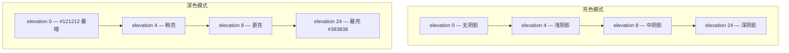

# 🌙 深色模式设计

> **适用对象：** UI/UX 设计师 · **阅读时间：** 约 25 分钟
>
> 深色模式已经从"锦上添花"变成了现代产品的标配功能。然而，设计一个优秀的深色模式远不止把背景换成黑色那么简单——它需要系统性地重新思考颜色、对比度、层级与视觉舒适度。本教程将带你深入了解 Material Design 的深色模式原则，掌握 Material UI 的深色调色板体系，让你交付的深色模式设计既专业又舒适。

---

## 📖 目录

1. [为什么需要深色模式](#-为什么需要深色模式)
2. [深色模式 ≠ 颜色反转](#-深色模式--颜色反转)
3. [Material Design 深色模式原则](#-material-design-深色模式原则)
4. [高度叠加层系统](#-高度叠加层系统elevation-overlay)
5. [深色模式配色调整](#-深色模式配色调整)
6. [深色表面上的内容](#-深色表面上的内容)
7. [图片与插画](#-图片与插画)
8. [测试深色模式设计](#-测试深色模式设计)
9. [Material UI 深色模式实现](#-material-ui-深色模式实现)
10. [亮色 vs 深色完整对照表](#-亮色-vs-深色完整对照表)
11. [实战练习：仪表盘深色化](#-实战练习仪表盘深色化)
12. [设计师↔开发者沟通术语表](#-设计师开发者沟通术语表)
13. [本章小结与自测清单](#-本章小结与自测清单)

---

## 🌃 为什么需要深色模式

> 📖 **类比：** 深色模式就像剧院照明——舞台（内容）被打亮，而周围环境（背景）退入黑暗，观众的注意力自然聚焦在表演上。你的 UI 也是同样的道理：深色背景让内容成为视觉焦点。

### 深色模式的四大优势

| 优势 | 说明 |
|------|------|
| 🌙 减轻视觉疲劳 | 夜间或暗光环境下，深色界面显著降低屏幕亮度对眼睛的刺激 |
| 🔋 节省电量 | 在 OLED 屏幕上，黑色像素完全不发光，可节省最高 60% 的屏幕耗电 |
| ♿ 无障碍友好 | 对光敏感用户（如偏头痛患者、光敏性癫痫）更加友好 |
| 🎨 现代审美 | 深色界面传递专业感、沉浸感，已成为主流设计趋势 |

根据行业调查，超过 80% 的智能手机用户会开启深色模式。iOS、Android、Windows、macOS 均已提供系统级深色模式支持，用户期望每一个 App 都能跟随系统设置自动切换。

> 💡 **提示：** 深色模式不仅仅是"夜间模式"——许多用户全天候使用，因此你的设计需要在任何环境下都能正常工作。

---

## 🚫 深色模式 ≠ 颜色反转

初学者最常犯的错误就是简单地把所有颜色取反——这会带来灾难性的结果。

### 为什么颜色反转不可行？

1. **图片变成负片** —— 照片和图标全部变成诡异的反色效果
2. **阴影失去意义** —— 深色表面上的深色阴影变成浅色"光晕"，违反物理直觉
3. **品牌色被破坏** —— 你精心挑选的品牌蓝可能变成一种刺眼的橙色
4. **对比度不可预测** —— 有些元素对比度过高，有些则几乎不可见
5. **语义颜色混乱** —— 红色错误提示可能变成绿色，绿色成功提示可能变成红色

### 直观对比：天真反转 vs 正确深色模式

| 设计元素 | 天真的颜色反转 ❌ | 正确的深色模式 ✅ |
|----------|-------------------|-------------------|
| 背景色 | `#000000`（纯黑） | `#121212`（柔和深灰） |
| 卡片背景 | `#000000`（与背景相同） | `#1e1e1e`（通过 overlay 区分层级） |
| 主文字色 | `#FFFFFF`（纯白） | `#FFFFFF`（纯白，但低层级文字降低 opacity） |
| 图片处理 | 反色（负片效果） | 原始图片 + 可选的 scrim 遮罩 |
| 品牌主色 | 取反色值 | 使用同色系较浅变体（如 200 色阶） |
| 阴影 | 被反转为白色光晕 | 保持深色阴影 + 使用 elevation overlay 代替 |

> ⚠️ **警告：** 永远不要使用 CSS `filter: invert(1)` 来实现深色模式。这种方法会破坏所有图片、视频和品牌资产，并且无法提供一致的用户体验。

---

## 🎨 Material Design 深色模式原则

Material Design 为深色模式制定了一套完整的设计规范，Material UI 忠实地实现了这些原则。

### 原则一：使用深灰而非纯黑

Material UI 的深色模式基础背景色是 `#121212`，而不是纯黑 `#000000`。

**为什么避免纯黑？**

- 纯黑背景上的白色文字会产生极端对比度（21:1），长时间阅读容易视觉疲劳
- 在 OLED 屏幕上，纯黑到有色区域的过渡会出现明显的"拖影"（black smearing）
- `#121212` 允许通过 elevation overlay 创造层级感，纯黑则无法叠加出可见差异
- 深灰背景更能准确表达 Material Design 的"纸面"隐喻

### 原则二：通过 elevation overlay 表达层级

在亮色模式中，层级通过**阴影**（shadow）来表达——海拔越高，阴影越深。但在深色模式中，深色阴影在深色背景上几乎不可见。

因此，深色模式使用**表面亮度**来表达层级：海拔越高，表面越亮。这通过在 `#121212` 基础上叠加半透明白色来实现。

### 原则三：降低主色饱和度

亮色模式中常用高饱和度的主色（如 palette 中的 700 色阶），但这些颜色在深色背景上：

- 可读性差（对比度不够）
- 视觉振动（高饱和色在暗背景上产生晕眩感）
- 长时间注视易疲劳

因此，深色模式应使用**较浅的色阶变体**（通常是 200 色阶），既保持品牌识别度，又确保在深色背景上舒适可读。

### 原则四：白色文字使用 opacity 分层

深色模式中的文字不全是纯白色。通过调整 opacity，创造出清晰的信息层级：

| 文字层级 | 颜色值 | opacity | 用途 |
|----------|--------|---------|------|
| 主文字 | `#FFFFFF` | 100% | 标题、正文等重要内容 |
| 次要文字 | `rgba(255, 255, 255, 0.7)` | 70% | 副标题、说明文字 |
| 禁用文字 | `rgba(255, 255, 255, 0.5)` | 50% | 不可交互的灰色文字 |

> 💡 **提示：** 使用 opacity 而非固定灰色值的好处是，当背景色发生变化时（如不同 elevation 层级），文字颜色会自然适应，始终保持和谐的对比关系。

---

## 📐 高度叠加层系统（Elevation Overlay）

Elevation overlay 是深色模式最核心的视觉机制。它用一层半透明白色叠加在 `#121212` 上，模拟"离用户更近"的视觉效果。

### Elevation 与 overlay opacity 映射

```mermaid
graph LR
    A["elevation 0<br/>0% overlay<br/>#121212"] --> B["elevation 1<br/>5% overlay"]
    B --> C["elevation 2<br/>7% overlay"]
    C --> D["elevation 3<br/>8% overlay"]
    D --> E["elevation 4<br/>9% overlay"]
    E --> F["elevation 6<br/>11% overlay"]
    F --> G["elevation 8<br/>12% overlay"]
    G --> H["elevation 12<br/>14% overlay"]
    H --> I["elevation 16<br/>15% overlay"]
    I --> J["elevation 24<br/>16% overlay"]

    style A fill:#121212,color:#fff
    style B fill:#1e1e1e,color:#fff
    style C fill:#222222,color:#fff
    style D fill:#242424,color:#fff
    style E fill:#262626,color:#fff
    style F fill:#2c2c2c,color:#fff
    style G fill:#2e2e2e,color:#fff
    style H fill:#333333,color:#fff
    style I fill:#353535,color:#fff
    style J fill:#383838,color:#fff
```



### 完整对照表

| Elevation | Overlay Opacity | 近似结果色 | 常见使用场景 |
|-----------|----------------|-----------|-------------|
| 0 | 0% | `#121212` | 页面背景 |
| 1 | 5% | `#1e1e1e` | Card、Search bar |
| 2 | 7% | `#222222` | 展开的 Card、按钮提升 |
| 3 | 8% | `#242424` | 导航栏（Snackbar） |
| 4 | 9% | `#262626` | App Bar |
| 6 | 11% | `#2c2c2c` | FAB（浮动操作按钮） |
| 8 | 12% | `#2e2e2e` | Menu、Side Sheet |
| 12 | 14% | `#333333` | Picker、Dialog |
| 16 | 15% | `#353535` | Modal Bottom Sheet |
| 24 | 16% | `#383838` | Dialog（最高层级） |

### 亮色 vs 深色模式的层级表达对比



> 📖 **理解关键：** 在亮色模式中，elevation 越高 → 阴影越深（暗示悬浮）；在深色模式中，elevation 越高 → 表面越亮（暗示靠近光源）。两者表达的是同一个空间概念，只是视觉手段完全相反。

---

## 🎯 深色模式配色调整

### 主色与强调色

在亮色模式中，你可能使用 palette 的 700 色阶作为主色。在深色模式中，需要切换到 **200 色阶**：

| 颜色角色 | 亮色模式色阶 | 深色模式色阶 | 原因 |
|----------|-------------|-------------|------|
| Primary | 700（深色） | 200（浅色） | 确保在深色背景上的可读性 |
| Secondary | 700 | 200 | 保持与 Primary 一致的调整策略 |
| Error | 700（如 `#d32f2f`） | 200-300（较浅红） | 纯红在深色背景上对比度不够 |

### 语义色调整

| 语义颜色 | 亮色模式 | 深色模式 | 说明 |
|----------|---------|---------|------|
| Success | 深绿（800） | 浅绿（200-300） | 深绿在深色背景上几乎不可见 |
| Warning | 深橙（800） | 浅橙（200-400） | 保持警示感但提升可读性 |
| Info | 深蓝（700） | 浅蓝（200-300） | 避免与 Primary 混淆 |
| Error | 深红（700） | 浅红（200-300） | 确保错误信息醒目 |

### 背景色层次体系

深色模式中的背景不是单一色值，而是一套渐进的层次体系：

| 层级 | 色值 | 用途 |
|------|------|------|
| 最底层 | `#121212` | 页面背景（`background.default`） |
| 第一层 | `#1e1e1e` | 卡片、面板（`background.paper` + elevation 1） |
| 第二层 | `#2c2c2c` | 浮动元素、弹出菜单 |
| 高亮层 | `#383838` | 最高层级的对话框、模态窗 |

> ⚠️ **警告：** 不要在深色模式中使用超过 3-4 个层次的背景灰度。过多的层次反而会让界面变得混乱，用户无法分辨哪些元素更"靠近"。

---

## 📝 深色表面上的内容

### 文字颜色体系

Material UI 为深色模式定义了精确的文字颜色值：

| 角色 | 色值 | 用途 |
|------|------|------|
| `text.primary` | `#FFFFFF` | 标题、正文、关键信息 |
| `text.secondary` | `rgba(255, 255, 255, 0.7)` | 副标题、辅助说明 |
| `text.disabled` | `rgba(255, 255, 255, 0.5)` | 禁用状态文字 |

### 分割线

| 角色 | 色值 | 说明 |
|------|------|------|
| `divider` | `rgba(255, 255, 255, 0.12)` | 12% opacity 的白色，在深色背景上提供微妙但可见的分割 |

### 图标处理

深色模式中的图标应使用白色并通过 opacity 调整优先级：

- **激活状态图标：** 100% 白色（`#FFFFFF`）
- **非激活状态图标：** 70% 白色（`rgba(255, 255, 255, 0.7)`）
- **禁用状态图标：** 50% 白色（`rgba(255, 255, 255, 0.5)`）

### 交互状态

深色模式中的交互状态通过白色 overlay 来实现：

| 状态 | Overlay 值 | 说明 |
|------|-----------|------|
| Hover | `rgba(255, 255, 255, 0.08)` | 8% 白色叠加，微妙的悬停反馈 |
| Focus | `rgba(255, 255, 255, 0.12)` | 12% 白色叠加，焦点环或高亮 |
| Selected | `rgba(255, 255, 255, 0.16)` | 16% 白色叠加，被选中的项目 |
| Disabled | `rgba(255, 255, 255, 0.3)` | 30% opacity，整体降低元素可见度 |

> 💡 **提示：** 注意这些值与亮色模式中使用黑色 overlay（`rgba(0, 0, 0, x)`）形成对称关系。设计时要确保每种状态在视觉上都能与默认状态区分开。

### 边框与轮廓

在深色模式中，边框应使用类似 divider 的半透明白色：

- 输入框边框：`rgba(255, 255, 255, 0.23)` — 比 divider 稍明显
- 轮廓按钮边框：`rgba(255, 255, 255, 0.5)` — 需要更清晰的边界
- 装饰性边框：`rgba(255, 255, 255, 0.12)` — 与 divider 一致

---

## 🖼️ 图片与插画

图片和插画是深色模式中最需要特别处理的元素——它们不像文字和背景那样可以通过 token 自动切换。

### 照片处理策略

1. **添加 scrim 遮罩：** 在明亮照片上叠加半透明深色层（如 `rgba(0, 0, 0, 0.2)`），降低整体亮度
2. **降低亮度：** 将照片亮度降低 10-20%，并适当提高对比度以补偿细节损失
3. **避免大面积白色图片：** 白色背景的产品图片在深色界面中非常突兀

### 插画与图形

| 策略 | 说明 | 适用场景 |
|------|------|---------|
| 降低饱和度 | 减少颜色的鲜艳程度 | 装饰性插画 |
| 替换背景色 | 将浅色背景替换为深色 | 有底色的插画 |
| 提供双版本 | 为亮色/深色模式各准备一版 | 品牌核心插画 |
| 添加描边 | 用细描边替代色块来定义形状 | 线性图标/插画 |

### Logo 适配

确保你的品牌 logo 有深色模式变体：深色 logo 切换为浅色或白色版本；彩色 logo 需要在深色背景上验证可读性，必要时增加浅色外描边。避免使用带白色背景框的 logo。

> ⚠️ **警告：** 绝不要对 logo 使用自动反色处理。品牌资产需要专门设计的深色模式变体。

---

## 🧪 测试深色模式设计

### 对比度检查

所有文字必须满足 WCAG 无障碍标准：

| 标准等级 | 最低对比度 | 适用场景 |
|----------|-----------|---------|
| WCAG AA | 4.5:1 | 正文文字（14px 以下） |
| WCAG AA（大字） | 3:1 | 标题文字（18px 以上或 14px 加粗） |
| WCAG AAA | 7:1 | 最严格标准（推荐重要内容达到） |

验证方法：使用 Figma 插件（如 Stark、A11y）检查每个文字/背景组合的对比度比值。

### 真机测试

- [ ] 在 OLED 屏幕上测试：检查 `#121212` 与纯黑 `#000000` 的过渡是否自然
- [ ] 在 LCD 屏幕上测试：确保暗色层级之间的差异在非 OLED 屏幕上也可见
- [ ] 在强光环境（户外）测试：深色界面在强光下的可读性
- [ ] 在暗光环境（夜间）测试：确保界面不会过亮
- [ ] 在不同系统深色模式下测试：iOS、Android、浏览器

### 常见问题排查清单

| 问题 | 原因 | 解决方案 |
|------|------|---------|
| 文字在深色背景上看不清 | 对比度不够 | 使用 `text.primary`（`#FFFFFF`）或降低背景亮度 |
| 卡片与背景无法区分 | 缺少 elevation overlay | 确保 Card 使用 elevation 1+，overlay 会自动生效 |
| 按钮看不到边框 | 边框色太暗 | Outlined 按钮边框使用 `rgba(255, 255, 255, 0.5)` |
| 图片太亮太刺眼 | 缺少 scrim 处理 | 添加 10-20% 的深色 scrim 遮罩 |
| hover 状态看不出来 | Overlay 值太低 | 确保使用至少 8% 的白色 overlay |
| 禁用元素不够"灰" | opacity 值设置不当 | 使用 30% opacity（`action.disabled`） |

---

## ⚙️ Material UI 深色模式实现

作为设计师，你不需要写代码，但了解 Material UI 如何实现深色模式有助于你与开发者高效沟通。

### 一键切换

Material UI 只需将 `palette.mode` 设置为 `'dark'`，整个主题就会自动切换到深色模式。所有上述的颜色调整（背景色、文字色、elevation overlay、交互状态）都会自动应用。

```
palette: {
  mode: 'dark'
}
```

这就是开发者需要写的核心配置。剩下的工作是你（设计师）需要提供的配色决策。

### 自动调整的内容

当 `palette.mode` 切换为 `'dark'` 时，Material UI 会自动：

- 将 `background.default` 设为 `#121212`
- 将 `background.paper` 设为 `#121212`
- 将文字色切换为白色体系（`#FFFFFF`、70% opacity、50% opacity）
- 启用 elevation overlay 系统
- 调整所有交互状态的 overlay 方向（黑色 → 白色）
- 调整 divider 颜色为 `rgba(255, 255, 255, 0.12)`

### CSS 自定义属性

Material UI 使用 CSS custom property（`--mui-palette-*`）来管理颜色 token。这意味着同一个组件可以通过切换 CSS 变量的值来实现亮色/深色模式的切换，无需重新渲染。

### 设计师需要提供什么？

| 你需要决定的 | 说明 |
|-------------|------|
| Primary 色在深色模式中的变体 | 通常是 200 色阶 |
| Secondary 色的深色变体 | 与 Primary 一致的策略 |
| 是否自定义 `background.default` | 默认是 `#121212`，可以调整 |
| 是否自定义 `background.paper` | 默认与 default 相同 |
| 品牌相关的插画/图片深色版本 | 需要专门设计 |
| 语义色（Error/Warning/Success/Info）的深色变体 | 通常使用较浅色阶 |

### 系统偏好检测

Material UI 支持 `prefers-color-scheme` 媒体查询，可以自动跟随操作系统的深色模式设置。设计时要考虑三种用户偏好模式：

1. **跟随系统** — 默认行为，随系统设置自动切换
2. **始终亮色** — 用户强制选择亮色模式
3. **始终深色** — 用户强制选择深色模式

> 💡 **提示：** 在你的设计中始终提供模式切换入口（通常在设置页面或导航栏），让用户可以手动覆盖系统设置。

---

## 📊 亮色 vs 深色完整对照表

| 属性 | 亮色模式 | 深色模式 |
|------|---------|---------|
| `background.default` | `#FFFFFF` | `#121212` |
| `background.paper` | `#FFFFFF` | `#121212` |
| `text.primary` | `rgba(0, 0, 0, 0.87)` | `#FFFFFF` |
| `text.secondary` | `rgba(0, 0, 0, 0.6)` | `rgba(255, 255, 255, 0.7)` |
| `text.disabled` | `rgba(0, 0, 0, 0.38)` | `rgba(255, 255, 255, 0.5)` |
| `divider` | `rgba(0, 0, 0, 0.12)` | `rgba(255, 255, 255, 0.12)` |
| `action.hover` | `rgba(0, 0, 0, 0.04)` | `rgba(255, 255, 255, 0.08)` |
| `action.selected` | `rgba(0, 0, 0, 0.08)` | `rgba(255, 255, 255, 0.16)` |
| `action.disabled` | `rgba(0, 0, 0, 0.26)` | `rgba(255, 255, 255, 0.3)` |
| `action.focus` | `rgba(0, 0, 0, 0.12)` | `rgba(255, 255, 255, 0.12)` |
| 层级表达方式 | 阴影（shadow）越深 = 越高 | 表面越亮 = 越高 |
| 主色色阶 | 700（深色） | 200（浅色） |
| 交互 overlay 基色 | 黑色 `rgba(0,0,0,x)` | 白色 `rgba(255,255,255,x)` |

> 💡 **提示：** 将此表保存到你的设计系统文档中，作为快速参考。注意亮色和深色模式在 opacity 值上并不总是对称的——这是经过视觉校准的结果。

---

## ✏️ 实战练习：仪表盘深色化

将一个亮色模式的数据仪表盘转换为深色模式。按照以下步骤逐一操作：

### 第一步：替换背景色

| 元素 | 亮色模式 | 深色模式 |
|------|---------|---------|
| 页面背景 | `#FFFFFF` | `#121212` |
| 侧边导航栏 | `#F5F5F5` | `#1e1e1e`（elevation 1） |
| 顶部导航栏 | `#1976D2`（Primary 700） | `#1e1e1e`（elevation 1） |
| 数据卡片 | `#FFFFFF` | `#1e1e1e`（elevation 1） |
| 弹出菜单 | `#FFFFFF` | `#2e2e2e`（elevation 8） |

### 第二步：调整文字颜色

| 文字类型 | 亮色模式 | 深色模式 |
|----------|---------|---------|
| 页面标题 | `rgba(0, 0, 0, 0.87)` | `#FFFFFF` |
| 卡片副标题 | `rgba(0, 0, 0, 0.6)` | `rgba(255, 255, 255, 0.7)` |
| 数据标签 | `rgba(0, 0, 0, 0.6)` | `rgba(255, 255, 255, 0.7)` |
| 禁用菜单项 | `rgba(0, 0, 0, 0.38)` | `rgba(255, 255, 255, 0.5)` |

### 第三步：调整交互元素

| 元素 | 亮色模式 | 深色模式 |
|------|---------|---------|
| 按钮主色 | Primary 700 | Primary 200 |
| 按钮悬停 | 在按钮色上叠加黑色 4% | 在按钮色上叠加白色 8% |
| 选中的导航项 | 黑色 8% overlay | 白色 16% overlay |
| 输入框边框 | `rgba(0, 0, 0, 0.23)` | `rgba(255, 255, 255, 0.23)` |

### 第四步：处理图表和图形

- 图表背景：透明（继承卡片背景）
- 图表网格线：`rgba(255, 255, 255, 0.12)` — 与 divider 一致
- 数据线颜色：使用 200-300 色阶的颜色，避免过高饱和度
- 图例文字：`rgba(255, 255, 255, 0.7)` — 使用 `text.secondary`

### 第五步：最终检查

- [ ] 所有文字对比度 ≥ 4.5:1（WCAG AA）
- [ ] 卡片能从页面背景中区分出来
- [ ] 所有交互状态（hover、focus、selected、disabled）可见
- [ ] 图表数据在深色背景上可读
- [ ] 品牌 logo 使用了深色模式变体
- [ ] 无纯黑 `#000000` 背景（除非有特殊设计意图）

---

## 🗣️ 设计师↔开发者沟通术语表

| 设计师语言 | 开发者语言 | 说明 |
|-----------|-----------|------|
| "切换到深色背景" | `palette.mode: 'dark'` | 一个配置项控制全局模式 |
| "卡片背景要比页面背景浅一点" | `elevation={1}` 或更高 | elevation overlay 自动生效 |
| "这个文字用次要颜色" | `color="text.secondary"` | 对应 70% opacity 白色 |
| "这个元素禁用了" | `disabled` prop | 自动应用 30% opacity |
| "鼠标悬停时要有反馈" | 组件自带 hover 状态 | 自动使用 8% 白色 overlay |
| "这个区域更高层级" | `elevation={8}` | 越高越亮（深色模式） |
| "用浅一点的主色" | `palette.primary` 的 200 色阶 | `theme.palette.primary.light` |
| "分割线颜色" | `<Divider />` 组件 | 自动使用 12% opacity 白色 |
| "跟随系统深色设置" | `prefers-color-scheme` | 自动检测用户系统偏好 |
| "图片太亮需要压暗" | 添加 scrim overlay | CSS 半透明遮罩层 |
| "深色模式的 CSS 变量" | `--mui-palette-*` token | 运行时动态切换颜色 |

---

## ✅ 本章小结与自测清单

### 核心要点回顾

1. 深色模式不是简单的颜色反转，需要系统性的设计策略
2. 使用 `#121212` 作为基础背景色，避免纯黑
3. 通过 elevation overlay（白色半透明叠加）表达层级
4. 文字使用白色 + opacity 分层：100%、70%、50%
5. 主色使用较浅的色阶（200 而非 700）
6. 交互状态使用白色 overlay：hover 8%、focus 12%、selected 16%
7. 图片需要特殊处理（scrim、降低亮度、双版本）
8. 始终验证 WCAG 对比度标准

### 自测清单

- [ ] 我能解释为什么 `#121212` 比 `#000000` 更适合作为深色模式背景
- [ ] 我知道 elevation overlay 的作用和工作原理
- [ ] 我能列出 `text.primary`、`text.secondary`、`text.disabled` 在深色模式中的值
- [ ] 我理解为什么主色需要在深色模式中使用较浅变体
- [ ] 我能正确处理深色模式中的图片和插画
- [ ] 我知道如何与开发者沟通深色模式的设计意图
- [ ] 我能使用 WCAG 标准验证深色模式中的文字对比度
- [ ] 我了解 Material UI 的 `palette.mode: 'dark'` 自动处理了哪些内容

---

> 📌 **下一章预告：** [设计稿到代码的协作](./09-design-to-code.md) — 学习如何让设计稿高效转化为代码！
