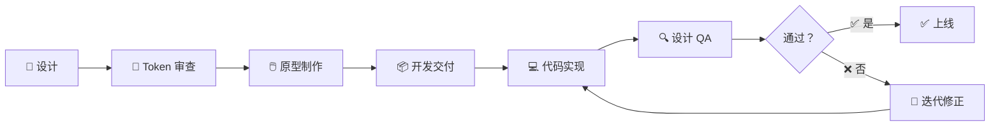

# 🤝 设计稿到代码的协作

> **适用对象：** UI/UX 设计师 · **阅读时间：** 约 30 分钟

设计与开发之间的高效协作，是打造优秀产品的关键环节。本教程将帮助你掌握从设计稿到代码的完整交付流程，学会使用 Material UI 的术语与开发者无缝沟通，确保你的设计意图被准确地实现。

## 目录

1. [类比导入：设计师与建筑师](#-类比导入设计师与建筑师)
2. [常见摩擦点](#-常见摩擦点)
3. [设计交付最佳实践](#-设计交付最佳实践)
4. [Figma → Material UI 映射](#-figma--material-ui-映射)
5. [组件对照表](#-组件对照表)
6. [设计到代码工作流](#-设计到代码工作流)
7. [沟通工具箱](#-沟通工具箱)
8. [协作工具](#-协作工具)
9. [真实案例：用户资料卡片](#-真实案例用户资料卡片)
10. [设计师需要了解的限制](#-设计师需要了解的限制)
11. [实战练习](#-实战练习)
12. [设计师-开发者沟通词汇表](#-设计师-开发者沟通词汇表)
13. [课程总结](#-课程总结)

---

## 🏗️ 类比导入：设计师与建筑师

> 📖 **类比：** 设计稿到代码的协作，就像建筑师与施工团队的合作——图纸（设计稿）必须精确，并使用标准化的度量单位（Design Token）让施工人员（开发者）能够准确还原每一个细节。

### 设计师与开发者的鸿沟

设计师和开发者使用不同的"语言"来描述同一个界面：

| 设计师说 | 开发者理解 |
|---------|----------|
| "这个蓝色" | 哪个蓝色？`#1976d2`？`#2196f3`？ |
| "间距大一点" | 大多少？`8px`？`16px`？`24px`？ |
| "平滑过渡" | 什么缓动函数？多长时间？ |
| "像 Material 那种风格" | 具体哪个组件？哪个 variant？ |

这种沟通障碍导致了反复修改、效率低下和团队摩擦。本教程的目标就是消除这些障碍。

---

## 🔥 常见摩擦点

以下是设计与开发协作中最常见的三类问题及其根本原因：

### 1. "这和我的设计稿不一样"

**根本原因：** 规格说明缺失或模糊。

- 颜色使用了随意取色而非 Token 值
- 间距没有标注，开发者只能"目测"
- 字体大小、行高等排版属性不完整

**预防方法：**

- 所有颜色标注使用 Token 名称（如 `primary.main`），而非十六进制值
- 间距使用 `spacing()` 倍数标注（如 `spacing(2)` = 16px）
- 提供完整的排版规格（字体、字号、字重、行高、字间距）

### 2. "这个动画实现不了"

**根本原因：** 对前端动画能力的预期不切实际。

- 复杂的 3D 变换和物理模拟动画在网页端性能开销极大
- 某些 After Effects 中轻松实现的效果在 CSS/JS 中极难复现
- 同时触发多个高频动画会导致页面卡顿

**预防方法：**

- 优先使用 Material UI 内置的过渡效果（Fade、Grow、Slide、Zoom）
- 动画时长控制在 150ms–400ms 之间
- 在设计评审阶段与开发者确认动画可行性

### 3. "这是什么颜色？间距多少？"

**根本原因：** 缺少基于 Token 的标注体系。

- 设计稿中只有视觉效果，没有系统化的标注
- 开发者无法直接从设计稿中提取可用的 Token 值
- 每次都需要手动测量，容易出错

**预防方法：**

- 建立统一的标注规范，所有值映射到 Design Token
- 使用 Figma 插件自动生成标注
- 参考 [Design Token 教程](./02-design-tokens.md) 建立完整的 Token 体系

---

## 📦 设计交付最佳实践

### 使用 Design Token 标注

所有视觉属性都应使用 Token 名称而非原始值。详见 [Design Token 教程](./02-design-tokens.md)。

```
❌  颜色: #1976d2    间距: 16px    字号: 14px
✅  颜色: primary.main    间距: spacing(2)    字号: body1
```

### 标注间距与尺寸

在设计稿中为每个元素标注：

- **外边距**（margin）：元素与相邻元素之间的距离
- **内边距**（padding）：元素边框与内容之间的距离
- **固定尺寸**：图标大小、头像尺寸、按钮高度等

> 💡 **提示：** 始终使用 `spacing()` 的倍数来标注间距。Material UI 的基础间距单位是 `8px`，即 `spacing(1) = 8px`。

### 记录所有组件状态

不要只提供默认状态的设计，确保覆盖以下状态：

| 状态类别 | 需要设计的状态 |
|---------|-------------|
| 交互状态 | Default、Hover、Active/Pressed、Focus、Disabled |
| 数据状态 | Empty、Loading、Loaded、Error |
| 内容状态 | 短文本、长文本（溢出处理）、缺失数据 |
| 验证状态 | Valid、Invalid（含错误消息） |

### 提供响应式规格

为关键断点提供设计方案。参考 [响应式设计教程](./07-responsive-design.md)。

| 断点 | 宽度 | 需要覆盖 |
|------|------|---------|
| `xs` | 0–599px | ✅ 必须 |
| `sm` | 600–899px | ✅ 推荐 |
| `md` | 900–1199px | ✅ 推荐 |
| `lg` | 1200–1535px | 可选 |
| `xl` | ≥ 1536px | 可选 |

### 包含深色模式

为每个页面和组件提供 Light / Dark 两套配色方案。参考 [深色模式教程](./08-dark-mode.md)。

### 交互与动画规格

标注清楚以下信息：

- **触发条件**：点击、悬停、滚动、加载完成
- **动画类型**：淡入淡出（Fade）、缩放（Grow）、滑入（Slide）、弹出（Zoom）
- **时长**：以毫秒为单位（如 300ms）
- **缓动函数**：ease-in-out、ease-out 等

### 边界情况

> ⚠️ **警告：** 忽视边界情况是设计交付中最常见的"坑"。务必提供以下场景的设计方案。

- **空状态**：列表无数据、搜索无结果
- **错误状态**：网络错误、权限不足、数据加载失败
- **加载状态**：骨架屏、进度条、加载指示器
- **长文本溢出**：用户名过长、描述文字超出容器

---

## 🔗 Figma → Material UI 映射

理解 Figma 概念和 Material UI 概念之间的对应关系，是高效协作的基础。

| Figma 概念 | Material UI 对应 | 说明 |
|-----------|-----------------|------|
| Auto Layout | `Stack` / `Grid` | 自动布局直接对应 Flex 布局组件 |
| Components | MUI Components | Figma 组件映射为 MUI 组件 |
| Variables | `theme.palette.*`、`theme.spacing()` | Figma 变量对应主题 Token |
| Variants | 组件 props（`variant`、`size`、`color`） | 组件变体对应 props 属性 |
| Styles | `theme.typography.*`、`theme.shadows[]` | 样式集合对应主题配置 |
| Constraints | 响应式 breakpoints | 约束条件对应断点布局 |
| Prototyping | 组件状态转换 | 原型交互对应组件状态管理 |

### Auto Layout → Stack / Grid

```
Figma Auto Layout (水平, gap=16)  →  <Stack direction="row" spacing={2}>
Figma Auto Layout (垂直, gap=24)  →  <Stack direction="column" spacing={3}>
Figma Auto Layout (网格, 12列)    →  <Grid container spacing={2}>
```

### Variants → Props

```
Figma Variant: Type=Primary, Size=Large
  → <Button variant="contained" color="primary" size="large">

Figma Variant: Type=Outlined, Size=Small
  → <Button variant="outlined" size="small">
```

> 💡 **提示：** 在 Figma 中建立组件 Variant 时，命名方式尽量与 MUI 的 prop 名称保持一致（如 `variant`、`size`、`color`），可以极大地减少沟通成本。

---

## 📋 组件对照表

以下是设计元素与 Material UI 组件的详细对照：

| 设计元素 | MUI 组件 | 关键 Props |
|---------|---------|-----------|
| 主按钮 | `Button` | `variant="contained" color="primary"` |
| 次要按钮 | `Button` | `variant="outlined" color="primary"` |
| 文字按钮 | `Button` | `variant="text"` |
| 图标按钮 | `IconButton` | `size="small/medium/large"` |
| 输入框 | `TextField` | `variant="outlined"` |
| 下拉选择 | `Select` | — |
| 开关 | `Switch` | `checked` |
| 复选框 | `Checkbox` | `checked` |
| 单选按钮 | `Radio` | `checked` |
| 滑块 | `Slider` | `min`、`max`、`step` |
| 卡片 | `Card` | `elevation={1}` |
| 对话框 | `Dialog` | `open` |
| 抽屉/侧边栏 | `Drawer` | `variant="permanent/temporary"` |
| 顶部导航 | `AppBar` | `position="fixed"` |
| 底部导航 | `BottomNavigation` | `value` |
| 标签页 | `Tabs` + `Tab` | `value` |
| 进度条 | `LinearProgress` / `CircularProgress` | — |
| 提示消息 | `Snackbar` + `Alert` | `severity="success/error/warning/info"` |
| 头像 | `Avatar` | `src` / children |
| 标签/徽章 | `Chip` | `variant="filled/outlined"` |
| 列表 | `List` + `ListItem` | — |
| 表格 | `Table` + `TableRow` + `TableCell` | — |
| 工具提示 | `Tooltip` | `title` |
| 面包屑导航 | `Breadcrumbs` | `separator` |
| 分割线 | `Divider` | `variant="fullWidth/middle"` |
| 手风琴/折叠面板 | `Accordion` | `expanded` |
| 步骤条 | `Stepper` + `Step` | `activeStep` |
| 菜单 | `Menu` + `MenuItem` | `open`、`anchorEl` |
| 骨架屏 | `Skeleton` | `variant="text/circular/rectangular"` |
| 评分 | `Rating` | `value`、`precision` |

> 💡 **提示：** 将此表格保存为设计团队的参考手册，在设计标注时直接引用 MUI 组件名称和 Props。

---

## 🔄 设计到代码工作流



### 各阶段详解

| 阶段 | 负责人 | 关键产出 | 核心要点 |
|------|-------|---------|---------|
| 🎨 设计 | 设计师 | 高保真设计稿 | 使用 MUI Design Kit 组件 |
| 📐 Token 审查 | 设计师 + 开发者 | Token 映射表 | 确认所有值对应 Token |
| 🖱️ 原型制作 | 设计师 | 可交互原型 | 标注交互行为和动画 |
| 📦 开发交付 | 设计师 | 标注完整的设计稿 | 包含所有状态和边界情况 |
| 💻 代码实现 | 开发者 | 功能代码 | 使用对应 MUI 组件 |
| 🔍 设计 QA | 设计师 | QA 反馈报告 | 逐像素比对，记录差异 |
| 🔁 迭代修正 | 开发者 | 修复后的代码 | 根据 QA 反馈调整 |

---

## 🗣️ 沟通工具箱

### 建立共同语言

设计师和开发者应该统一使用以下术语：

| 统一术语 | 含义 | 示例 |
|---------|------|------|
| Token | 设计系统中的原子级变量 | `primary.main`、`spacing(2)` |
| Variant | 组件的视觉变体 | `contained`、`outlined`、`text` |
| Prop | 组件的可配置属性 | `size="large"`、`disabled` |
| Slot | 组件的可替换插槽 | `startIcon`、`endIcon` |
| Breakpoint | 响应式断点 | `sm`、`md`、`lg` |
| Elevation | 阴影层级 | `elevation={0}` ~ `elevation={24}` |

### 组件 Prop 文档

设计师应了解每个使用组件的关键 Props：

```
组件: Button
├── variant:  "contained" | "outlined" | "text"    → 视觉样式
├── color:    "primary" | "secondary" | "error"    → 主题色
├── size:     "small" | "medium" | "large"         → 尺寸
├── disabled: true | false                         → 禁用状态
├── startIcon: <Icon />                            → 前置图标
└── endIcon:  <Icon />                             → 后置图标
```

### 设计评审检查清单

在提交设计稿给开发者之前，逐项确认：

- [ ] 所有颜色使用 Token 名称标注
- [ ] 所有间距使用 `spacing()` 倍数标注
- [ ] 所有文字使用 Typography variant 标注
- [ ] 标明使用的 MUI 组件名称
- [ ] 标注组件的关键 Props 值
- [ ] 覆盖所有交互状态（Hover、Active、Focus、Disabled）
- [ ] 覆盖所有数据状态（Empty、Loading、Error）
- [ ] 提供长文本溢出处理方案
- [ ] 包含响应式断点方案（至少 `xs` 和 `md`）
- [ ] 包含 Light / Dark 两套配色
- [ ] 标注动画类型和时长

### 标注规范

使用统一的标注格式让开发者一目了然：

```
┌─────────────────────────────────────┐
│  [AppBar position="fixed"]          │
│  ┌──────────────────────────────┐   │
│  │  spacing(2) padding          │   │
│  │  Typography: h6              │   │
│  │  Color: common.white         │   │
│  └──────────────────────────────┘   │
│                                     │
│  spacing(3) margin-top              │
│                                     │
│  [Card elevation={2}]               │
│  ┌──────────────────────────────┐   │
│  │  spacing(2) padding          │   │
│  │  [Avatar size=40x40]         │   │
│  │  spacing(2) gap              │   │
│  │  Typography: subtitle1       │   │
│  │  Color: text.primary         │   │
│  └──────────────────────────────┘   │
└─────────────────────────────────────┘
```

---

## 🛠️ 协作工具

### Figma + Material UI Design Kit

- 使用官方 [Material UI Design Kit for Figma](https://mui.com/store/items/figma-react/) 确保设计组件与代码组件一一对应
- Kit 中的组件已内置正确的 Variant 和 Token 值

### Storybook

- 开发团队可部署 Storybook，设计师可以在浏览器中查看每个组件的所有状态
- 在 Storybook 中调整 Props，实时预览效果
- 作为"活文档"取代静态设计规范

### Design Token 管理

- 使用 Figma Variables 或 Tokens Studio 管理 Token
- 导出为 JSON 格式与开发共享
- 保持设计与代码中的 Token 值同步

### 设计版本管理

- 在 Figma 中使用 Branching 功能管理设计版本
- 重大改动前创建分支，评审通过后合并
- 与开发团队的 Git 工作流保持同步节奏

---

## 🏠 真实案例：用户资料卡片

让我们完整走一遍一个功能的设计到开发流程。

### 功能需求

设计一个用户资料卡片，包含头像、姓名、邮箱，以及"编辑"功能。

### 第一步：设计师创建标注完整的设计稿

```
[Card elevation={1}]
  padding: spacing(3)        → 24px
  borderRadius: shape.borderRadiusMedium → 12px

  [Stack direction="row" spacing={2}]
    [Avatar]
      size: 64x64
      src: 用户头像

    [Stack direction="column" spacing={0.5}]
      [Typography variant="h6"]
        color: text.primary
        content: 用户姓名

      [Typography variant="body2"]
        color: text.secondary
        content: 用户邮箱

  spacing(2) margin-top

  [Button variant="outlined" size="small" startIcon={EditIcon}]
    label: "编辑资料"
    color: primary
```

### 第二步：设计评审会议

设计师与开发者确认：

- ✅ Card 使用 `elevation={1}`，对应 `theme.shadows[1]`
- ✅ 所有间距使用 `spacing()` 倍数
- ✅ Avatar 尺寸为 64px，对应自定义 `sx={{ width: 64, height: 64 }}`
- ⚠️ 讨论：编辑按钮点击后的交互——弹出 Dialog 还是跳转页面？
- ✅ 决定：使用 `Dialog` 弹出编辑表单

### 第三步：开发者实现

开发者根据标注使用 MUI 组件实现：

```tsx
<Card elevation={1} sx={{ p: 3, borderRadius: 3 }}>
  <Stack direction="row" spacing={2} alignItems="center">
    <Avatar sx={{ width: 64, height: 64 }} src={user.avatar} />
    <Stack spacing={0.5}>
      <Typography variant="h6">{user.name}</Typography>
      <Typography variant="body2" color="text.secondary">
        {user.email}
      </Typography>
    </Stack>
  </Stack>
  <Button
    variant="outlined"
    size="small"
    startIcon={<EditIcon />}
    sx={{ mt: 2 }}
  >
    编辑资料
  </Button>
</Card>
```

### 第四步：设计 QA 与迭代

设计师在浏览器中检查实现效果：

- ✅ 间距与设计稿一致
- ✅ 排版层级正确
- ❌ Avatar 缺少边框 → 反馈给开发者添加 `border`
- ❌ 暗色模式下 Card 背景色偏深 → 确认使用 `background.paper`

---

## ⚙️ 设计师需要了解的限制

### 定制难度等级

| 定制类型 | 难度 | 说明 |
|---------|------|------|
| 更改颜色 | 🟢 简单 | 通过 Theme 配置即可 |
| 更改字体 | 🟢 简单 | 修改 `theme.typography` |
| 更改间距 | 🟢 简单 | 修改 `theme.spacing` |
| 更改圆角 | 🟢 简单 | 修改 `theme.shape.borderRadius` |
| 更改组件尺寸 | 🟡 中等 | 可能需要覆盖多个内部样式 |
| 自定义动画 | 🟡 中等 | 简单过渡容易，复杂动画困难 |
| 非标准布局 | 🟡 中等 | Grid/Stack 能处理大部分场景 |
| 完全自定义组件外观 | 🔴 困难 | 需要大量 `sx` 或 `styled` 覆盖 |
| 非标准形状（异形卡片） | 🔴 困难 | 需要自定义 CSS clip-path |
| 复杂手势交互 | 🔴 困难 | 需要额外的第三方库 |
| 3D 变换和物理动画 | 🔴 困难 | 性能开销大，可能影响用户体验 |

### 浏览器兼容性

> ⚠️ **警告：** 某些 CSS 新特性并非所有浏览器都支持。在使用以下效果前，请与开发者确认兼容性。

- `backdrop-filter`（毛玻璃效果）：部分旧版浏览器不支持
- 复杂的 CSS `filter` 效果：移动端性能可能有问题
- 某些 `scroll-snap` 行为在不同浏览器表现不一致

---

## ✏️ 实战练习

### 任务：为登录页面创建完整的设计规格文档

请为一个登录页面提供以下内容的完整设计标注：

#### 需要覆盖的状态

1. **空状态**：初始表单，无输入
2. **填写中**：用户正在输入
3. **验证错误**：邮箱格式错误 / 密码过短
4. **加载中**：提交后等待响应
5. **成功**：登录成功跳转

#### 设计标注模板

```
页面：登录页
断点：xs (移动端) / md (桌面端)
模式：Light / Dark

布局：
  [Container maxWidth="sm"]
    spacing(4) padding-top

    [Card elevation={2}]
      padding: spacing(4)

      [Typography variant="h4" align="center"]
        content: "欢迎回来"
        color: text.primary

      spacing(3) margin-top

      [TextField variant="outlined" fullWidth]
        label: "邮箱地址"
        type: email
        error 状态: "请输入有效的邮箱地址"

      spacing(2) margin-top

      [TextField variant="outlined" fullWidth]
        label: "密码"
        type: password
        error 状态: "密码至少 8 位"

      spacing(3) margin-top

      [Button variant="contained" fullWidth size="large"]
        label: "登录"
        loading 状态: CircularProgress size={24}
        disabled: 表单未填写完成时

      spacing(2) margin-top

      [Typography variant="body2" align="center"]
        content: "还没有账号？立即注册"
        color: primary.main
        交互: 点击跳转注册页

颜色 Token:
  - 背景: background.default
  - 卡片背景: background.paper
  - 主文字: text.primary
  - 次要文字: text.secondary
  - 主色: primary.main
  - 错误色: error.main

间距 Token:
  - 卡片内边距: spacing(4) = 32px
  - 输入框间距: spacing(2) = 16px
  - 段落间距: spacing(3) = 24px
```

#### 自检清单

- [ ] 所有 5 种状态都提供了设计方案
- [ ] 颜色全部使用 Token 名称
- [ ] 间距全部使用 `spacing()` 标注
- [ ] 排版使用 Typography variant
- [ ] 指定了 MUI 组件名称和关键 Props
- [ ] 提供了移动端和桌面端两套方案
- [ ] 提供了 Light / Dark 两套配色
- [ ] 标注了错误信息文案
- [ ] 标注了加载状态表现
- [ ] 标注了成功后的跳转行为

---

## 📖 设计师-开发者沟通词汇表

以下词汇表覆盖了本学习轨道所有教程的核心概念：

| 设计师语言 | 开发者语言（Material UI） | 相关教程 |
|-----------|------------------------|---------|
| 品牌色 | `theme.palette.primary.main` | [03 色彩系统](./03-color-system.md) |
| 辅助色 | `theme.palette.secondary.main` | [03 色彩系统](./03-color-system.md) |
| 背景色 | `theme.palette.background.default` | [03 色彩系统](./03-color-system.md) |
| 大标题 | `Typography variant="h4"` | [04 字体排版](./04-typography.md) |
| 正文 | `Typography variant="body1"` | [04 字体排版](./04-typography.md) |
| 说明文字 | `Typography variant="caption"` | [04 字体排版](./04-typography.md) |
| 间距 / 留白 | `theme.spacing(n)` | [05 间距与布局](./05-spacing-layout.md) |
| 内边距 | `padding` / `sx={{ p: n }}` | [05 间距与布局](./05-spacing-layout.md) |
| 外边距 | `margin` / `sx={{ m: n }}` | [05 间距与布局](./05-spacing-layout.md) |
| 按钮样式 | `Button variant` prop | [06 组件解剖](./06-component-anatomy.md) |
| 组件变体 | Props（`variant`、`size`、`color`） | [06 组件解剖](./06-component-anatomy.md) |
| 组件插槽 | Slots / `startIcon`、`endIcon` 等 | [06 组件解剖](./06-component-anatomy.md) |
| 移动端适配 | `useMediaQuery` / 响应式 breakpoints | [07 响应式设计](./07-responsive-design.md) |
| 自适应布局 | `Grid` container + item | [07 响应式设计](./07-responsive-design.md) |
| 暗色模式 | `theme.palette.mode: 'dark'` | [08 深色模式](./08-dark-mode.md) |
| 阴影层级 | `theme.shadows[n]` / `elevation` | [01 Material Design](./01-material-design-intro.md) |
| 设计令牌 | `theme` 对象中的所有值 | [02 设计令牌](./02-design-tokens.md) |
| 圆角 | `theme.shape.borderRadius` | [02 设计令牌](./02-design-tokens.md) |

---

## 🎓 课程总结

### 九章回顾

恭喜你完成了 UI Designer 学习轨道的全部九个章节！以下是每章的核心要点：

| 章节 | 标题 | 核心收获 |
|------|------|---------|
| 01 | Material Design 设计语言 | 理解 Material Design 的核心原则和设计哲学 |
| 02 | 设计令牌 | 掌握 Design Token 体系，实现设计-代码一致性 |
| 03 | 色彩系统 | 学会使用主题调色板，确保色彩无障碍 |
| 04 | 字体排版 | 建立清晰的排版层级，正确使用 Typography |
| 05 | 间距与布局 | 掌握 8px 网格系统和系统化的间距方案 |
| 06 | 组件解剖 | 理解组件结构：variant、prop、slot |
| 07 | 响应式设计 | 使用断点系统实现多端适配 |
| 08 | 深色模式设计 | 设计符合无障碍标准的暗色主题 |
| 09 | 设计稿到代码 | 与开发者高效协作，精准还原设计意图 |

### 持续学习资源

- [Material UI 官方文档](https://mui.com/)
- [Material Design 3 指南](https://m3.material.io/)
- [Figma Material UI Design Kit](https://mui.com/store/items/figma-react/)
- [Material UI GitHub 仓库](https://github.com/mui/material-ui)

### 自我评估清单

完成学习后，你应该能够：

- [ ] 使用 Design Token 进行精确的设计标注
- [ ] 在设计中正确应用 Material UI 的色彩系统
- [ ] 建立清晰的排版层级
- [ ] 使用 8px 网格系统管理间距
- [ ] 理解 MUI 组件的 variant / prop / slot 结构
- [ ] 为不同断点提供响应式设计方案
- [ ] 设计符合标准的深色模式
- [ ] 与开发者使用统一的术语高效沟通
- [ ] 提交规范完整的设计交付文档

---

> 🎉 **恭喜你完成了 UI Designer 学习轨道的全部课程！**
>
> 你已经系统学习了：
> 1. [Material Design 设计语言](./01-material-design-intro.md)
> 2. [设计令牌](./02-design-tokens.md)
> 3. [色彩系统](./03-color-system.md)
> 4. [字体排版](./04-typography.md)
> 5. [间距与布局](./05-spacing-layout.md)
> 6. [组件解剖](./06-component-anatomy.md)
> 7. [响应式设计](./07-responsive-design.md)
> 8. [深色模式设计](./08-dark-mode.md)
> 9. [设计稿到代码的协作](./09-design-to-code.md)
>
> 这些知识将帮助你成为更专业的 UI 设计师，更高效地与开发团队协作！
